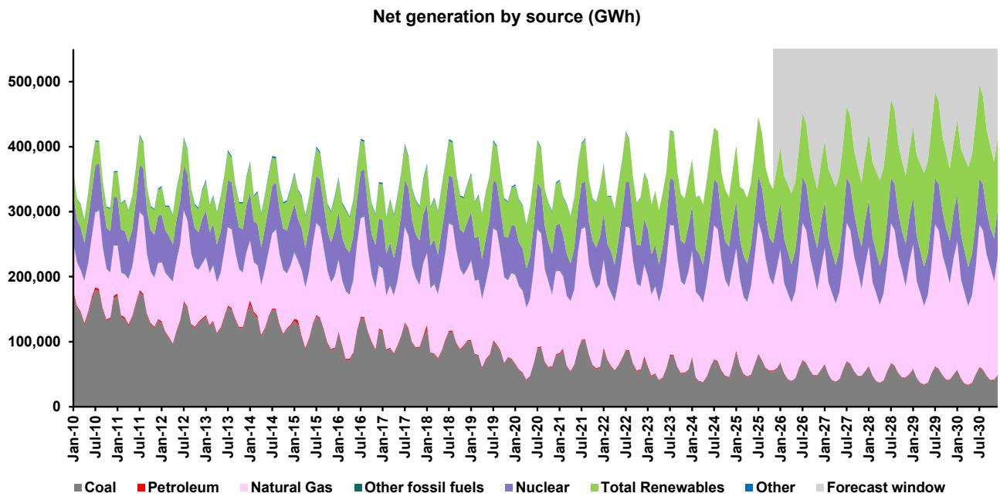
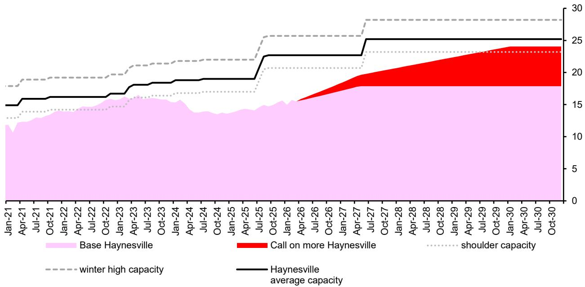
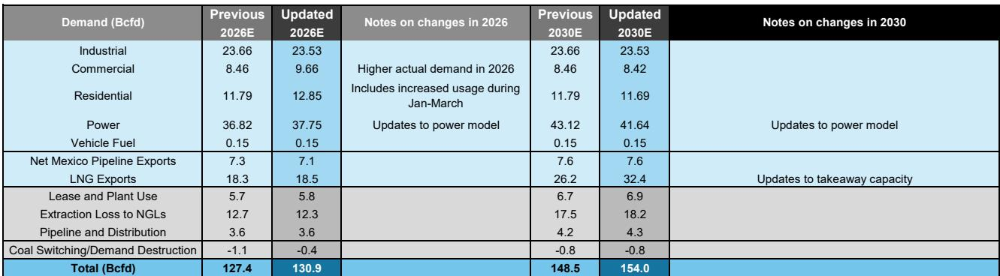

# US Natural Gas Demand Will Grow 24% by 2030, But Only a $5/MMBtu Henry Hub Price Can Unlock the Supply Needed to Meet It

The US natural gas market is approaching a structural inflection point that most observers still underestimate. LNG export capacity will nearly double from roughly 18 billion cubic feet per day (bcfd) in early 2026 to approximately 33 bcfd by late 2030. Power demand is growing at a 2.6% CAGR through 2030, driven by data center buildout and electrification, with gas capturing a large share of that fuel mix. And the volume of gas consumed in extraction losses, plant use, and pipeline distribution will rise linearly as total throughput increases. These three forces together imply total US gas demand reaching 154 bcfd by 2030, a 24% increase from 2025 levels. Yet this demand trajectory collides with a supply base that is deliberately constrained. Permian rig counts have fallen 25% since early 2024, Appalachian rigs are down 21%, and even the recent Haynesville activity uptick comes from operators with historically lower initial production rates. The arithmetic is clear: the market will need a sustained Henry Hub price near $5/MMBtu to convince upstream producers to deliver the required molecules.

The timing matters because the market is already pricing a different reality. Henry Hub averaged $3.53/MMBtu in 2025, and the forward curve does not yet reflect the compounding demand growth that is already locked in by LNG terminal construction schedules and power procurement contracts. The gap between what the market expects and what the physical balance requires is the central observation in North American gas today.

## LNG Liftings Will Nearly Double by 2030, Creating a Non-Negotiable Demand Floor That Reshapes the Entire Supply Stack

The most concrete and irreversible driver of US gas demand growth is the wave of LNG export capacity currently under construction or in commissioning. From roughly 18 bcfd of LNG liftings in early 2026, Bernstein projects that figure will rise to approximately 33 bcfd by late 2030. This is not a forecast that depends on commodity price assumptions or policy outcomes. These are facilities with binding construction contracts, regulatory approvals, and financing in place. The molecules will flow because the infrastructure is being built.

The implication for the domestic gas market is profound. By 2030, LNG exports alone will consume roughly one-fifth of total US gas production. This creates a demand floor that is both large and inflexible. Unlike power demand, which can modulate with weather and coal switching, or industrial demand, which responds to economic cycles, LNG liftings are a fixed-volume obligation. The plants run on a baseload basis. When they are operational, the gas must be delivered.

This structural demand growth cascades through the supply chain in a way that is often overlooked. As total gas throughput rises, the volume of gas lost to extraction, plant use, and pipeline distribution increases roughly linearly. Bernstein estimates that these losses will grow from approximately 20 bcfd in 2025 to nearly 29 bcfd by 2030. This means that for every incremental bcf of LNG demand, the upstream must produce more than one bcf to account for the system losses. The leverage is unfavorable for supply but favorable for price.

## Power Demand Growth from Data Centers and Electrification Adds 6 Bcfd of Gas Demand by 2030, and the Timing of This Demand Is Clustered

The second pillar of gas demand growth is power generation, where Bernstein's proprietary US power model forecasts aggregate demand growing at a 2.6% CAGR through 2030. Gas-fired generation captures a large share of this incremental load. The model projects that gas demand for power will grow from approximately 35.7 bcfd in 2025 to 41.6 bcfd by 2030, a 2.5% CAGR.

The critical nuance is timing. Power demand for gas entered 2025 already above the previous record year of 2024, and the data center buildout is only beginning to register in utility load forecasts. Bernstein expects power demand for gas to grow roughly 2 bcfd in 2026 alone, rising toward approximately 6 bcfd by 2030 from 2025 levels. This is a front-loaded demand shock, not a gradual trend.

The clustering of this demand matters because the gas market does not respond linearly to incremental demand. When power demand spikes during summer heat waves or winter cold snaps, the gas market must find supply from storage, pipeline capacity, or spot production. If the base supply is already tight due to LNG demands, these power demand spikes will translate directly into price volatility. The model explicitly accounts for coal-to-gas switching, which has been a significant factor in 2025, but argues that additional coal switching is limited. The remaining coal fleet is either economically uncompetitive or facing retirements, so the power sector's incremental demand will fall disproportionately on gas.

## Supply Discipline in the Permian and Appalachia Is Structural, and the Haynesville Activity Uptick Is Not a Bearish Signal

The bear case for gas prices has long rested on the assumption that US supply can respond elastically to higher prices. That assumption is breaking down. Since the start of 2024, rig counts in the Permian Basin, the largest source of associated gas from shale oil drilling, have fallen 25%. In the Appalachian Basin, the core of dry gas production, rig counts are down 21%. This is not a cyclical pause. It reflects a structural shift in capital discipline across the E&P sector.

The Permian is particularly important because it produces the largest volume of associated gas in the US, and that gas is a byproduct of oil drilling. Oil-directed drilling is not driven by gas prices. Even if Henry Hub rises to $5/MMBtu, Permian operators will not drill more oil wells to capture the gas. They will drill based on oil economics and their corporate return thresholds. This means Permian gas supply growth is effectively capped by oil activity, not gas prices. Bernstein projects Permian gas production growing from 28 bcfd in 2025 to 39.6 bcfd by 2030, a 41% increase, but this requires significant new takeaway capacity from pipeline expansions such as the Transwestern desert pipeline expansion from 1.5 to 2.3 bcfd and the 2.8 bcfd Saguaro connector pipeline.

The recent tick-up in Haynesville rig activity has raised concerns among some market participants that supply could respond faster than expected. Bernstein argues this is not a structural shift. The new activity is concentrated among operators with historically lower initial production rates per well, specifically APEX Natural Gas and other operators that were benchmarked below the cohort average in previous analysis. This means the incremental supply from Haynesville will come at a higher unit cost and lower efficiency. It is a marginal response to higher prices, not a wave of low-cost supply. The model explicitly includes a "call on more Haynesville" that rises from 0.5 bcfd in 2026 to 6.2 bcfd by 2030, but this is priced in as a high-cost source that only becomes economic at $5/MMBtu.

## The Supply-Demand Balance Implies Storage Will Be Drawn to Critically Low Levels by 2030, Forcing the Price Higher

The most powerful evidence for the $5/MMBtu mid-cycle price thesis comes from the storage trajectory implied by the supply-demand balance. Bernstein's model projects that total US gas storage will decline from approximately 2,918 billion cubic feet (Bcf) in 2025 to 1,092 Bcf by 2030. That is a 63% drawdown over five years. Relative to the five-year average, storage will be 1,420 Bcf below normal by 2030.

These are not equilibrium levels. They are levels that would require significant adjustment. The implied Henry Hub price in the model rises from $3.53/MMBtu in 2025 to $5.27 in 2026, $8.01 in 2027, and then accelerates to $12.05 in 2028, $16.07 in 2029, and $61.72 in 2030. The model acknowledges that the 2030 price is mathematically extreme and reflects a physical balance that, in practice, would be resolved by demand adjustment or supply response well before that point. The model's purpose is not to predict the exact price path but to demonstrate that the current supply trajectory is incompatible with the demand outlook.

The mechanism that resolves this imbalance is price. At $5/MMBtu, the model assumes that upstream producers in the Permian, Appalachia, and Haynesville can deliver the required molecules. Below that price, the supply gap widens and storage is drawn unsustainably. The $5/MMBtu level is not an arbitrary target. It is the price at which the physical balance closes.

## A Decision Framework for Observers: Three Questions to Determine Perspective

For institutional observers assessing their natural gas exposure, the analysis reduces to three sequential decisions.

First, does the observer believe that LNG export capacity will reach 33 bcfd by 2030? This is the most certain variable in the model. The projects are under construction, and the capital has been committed. The only risk is delay, not cancellation. If the observer accepts this premise, then approximately 20 bcfd of incremental demand is locked in.

Second, does the observer believe that US power demand will grow at a 2.6% CAGR through 2030? This is less certain but directionally clear. Data center load growth, electric vehicle adoption, and industrial electrification are all pushing in the same direction. The debate is about magnitude, not sign. Even a 1.5% CAGR would add significant gas demand.

Third, does the observer believe that supply discipline in the Permian and Appalachia is structural? This is the most contested assumption. If rig counts rebound sharply, the supply-demand balance could loosen. But the evidence from operator behavior since 2024 suggests that the industry has internalized the lessons of the 2020 downturn and the 2022-2023 price adjustment. Capital discipline is now a board-level mandate, not a cyclical preference.

If the answer to all three questions is yes, then the implication is straightforward: Henry Hub prices must rise to incentivize supply, and the companies most leveraged to that outcome are the gassy E&Ps with high exposure to the spot price. Bernstein specifically identifies Henry Hub-leveraged companies as offering significant potential at current valuations. The ticker table shows that EQT, Expand Energy, and Devon Energy are among those highlighted.

The alternative view requires at least one of these three pillars to break. If LNG capacity is delayed, power demand growth disappoints, or supply responds aggressively, the price thesis weakens. But the burden of proof is on the alternative view. The physical data, the capital cycle evidence, and the infrastructure pipeline all point in one direction.

*For informational purposes only. Portions may be generated, translated, summarized, or edited with AI assistance based on source materials and may contain omissions or errors. Please verify independently. This is not professional advice.*

For informational purposes only. Portions may be generated, translated, summarized, or edited with AI assistance based on source materials and may contain omissions or errors. Please verify independently. This is not professional advice.

