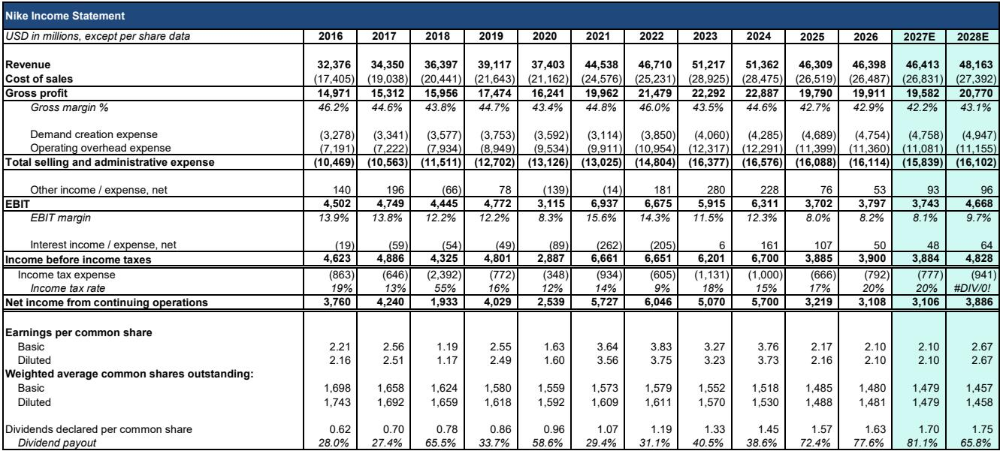
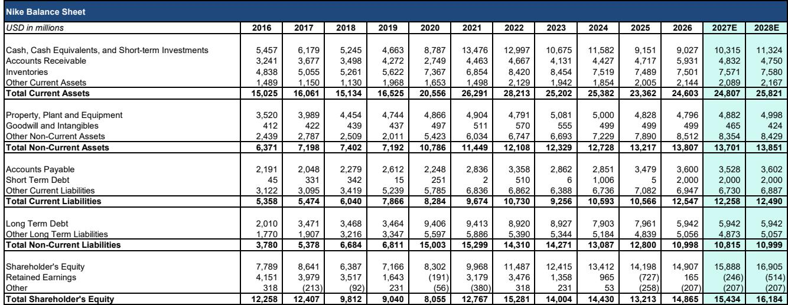
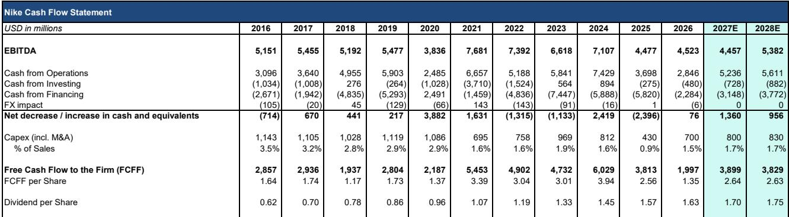

# Nike's Turnaround Has a Clear Sequence: Margins First, Revenue Second, and the November Investor Day Is the Catalyst

The narrative around Nike has been dominated by a single, punishing fact: the company's relative performance compared to the broader market has seen a significant shift over the past twelve months. At a recent closing price of $44.37, the market is pricing in a prolonged period of adjustment. Yet recent investor meetings hosted by a major research firm reveal a company that, while still in transition, has a clearly sequenced turnaround plan that is not yet reflected in the current valuation. The central thesis is that Nike's recovery will follow a specific, observable cadence: gross margin improvement will inflect first, followed by revenue growth later in fiscal 2027, with the November Investor Day serving as the critical event to provide hard numbers and a product roadmap for the next 12-18 months. The risk-reward profile is shaped by factors such as potential disruptions from tariffs or demand volatility.

The most misunderstood aspect of Nike's current position is the distinction between the health of the underlying business and the reported financials. The headline guidance for Q1 fiscal 2027—a low-single-digit to mid-single-digit decline—appears to confirm the worst fears. But the composition of that decline matters critically. Roughly 60% of Nike's revenue comes from Lifestyle product, commonly called Sportswear, which includes the once-dominant Classics franchises: Air Force 1, Air Jordan 1, and Dunk. These three franchises alone drove a $2 billion revenue decline in fiscal 2026, representing a 4-percentage-point headwind to total company sales. The core insight from the investor meetings is that this headwind is now moderating. The decline in fiscal 2027 is expected to be roughly half as severe, at approximately 2 percentage points. This is not a story of accelerating deterioration; it is a story of a known drag that is becoming less painful with each passing quarter.

The first sign of genuine inflection will not be revenue growth. It will be gross margin. Management has been explicit that the priority is quality of sales over volume. The deliberate pullback from promotional activity in China and Europe, the reduction of low-quality digital sales, and the cleanup of inventory across all regions are all short-term revenue drags that directly support margin expansion. The firm's analysis shows gross margin moving directionally positive starting in Q1, supported by lower discounting, better full-price realization, and reduced off-price liquidation headwinds. This is the logical starting point for the turnaround: margins can improve even while the top line is still declining, because the company is choosing to sell fewer units at higher prices rather than more units at distressed prices. The implication for observers is clear: the first quarter of positive gross margin surprise will be a leading indicator that the broader recovery is on track.

## North America Wholesale Is Already Recovering, and the Gap Between Sell-In and Sell-Through Is About to Narrow

The most actionable data point from the investor meetings concerns North America wholesale. This channel is already growing, and it is doing so through three distinct mechanisms that together create a durable recovery. First, existing partners such as Dick's Sporting Goods and Foot Locker are increasing their order books. Foot Locker, in particular, reported its first quarter of positive sell-in and sell-through in several years, suggesting that the retail partner base is finally aligning with Nike's new product direction. Second, re-established relationships with Running Specialty retailers are contributing incremental volume. Nike had previously deprioritized these accounts in favor of direct-to-consumer distribution; now, with localized service and dedicated account teams, these relationships are being rebuilt. Third, new business from the Amazon partnership is being managed carefully to create a multi-year growth runway without over-distributing product.

A persistent observer concern has been the gap between Nike's reported sell-in to wholesale partners and the actual sell-through to consumers. This gap has fueled fears that Nike is over-shipping into the channel, creating future inventory problems. Management's explanation is specific and credible: the gap was artificially widened by the fact that current sell-in is lapping prior-year cancellations and returns to vendor, which acted as contra-revenue. As those anniversary effects fade, the spread between sell-in and sell-through is expected to narrow. This is not a vague promise; it is a mathematical inevitability as the accounting distortions roll off. The narrowing gap will be visible in the coming quarters and should alleviate one of the key bear arguments against the company.

## China Is Undergoing a Controlled Reset, Not a Retreat

China has been a source of anxiety for Nike observers, amplified by media coverage of the company's distribution presence. The facts from the investor meetings paint a more nuanced picture. Nike maintains approximately 5,000 stores in China, mostly partner-owned, alongside a broad digital presence across platforms including WeChat, Tmall, Taobao, Douyin, JD, and Weibo. None of this physical or digital infrastructure is being reduced. What is changing is the quality of sales within that infrastructure. Nike is deliberately cutting back on low-margin, promotional touchpoints that dilute the brand. This includes reducing participation in deep-discount shopping events like 6.18 and 11.11, actively mitigating the presence of Nike product on random discount websites through resellers, and refusing to match domestic competitors' price points to maintain market share.

The result is a temporary revenue headwind that is entirely intentional. Sell-in to China is negative precisely because Nike is cutting low-quality online sales. Meanwhile, sell-through to consumers remains positive, indicating that demand for the brand is intact. The most concrete evidence that this strategy is working comes from the 100-plus remodeled stores in China. These doors, which have been refocused on sport, local storytelling, and newer innovation, are generating positive traffic and comp store sales. Management has also added a local product creation leader and expanded coverage to local teams in approximately 20 cities. This is not a retreat from China; it is a repositioning toward higher-quality, more localized, and more profitable sales. The bear case that Nike is losing relevance in China does not align with the sell-through data or the store-level performance of the remodeled locations.

## Margins Will Inflect Before Revenue, Driven by a Cleaner Channel and Disciplined Cost Control

The margin story has two distinct drivers, and both are currently moving in Nike's favor. The first is the channel cleanup itself. As Nike laps the heavy clearance activity of fiscal 2026 across all regions, the year-over-year drag from liquidations and off-price sales will diminish. This is most visible in the direct-to-consumer channel, where sales have been declining as the company worked through excess inventory. As DTC sales stabilize, the channel mix shift toward wholesale becomes less of a headwind. The second driver is the deliberate reduction in promotional activity in China and Europe. These regions have been the most aggressive in discounting, and the pullback is a direct support to gross margin.

The second pillar of margin improvement is SG&A discipline. This is the primary reason Nike can stabilize earnings per share while revenue is still declining. Management has guided to flattish year-over-year EPS over the nine-month period from Q4 fiscal 2026 through H1 fiscal 2027, despite lower revenue. The mechanism is clear: operating overhead dollars are expected to be down in Q1, netting out a high-single-digit percentage increase in marketing spending tied to World Cup investment. For the remainder of fiscal 2027, marketing spending is expected to moderate. The fixed cost base is being managed tightly, and productivity improvements are flowing through to the bottom line. This is not a one-time cost cut; it reflects a structural change in how Nike manages its overhead, with the new CFO expected to formalize this discipline in the medium-term framework.

Tariffs remain a complicating factor, but the guidance provides a specific framework. The assumption is a step-up from the current 10% rate to 15% after July. This creates a predictable pattern: Q1 will see a tailwind as the current 10% rate compares favorably to last year's elevated rates above 20%. Q2 and Q3 should see a modest tailwind for the same reason. Q4 becomes a headwind as it laps the large tariff accrual that boosted fiscal 2026 Q4 margins. The net effect is manageable within the broader margin improvement story, though the actual Section 301 tariff rate could deviate from the 15% assumption.

## The November Investor Day Will Provide the Hard Numbers the Market Needs

The most significant near-term catalyst for Nike is the Investor Day scheduled for November. This event will address the two biggest sources of observer uncertainty: the lack of a medium-term financial framework and the absence of visibility into the product pipeline. Management has explicitly stated that the unusual nine-month guidance window—covering Q4 through H2—was designed to set up the Investor Day as the moment for laying out the broader growth framework. The incoming CFO, Dave Denton, who joins from CVS and Lowe's, will issue the forward guidance rather than inheriting it. This is a deliberate choice to create a clean break and a clear narrative.

The Investor Day will include three specific deliverables. First, a medium-term growth algorithm that will give observers a concrete framework for thinking about top-line and earnings growth for the next phase of the company's evolution. Second, a detailed product showcase of the new Lifestyle footwear collections launching in Spring 2027. This is the most critical element for the turnaround narrative, as the current decline in Lifestyle is driven by the absence of new product to replace the declining Classics franchises. A strong product preview would provide confidence that the Spring 2027 launches can drive a return to growth in the Lifestyle segment by Q4 fiscal 2027. Third, the new CFO will clarify capital allocation priorities, including how Nike balances its dividend commitment, debt maturities, buybacks, and reinvestment. The balance sheet is strong, with a net cash position, but two tranches of pandemic-era debt are maturing in fiscal 2026, and paying down debt is a live option given the higher cost of refinancing.

The sequence is now clear. Margins inflect first, starting in Q1. Revenue inflects later, in H2 fiscal 2027, as the Lifestyle drag moderates and new product enters the market. The Investor Day in November bridges the gap between these two inflection points by providing the hard numbers and product visibility that the market currently lacks. For observers willing to look past the near-term noise of declining Lifestyle sales and tariff uncertainty, the setup is unusually favorable—a disciplined, sequenced turnaround rather than hoping for a quick fix.

*For informational purposes only. Portions may be generated, translated, summarized, or edited with AI assistance based on source materials and may contain omissions or errors. Please verify independently. This is not professional advice.*

For informational purposes only. Portions may be generated, translated, summarized, or edited with AI assistance based on source materials and may contain omissions or errors. Please verify independently. This is not professional advice.

