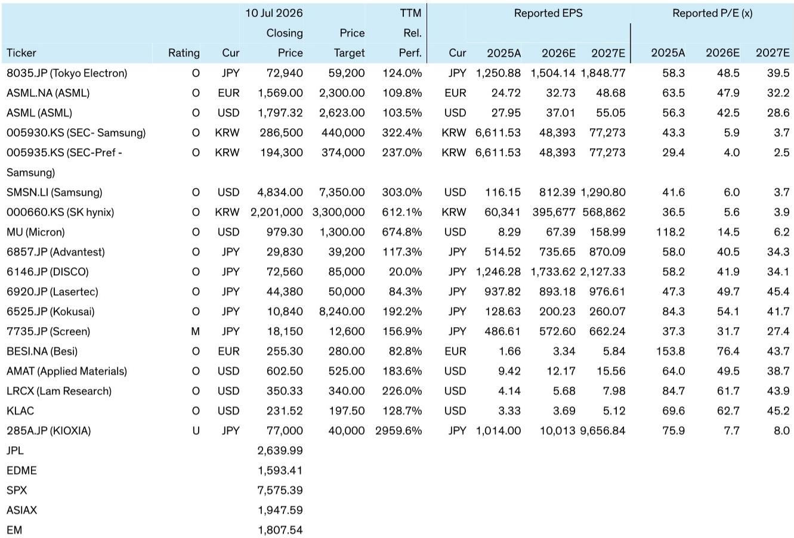
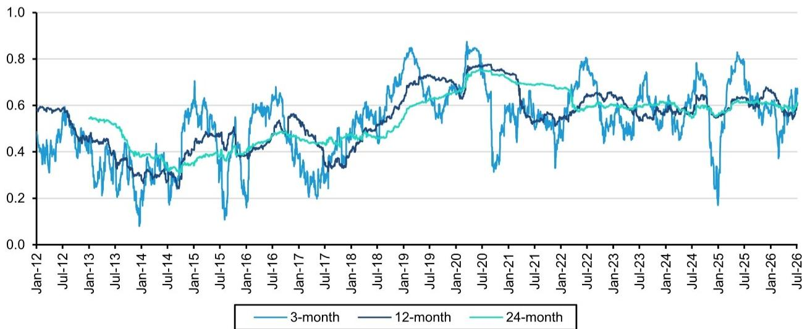
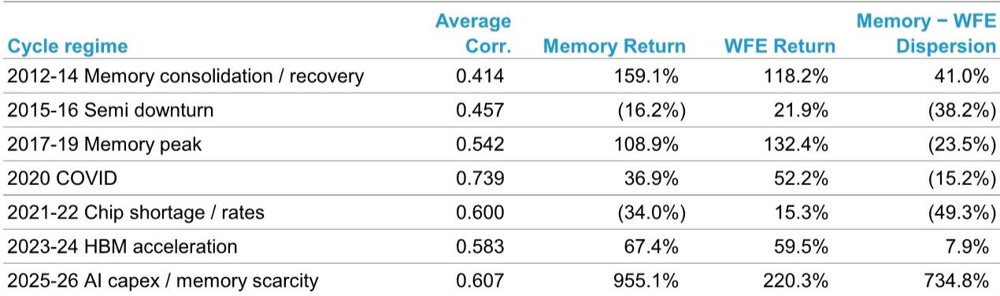

# Bernstein：全球半导体与设备——存储波动下，设备能否延续独立走势

存储板块的近期波动引发不少关注：如果存储行情出现调整，半导体设备是否也会随之变化。Bernstein最新发布的研究报告试图回答这个问题，结论是——两者虽有关联，但历史数据表明，设备板块完全可以在存储表现平淡甚至调整时继续展现自身走势。

这份报告的核心价值在于拆解了一个被市场普遍接受的假设：存储与设备高度绑定。Bernstein通过回溯2011年至2026年的报价与回报数据，发现两者的12个月滚动相关性均值仅为0.54，远低于设备与整个半导体板块之间0.82的稳定关联。更关键的是，在多个历史周期中，设备板块都曾走出与存储截然不同的独立行情。

## 1. 低相关性不等于回报同步，设备曾多次走出独立行情

Bernstein将2011年以来的市场划分为七个明确的周期阶段，每个阶段都对应不同的供需背景。在2015年至2016年的半导体节奏变化周期中，存储板块下跌16.2%，而设备板块同期上涨21.9%，两者回报差距达到38个百分点。2021年至2022年芯片短缺与利率调整期间，存储下跌34%，设备却上涨15.3%，差距进一步拉大至49个百分点。

报告特别指出，即便在相关性较高的阶段，回报差异同样显著。2019年至2020年，存储与设备的12个月滚动相关性达到0.72，但设备回报仍比存储高出24个百分点。这些案例说明，相关性只反映共同的半导体贝塔暴露，而相对回报更多由各自子行业的基本面驱动。

> **KC评论：** 读者容易把“相关”等同于“同涨同跌”，但Bernstein的周期表清楚显示，设备板块在存储下跌的周期中反而录得正回报。这意味着，判断设备走势的关键不在于存储价格本身，而在于设备需求是否受到独立支撑。

## 2. 存储溢价已处于历史极端，均值回归可能反而利好设备

报告中最引人注目的图表是存储相对于设备的累计回报比值。截至2026年7月，存储自2025年6月以来的涨幅达到955%，而设备同期仅上涨220%，两者差距创下历史新高。Bernstein测算，当前存储相对于设备的溢价已超过历史均值两个标准差。

报告认为，这种极端溢价主要来自HBM和传统DRAM的供应短缺，以及AI服务器对存储内容的持续拉动。但问题在于，如果存储价格正常化，设备是否必然承压？Bernstein的历史框架给出的答案是否定的。2019年至2025年期间，存储长期跑输设备，直到2026年2月才追平15年来的累计涨幅。如果均值回归发生，当前极端的溢价反而可能为设备提供相对优势。

## 3. 设备的基本面支撑来自AI资本开支和技术转型，而非存储价格

Bernstein对设备板块的积极判断并非建立在存储持续上涨的假设之上。报告指出，存储资本开支正在明确加速——SK海力士近期宣布在清州新增100万亿韩元（约670亿美元）的研究，韩国政府也在考虑支持三星和SK海力士在西南部建设新厂。但这些研究本身就需要设备采购，而设备需求还受到先进制程逻辑芯片、先进封装和HBM产能扩张等多重因素驱动。

报告认为，市场对设备板块2028年之前的盈利预期仍有上调空间。即便存储价格出现波动，只要AI资本开支和技术转型需求保持韧性，设备板块的基本面就不会被存储单一变量所左右。Bernstein在报告中维持对东京电子、ASML、应用材料、科磊、泛林半导体等主要设备公司的积极评级。

## 4. 一个可复用的观察框架：区分“存储特定波动”与“系统性冲击”

Bernstein的分析方法值得借鉴。报告没有停留在“存储和设备是否相关”这个统计问题上，而是进一步追问：当前的存储波动是存储行业自身的正常化，还是足以波及设备需求的系统性冲击？

从历史数据看，2015年至2016年和2021年至2022年两次存储下跌周期中，设备均未受到实质性影响，因为当时设备需求分别受到逻辑芯片研究和先进制程升级的支撑。当前周期中，AI资本开支、HBM产能扩张和先进封装需求构成了类似的独立支撑。因此，判断设备走势的核心变量不是存储价格本身，而是这些结构性需求是否出现拐点。

Bernstein的这份报告为读者提供了一个更精细的分析框架：与其被存储与设备之间的短期相关性所困扰，不如将注意力集中在各自的基本面驱动因素上。在当前的AI研究周期中，设备板块的独立逻辑可能比市场想象的更为坚实。

For informational purposes only. Portions may be generated,translated,summarized,or edited with AI assistance based on source materials and may contain omissions or errors. Please verify independently. This is not investment,legal,tax,accounting,or other professional advice.

For informational purposes only. Portions may be generated,translated,summarized,or edited with AI assistance based on source materials and may contain omissions or errors. Please verify independently. This is not investment,legal,tax,accounting,or other professional advice.

