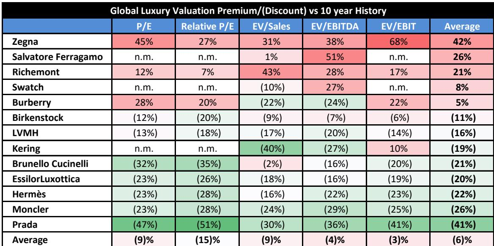
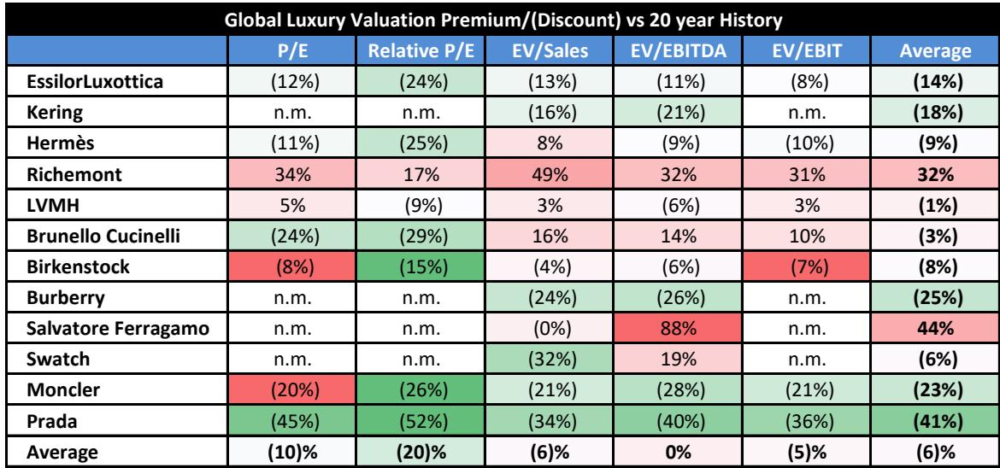
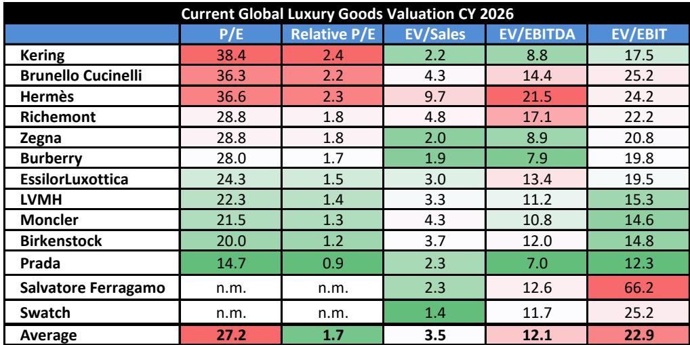

# Bernstein：全球奢侈品——追踪2026年第二季度AI相关消费趋势

这份Bernstein研究报告的核心判断是：全球奢侈品需求正经历一轮区域性的、由AI相关财富效应带动的变化，而市场可能低估了亚洲市场的表现。报告通过追踪中国购物中心销售数据与区域零售指标，发现韩国、日本和香港的奢侈品销售在2026年第二季度持续走强，甚至中国大陆也出现了初步改善迹象。对于关注全球高端消费的读者而言，这组数据可能意味着行业正接近一个转折点——尤其是当科技相关板块的热潮似乎见顶、资金开始寻找替代配置时。

报告特别指出，硬奢侈品（珠宝、腕表）的表现持续优于软奢侈品（皮具、成衣），尽管差距有所收窄，但这一结构性优势仍将在即将发布的业绩中体现。

## 1. 日本成为最大意外变量：AI相关财富效应叠加游客红利

研报中最值得关注的区域是日本。Bernstein的数据显示，东京百货商店的珠宝销售在2026年第二季度仍保持20%以上的同比增长，而配饰和服装销售也出现加速。报告认为，这背后是多重因素的叠加：日元汇率变化、基数效应，以及来自韩国和台湾消费者的AI相关财富创造。

> **KC评论：** 这里的关键不是日本本土消费，而是“AI相关财富效应”如何通过跨境旅游传导到奢侈品市场。韩国和台湾的科技从业者因AI热潮获得财富增值后，选择在日本消费——这解释了为何日本奢侈品销售与本地宏观环境数据出现背离。

报告进一步指出，如果历史相关性仍然有效，LVMH的时装与皮具部门在2026年第二季度的有机销售增长可能达到+3%，高于市场预期的+1.7%。日本市场的改善是这一超预期的主要来源。

## 2. 韩国和香港持续强劲，中国大陆初现变化

韩国百货商店的外国奢侈品牌销售在2026年4-5月加速至35-40%的同比增长，高于第一季度的20-30%。香港的珠宝、手表销售同样保持20%以上的增长。这些区域的表现并非短期脉冲——报告显示，韩国和香港的强劲势头已持续多个季度。

更值得关注的是中国大陆的变化。Bernstein追踪的中国奢侈品购物中心销售数据显示，2026年4-5月同比增长约+7%，而第一季度基本持平。虽然幅度不大，但这是自2024年以来首次出现明确的改善信号。报告认为，这可能意味着中国大陆奢侈品市场正在经历一个调整后的企稳阶段。

## 3. 历峰集团和Moncler可能成为业绩超预期的主角

基于区域数据的回归模型，Bernstein对几家主要奢侈品公司给出了具体的预测：

历峰集团在2027财年第一季度的有机销售增长可能达到+12.1%，比公司收集的共识高出约110个基点。日本市场是最大的超预期来源，珠宝业务受益于前述的AI相关财富效应和游客组合变化。

Moncler品牌在2026年第二季度的亚太区可比增长可能达到+13%（共识为+11%），韩国和日本的强劲表现足以抵消中国大陆的阶段性调整。报告预测Moncler品牌整体可比增长为+5.6%，高于共识的+4.1%。

相比之下，Gucci的表现可能基本符合预期，日本市场有所改善，但美国和亚太其他地区保持稳定。

## 4. 行业估值处于历史低位，业绩催化剂可能触发资金回流

报告在研究含义部分提出了一个值得注意的观点：奢侈品板块目前比10年平均估值便宜20%，而科技相关板块的热潮似乎正在见顶。如果即将发布的2026年上半年业绩能够提供“比第一季度更好的增长、小幅超预期以及体面的利润表现”，这可能是长期读者重新关注的重要信号。

Bernstein认为，质量优先将是资金回流的第一站，历峰集团被列为首选。同时，LVMH兼具高质量和“自我调整”故事的双重属性——Dior的复兴和成本效率正在对冲手表与珠宝业务转型的不确定性。Burberry的转型也步入正轨，品牌势能和全价销售率均有改善。

> **KC评论：** 这份报告提供了一个可复用的观察框架：当市场普遍关注中国大陆奢侈品需求时，真正的增量可能来自日本、韩国等“AI相关财富效应”受益区域。读者需要区分“区域结构性增长”和“品牌自身周期”，而不是笼统地看行业整体。

For informational purposes only. Portions may be generated,translated,summarized,or edited with AI assistance based on source materials and may contain omissions or errors. Please verify independently. This is not investment,legal,tax,accounting,or other professional advice.

