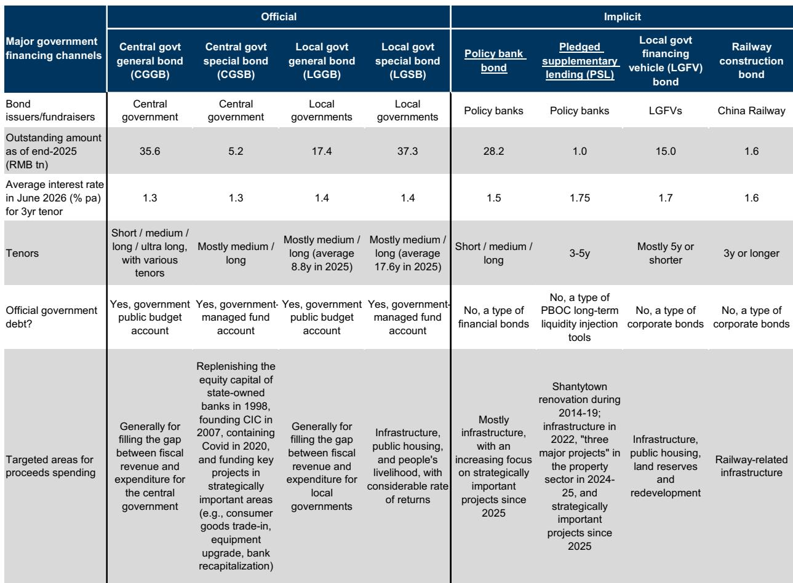
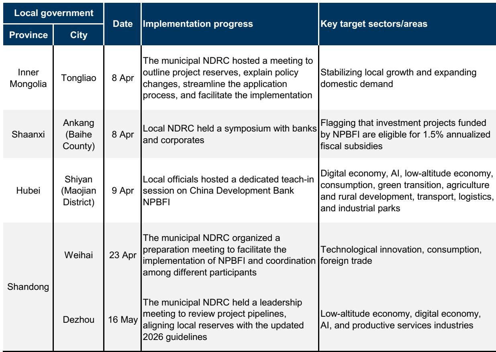
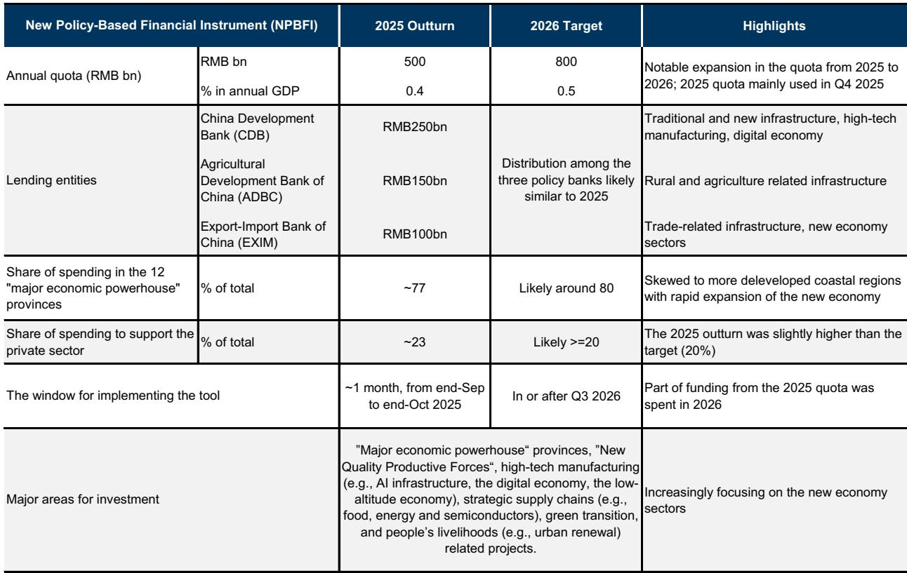

# 中国新型政策性金融工具：不只是刺激，更是科技融资的战略转变

2025年4月，中国高层正式设立一项名为“新型政策性金融工具”的准财政工具，首月即投放5000亿元额度。2026年，该额度已提升至8000亿元。这并非简单的又一轮财政宽松，而是代表了一种结构性变化——在管理地方债务风险的同时，为高技术转型提供资金，这是传统工具难以兼顾的双重目标。

该工具通过三家政策性银行——国家开发银行、中国农业发展银行和中国进出口银行——引导低成本长期资金，为战略重点项目提供股权资本。该工具由中央协调，绕开地方融资平台，聚焦人工智能基础设施、半导体供应链、绿色转型及“六网”建设等方向。2025年约80%的额度流向中国12个经济实力较强的省份，这些省份合计占全国研发支出的80%。

本文旨在说明该工具为何值得关注、其运作机制与以往工具有何不同，以及观察者可以预期的合理宏观影响。核心观点是：该工具旨在解决一个特定瓶颈——高技术项目的股权资本不足——其乘数效应真实存在，但容易被夸大。真正的考验不在于额度大小，而在于它能在多大程度上有效带动私人资本，同时又不挤占其他投资。

## 该工具解决了传统信贷无法应对的持续瓶颈

该工具解决的根本问题是股权资本缺口。中国大多数大型基础设施和制造项目在获得商业银行贷款或私人部门债务之前，需要项目总成本15%-25%的初始股权出资。历史上，许多战略重要项目——尤其是高技术制造和新基建——因发起方无法获得足够的股权资本而被推迟或搁置。

该工具直接填补了这一缺口。政策性银行通过发行金融债券或利用央行抵押补充贷款工具筹集低成本资金，目前三年期及以上PSL利率为1.75%。国开行3-5年期债券回报表现近期在1.5%-1.6%左右，均低于地方政府债券回报表现，也远低于商业贷款利率。这些资金随后注入专项投资基金，为经国家发改委预审通过的项目提供股权。

这一机制与传统财政工具有本质区别。地方专项债和地方融资平台债务直接增加地方表外负债，而该工具不会。它由中央控制，需要央行、发改委、财政部及三家政策性银行协调配合，理论上能带动商业银行和私人读者的后续贷款，而不增加地方债务存量。

该工具的历史沿革也印证了这一点。其根源可追溯至2022年疫情期间部署的7400亿元“政策性开发性金融工具”，主要用于交通、水利和能源基础设施。2025年的制度化将其使命明确扩展至“新质生产力”——涵盖人工智能、数字经济、低空经济和战略供应链的政策框架。因此，该工具并非临时性刺激，而是中国财政工具箱中的一项永久性补充。

## 地理集中反映的是战略意图，而非偶然

2025年该工具约80%的资金流向12个省份：广东、江苏、山东、浙江、四川、河南、湖北、福建、上海、湖南、安徽和北京。这些省份占全国GDP的69%、研发支出的80%和零售额的72%，但仅占人口的59%和固定资产投资的58%。因此，资金分配明显偏向经济最活跃、技术最先进的地区。

这并非分配上的偶然，而是反映了将稀缺股权资本集中投向能产生最高技术升级和生产率增长回报地区的政策选择。这12个省份也是中国人工智能供应链、半导体制造厂和数字基础设施项目的主要所在地。通过将资金集中投向这些地区，决策者实际上是在沿海和中部经济核心地带加倍投入，而让财政受限的内陆省份依赖其他融资渠道。

这12个省份与中国12个高负债省份——包括贵州、云南、辽宁和甘肃——之间的分化十分显著，且可能进一步扩大。近年来，强省固定资产投资增速快于高负债省份，这一差距预计将持续。该工具强化了这一趋势。观察者应预期高技术投资的地理集中度将加剧，这对区域增长差异、房地产市场及地方财政收入均有影响。

## 宏观影响真实存在但易被夸大——情景分析提供合理区间

官方估算及部分市场评论认为，8000亿元额度可撬动5-10万亿元的固定资产投资总额，意味着6-12倍的乘数。这些数字基于大多数项目20%-30%的最低股权资本要求，并假设该工具可覆盖其中最多50%的股权，其余来自其他来源。

这些估算存在三个误导因素。首先，部分配套资金——来自中央和地方专项债——本就会用于其他项目，其乘数效应不应重复计算。其次，该工具的实施可能分流现有项目融资，尤其是在政策性银行债券发行和地方资源重新配置期间。第三，在私人部门信贷需求依然低迷的背景下——近期社会融资规模存量增速持续下降——部分由该工具融资的项目可能只是替代了原本会通过其他渠道进行的投资。

更现实的评估采用基于财政乘数的情景分析。此前研究发现，广义财政赤字率每扩大1个百分点，四个季度后中国实际GDP水平累计提升0.5个百分点。将此框架应用于该工具，假设保守、基准和乐观情景下的财政乘数分别为0.5倍、1倍和2倍，得出以下估算。

对于2025年9-10月部署的5000亿元，随后四个季度累计GDP水平影响在保守、基准和乐观情景下分别约为0.2、0.4和0.7个百分点，影响主要集中在2026年。对于2026年8000亿元额度，假设在第三季度实施，基准情景下GDP水平影响估计为0.5个百分点，范围在0.3至1.1个百分点之间，具体取决于乘数。影响可能集中在2026年末和2027年初。

这些估算低于官方乘数说法，但仍具意义。0.5个百分点的GDP水平提升并非微不足道，尤其是在整体增长面临一定压力的环境下。然而，影响是滞后的，且存在显著不确定性。高频跟踪较为困难，因为PSL和政策性银行债券发行数据波动较大，且并非总是与实际资金部署同步。

## 观察者的决策框架：关注额度之外的指标

对于试图评估该工具实际影响的观察者而言，额度大小是最不具信息量的指标。相反，应关注四个领先指标。

第一，跟踪政策性银行债券发行和PSL流量。这些是该工具的资金来源。政策性银行债券发行持续增加或PSL扩张重启，将表明部署正在加速。反之，如果政策性银行主要依赖现有资产负债表能力，则增量影响较小。

第二，监测高技术固定资产投资数据，尤其是12个强省的数据。该工具旨在提振这一特定类别。如果高技术固定资产投资增速继续领先整体固定资产投资——正如近几个季度的情况——则表明该工具正在按预期发挥作用。如果差距缩小，则股权资本瓶颈可能没有假设的那么严重。

第三，关注其他投资类别中是否存在挤出迹象。如果在该工具部署期间社会融资总量增长依然疲弱，则表明其融资的项目正在替代而非补充其他投资。理想结果是投资活动广泛增加，而不仅仅是重新分配。

第四，评估地方政府的实施能力。该工具需要多个部门和政策性银行之间的协调。在高压反腐和政治调整背景下，地方官员激励不足可能延迟项目审批和资金部署。如果实施窗口仍像2025年那样短（从批准到全额部署约一个月），影响将集中但可能较大。如果时间拉长，影响将更为分散。

该工具是一项真正的新工具，旨在解决中国投资体系中的结构性约束。其意义不在于相对于GDP的规模——约0.5%——而在于其作为中央协调、聚焦股权、不增加地方债务的设计，用于为高技术转型提供资金。宏观影响真实但温和，观察者应对超出历史证据支持的乘数说法保持审慎。该工具的成功最终将不取决于分配了多少，而在于它带动了多少私人资本，以及实现了多少生产率增长。

*仅供参考。部分内容可能基于源材料通过AI辅助生成、翻译、总结或编辑，可能存在遗漏或错误。请独立核实。本文不构成专业建议。*

仅供参考。部分内容可能基于源材料通过AI辅助生成、翻译、总结或编辑，可能存在遗漏或错误。请独立核实。本文不构成专业建议。

