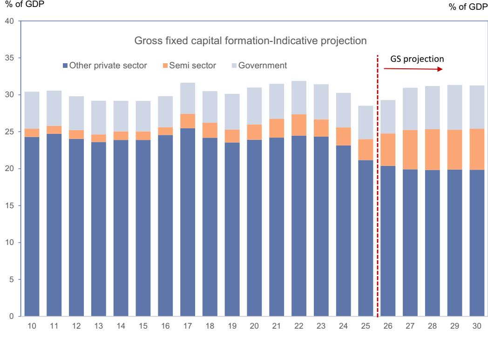
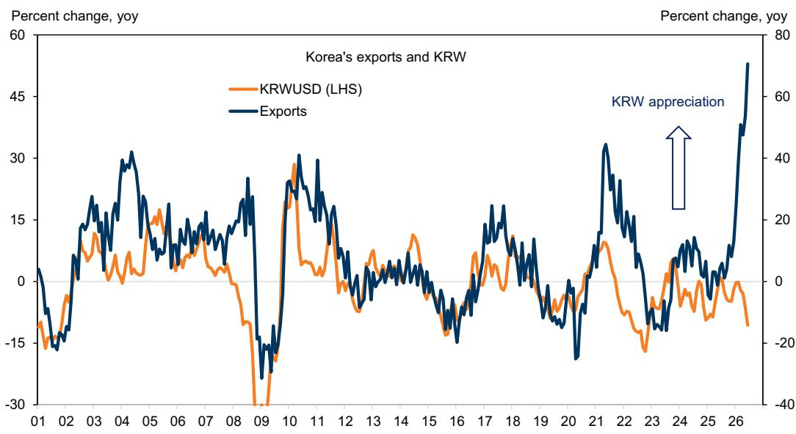
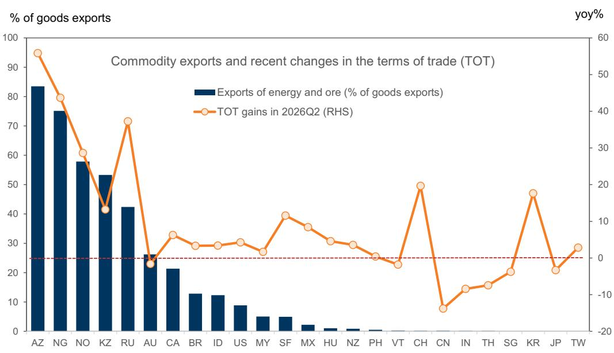

# GS：韩国AI红利传导——主要通过汇率和财政政策

韩国正处在AI发展受益较为明显的地区之列。出口因存储芯片价格上升而有所增长，有望在2026年突破1万亿美元。但GS这份研究笔记的核心判断是：这笔贸易顺差能否转化为国内更广泛的增长，关键变量不在半导体本身，而在于汇率和财政政策。韩元近期的持续调整，正在抵消AI带来的正向溢出效应，这构成了一个与全球经验相悖的意外局面。

## 1. 贸易条件改善本应推升汇率，但韩元反向调整

GS对32个地区2000年至2026年的跨国研究显示，无论是大宗商品出口国还是制造业出口国，贸易条件改善通常伴随本币升值。在制造业出口国，一个标准差（约2.9%）的贸易条件改善，会在四个季度内推动汇率升值约1%。然而，韩国当前的情况完全背离了这一规律。尽管贸易条件在第二季度同比改善近20%，韩元却出现显著调整。报告指出，零售读者的海外标的研究、社保产品的外汇配置、外部读者的对冲需求以及近期KOSPI上涨后的再平衡操作，是韩元调整的主要驱动因素。

> **KC评论：** 韩元逆势调整意味着，AI带来的出口收入并未通过汇率渠道自然转化为国内购买力。这削弱了贸易条件改善对国内消费和研究的传统传导机制。

## 2. 汇率调整正在抵消AI对国内需求的溢出效应

韩元持续调整对国内宏观环境的影响是多重的。GS估算，韩元对美元每调整5%，将推高通胀约30个基点。这意味着，在出口企业享受价格红利的同时，国内消费者正面临更高的进口商品价格，实际购买力有所变化。同时，为应对输入性通胀，韩国央行可能被迫提前调整货币政策——报告预计7月16日的议息会议将启动加息。此外，韩国出口产业的结构性变化也在削弱汇率调整对出口的刺激作用：过去十年，韩国企业海外子公司的销售额已攀升至其本土直接出口的约90%，汇率对出口利润的影响已显著下降。

## 3. 财政政策是决定AI研究能否落地的另一关键

与汇率传导路径不同，财政政策决定了贸易条件改善能否有效转化为实际研究。全球存储芯片行业当前面临产能瓶颈，而非部分采掘行业常见的产能过剩。韩国近期宣布的“三大AI超级项目”是一项大规模公私合作研究计划。GS测算，如果这些项目能参照此前半导体产业集群的推进节奏实施，将带动韩国实际资本支出每年额外增长2-3个百分点，并在中期内每年提升GDP增速约0.4个百分点。名义私人研究与公共研究合计，中期内将上升约3-4个百分点的GDP占比。

## 4. 政策优先级将从稳定物价转向盈余再循环

报告认为，韩国政策制定者面临两个阶段的挑战。短期内，韩元稳定是优先目标，以保障价格稳定并将AI繁荣延伸至国内需求。持续的韩元弱势会在AI繁荣周期初期加剧成本推动型通胀，抑制消费，并扩大出口部门与内需部门之间的分化。但中长期来看，政策重心将从稳定物价转向如何高效地再循环外部盈余。GS建议，渐进式的货币紧缩配合部分财政盈余的储蓄机制——例如设立名为“未来应对产品”的主权财富产品——将有助于维持宏观稳定，并让AI相关收益更广泛地惠及各个行业。如果AI繁荣持续，盈余再循环对韩国宏观稳定和潜在增长的重要性将日益凸显。

For informational purposes only. Portions may be generated,translated,summarized,or edited with AI assistance based on source materials and may contain omissions or errors. Please verify independently. This is not investment,legal,tax,accounting,or other professional advice.

