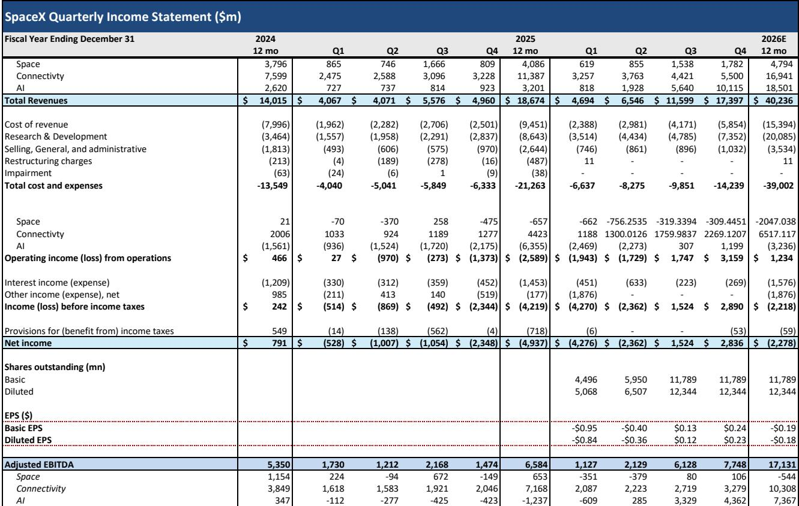
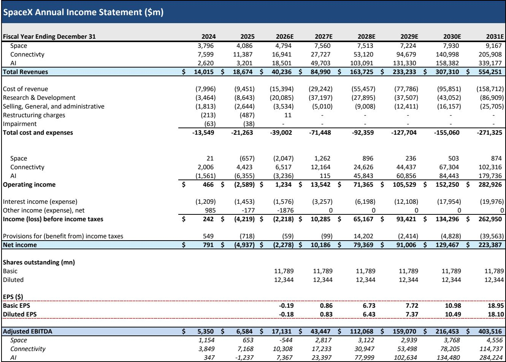
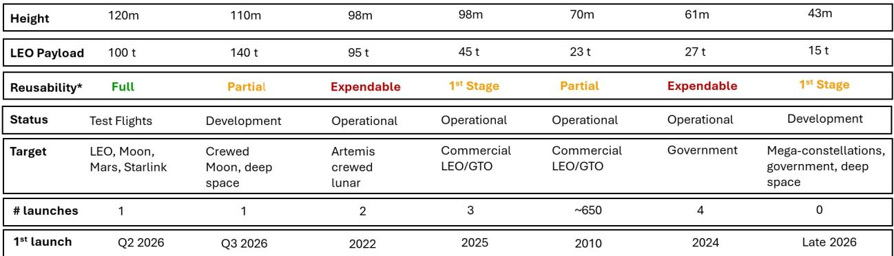

# Bernstein：SpaceX与中国长征十号助推器回收-真正竞争者出现

2026年7月10日，中国成功实现了长征十号B火箭一级助推器的回收着陆。这一事件比Bernstein分析师此前的预期提前了大约六个月。在Bernstein看来，中国已成为SpaceX在航天发射领域最主要的长期竞争者。这份报告的核心判断并非中国已经接近SpaceX，而是中国正在以超出预期的速度推进其航天能力，并且这一进程正在重塑全球太空竞赛的格局。

中国航天部门计划在今年晚些时候进行下一次发射和回收试验。更值得关注的是，中国在去年12月向国际电信联盟提交了总计超过20万颗低轨卫星的星座申请。尽管这一数字远低于SpaceX宣称的未来百万颗卫星计划，但它清晰地表明，中国正在从发射能力和卫星运营两个维度同时布局。

## 1. 长征十号只是第一步，SpaceX的领先优势仍在扩大

Bernstein指出，中国此次成功着陆是其大型运载火箭的首次回收，但尚未完成助推器的重复使用。而SpaceX的猎鹰九号火箭已经实现了近十年的助推器复用，部分助推器重复使用次数超过20次。去年猎鹰九号完成了165次发射，这背后是SpaceX在霍桑工厂建立的、分析师认为“与其他任何重型发射生产设施都不同”的规模化生产能力。

关键差异在于复用深度。长征十号目前只具备一级复用能力，这意味着每次发射仍需制造新的二级火箭。而SpaceX的星舰系统设计目标是全复用——包括第一级和第二级。Bernstein在更早的启动报告中已经分析过，全复用可以将年发射量提升一个数量级。该机构预测，到2031年SpaceX的年发射量将达到约3500次，而长征十号届时可能难以突破100次。

> **KC评论：** 这里容易被忽略的是“全复用”对发射成本的指数级影响。猎鹰九号的一级复用已经改变了商业发射市场，而星舰的全复用将彻底改变人类进入太空的宏观环境模型。中国目前还处于猎鹰九号早期的技术阶段。

## 2. 星舰第13次发射在即，技术迭代正在加速

报告提到，SpaceX计划于2026年7月16日进行星舰V3的第13次发射。这将是第12次发射的延续，但针对飞行中暴露的问题进行了多项改进：发动机启动顺序已调整以避免助推器方向翻转，硬件改动提升了五台发动机的再点火可靠性，此前一台猛禽发动机的故障也已得到修复。此次发射将部署20颗V3版星链卫星，并继续测试热防护系统——这是实现第二级全复用的前提。

星舰的助推器回收已经通过“筷子”机构在发射台上完成，这直接支持了快速复用。而第二级复用预计将在第15次发射时进行验证，时间可能在今年秋季。Bernstein认为，尽管每一次星舰发射都存在不确定性，但SpaceX正在以极高的节奏推进技术验证。

## 3. 新的太空竞赛正在形成，政策支持将成为关键变量

报告最核心的洞察在于地缘政治维度。中国载人航天工程办公室多次将2030年设定为载人登月目标，并计划最终建立月球研究站。而美国阿尔忒弥斯计划的目标是在2028年底前实现NASA宇航员登月。Bernstein认为，考虑到中国可能提前实现目标，美中之间已经实质性地进入了一场新的太空竞赛。

这一竞赛格局对SpaceX意味着什么？报告认为，尽管蓝色起源的“新格伦”火箭和波音等公司也在参与，但SpaceX仍将是美国政策支持的核心受益者。原因很简单：在争夺月球基地的竞赛中，SpaceX的星舰是目前相对少见具备全复用能力和大规模运输潜力的系统。

> **KC评论：** 这份报告提供了一个观察框架：评估航天公司长期竞争力的三个维度——复用深度、发射频率、政策支持。SpaceX在三项上均领先，但中国在“政策支持”这一项上拥有集中资源办大事的体制优势。读者需要关注的不是短期技术差距，而是中国能否在5-10年内跨越从“一级回收”到“全复用”的技术鸿沟。

Bernstein的分析表明，SpaceX在可预见的未来仍将保持技术领先，但中国的追赶速度正在加快。对于关注航天产业的读者而言，真正的变量不是SpaceX能否成功，而是中国能否在月球基地和低轨星座这两个战略目标上形成实质性竞争。7月16日的星舰第13次发射，将是检验SpaceX技术迭代节奏的下一个关键节点。

For informational purposes only. Portions may be generated,translated,summarized,or edited with AI assistance based on source materials and may contain omissions or errors. Please verify independently. This is not investment,legal,tax,accounting,or other professional advice.

For informational purposes only. Portions may be generated,translated,summarized,or edited with AI assistance based on source materials and may contain omissions or errors. Please verify independently. This is not investment,legal,tax,accounting,or other professional advice.

