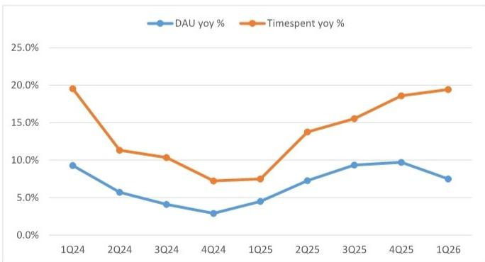
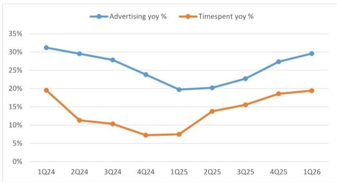

# Bilibili Inc. (BILI): Investor Day Takeaways: Healthy Community Reinforces Monetization Flywheel; Enhancing Game Pipeline into 2026-27

We attended the 2026 Bilibili Investor Day, where key focus and our takeaways centered around: 1) a healthy and unique community ecosystem remaining the foundation of long-term growth, supported by high-quality content, emerging content formats, creator growth and vibrant interactions; 2) solid advertising momentum to continue, underpinned by traffic growth, increasing user spending power and expanding monetization of deep content scenarios such as search, playback page and PC/OTT; 3) games continue to execute under a long-term strategy with disciplined expansion, targeting at least 2 new category-leading long-live titles over the next 2-3 years; and 4) AI is positioned as Bili's major investment priority, with tangible monetization and efficiency benefits already emerging across content, advertising and recommendation.

We lay out our key takeaways below.

## Content & Community: Healthy Ecosystem with Strong Trust and Differentiated Engagement

Management continues to emphasize that Bilibili's core moat is its community with differentiated high-quality content.

Both old and new content remain highly vibrant, with even the video uploaded in 2009 generating 2.03mn additional views in the past year. Meanwhile, video podcasts grew by 500%+ yoy in the past year, highlighting the platform's ability to incubate new long-form content formats.

■ Community engagement remains high quality. Over the past year, bullet comments and comments grew 19% yoy, while comments exceeding 100 characters increased 32% yoy, reflecting deeper user participation and discussion.

Trust between creators and users continues strengthening, with creators above 1k followers growing 31% yoy and creators above 10k followers growing 21% yoy in the past year.

Importantly, management views AI as an amplifier of the ecosystem rather than as a disruption risk to the platform. It believes AI improves content creation productivity but does not change the underlying relationship between creators and users, and Bilibili's essence is community and trust, and therefore generative AI is more likely to strengthen rather than replace the platform model.

## Advertising: Solid Momentum Driven by Growing Traffic, Rising User Consumption Power and Expanding Monetization

Management framed advertising growth around three pillars, including growing traffic, rising user consumption power, and expanding monetization within deep content scenarios.

The user traffic foundation remains strong, with DAU +8% yoy, average daily timespent increasing by 11mins yoy, and total timespent growing 19% yoy in 1Q26.

Community ecosystem continues to improve. Mid-to-long-form content accounts for more than 65% of viewing time, while the average user age has reached 27 years old, with 55% of users located in tier-1 and tier-2 cities. Management believes this demographic profile should continue supporting consumption-oriented advertising budgets over the next several years.

The content-commercialization flywheel remains healthy. In 1Q26, average creator income increased 24% yoy, while content submissions from 10k+ follower creators increased more than 50% yoy, suggesting monetization is reinforcing content supply.

Monetization through deep content scenarios remains a key growth opportunity. Management highlighted search, playback pages and PC/OTT viewing as the company's critical focus on monetization opportunities going forward.

□ Search revenue grew 100%+ yoy in 1Q26, benefiting from users' active content discovery intent.

□ Playback page revenue grew 80%+ yoy in 1Q26, leveraging rich contextual information around video consumption.

□ PC/OTT revenue grew 50%+ yoy in 1Q26, benefiting from more immersive viewing experiences and stronger brand advertising positioning.

□ Management reiterated that monetization of these deep content scenarios will remain a major strategic focus over the coming years.

Industry solutions are characterized by penetrating attractive industries/verticals through focusing on strategic key accounts (SKAs) and leading customers. Management highlighted strong momentum in home furnishing industry, where ad revenue grew 100%+ yoy in 1Q26. Meanwhile, Bilibili mini-games and mini-programs delivered revenue growth of 3x yoy, demonstrating success in keeping content-consumption advertisers within the Bilibili ecosystem.

## Games: Enhanced Pipeline Visibility with More Titles to Come in 4Q26/2027

Management reiterated its game strategy introduced in 2024 to: 1) build games that young people love; 2) become the first or best in selected vertical categories; 3) focus on long-term operations. The company's goal is to add at least 2 long-lived category-leading games over the next 2-3 years.

The execution strategy focuses on: 1) expanding into more youth-oriented genres; 2) pursuing both self-developed and licensed titles; 3) building global and multi-platform games from day one.

■ Management noted that game project approval within Bilibili is now far more disciplined than in previous years, although the number of self-developed titles are expected to increase slowly but grow faster than licensed titles over time.

Pipeline visibility continues improving. For 2026, management highlighted Lumi Master (闪耀吧噜咪) and Sangokushi: Wangdao Tianxia (三国志：王道天下) as key 4Q26 launches, while other titles are currently scheduled for 2027 and beyond.

□ Sangokushi: Wangdao Tianxia (三国志：王道天下) is positioned as a complementary offering to Sanguo: NSLG rather than a cannibalistic product. Sanguo: NSLG targets users seeking lighter gameplay and lowers monetization pressure, while Sangokushi: Wangdao Tianxia is designed for more intense and immersion-oriented SLG players. Management believes the title will help Bili establish broader coverage within the Sanguo SLG category and further strengthen its competitive positioning in the segment. The game has recently entered another round of testing and is currently planned for 4Q26 launch.

Sanguo: Ncard (三国百将牌) is a strategy card title where management explicitly prioritizes long-term retention over short-term monetization. The game has started soft-launch and remains under active testing and iteration, with development efforts focused on optimizing retention metrics and gradually scaling DAU through continuous product refinement, consistent with Bili's long-term operations philosophy.

□ Lumi Master (闪耀吧！噜咪) is a self-developed pet-collection adventure mobile game targeting the fast-growing monster-catching genre. The game's core differentiation lies in distilling the fundamental fun of monster collection while delivering a lighter and lower-burden gameplay experience. Global launch is currently scheduled for 4Q26.

Sanguo: The Ravages of Time (三国火凤燎原) is a self-developed title based on the well-known comic IP. The game focuses on the Wargame/tactical RPG segment, which management views as a category with long lifecycle potential. Initial testing is scheduled for July 2026, while both PC and mobile versions are expected to launch globally, highlighting the company's multi-platform and globalization strategy.

□ Guild Wars Series (激战系列) represents Bili's first global publishing projects. Management views the title as highly compatible with Bili's content ecosystem given the strong concentration of strategy-card and MMO enthusiasts on the platform. Importantly, this will be a true global multi-platform launch across PC and mobile, underscoring its growing international publishing capabilities.

□ The undisclosed MMORPG remains one of the most intriguing projects in the pipeline. Management described it as the official sequel to a globally recognized top-tier gaming IP with a history spanning over two decades. The title is being built natively based on PC while supporting multi-platform deployment across PC and mobile. Formal unveiling is expected around late July or early August.

□ Escape from Duckov Mobile. Management noted the title is slated for 2027 launch and emphasized that development is focused on reworking core gameplay systems rather than a simple mobile port. The company aims to preserve the franchise's unique gameplay experience while improving mobile fit, with the ultimate goal of turning the title into another hit product on mobile following the strong success of the PC version.

## AI: Major Investment Priority with Clear Business KPIs

Management stated that AI will be the only major investment priority over the next several years. Importantly, every AI project must directly improve business metrics through cost reduction, efficiency gains, user growth or revenue expansion, per management.

For example, AI capability has meaningfully improved advertising monetization efficiency.

\- Semantic data asset. With the help of AI, user behaviour, comments and creator content are converted into structured advertiser insights. This has already delivered 11%+ ROI improvement within gaming advertisers and has expanded into education, consumer electronics, novels and short-drama verticals.

AIGC ad materials. More than 50% of advertisement video covers and titles are already AI-generated on Bili platform, accounting for over 40% of advertising spending. Management plans to roll out fully AI-generated video production across mini-games, short dramas and gaming advertisers by year-end.

\- Recommendation and matching algorithms also remain key focus areas. Management expects ranking-layer upgrades in 2H26 to deliver 5%+ eCPM uplift.

■ Fully-managed advertising products have already demonstrated strong results in e-commerce testing, with spending from mid-sized merchants increasing more than 2x.

Exhibit 1: Bili maintained solid user engagement growth into early 2026  
  
Source: Company data

Exhibit 2: Ads growth is accelerating, consistent with timespent trend  
  
Source: Company data

Exhibit 3: Bilibili: Financial summary

<table><tr><td></td><td>2022</td><td>2023</td><td>2024</td><td>2025</td><td>2026E</td><td>2027E</td><td>2028E</td></tr><tr><td>MAU (mn)</td><td>314</td><td>329</td><td>341</td><td>368</td><td>375</td><td>386</td><td>394</td></tr><tr><td>%yoy</td><td>26%</td><td>4%</td><td>4%</td><td>8%</td><td>2%</td><td>3%</td><td>2%</td></tr><tr><td>DAU (mn)</td><td>87</td><td>98</td><td>104</td><td>112</td><td>117</td><td>122</td><td>124</td></tr><tr><td>DAU/MAU</td><td>28%</td><td>30%</td><td>30%</td><td>30%</td><td>31%</td><td>32%</td><td>32%</td></tr><tr><td>RMB mn</td><td>2022</td><td>2023</td><td>2024</td><td>2025</td><td>2026E</td><td>2027E</td><td>2028E</td></tr><tr><td>Revenue</td><td>21,899</td><td>22,528</td><td>26,832</td><td>30,348</td><td>32,826</td><td>36,264</td><td>39,268</td></tr><tr><td>%yoy</td><td>13%</td><td>3%</td><td>19%</td><td>13%</td><td>8%</td><td>10%</td><td>8%</td></tr><tr><td>1. Mobile games</td><td>5,021</td><td>4,021</td><td>5,610</td><td>6,395</td><td>6,106</td><td>6,732</td><td>7,069</td></tr><tr><td>%yoy</td><td>-1%</td><td>-20%</td><td>40%</td><td>14%</td><td>-5%</td><td>10%</td><td>5%</td></tr><tr><td>2. Live broadcasting and VAS</td><td>8,715</td><td>9,910</td><td>10,999</td><td>11,928</td><td>12,174</td><td>12,771</td><td>13,249</td></tr><tr><td>%yoy</td><td>26%</td><td>14%</td><td>11%</td><td>8%</td><td>2%</td><td>5%</td><td>4%</td></tr><tr><td>3. Advertising</td><td>5,066</td><td>6,412</td><td>8,189</td><td>10,058</td><td>12,580</td><td>14,795</td><td>16,984</td></tr><tr><td>%yoy</td><td>12%</td><td>27%</td><td>28%</td><td>23%</td><td>25%</td><td>18%</td><td>15%</td></tr><tr><td>4. Others</td><td>3,096</td><td>2,185</td><td>2,033</td><td>1,966</td><td>1,966</td><td>1,966</td><td>1,966</td></tr><tr><td>%yoy</td><td>9%</td><td>-29%</td><td>-7%</td><td>-3%</td><td>0%</td><td>0%</td><td>0%</td></tr></table>

<table><tr><td>1Q25</td><td>2Q25</td><td>3Q25</td><td>4Q25</td><td>1Q26</td><td>2Q26E</td><td>3Q26E</td><td>4Q26E</td></tr><tr><td>368</td><td>363</td><td>376</td><td>366</td><td>376</td><td>373</td><td>379</td><td>371</td></tr><tr><td>8%</td><td>8%</td><td>8%</td><td>8%</td><td>2%</td><td>3%</td><td>1%</td><td>1%</td></tr><tr><td>107</td><td>109</td><td>117</td><td>113</td><td>115</td><td>115</td><td>119</td><td>117</td></tr><tr><td>29%</td><td>30%</td><td>31%</td><td>31%</td><td>31%</td><td>31%</td><td>32%</td><td>32%</td></tr><tr><td>1Q25</td><td>2Q25</td><td>3Q25</td><td>4Q25</td><td>1Q26</td><td>2Q26E</td><td>3Q26E</td><td>4Q26E</td></tr><tr><td>7,003</td><td>7,338</td><td>7,685</td><td>8,321</td><td>7,472</td><td>7,870</td><td>8,223</td><td>9,261</td></tr><tr><td>24%</td><td>20%</td><td>5%</td><td>8%</td><td>7%</td><td>7%</td><td>7%</td><td>11%</td></tr><tr><td>1,731</td><td>1,612</td><td>1,511</td><td>1,540</td><td>1,523</td><td>1,419</td><td>1,413</td><td>1,752</td></tr><tr><td>76%</td><td>60%</td><td>-17%</td><td>-14%</td><td>-12%</td><td>-12%</td><td>-6%</td><td>14%</td></tr><tr><td>2,807</td><td>2,837</td><td>3,023</td><td>3,262</td><td>2,912</td><td>2,885</td><td>3,074</td><td>3,303</td></tr><tr><td>11%</td><td>11%</td><td>7%</td><td>6%</td><td>4%</td><td>2%</td><td>2%</td><td>1%</td></tr><tr><td>1,998</td><td>2,449</td><td>2,570</td><td>3,042</td><td>2,589</td><td>3,127</td><td>3,151</td><td>3,713</td></tr><tr><td>20%</td><td>20%</td><td>23%</td><td>27%</td><td>30%</td><td>28%</td><td>23%</td><td>22%</td></tr><tr><td>467</td><td>440</td><td>582</td><td>477</td><td>448</td><td>439</td><td>586</td><td>492</td></tr><tr><td>-4%</td><td>-15%</td><td>3%</td><td>3%</td><td>-4%</td><td>0%</td><td>1%</td><td>3%</td></tr></table>

<table><tr><td>GP (GAAP)</td><td>3,849</td><td>5,442</td><td>8,774</td><td>11,114</td><td>12,369</td><td>14,180</td><td>16,159</td></tr><tr><td>Gross Margin</td><td>18%</td><td>24%</td><td>33%</td><td>37%</td><td>38%</td><td>39%</td><td>41%</td></tr><tr><td>Opex (GAAP)</td><td>(12,207)</td><td>(10,506)</td><td>(10,118)</td><td>(9,990)</td><td>(10,455)</td><td>(11,152)</td><td>(11,627)</td></tr><tr><td>S&amp;M</td><td>(4,921)</td><td>(3,916)</td><td>(4,402)</td><td>(4,394)</td><td>(4,374)</td><td>(4,692)</td><td>(4,858)</td></tr><tr><td>G&amp;A</td><td>(2,521)</td><td>(2,122)</td><td>(2,031)</td><td>(2,062)</td><td>(2,092)</td><td>(2,166)</td><td>(2,230)</td></tr><tr><td>R&amp;D</td><td>(4,765)</td><td>(4,467)</td><td>(3,685)</td><td>(3,533)</td><td>(3,988)</td><td>(4,294)</td><td>(4,538)</td></tr><tr><td>S&amp;M as % Sales</td><td>22.5%</td><td>17.4%</td><td>16.4%</td><td>14.5%</td><td>13.3%</td><td>12.9%</td><td>12.4%</td></tr><tr><td>G&amp;A as % Sales</td><td>11.5%</td><td>9.4%</td><td>7.6%</td><td>6.8%</td><td>6.4%</td><td>6.0%</td><td>5.7%</td></tr><tr><td>R&amp;D as % Sales</td><td>21.8%</td><td>19.8%</td><td>13.7%</td><td>11.6%</td><td>12.1%</td><td>11.8%</td><td>11.6%</td></tr><tr><td>EBIT (non-GAAP)</td><td>(6,599)</td><td>(3,385)</td><td>(61)</td><td>2,442</td><td>3,054</td><td>4,224</td><td>5,763</td></tr><tr><td>%margin</td><td>-30.1%</td><td>-15.0%</td><td>-0.2%</td><td>8.0%</td><td>9.3%</td><td>11.6%</td><td>14.7%</td></tr><tr><td>%yoy</td><td></td><td></td><td></td><td></td><td>25%</td><td>38%</td><td>36%</td></tr><tr><td>Net Profit (non-GAAP)</td><td>(6,702)</td><td>(3,414)</td><td>(39)</td><td>2,588</td><td>3,138</td><td>4,359</td><td>5,624</td></tr><tr><td>%margin</td><td>-30.6%</td><td>-15.2%</td><td>-0.1%</td><td>8.5%</td><td>9.6%</td><td>12.0%</td><td>14.3%</td></tr><tr><td>%yoy</td><td></td><td></td><td></td><td></td><td>21%</td><td>39%</td><td>29%</td></tr><tr><td>EPS (non-GAAP)</td><td>(16.95)</td><td>(8.29)</td><td>(0.05)</td><td>5.84</td><td>6.80</td><td>9.17</td><td>11.48</td></tr><tr><td>%yoy</td><td></td><td></td><td></td><td></td><td>16%</td><td>35%</td><td>25%</td></tr></table>

Source: Company data

<table><tr><td>2,539</td><td>2,676</td><td>2,818</td><td>3,081</td><td>2,773</td><td>2,932</td><td>3,102</td><td>3,562</td></tr><tr><td>36.3%</td><td>36.5%</td><td>36.7%</td><td>37.0%</td><td>37.1%</td><td>37.3%</td><td>37.7%</td><td>38.5%</td></tr><tr><td>(1,167)</td><td>(1,048)</td><td>(1,051)</td><td>(1,128)</td><td>(1,153)</td><td>(1,062)</td><td>(1,069)</td><td>(1,090)</td></tr><tr><td>(516)</td><td>(510)</td><td>(509)</td><td>(528)</td><td>(533)</td><td>(519)</td><td>(493)</td><td>(547)</td></tr><tr><td>(841)</td><td>(866)</td><td>(905)</td><td>(921)</td><td>(921)</td><td>(984)</td><td>(987)</td><td>(1,096)</td></tr><tr><td>16.7%</td><td>14.3%</td><td>13.7%</td><td>13.6%</td><td>15.4%</td><td>13.5%</td><td>13.0%</td><td>11.8%</td></tr><tr><td>7.4%</td><td>6.9%</td><td>6.6%</td><td>6.3%</td><td>7.1%</td><td>6.6%</td><td>6.0%</td><td>5.9%</td></tr><tr><td>12.0%</td><td>11.8%</td><td>11.8%</td><td>11.1%</td><td>12.3%</td><td>12.5%</td><td>12.0%</td><td>11.8%</td></tr><tr><td>342</td><td>573</td><td>688</td><td>838</td><td>524</td><td>641</td><td>841</td><td>1,048</td></tr><tr><td>4.9%</td><td>7.8%</td><td>9.0%</td><td>10.1%</td><td>7.0%</td><td>8.2%</td><td>10.2%</td><td>11.3%</td></tr><tr><td></td><td></td><td>153%</td><td>81%</td><td>53%</td><td>12%</td><td>22%</td><td>25%</td></tr><tr><td>362</td><td>561</td><td>786</td><td>878</td><td>585</td><td>705</td><td>890</td><td>958</td></tr><tr><td>5.2%</td><td>7.6%</td><td>10.2%</td><td>10.6%</td><td>7.8%</td><td>9.0%</td><td>10.8%</td><td>10.3%</td></tr><tr><td></td><td></td><td>233%</td><td>94%</td><td>62%</td><td>26%</td><td>13%</td><td>9%</td></tr><tr><td>0.85</td><td>1.29</td><td>1.73</td><td>1.92</td><td>1.31</td><td>1.53</td><td>1.93</td><td>2.06</td></tr><tr><td></td><td></td><td>206%</td><td>50%</td><td>54%</td><td>19%</td><td>12%</td><td>7%</td></tr></table>
