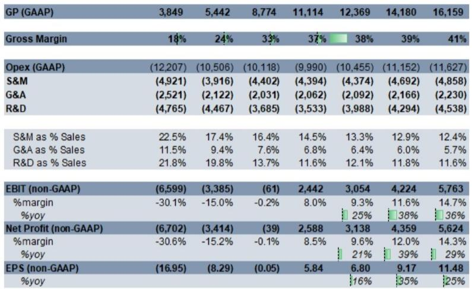
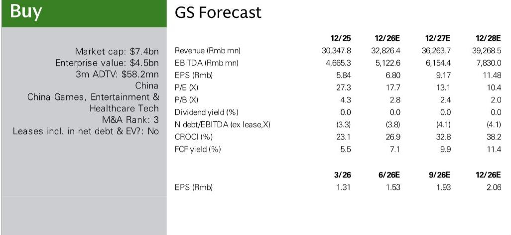
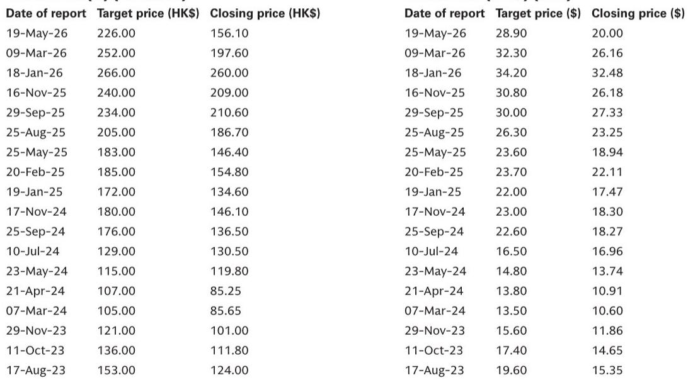

# GS：B站读者日要点健康社区强化货币化飞轮增强游戏管线信息20262

B站2026年读者日传递的核心信号，与市场此前聚焦的游戏管线不同：管理层将AI定位为未来数年相对少见重大投入方向，且每个AI项目必须直接挂钩业务指标。同时，广告业务正从流量增长、用户消费力提升和深度场景货币化三个维度同时加速。这份由GS分析师团队发布的报告，最值得关注的判断是——B站的社区生态已从“护城河”进化为“货币化飞轮”，而AI正在成为这个飞轮的加速器。

报告明确指出，B站的核心壁垒并非单一产品功能，而是基于高质量内容和深度信任的社区生态。一个关键数据点：2009年上传的视频在过去一年仍获得203万次新增播放。这说明B站的内容资产具有长尾复利效应，而非传统视频平台的“发布即衰减”模式。同时，视频播客内容同比增长超过500%，显示平台仍在孵化新的长内容形态。

## 1. 广告增长的三重引擎正在同步运转，搜索和播放页成为新增长极

报告将广告增长拆解为三个独立但相互强化的驱动力：流量增长、用户消费力提升、深度场景货币化。2026年第一季度，B站日活用户同比增长8%，人均使用时长增加11分钟，总使用时长增长19%。更值得关注的是用户结构变化——平均年龄已达27岁，55%用户位于一二线城市。这一人口结构意味着B站正从“Z世代聚集地”向“主流消费人群平台”过渡，对消费类广告主的吸引力将持续增强。

深度场景货币化是报告强调的最大增量。搜索广告收入同比增长超过100%，播放页广告增长超过80%，PC/OTT端增长超过50%。这三个场景的共同特点是用户主动意图强、沉浸度高，广告主愿意为此支付溢价。报告认为，这些场景的货币化仍处于早期阶段，未来几年将是战略重点。

> **KC评论：** 搜索和播放页广告的高增长，本质上是B站把“用户主动找内容”和“用户沉浸看内容”这两个行为转化为广告库存。这与信息流广告的“被动提到”逻辑不同，广告主获得的是更精准的意图信号和更长的注意力窗口。

## 2. 游戏管线透明度提升，但短期收入贡献有限

管理层重申了2024年提出的游戏战略：做年轻人喜欢的游戏、在选定品类做到第一或最好、聚焦长期运营。目标是在未来2-3年新增至少2款品类领先的长生命周期产品。

报告披露了多条管线细节。2026年第四季度将重点推出两款产品：《闪耀吧噜咪》和《三国志：王道天下》。前者是自研的宠物收集冒险手游，瞄准快速增长的“类宝可梦”品类，计划全球发行。后者定位为《三国：谋定天下》的补充而非替代，面向更硬核的SLG玩家。

值得注意的是，管理层明确表示，B站内部游戏项目审批已比过去严格得多，自研产品数量将缓慢增加，但增速会快于代理产品。从财务数据看，报告预测2026年游戏收入同比下降5%，2027年恢复10%增长。这意味着游戏短期内不会成为收入增长的主要驱动力，但其战略价值在于为社区提供内容供给和用户留存。

## 3. AI被定位为相对少见重大投入，但每个项目必须算清ROI

管理层将AI定义为未来数年相对少见重大研究方向，且每个AI项目必须直接改善业务指标——成本降低、效率提升、用户增长或收入扩张。这与许多公司“先投入再看效果”的做法形成对比。

报告提供了具体案例。在广告侧，AI已将用户行为、评论和创作者内容转化为结构化广告洞察，游戏广告主的ROI提升超过11%。超过50%的广告视频封面和标题已由AI生成，占广告支出的40%以上。管理层计划在年底前实现迷你游戏、短剧和游戏广告的完全AI视频制作。提到算法方面，预计2026年下半年的排序层升级将带来5%以上的eCPM提升。

> **KC评论：** 管理层强调“AI不改变创作者与用户之间的信任关系”，这实际上是在划定AI应用的边界。B站的核心资产是社区信任，AI只能放大这个资产，不能替代它。报告隐含的判断是：如果AI能帮助创作者提高效率、帮助广告主提高ROI，社区生态反而会更强。

## 4. 一个可复用的观察框架：社区货币化的三个阶段

从B站的案例可以提炼出一个通用的社区货币化观察框架。第一阶段是“流量货币化”，即通过广告和直播将用户注意力变现。第二阶段是“信任货币化”，即社区信任度足够高后，用户愿意为内容付费、为创作者打赏、为品牌背书。第三阶段是“生态货币化”，即社区本身成为内容生产和商业创新的平台，AI、游戏、电商等新业务在社区土壤上自然生长。

B站目前正处于第二阶段向第三阶段过渡的关键时期。广告收入持续高增长（报告预测2026年增长25%），创作者收入同比增长24%，10万粉丝以上创作者的内容提交量增长超过50%——这些数据表明货币化正在反哺内容供给，形成正向循环。而AI投入和游戏管线，则是第三阶段的关键试验。

报告没有回避不确定性。游戏收入短期承压、广告增速能否持续、AI投入的回报周期，都是需要持续观察的变量。但至少从读者日传递的信息看，B站管理层对社区生态的信心，以及将AI作为“放大器”而非“替代者”的定位，是目前最清晰的战略锚点。

For informational purposes only. Portions may be generated,translated,summarized,or edited with AI assistance based on source materials and may contain omissions or errors. Please verify independently. This is not investment,legal,tax,accounting,or other professional advice.

For informational purposes only. Portions may be generated,translated,summarized,or edited with AI assistance based on source materials and may contain omissions or errors. Please verify independently. This is not investment,legal,tax,accounting,or other professional advice.

