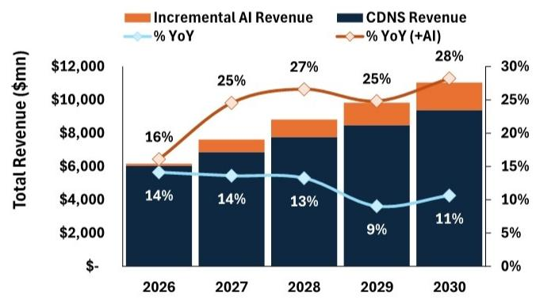
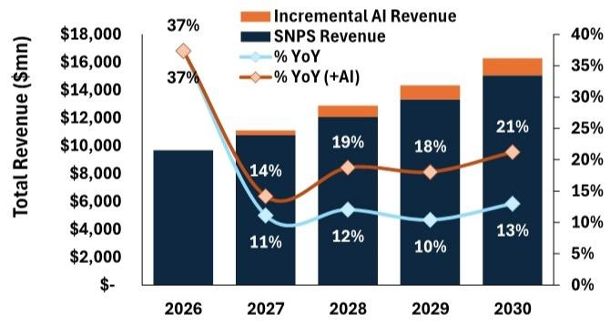
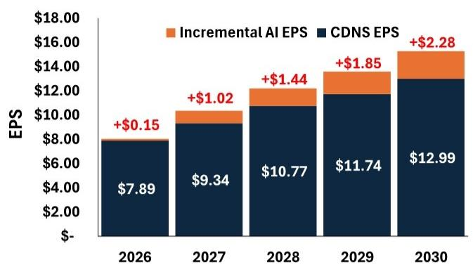
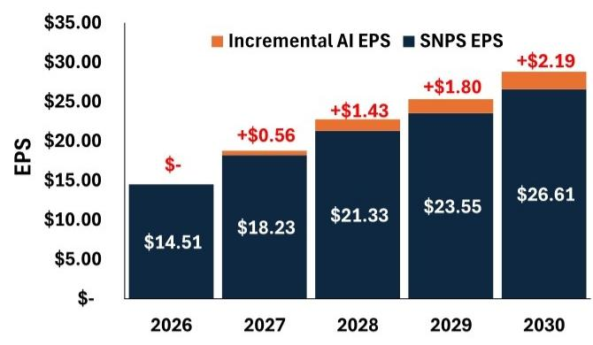
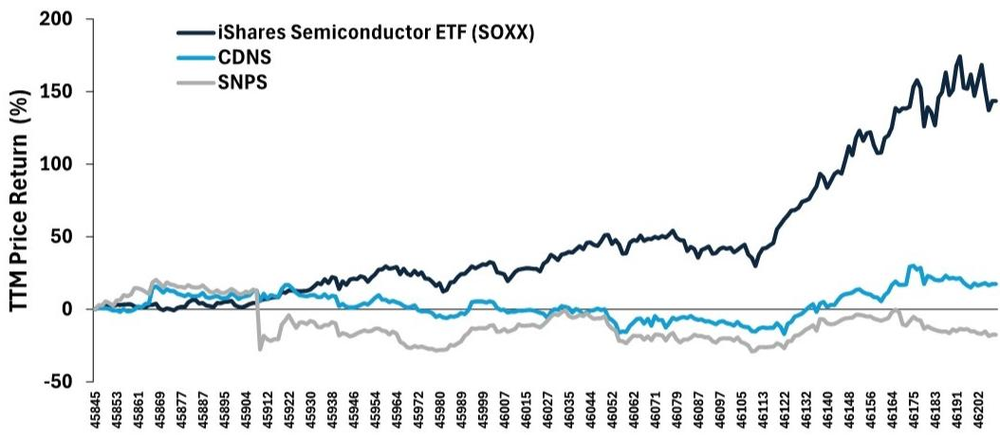
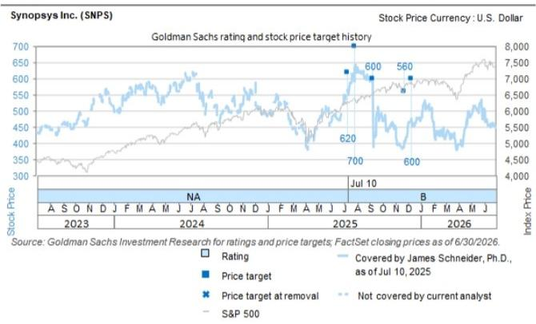
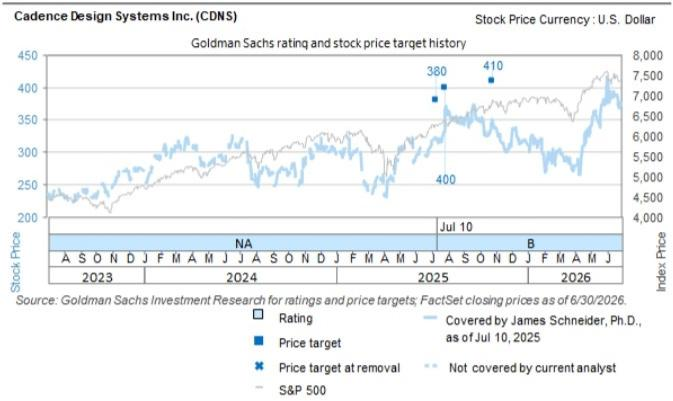

## 行业观察：半导体设计工具领域的新趋势

**核心观点：** 市场普遍将Cadence和Synopsys视为增长稳定的防御型公司，甚至可能成为AI变革的潜在受影响者。然而，我们的最新分析表明，向定制化AI芯片的转变加剧了芯片设计工程师的结构性短缺，而EDA公司凭借其独特的Agentic AI技术，有望将这一缺口转化为新的增长机会。我们估计，到2030年，这一增量市场空间约为每年37亿美元，这一预期尚未被市场充分反映，最早可能在2026年下半年开始显现。我们认为，当前的市场共识仍停留在该行业“前AI时代”的增长模式中，而增长曲线即将迎来变化。

- AI客户对芯片的需求可能导致到2030年全球芯片设计师缺口约7.2万人。一项关键的行业基准研究（SIA/BCG，2022年）在生成式AI出现前就预测美国芯片设计师缺口约2.3万人。此后，超大规模云厂商和AI实验室启动了定制芯片项目，至少需要约2500名设计师。与此同时，人类设计师的供应量每年仅增长2%-3%。我们估计，到2030年，AI设计工具可以增加约4.8万个代理工程师等效产能，这可以部分弥合这一缺口。

我们基于相对保守的采用率假设，测算到2030年EDA领域的Agentic AI年收入机会约为37亿美元。我们估计，“Copilot风格”的AI EDA工具每年每位工程师的定价约为2.5万美元，而客户在EDA上每个席位的花费约为9-10万美元。我们还认为，两家EDA供应商将在2026-27年推出的自主代理，到2030年可能处理高达30%的工作，每个代理的定价约为5万美元——约为人类设计工程师总成本的25%。

■ 市场数据基本未反映这一变化——我们认为最初的验证点可能在数月内显现。市场共识模型显示，两家公司的收入增长将从现在开始放缓，这意味着并未为这一新的Agentic层赋予价值。我们估计，这一机会可能将Cadence的收入增长率从约13%提升至25%左右（到2030年每股收益增加2.30美元），并将Synopsys的收入增长率提升至约20%（每股收益增加2.20美元）。下半年的业绩可能提供这一增长机会的初步证据。如果Agentic AI工具的应用获得动力，我们认为CDNS/SNPS有望以更快的增长率和更高的估值倍数进行重新定价。

我们重申对CDNS和SNPS的积极看法。我们将CDNS的12个月目标价从410美元上调至470美元（约22%的上行空间），仍基于45倍于正常化每股收益10.50美元的估值（此前基于9.10美元，因可见度提高）。我们认为SNPS约有35%的上行空间。

James Schneider, Ph.D.  
+1(212)357-2929 |  
jim.schneider@gs.com  
GS & Co. LLC

Luya You  
+1(212)902-5297 | luya.you@gs.com  
GS & Co. LLC

Anmol Makkar +1(212)357-1366 | anmol.makkar@gs.com GS & Co. LLC

Khalil Fenina +1(212)357-6392 | khalil.fenina@gs.com GS & Co. LLC

## 芯片设计人才短缺或为EDA带来可观的收入机会直至2030年

**核心观点：** 半导体行业长期面临人才问题，全球每年新增芯片设计师的数量仅为2%-3%——到2030年将产生约25.5万名工程师——而据我们估计，该行业需要32.5万名设计工程师才能满足由AI驱动的激增需求。

根据半导体行业协会（SIA）和波士顿咨询集团（BCG）2022年的一项行业劳动力研究，截至2021年，该行业已经预计到2030年将短缺约2.3万名芯片设计师。自该研究（在2023年生成式AI热潮之前）以来，超大规模云厂商和AI实验室迅速建立了自己的芯片项目，而商业芯片制造商将设计周期从两年缩短至一年。根据我们的估计，叠加这一增量需求，到2030年全球设计师缺口将达到约7万人。由于AI设计工具是短期内相对少见可用的供应响应，我们的估计表明，到2030年，它们可以为行业增加约48,000个工程师等效产能——足以覆盖五年前的行业缺口，但不足以满足AI热潮此后创造的需求。我们认为，Cadence和Synopsys——EDA工具市场的两家领导者——最有能力将结构性劳动力短缺转化为新的收入来源——到2030年，在约140亿美元的核心EDA收入基础上，新增约37亿美元的按使用量计价的AI软件收入（2026-30年累计收入约110亿美元），而市场数据目前尚未反映这一点。

图表1：2021-2030年全球芯片设计师供需情况——AI可以帮助填补缺口  
  
来源：GS全球投资研究

**我们预计，即使在保守假设下，EDA软件也将迎来可观的AI收入机会**

**核心观点：** 尽管AI工具在受劳动力供应限制的行业中具有显著的上行潜力，但我们的模型假设刻意保持保守。即便如此，我们的估计相当于到2030年，AI年化增量收入达到37亿美元。

我们的分析从全球芯片设计师数量开始，我们分离出AI工具已经可以帮助增强的职能（如验证、物理设计、RTL），并排除其尚无法胜任的职能。我们量化了两个不同的收入层级：(1) 面向现有人类工程师的AI增强或Copilot风格工具（在已经使用AI的领先设计中的采用率从20%-40%开始，每位工程师定价约2.5万美元，或已在AI增强续约中观察到的约20%的定价提升）；(2) 用于弥补无法招聘到的工程师的自主AI代理（我们假设到2030年，代理仅执行该未填补工作的30%，每个“虚拟工程师”定价约5万美元，不到隐含价值捕获的一半）。我们的预测基于我们认为相对温和、现实的假设（例如，部分采用、价值定价），但到2030年，其复合年市场规模仍可达到约37亿美元。

图表2：CDNS/SNPS AI收入汇总 - 2026-2030E

<table><tr><td>汇总</td><td>2026</td><td>2027</td><td>2028</td><td>2029</td><td>2030</td></tr><tr><td>第一阶段 - AI增强</td><td>$1,055</td><td>$1,411</td><td>$1,791</td><td>$2,198</td><td>$2,633</td></tr><tr><td>第二阶段 - 自主代理</td><td>$0</td><td>$258</td><td>$517</td><td>$775</td><td>$1,034</td></tr><tr><td>Agentic EDA市场总计</td><td>$1,055</td><td>$1,669</td><td>$2,308</td><td>$2,973</td><td>$3,667</td></tr><tr><td>估计AI收入 - Cadence</td><td>$119</td><td>$751</td><td>$1,038</td><td>$1,338</td><td>$1,650</td></tr><tr><td>估计AI收入 - Synopsys</td><td>$0</td><td>$329</td><td>$809</td><td>$1,019</td><td>$1,239</td></tr><tr><td>CDNS收入 (Visible Alpha)</td><td>$6,046</td><td>$6,869</td><td>$7,780</td><td>$8,484</td><td>$9,388</td></tr><tr><td>基础增长率</td><td>14.1%</td><td>13.6%</td><td>13.3%</td><td>9.0%</td><td>10.7%</td></tr><tr><td>AI带来的上行空间</td><td>2.0%</td><td>10.9%</td><td>13.3%</td><td>15.8%</td><td>17.6%</td></tr><tr><td>基础 + AI增长率</td><td>16.1%</td><td>24.6%</td><td>26.6%</td><td>24.8%</td><td>28.2%</td></tr><tr><td>SNPS收入 (Visible Alpha)</td><td>$9,691</td><td>$10,770</td><td>$12,068</td><td>$13,324</td><td>$15,055</td></tr><tr><td>基础增长率</td><td>37.4%</td><td>11.1%</td><td>12.1%</td><td>10.4%</td><td>13.0%</td></tr><tr><td>AI带来的上行空间</td><td>0.0%</td><td>3.1%</td><td>6.7%</td><td>7.6%</td><td>8.2%</td></tr><tr><td>基础 + AI增长率</td><td>37.4%</td><td>14.2%</td><td>18.8%</td><td>18.1%</td><td>21.2%</td></tr></table>

来源：Visible Alpha共识数据，GS全球投资研究

图表3：截至2026年7月，超大规模云厂商和AI实验室的定制芯片设计项目示例

<table><tr><td>设计项目</td><td>状态</td><td>估计设计师需求</td></tr><tr><td>Google TPU (v7 Ironwood) + Axion</td><td>进行中</td><td>300</td></tr><tr><td>AWS Trainium 3 / Inferentia (Annapurna)</td><td>进行中</td><td>300</td></tr><tr><td>Microsoft Maia 200</td><td>进行中</td><td>450</td></tr><tr><td>Meta MTIA</td><td>进行中</td><td>400</td></tr><tr><td>OpenAI Jalapeno</td><td>已流片；27-28年量产</td><td>350</td></tr><tr><td>Anthropic (Broadcom "Titan")</td><td>已报道</td><td>100</td></tr><tr><td>Tesla Dojo / AI5 - AI6</td><td>进行中</td><td>200</td></tr><tr><td>Apple AI服务器芯片</td><td>进行中</td><td>350</td></tr><tr><td>xAI</td><td>已报道</td><td>100</td></tr><tr><td colspan="2">美国新增设计需求总计</td><td>2,550</td></tr></table>

来源：GS全球投资研究整理的数据

## 仍以“前AI”增长定价——尽管AI的转折点已近在眼前

**核心观点：** 我们认为，市场在很大程度上将EDA公司视为AI交易的旁观者——充其量是防御性的、稳定增长的标的，最坏情况下是AI变革的受害者——SOXX过去12个月回报率约为140%，而CDNS上涨约20%，SNPS则横盘整理。我们现在看到，随着Agentic AI产品在未来几个季度进入市场，一个重要的催化剂即将出现。

根据市场数据（Visible Alpha），Cadence的增长模型似乎与其过往一致——约8%的数量增长加上约6%的定价增长，到2028年放缓至约13%——AI似乎没有带来任何贡献（图表9）。叠加我们的AI上行估计，CDNS的收入增长率可能加速至25%-30%左右，SNPS约为20%，到2030年分别带来约2.30美元和约2.20美元的增量每股收益。关键的是，这些收入将反映在结构性劳动力短缺背景下，来自按使用量计价的软件的可持续、高质量增长，并通过行业日常使用的现有工具交付。此外，我们认为代理将仅与供应商自身的仿真和签核引擎协同工作。鉴于CDNS的交易价格约为45倍未来12个月每股收益（SNPS约为35倍），且假设两者中期内均不会显著快于中等两位数增长，如果未来几个季度出现AI采用和变现的初步证据，我们预计这两家公司都将有显著的上行空间。

图表4：CDNS收入——基础与AI上行空间  
  
来源：Visible Alpha共识数据，GS全球投资研究

图表5：SNPS收入——基础与AI上行空间  
  
来源：Visible Alpha共识数据，GS全球投资研究

图表6：CDNS每股收益——基础与AI上行空间  
  
来源：Visible Alpha共识数据，GS全球投资研究

图表7：SNPS每股收益——基础与AI上行空间  
  
来源：Visible Alpha共识数据，GS全球投资研究

图表8：EDA公司在半导体板块更广泛的AI行情中表现滞后  
  
来源：FactSet

图表9：CDNS共识估计假设数量和价格均实现稳定增长，未见明显的AI提升

<table><tr><td>CDNS</td><td>2024</td><td>2025</td><td>2026E</td><td>2027E</td><td>2028E</td></tr><tr><td>收入</td><td>$ 4,641</td><td>$ 5,297</td><td>$ 6,046</td><td>$ 6,869</td><td>$ 7,780</td></tr><tr><td>隐含数量增长</td><td></td><td>8.6%</td><td>8.1%</td><td>7.6%</td><td>7.3%</td></tr><tr><td>估计定价增长</td><td></td><td>5.5%</td><td>6.0%</td><td>6.0%</td><td>6.0%</td></tr><tr><td>总收入增长</td><td></td><td>14.1%</td><td>14.1%</td><td>13.6%</td><td>13.3%</td></tr></table>

来源：Visible Alpha共识数据

## 估值/风险

CDNS（积极看法）：我们将CDNS的12个月目标价从410美元上调至470美元（约26%上行空间），仍基于45倍于正常化每股收益10.50美元的估值（此前基于9.10美元，因可见度提高）。下行风险：(1) 出口限制；(2) 市场份额流失；(3) 定制芯片设计减少。

SNPS（积极看法）：我们的12个月目标价为600美元，基于40倍于我们正常化每股收益15.00美元估计的估值。下行风险：(1) 出口限制；(2) 市场份额流失；(3) 定制芯片设计减少。

## 附录：信息披露

## Reg AC

我们，James Schneider, Ph.D., Luya You, Anmol Makkar 和 Khalil Fenina，特此证明，本报告中表达的所有观点均准确反映了我们个人对相关公司或其证券的看法。我们还证明，我们的薪酬中没有任何部分直接或间接地与报告中表达的具体建议或观点相关。

除非另有说明，本报告封面所列的个人均为GS全球投资研究部分析师。

撰稿作者：James Schneider, Ph.D. GS & Co. LLC, Luya You GS & Co. LLC, Anmol Makkar GS & Co. LLC, Khalil Fenina GS & Co. LLC。

除非另有说明，本报告“撰稿作者”披露中列出的个人均为GS全球投资研究部分析师。

## GS因子概况

GS因子概况通过将一只股票的关键属性与市场（即我们评级的股票池）及其行业同行进行比较，提供投资背景。所描绘的四个关键属性是：增长、财务回报、倍数（例如估值）和综合（增长、财务回报和倍数的复合指标）。增长、财务回报和倍数是通过使用每只股票特定指标的标准化排名计算得出的。然后将每个指标的标准化排名进行平均，并转换为相关属性的百分位数。每个指标的具体计算可能因财年、行业和地区而异，但标准方法如下：

增长基于股票的前瞻性销售增长、EBITDA增长和每股收益增长（对于金融股，仅基于每股收益和销售增长），较高的百分位数表示增长较快的公司。财务回报基于股票的前瞻性ROE、ROCE和CROCI（对于金融股，仅基于ROE），较高的百分位数表示财务回报较高的公司。倍数基于股票的前瞻性市盈率、市净率、价格/股息（P/D）、EV/EBITDA、EV/FCF和EV/债务调整后现金流（DACF）（对于金融股，仅基于市盈率、市净率和P/D），较高的百分位数表示交易倍数较高的股票。综合百分位数计算为增长百分位数、财务回报百分位数和（100% - 倍数百分位数）的平均值。

财务回报和倍数使用GS分析师对未来至少三个季度后的财年末的预测。增长使用对未来至少七个季度后的财年与未来至少三个季度后的财年相比的输入数据（所有指标均基于每股）。

有关我们如何计算GS因子概况的更详细说明，请联系您的GS代表。

## 并购排名

在我们的全球覆盖范围内，我们使用并购框架审视股票，同时考虑定性因素和定量因素（可能因行业和地区而异），以纳入某些公司可能被收购的潜在可能性。然后，我们分配一个并购排名，作为对我们评级覆盖范围内的公司从1到3进行评分的方法，其中1表示公司成为收购目标的可能性较高（30%-50%），2表示可能性中等（15%-30%），3表示可能性较低（0%-15%）。对于排名为1或2的公司，按照我们的标准部门指引，我们在目标价中纳入并购成分。并购排名为3被认为不重要，因此不计入我们的目标价，并且可能在研究中讨论或不讨论。

## Quantum

Quantum是GS的专有数据库，提供对详细财务报表历史、预测和比率的访问。它可用于对单一公司进行深入分析，或比较不同行业和市场的公司。

## 信息披露

Cadence Design Systems Inc. 和 Synopsys Inc. 的评级是相对于其覆盖范围内的其他公司而言的：ARM Holdings, Accenture Plc, Advanced Micro Devices Inc., Amkor Technology Inc., Analog Devices Inc., Applied Materials Inc., Broadcom Inc., Cadence Design Systems Inc., Camtek, Cognizant Technology Solutions, Credo Technology Group, EPAM Systems Inc., Entegris Inc., GlobalFoundries Inc., Globant SA, Intel Corp., International Business Machines Corp., KLA Corp., Lam Research Corp., MKS Instruments Inc., Marvell Technology Inc., Microchip Technology Inc., Micron Technology Inc., NXP Semiconductors NV, Nvidia Corp., ON Semiconductor Corp., Qnity, Qualcomm Inc., SanDisk Corp., Seagate Technology, SiTime Corp., Synopsys Inc., TaskUs Inc., Teradyne Inc., Texas Instruments Inc., Western Digital Corp.

## 公司特定监管披露

以下披露涉及GS集团（及其关联公司，“GS”）与GS全球投资研究所涵盖的公司之间的关系，并在此研究中提及。

截至本报告前一个月末，GS实益拥有普通股1%或以上（不包括根据美国证券法无需汇总的关联公司和业务部门持有的头寸）：Synopsys Inc. ($445.50)

GS在过去12个月内因投资银行服务获得报酬：Cadence Design Systems Inc. ($384.17) 和 Synopsys Inc. ($445.50)

GS预计在未来3个月内将寻求因投资银行服务获得报酬：Cadence Design Systems Inc. ($384.17) 和 Synopsys Inc. ($445.50)

GS在过去12个月内与以下公司存在投资银行服务客户关系：Cadence Design Systems Inc. ($384.17) 和 Synopsys Inc. ($445.50)

GS在过去12个月内与以下公司存在非投资银行证券相关服务客户关系：Cadence Design Systems Inc. ($384.17)

GS在过去12个月内与以下公司存在非证券服务客户关系：Cadence Design Systems Inc. ($384.17)

GS做市于以下证券或其衍生品：Cadence Design Systems Inc. ($384.17) 和 Synopsys Inc. ($445.50)

## 评级/投资银行关系分布

GS投资研究全球股票覆盖范围

<table><tr><td rowspan="2"></td><td colspan="3">评级分布</td><td colspan="3">投资银行关系</td></tr><tr><td>买入</td><td>持有</td><td>卖出</td><td>买入</td><td>持有</td><td>卖出</td></tr><tr><td>全球</td><td>50%</td><td>34%</td><td>16%</td><td>65%</td><td>59%</td><td>43%</td></tr></table>

截至2026年7月1日，GS全球投资研究对3,104只股票有投资评级。GS将股票分配为买入和卖出，列入各种区域投资清单；未如此分配的股票被视为中性。此类分配等同于FINRA规则要求的上述披露中的买入、持有和卖出。请参阅下面的“评级、覆盖范围和相关定义”。投资银行关系图反映了每个评级类别中GS在过去十二个月内提供过投资银行服务的公司百分比。

## 目标价和评级历史图表

  
所示目标价应结合所有先前发布的GS报告（可能包含或不包含目标价）以及公司、其行业和金融市场的发展情况来考虑。

  
所示目标价应结合所有先前发布的GS报告（可能包含或不包含目标价）以及公司、其行业和金融市场的发展情况来考虑。

## 目标价历史表格

Cadence Design Systems Inc. (CDNS)

<table><tr><td>报告日期</td><td>目标价 ($)</td><td>收盘价 ($)</td><td>报告日期</td><td>目标价 ($)</td><td>收盘价 ($)</td></tr><tr><td>27-Oct-25</td><td>410.00</td><td>351.40</td><td>11-Dec-25</td><td>600.00</td><td>477.26</td></tr><tr><td>29-Jul-25</td><td>400.00</td><td>366.26</td><td>24-Nov-25</td><td>560.00</td><td>404.63</td></tr><tr><td>10-Jul-25</td><td>380.00</td><td>322.66</td><td>10-Sep-25</td><td>600.00</td><td>387.78</td></tr><tr><td></td><td></td><td></td><td>28-Jul-25</td><td>700.00</td><td>592.63</td></tr><tr><td></td><td></td><td></td><td>10-Jul-25</td><td>620.00</td><td>566.19</td></tr></table>

表格中显示的目标价未针对公司行为进行调整。

## 监管披露

## 美国法律法规要求的披露

请参阅上述公司特定监管披露，了解本报告中提及的公司所需的任何以下披露：待定交易中的经理或联合经理；$1\%$ 或其他所有权；特定服务的报酬；客户关系类型；先前期间的已管理/联合管理公开发行；董事职位；对于股票，做市和/或专家角色。GS可能作为本金交易本报告中讨论的发行人的债务证券（或相关衍生品）。

以下是额外要求的披露：所有权和重大利益冲突：GS政策禁止其分析师、向分析师报告的专业人士及其家庭成员持有分析师覆盖范围内任何公司的证券。分析师薪酬：分析师的薪酬部分基于GS的盈利能力，其中包括投资银行收入。分析师作为高管或董事：GS政策通常禁止其分析师、向分析师报告的人员或其家庭成员担任分析师覆盖范围内任何公司的高管、董事或顾问。非美国分析师：非美国分析师可能不是GS & Co. LLC的关联人士，因此可能不受FINRA规则2241或FINRA规则2242关于与主题公司沟通、公开露面以及交易分析师所覆盖证券的限制。

## 美国以外司法管辖区法律法规要求的额外披露

以下披露是所指示司法管辖区要求的，除非已根据美国法律和法规在上文中作出。澳大利亚：GS Australia Pty Ltd及其关联公司不是澳大利亚的授权存款机构（该术语在《1959年银行法》（联邦）中定义），不提供银行服务，也不在澳大利亚开展银行业务。除非GS另有约定，本研究及其任何访问权限仅适用于澳大利亚《公司法》含义内的“批发客户”。在编制研究报告时，GS Australia全球投资研究部门的成员可能会参加由研究报告主题公司和其他实体主办或组织的现场访问和其他会议。在某些情况下，如果GS Australia认为在特定情况下与现场访问或会议相关是适当且合理的，此类现场访问或会议的费用可能部分或全部由相关发行人承担。如果本文档内容包含任何金融产品建议，则仅为一般性建议，由GS在未考虑客户的目标、财务状况或需求的情况下编制。客户在根据任何此类建议采取行动之前，应考虑该建议是否适合其自身的目标、财务状况和需求。某些GS Australia和New Zealand的利益披露以及GS澳大利亚卖方研究独立性政策声明的副本可在以下网址获取：https://www.goldmansachs.com/disclosures/australia-new-zealand/index.html。巴西：有关CVM第20号决议的披露信息可在以下网址获取：https://www.gs.com/worldwide/brazil/area/gir/index.html。在适用的情况下，根据CVM第20号决议第20条的定义，本研究报告内容的主要负责巴西注册分析师是本报告开头指定的第一作者，除非文本末尾另有说明。加拿大：此信息仅供您参考，在任何情况下均不应被解释为GS & Co. LLC为在加拿大购买证券而向加拿大证券购买者提供的广告、要约或招揽。GS & Co. LLC未在加拿大任何司法管辖区根据适用的加拿大证券法注册为交易商，通常不允许交易加拿大证券，并且可能被禁止在加拿大某些司法管辖区销售某些证券和产品。如果您希望在加拿大交易任何加拿大证券或其他产品，请联系GS Canada Inc.（GS集团公司的关联公司）或其他注册的加拿大交易商。香港：可根据要求从GS (Asia) L.L.C.获取本研究中提及的所覆盖公司证券的进一步信息。印度：可从GS (India) Securities Private Limited获取本研究中提及的主题公司或公司的进一步信息，研究分析师 - SEBI注册号INH000001493，地址：10th Floor, Ascent-Worli, Sudam Kalu Ahire Marg, Worli, Mumbai-400 025, India，公司识别号U74140MH2006FTC160634，电话+91 22 6616 9000，传真+91 22 6616 9001。GS可能实益拥有本研究报告中所提及的主题公司或公司1%或以上的证券（该术语在印度《证券合约（监管）法》1956年第2(h)条中定义）。SEBI的注册和NISM的认证绝不保证中介机构的业绩或向读者提供任何回报保证。GS (India) Securities Private Limited的合规官和读者投诉联系详情、年度合规审计报告副本以及其他相关信息和披露可在以下链接找到：

https://www.goldmansachs.com/worldwide/india/research-analyst。日本：见下文。韩国：除非GS另有约定，本研究及其任何访问权限仅适用于《金融服务和资本市场法》含义内的“专业读者”。可从GS (Asia) L.L.C., Seoul Branch获取本研究中提及的主题公司或公司的进一步信息。新西兰：GS New Zealand Limited及其关联公司不是新西兰的“注册银行”或“存款接受者”（定义见《1989年新西兰储备银行法》）。除非GS另有约定，本研究及其任何访问权限适用于《2008年金融顾问法》含义内的“批发客户”。某些GS Australia和New Zealand的利益披露副本可在以下网址获取：https://www.goldmansachs.com/disclosures/australia-new-zealand/index.html。俄罗斯：在俄罗斯联邦分发的研究报告不属于俄罗斯法律定义中的广告，而是以产品推广为主要目的的信息和分析，并且不提供俄罗斯评估活动法律含义内的评估。研究报告不构成俄罗斯法律法规定义的个人化研究交流，不针对特定客户，并且在未分析客户财务状况、投资概况或风险状况的情况下编制。GS不对客户或任何其他人基于本研究报告可能做出的任何投资决策承担任何责任。新加坡：GS (Singapore) Pte.（公司编号：198602165W），受新加坡金融管理局监管，接受对本研究的法律责任，如有任何与本研究报告相关的事宜，应联系该公司。台湾：此材料仅供参考，未经许可不得转载。读者应仔细考虑自身的投资风险。投资结果由个人读者负责。英国：在英国被归类为零售客户（该术语在金融行为监管局规则中定义）的人士，应结合先前关于本研究所涵盖公司的GS报告阅读本研究，并应参考GS International已发送给他们的风险警告。这些风险警告的副本以及本报告中使用的某些金融术语的词汇表，可应要求从GS International获取。

欧盟和英国：有关欧洲委员会授权条例(EU) (2016/958)第6(2)条的披露信息（该条例补充欧洲议会和理事会条例(EU) No 596/2014，包括该授权条例在英国脱离欧盟和欧洲经济区后转化为英国国内法律和法规的情况），涉及研究交流或其他建议或暗示投资策略的信息的客观呈现的技术安排，以及特定利益或利益冲突迹象的披露，可在以下网址获取：https://www.gs.com/disclosures/europeanpolicy.html，其中说明了与投资研究相关的利益冲突管理的欧洲政策。

日本：GS Japan Co., Ltd. 是一家金融工具交易商，在关东财务局注册，注册号为金商第69号，并且是日本证券交易商协会、日本金融期货协会、第二类金融工具交易商协会和日本投资管理协会的成员。股票买卖需支付与客户预先确定的佣金加上消费税。有关日本证券交易所、日本证券交易商协会或日本证券金融公司要求的任何适用披露，请参阅公司特定披露。

## 评级、覆盖范围和相关定义

买入 (B)，中性 (N)，卖出 (S) 分析师推荐股票作为买入或卖出，以纳入各种区域投资清单。被分配为买入或卖出投资清单的决定取决于股票相对于其覆盖范围的总回报潜力。任何未被分配为买入或卖出投资清单且具有有效评级（即，不是评级暂停、未评级、早期生物技术、覆盖暂停或未覆盖的股票）的股票被视为中性。每个区域管理区域信念清单，这些清单选自各自区域投资清单中的报告评级股票，并代表侧重于总回报潜力大小和/或在其各自覆盖区域内实现回报的可能性的研究交流。此类信念清单中添加或移除股票由每个相应区域的投资审查委员会或其他指定委员会管理，并不代表分析师对此类股票的投资评级发生变化。

总回报潜力代表当前股价与目标价之间的上行或下行差异，包括所有已支付或预期的股息，预计在目标价相关的时间范围内实现。所有覆盖的股票都需要目标价。总回报潜力、目标价和相关时间范围在每份添加或重申投资清单成员资格的报告中有说明。

覆盖范围：每个覆盖范围内的所有股票列表可通过主要分析师、股票和覆盖范围在 https://www.gs.com/research/hedge.html 获取。

未评级 (NR)。当GS在此公司的合并或战略交易中担任顾问角色时，当由于GS参与交易而存在法律、监管或政策限制时，以及在某些其他情况下，根据GS政策，投资评级、目标价和盈利预测（如相关）将被移除。早期生物技术 (ES)。当此公司既没有通过II期临床试验的药物、治疗或医疗设备，也没有分销后II期药物、治疗或医疗设备的许可时，根据GS政策，不分配投资评级和目标价。评级暂停 (RS)。GS已暂停此股票的投资评级和目标价，因为没有足够的基本面基础来确定投资评级或目标价。先前的投资评级和目标价（如有）对此股票不再有效，不应依赖。覆盖暂停 (CS)。GS已暂停对此公司的覆盖。未覆盖 (NC)。GS不覆盖此公司。

## 全球产品；分发实体

GS全球投资研究为GS的客户在全球范围内制作和分发研究产品。位于GS全球各办事处的分析师对行业和公司以及宏观经济、货币、大宗商品和投资组合策略进行研究。本研究在澳大利亚由GS Australia Pty Ltd (ABN 21 006 797 897) 分发；在巴西由GS do Brasil Corretora de Títulos e Valores Mobiliários S.A. 分发；公共沟通渠道 GS Brazil: 0800 727 5764 和/或 contatogoldmanbrasil@gs.com。工作日（节假日除外），上午9点至下午6点。Canal de Comunicação com o Público GS Brasil: 0800 727 5764 e/ou contatogoldmanbrasil@gs.com。Horário de funcionamento: segunda-feira à sexta-feira (exceto feriados), das 9h às 18h；在加拿大由GS & Co. LLC 分发；在香港由GS (Asia) L.L.C. 分发；在印度由GS (India) Securities Private Ltd. 分发；在日本由GS Japan Co., Ltd. 分发；在韩国由GS (Asia) L.L.C., Seoul Branch 分发；在新西兰由GS New Zealand Limited 分发；在俄罗斯由OOO GS 分发；在新加坡由GS (Singapore) Pte.（公司编号：198602165W）分发；在美国由GS & Co. LLC 分发。GS International 已批准本研究与其在英国的分发相关。

GS International (“GSI”)，由审慎监管局 (“PRA”) 授权并由金融行为监管局 (“FCA”) 和 PRA 监管，已批准本研究与其在英国的分发相关。

欧洲经济区：GS Bank Europe SE (“GSBE”) 是一家在德国注册的信贷机构，在单一监管机制内，接受欧洲中央银行的直接审慎监管，并在其他方面接受德国联邦金融监管局 (Bundesanstalt für Finanzdienstleistungsaufsicht, BaFin) 和德意志联邦银行的监管，并在欧洲经济区内分发研究。

## 一般披露

本研究仅供我们的客户使用。除与GS相关的披露外，本研究基于我们认为可靠的当前公开信息，但我们不声明其准确或完整，并且不应依赖于此。本文所含信息、意见、估计和预测截至本文日期，如有更改，恕不另行通知。我们力求适时更新我们的研究，但各种法规可能阻止我们这样做。除某些定期发布的行业报告外，大部分报告根据分析师的判断不定期发布。

GS开展全球全方位服务、综合投资银行、投资管理和经纪业务。我们与全球投资研究所覆盖的相当大比例的公司存在投资银行和其他业务关系。GS & Co. LLC，美国经纪交易商，是SIPC的成员 (https://www.sipc.org)。

我们的销售人员、交易员和其他专业人士可能会向我们的客户和主要交易部门提供口头或书面的市场评论或交易策略，这些评论或策略可能反映与本研究中表达的观点相反的意见。我们的资产管理领域、主要交易部门和投资业务可能做出与本研究中包含的建议或观点不一致的投资决策。

本报告中指定的分析师可能不时与我们的客户（包括GS销售人员和交易员）讨论，或在本报告中讨论，交易策略，这些策略涉及可能对本报告中讨论的股票的市场价格产生近期影响的催化剂或事件，这种影响可能在方向上与分析师的已发布目标价预期相反。任何此类交易策略都不同于且不影响分析师对此类股票的基本股票评级，该评级反映了股票相对于其覆盖范围的总回报潜力，如本文所述。

我们及我们的关联公司、高级职员、董事和员工将不时持有多头或空头头寸，作为本金行事，并买卖本研究中提及的证券或衍生品（如有），除非法规或GS政策禁止。

在GS安排的会议上，第三方演讲者（包括来自GS其他部门的个人）所表达的观点不一定反映全球投资研究的观点，也不是GS的官方观点。

本文引用的任何第三方，包括任何销售人员、交易员和其他专业人士或其家庭成员，可能持有与本文指定分析师表达的观点不一致的所提及产品的头寸。

本研究不构成在任何司法管辖区出售或购买任何
