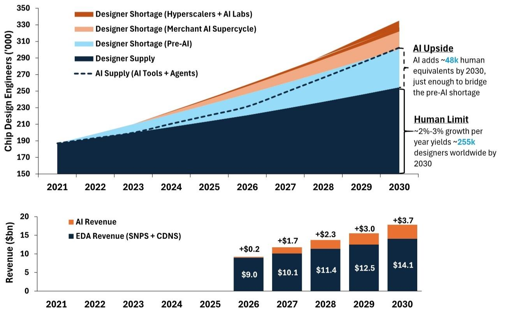
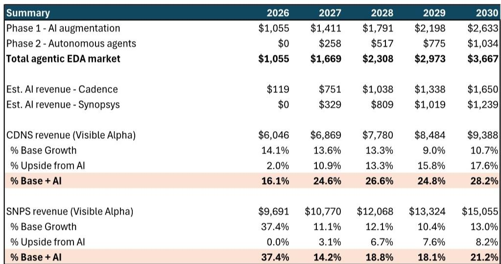
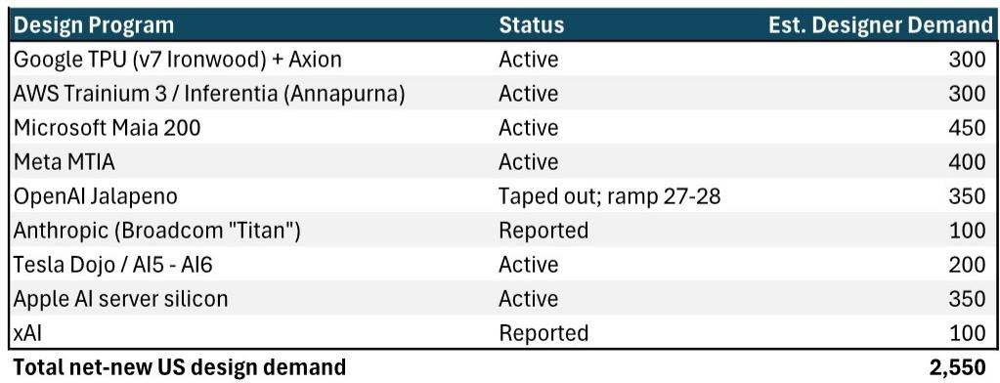

# The EDA Industry Is About to Capture Agentic AI Value—and the Market Has Not Priced It In

Consensus has treated Cadence and Synopsys as defensive 12%-15% growers at best, and potential victims of AI disruption at worst. Over the past year, the Philadelphia Semiconductor Index (SOXX) has returned roughly 140%, while Cadence has gained only about 20% and Synopsys has traded sideways. This divergence reflects a fundamental mispricing: the market has assumed that EDA companies will be bystanders in the AI revolution, when in fact they are uniquely positioned to monetize the structural shortage of chip design engineers that custom AI silicon has created. A new analysis suggests that agentic AI tools could generate roughly $3.7 billion in incremental annual revenue for the EDA industry by 2030—a figure not reflected in current Street estimates, and one that may begin to show evidence as early as the second half of 2026.

The core tension is straightforward. Hyperscalers and AI labs have launched custom silicon programs that require at least 2,500 new chip designers in the United States alone, on top of a pre-existing shortfall of roughly 23,000 designers projected before the generative AI boom. Meanwhile, the global supply of human chip designers grows at just 2%-3% annually. By 2030, the industry will need approximately 325,000 design engineers but will have only about 255,000 available—a gap of roughly 70,000. The only scalable solution is software: AI-powered design tools that augment human engineers and, eventually, autonomous agents that perform design tasks independently. Cadence and Synopsys, as the two dominant EDA platform providers, are the natural suppliers of this solution.

The argument is not that AI will replace chip designers. It is that AI will become the only way to close the labor gap, and that EDA vendors will capture a significant portion of the value they create. This is not a speculative narrative about future technology. It is a near-term revenue opportunity supported by concrete adoption timelines, pricing models, and a structural imbalance that grows more acute with every new custom chip program announced.

## A Structural Shortage of 70,000 Chip Designers Creates a Forced Adoption Cycle for AI Tools

The semiconductor industry's labor problem predates AI, but AI has made it acute. A 2022 workforce study by the Semiconductor Industry Association and Boston Consulting Group projected a shortfall of roughly 23,000 chip designers in the United States by 2030, based on pre-generative-AI demand. Since that study was published, the landscape has shifted dramatically. Hyperscalers including Google, Amazon, Microsoft, and Meta have launched active custom silicon programs. AI labs such as OpenAI and Anthropic have followed. Apple is building AI server silicon. Tesla continues to develop its Dojo architecture. Each program requires between 100 and 450 design engineers, and collectively they add roughly 2,550 new jobs in the United States alone.

Globally, the gap is larger. The supply of human designers grows at 2%-3% per year, yielding roughly 255,000 engineers by 2030. The industry will require approximately 325,000, implying a global shortage of about 70,000 designers. This is not a cyclical shortfall that will correct with higher wages or more university graduates. The pipeline of new engineers is constrained by the length of training programs, the specialization required, and the fact that chip design is a niche discipline. The only supply response available in the short to medium term is technological.

AI design tools can partially close this gap. The analysis estimates that by 2030, these tools could provide the equivalent of roughly 48,000 additional engineers—enough to cover the shortage the industry faced five years ago, but not the full demand that the AI boom has since created. The implication is that adoption will not be optional. Companies that need to design custom silicon will have to use AI tools, because they cannot hire the engineers. This creates a captive market for EDA vendors, and it shifts the pricing dynamic from one of discretionary tool upgrades to one of mission-critical capacity expansion.

## Conservative Assumptions Still Yield $3.7 Billion in Annual Agentic AI Revenue by 2030

The revenue model is built on two layers, both of which are priced conservatively. The first layer is AI augmentation tools—copilot-style software that helps existing human engineers work faster. These tools are already in use on leading-edge designs, and the analysis assumes adoption rates of 20%-40% in that segment by 2030. The pricing assumption is roughly $25,000 per engineer per year, representing a roughly 20% uplift on existing EDA seat costs of $90,000-$100,000. This is not a premium that requires customers to accept a new value proposition; it is an incremental charge for a capability that demonstrably increases output.

The second layer is autonomous AI agents, which both Cadence and Synopsys are expected to launch in 2026-2027. These agents perform design tasks independently, effectively acting as virtual engineers. The analysis assumes that by 2030, agents will handle only 30% of the work that cannot be filled by human engineers—a deliberately modest penetration rate. The pricing is set at roughly $50,000 per agent, or about 25% of the fully loaded cost of a human design engineer. This is value-based pricing: the customer pays less than the cost of a human, but the vendor captures a fraction of the savings.

Under these assumptions, the total agentic EDA market reaches roughly $1.1 billion in 2026, grows to $2.3 billion by 2028, and reaches $3.7 billion by 2030. Cumulative revenue from 2026 through 2030 totals approximately $11 billion. The split between the two vendors is not equal—Cadence captures a larger share earlier due to its earlier product roadmap—but both benefit materially. For Cadence, AI revenue adds roughly 2% to base revenue in 2026, rising to nearly 18% by 2030. For Synopsys, the contribution starts later but reaches roughly 8% by 2030.

These figures are additive to existing revenue streams, not substitutes for them. The core EDA market is roughly $14 billion and growing at 12%-15% annually. The AI layer is incremental, consumption-priced, and tied to a structural need that will persist regardless of the macroeconomic environment.

## Street Estimates Reflect Zero Credit for Agentic AI, Creating Asymmetric Upside

The most striking finding is not the size of the opportunity but the fact that it is absent from consensus numbers. Street estimates for Cadence project revenue growth decelerating from roughly 14% in 2025 to about 13% by 2028, driven by the same volume-plus-pricing algorithm the company has used for years. There is no discernible AI uplift in the model. Implied volume growth declines from roughly 8.6% to 7.3% over that period, while price growth holds steady at 5%-6%. This is a pre-AI growth trajectory.

Layering in the AI opportunity changes the picture dramatically. For Cadence, base-plus-AI revenue growth reaches roughly 25% by 2027 and nearly 28% by 2030. Incremental EPS from AI is estimated at roughly $2.30 by 2030. For Synopsys, base-plus-AI growth reaches roughly 21% by 2030, with incremental EPS of roughly $2.20. These are not small adjustments. They represent a structural acceleration in growth rates that would re-rate the stocks if the market begins to price them in.

The timing matters. Both vendors are expected to launch autonomous agent products in 2026-2027, but initial proof points could emerge sooner. Second-half 2026 results could provide the first evidence of AI tool adoption and monetization. If customers begin to commit to multi-year AI-enhanced licenses or if early agent deployments show measurable productivity gains, the narrative will shift from "potential" to "realized." Given the lag in EDA stock performance relative to the broader semiconductor rally, even modest evidence could trigger a revaluation.

## A Decision Framework for Investors: Three Questions to Assess the AI Opportunity

The opportunity is not uniform across all EDA exposures, and not all AI narratives deserve equal weight. Three questions can help investors evaluate whether the thesis is playing out as expected.

First, are custom silicon programs continuing to expand? The demand for AI design tools is a function of the number of chips being designed. If hyperscaler and AI lab programs slow or cancel, the labor shortage narrows and the urgency to adopt AI tools diminishes. The current pipeline includes at least nine major programs, with an estimated 2,550 new design jobs in the United States alone. Investors should track new program announcements, tape-out schedules, and hiring plans at the largest custom chip customers.

Second, are EDA vendors demonstrating pricing power for AI features? The revenue model depends on customers paying $25,000 per engineer for augmentation tools and $50,000 per agent. If early renewals show that customers are resisting these price points, or if vendors are forced to bundle AI features into existing contracts without incremental revenue, the upside will be smaller. Early indicators include disclosed contract values, average revenue per customer, and commentary on pricing during earnings calls.

Third, are autonomous agents being adopted by leading-edge customers? The most credible evidence will come from design wins at hyperscalers and AI labs that use agents for verification, physical design, or RTL tasks. If the first agent deployments are limited to non-critical or peripheral designs, the adoption curve may be slower than modeled. If they are deployed on flagship chips, the case for rapid scaling becomes much stronger.

These questions are not theoretical. They can be monitored through earnings calls, industry conferences, and customer announcements. The next 12 to 18 months will provide enough data to determine whether the AI opportunity is real or overstated.

## Valuation and Risk: The Stocks Offer Asymmetric Upside Even on Conservative Multiples

For Cadence, the 12-month target is $470, based on 45 times normalized EPS of $10.50—up from $9.10 on improved visibility. This implies roughly 22% upside from current levels. For Synopsys, the target is $600, based on 40 times normalized EPS of $15.00, implying roughly 35% upside. These multiples are not aggressive for companies growing at mid-to-high teens rates, and they do not fully reflect the potential acceleration from AI.

The risks are real and should not be dismissed. Export restrictions could limit the addressable market for advanced EDA tools, particularly in China. Market share losses—whether to each other or to emerging competitors—could compress margins and slow growth. And if custom chip design programs slow or reverse, the labor shortage that drives AI adoption will narrow. But these risks are not new, and they are largely priced into current valuations. The AI opportunity is not.

The asymmetry is the defining feature of the setup. If the thesis is wrong—if AI tools do not gain traction, or if pricing fails to materialize—the stocks are likely to revert to their pre-AI growth trajectories, which are already discounted in current multiples. If the thesis is right, the stocks have significant upside as revenue growth accelerates and the market re-rates them for a new, higher-growth regime. The evidence that will settle the question is likely to arrive within the next two to three quarters.

*For informational purposes only. Portions may be generated, translated, summarized, or edited with AI assistance based on source materials and may contain omissions or errors. Please verify independently. This is not investment, legal, tax, accounting, or other professional advice.*

For informational purposes only. Portions may be generated, translated, summarized, or edited with AI assistance based on source materials and may contain omissions or errors. Please verify independently. This is not investment, legal, tax, accounting, or other professional advice.

