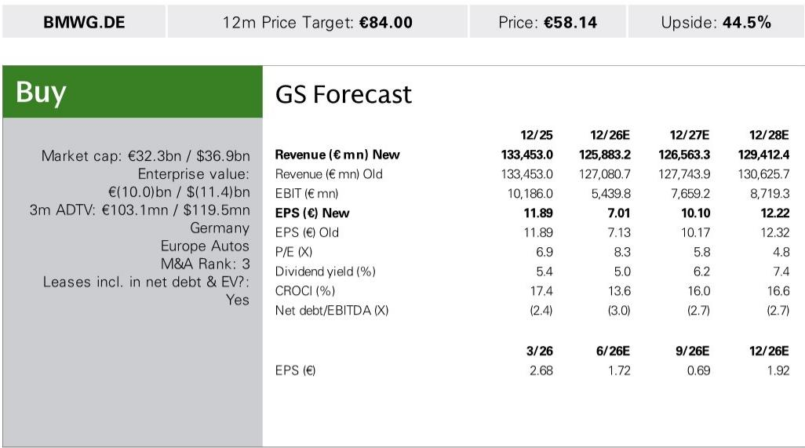
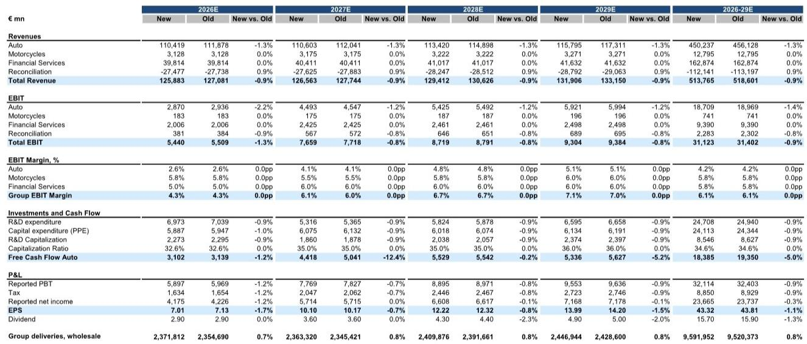
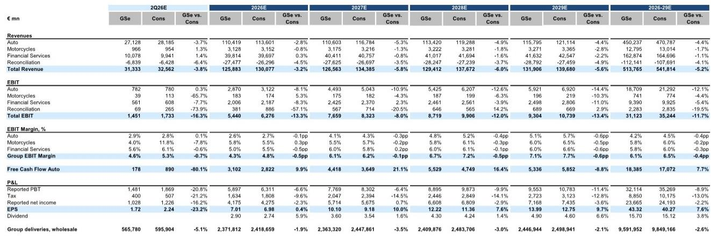

# BMW 2026年第二季度零售数据观察：全球高端汽车市场的结构性分化

宝马于7月10日发布的2026年第二季度零售数据显示出全球市场的显著分化。公司当季交付59.1万辆，同比下降4.9%，但这一降幅的结构性特征比整体数字更具研究价值。中国市场的零售量同比下降30%，而欧洲和美国市场分别增长8%和10%。这并非周期性波动，而是全球高端汽车市场正在经历的结构性调整，宝马的财务数据为这一趋势提供了清晰的信号。

公司预计第二季度汽车业务息税前利润率将落在1-3%的全年指引区间内，我们的估算约为2.9%（7.82亿欧元），与市场共识基本一致。从全年来看，我们预测2026财年汽车业务利润率为2.6%，其中中国合资企业利润率为1.3%（此前为2.3%），中国以外地区利润率为2.8%（此前为2.7%）。公司实际上正在运营两个利润特征不同的业务板块，而收缩的部分原本被视为增长引擎。

管理层最重要的战略信号并非利润率压缩本身，而是其应对措施。宝马将股票回购计划提前了约五个月，于7月1日启动了第三期计划的第三部分（6.25亿欧元），预计于11月30日完成，而非原定的2027年4月。在盈利承压的背景下，这一举措体现了管理层对资产负债表的信心，表明他们认为当前的低谷是可控的，公司的现金流生成能力依然稳健。

2026年下半年存在尚未完全定价的重大风险，包括中国市场可能的额外经销商支持、墨西哥至美国关税减免未如期实现，以及全部重组成本将在下半年体现。然而，管理层明确表示这些因素均不会改变全年指引。对于市场参与者而言，关键在于判断这种信心是否合理，抑或只是更大幅度调整前的过渡阶段。

## 中国高端市场：结构性调整而非周期性波动

宝马第二季度在中国市场的零售量同比下降30%，这并非需求暂停，而是高端市场最重要增长区域的结构性变化。我们此前的预测已假设24%的降幅，实际结果比这一悲观预期还低6个百分点，且趋势显示仍有进一步下行的可能。

这一变化的背后并非简单的消费信心不足。中国高端汽车市场正经历根本性重构，本土电动汽车制造商在价格、技术和品牌影响力方面展开直接竞争。宝马的内燃机车型在一个新能源汽车已跨越消费者偏好临界点的市场中面临加速淘汰。与此同时，宝马的电动车型虽在改善（iX3订单量正接近10万辆），但尚不足以在所需规模上抵消内燃机车型的下降。

财务影响十分显著。我们目前估计宝马中国合资企业2026财年利润率为1.3%，低于此前的2.3%，盈利能力在已压缩的基础上再降43%。中国市场的息税前利润贡献已远低于两年前，且趋势向下。管理层已在第二季度末提及一笔低三位数百万欧元的经销商支持款项，虽然下半年暂无进一步支持计划，但必要时考虑的可能性意味着额外现金流出的风险真实存在。

关键认知在于，这一问题不会随着宏观环境复苏而自行修正。中国消费者对本土高端电动车的偏好转变是永久性的且正在加速。宝马以Neue Klasse架构和提供五种动力系统选项的全新X5为核心的应对方向正确，但需要时间形成规模。iX3的产能正在加速，德布勒森工厂已提前启动第二班次，第三班次也在考虑中，但这解决的是供给而非需求问题。关键在于中国消费者是否愿意等待。

## 西方市场提供韧性支撑，但利润结构存在根本差异

欧洲和美国市场第二季度分别增长8%和10%，为中国市场的调整提供了重要平衡。这不仅是销量故事，更反映了西方市场截然不同的竞争格局：宝马的品牌价值依然稳固，定价能力更强，电动化转型节奏更为平缓，使得内燃机和电动车型能够实现盈利共存。

这一地域分化的财务影响体现在我们的估算调整中。我们将中国以外地区的汽车业务利润率从2.7%上调至2.8%，反映了西方市场销量和产品组合的改善。但相对水平仍受行业性因素压缩：负面的销量和产品组合效应、原材料和汇率压力，以及公司投资Neue Klasse平台带来的更高折旧摊销负担。欧元走强对报告收入构成额外拖累，管理层已明确将汇率列为持续存在的阻力。

战略意义在于，宝马的利润池正在发生地域性转移，许多市场参与者尚未充分将其纳入分析框架。公司历史估值一直受到中国作为长期增长引擎且具有高端利润率的叙事支撑，这一叙事现已逆转。原本被视为成熟低增长的西方市场现在成为稳定锚点，而中国则成为拖累因素。这一重新排序对如何思考宝马的终端利润率结构具有直接影响。

第二季度汽车业务息税前利润率2.9%处于调整后的1-3%全年区间内，但理解其构成十分重要。该季度未包含重组成本，这些成本将全部在2026年下半年体现。重组费用的现金流影响要到2027年才会显现，造成盈利冲击与现金流出之间的时间差。这意味着第二季度利润率虽然较低，但实际上是比下半年利润率更清晰的运营表现反映。

## 股票回购加速：管理层对低谷可控性的关键信号

将股票回购计划提前约五个月是宝马第二季度沟通中最具战略意义的举措。第三期计划的第三部分（6.25亿欧元）于7月1日启动，完成目标从2027年4月提前至11月30日。在盈利面临明显压力的时刻，这是一个经过深思熟虑且成本高昂的资产负债表信心信号。

理解其重要性需考虑替代方案。管理层本可以暂停回购、保留现金，等待下半年重组成本、中国经销商支持情况和关税环境的明朗化。但他们选择了加速。这向市场表明，公司的现金流生成虽然压缩，但仍足以支持运营需求和资本回报。我们2026财年汽车业务自由现金流估算为31亿欧元，远高于25亿欧元的指引下限，与30亿欧元的市场共识基本一致。

第二季度自由现金流情况提供了背景。汽车业务自由现金流预计为正但环比下降，受到盈利降低以及与iX3和i3上市相关的库存增加带来的营运资金拖累。折旧和投资提供了一定缓冲，但整体而言该季度现金流较为紧张。在此背景下决定加速回购，表明管理层将当前盈利低谷视为暂时现象，且资产负债表足够强劲以吸收短期压力。

对于市场参与者而言，回购加速作为管理层内部风险评估的实时信号发挥作用。如果下半年预计出现超出已指引范围的实质性恶化，加速资本回报将是不明智的。管理层采取相反行动，表明他们认为下半年阻力可控，且2027和2028年的盈利复苏仍在正轨。我们的估算支持这一观点，汽车业务息税前利润预计从2026财年的28.7亿欧元上升至2027财年的44.9亿欧元和2028财年的54.3亿欧元。

## 分析框架：地域分化、资本配置与下半年风险

宝马第二季度预览信息可组织为结构化分析框架，帮助识别未来十二个月的关键变量。该框架包含三个维度：地域利润结构、资本配置信号和下半年风险评估。

在地域利润结构方面，关键变量是中国利润率的走势。我们目前对2026财年中国合资企业1.3%利润率的估算，假设第二季度的下降代表新的基线而非进一步恶化。如果中国利润率在此水平企稳，中国以外地区2.8%的利润率足以使合并汽车业务利润率保持在1-3%区间。但如果中国利润率进一步下降，无论是通过额外经销商支持还是更深的销量下滑，合并利润率可能跌破2%，这将触发对全年指引下限的重新评估。应关注下半年任何与中国相关的增量公告，尤其是经销商支持方面，这将是利润率风险的前瞻指标。

在资本配置方面，回购加速是主导信号，但必须结合重组成本时间安排来评估。重组费用在2026年下半年体现，但现金流影响直到2027年才出现。这意味着回购资金来自尚未承受重组现金流出的现金流。关键问题在于，当2027年重组的现金影响开始显现时，公司能否维持其资本回报轨迹。我们2027财年自由现金流估算为44.2亿欧元，较2026财年增长42%，提供了充足空间，但这取决于盈利复苏如期实现。

在下半年风险评估方面，有三项具体事项值得关注。第一，中国经销商进一步支持的可能性：管理层表示目前无额外支持计划，但必要时愿意考虑，且已明确不会影响全年指引。这一风险包含在指引范围内，但可能将盈利构成转向较低质量来源。第二，墨西哥至美国关税情况：预期的27.5%税率下调未实现，但管理层表示这不会实质性改变指引。风险在于这可能成为持续性阻力而非一次性失望。第三，iX3产能爬坡：产能加速是积极因素，但执行风险依然存在，尤其是在软件集成和供应链可靠性方面。

综合来看，宝马的下行风险相对明确地限定在1-3%利润率区间和25亿欧元自由现金流下限内，而上行空间取决于Neue Klasse驱动的2027和2028年盈利复苏。回购加速提供了管理层认同这一观点的切实信号。风险在于下半年阻力可能比预期更持久，延迟复苏并进一步压缩估值倍数。

*本文仅供参考。部分内容可能基于源材料通过AI辅助生成、翻译、总结或编辑，可能存在遗漏或错误。请独立核实。本文不构成专业建议。*
