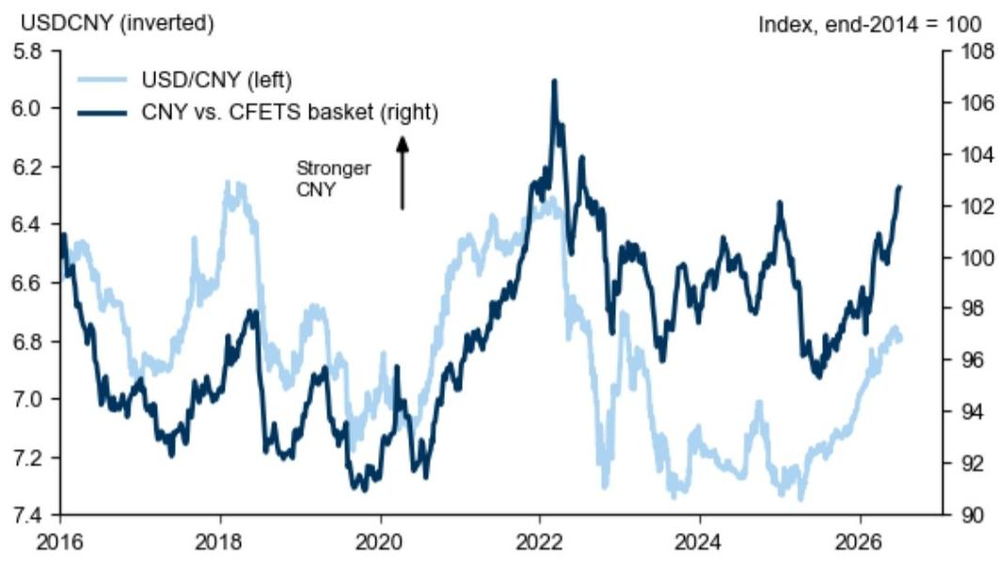
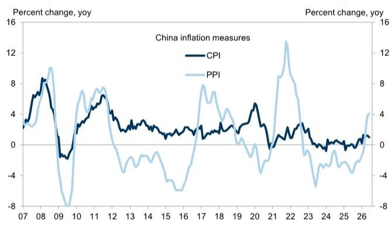

# GS：中国三件事

中国6月通胀数据释放了一个关键信号：PPI同比虽小幅上行至4.1%，但环比已明显走弱。结合GS大宗商品团队对油价的下修判断，这份研报认为PPI通胀可能已在6月见顶。与此同时，央行二季度货币政策委员会会议声明承认了“供给强、需求弱”的国内宏观环境挑战，但并未释放全面宽松信号。这两条线索叠加，指向同一结论：中国宏观政策目前处于一个“观察窗口”，而非“加码窗口”。

6月CPI同比从1.2%回落至1.0%，主要受能源和黄金价格走低影响。PPI同比从3.9%升至4.1%，但环比从5月到6月出现明显下降。GS据此将下半年PPI预测下调，并预计2026年和2027年全年PPI分别为2%和0%。这意味着，上游价格不确定性正在缓解，企业端成本端最紧张的阶段可能已经过去。

> **KC评论：** 市场此前对PPI持续上行的担忧，可能被6月数据部分证伪。环比转弱比同比读数更重要，因为它反映的是边际变化方向。

## 1. 央行二季度例会：承认挑战，但未转向宽松

央行二季度货币政策委员会会议声明中，明确提及国内宏观环境面临“供给强、需求弱”的结构性问题。但报告指出，央行并未因此释放全面宽松信号。GS据此判断，2026年不会再有政策利率或存款准备金率下调。

这一判断与市场部分预期形成反差。此前有观点认为，需求偏弱可能倒逼央行进一步宽松。但央行的实际表态表明，其更倾向于通过结构性工具和人民币国际化路径来应对当前局面。

## 2. 潘功胜香港讲话：人民币国际化提速，而非贬值

央行行长潘功胜近期在香港的讲话，重点在于改善离岸人民币市场基础设施、流动性和产品体系。这与市场部分声音认为“人民币需要贬值来应对宏观环境仍在调整”的逻辑不同。GS研报明确预期，人民币将继续对美元及其他货币升值。

从数据看，人民币对美元和CFETS篮子均已呈现升值趋势。央行推进人民币国际化的决心，正在成为汇率定价中的一个重要变量。

> **KC评论：** 人民币升值预期与PPI见顶、央行不降息三个信号放在一起，意味着当前宏观环境更接近“价格不确定性缓解+汇率稳定”的组合，而非“宏观环境节奏变化+政策刺激”的传统叙事。

## 3. 商务部零售新政：供给侧导向，而非需求侧刺激

7月9日，商务部发布《关于加速零售业创新发展的文件》。GS研报指出，多数措施聚焦供给侧：确保超市、便利店、生鲜市场便捷可达，提升商品和服务质量，发展新零售业态和消费场景。文件同时强调加强市场监管，包括对网络平台领域的反垄断审查，以及缩小线上线下价格差距。

这份文件没有直接发放消费券或补贴，而是通过改善供给质量和竞争环境来间接提振零售。这与央行不搞全面宽松的逻辑一致：政策工具箱中，结构性工具和供给侧改革仍是优先选项。

## 4. 一个可复用的观察框架：政策节奏的“三不”信号

从这份研报可以提炼出一个简洁的观察框架：当前中国宏观政策处于“不急于加码、不主动贬值、不全面刺激”的阶段。PPI见顶降低了通胀对政策的约束，但央行和商务部的最新动作表明，政策制定者更倾向于用时间换空间，而非用力度换速度。

对于关注中国宏观环境的读者而言，接下来的关键变量不是政策何时放松，而是需求端能否在现有政策框架下自然修复。PPI环比走势、人民币汇率变化以及零售数据，将是检验这一判断的三个核心观测点。

For informational purposes only. Portions may be generated,translated,summarized,or edited with AI assistance based on source materials and may contain omissions or errors. Please verify independently. This is not investment,legal,tax,accounting,or other professional advice.

For informational purposes only. Portions may be generated,translated,summarized,or edited with AI assistance based on source materials and may contain omissions or errors. Please verify independently. This is not investment,legal,tax,accounting,or other professional advice.
