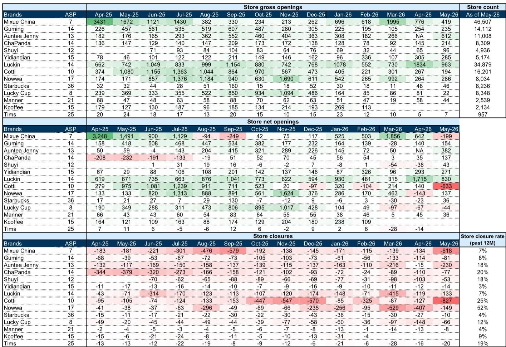
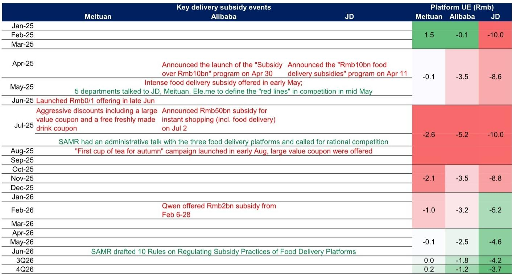
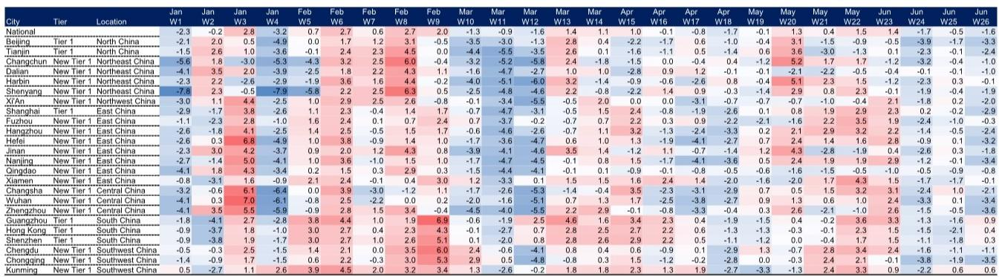

# 中国现制饮品行业竞争格局已发生根本性转变

中国现制饮品市场保持着两位数的年复合增长率，渗透率仍处于较低水平，在整体消费环境中属于表现较为突出的领域。然而，许多观察者仍持观望态度，主要关注一个问题：2023-2024年间咖啡品类中出现的激烈价格竞争是否会蔓延至更广泛的饮品行业，并再次压缩利润空间？基于对门店层面数据、定价行为及竞争结构的仔细分析，答案显示，重演类似情况的风险远低于市场担忧的程度。2023年的咖啡行业竞争是一个特定事件，由资金充裕的新进入者针对特定竞争对手发起。如今，进入咖啡领域的头部现制茶饮品牌，其定价策略更为理性，规模较小，且遵循着根本不同的战略逻辑。当前的核心议题并非即将到来的价格竞争，而是竞争优势的结构性转变：部分品牌正在调整，部分品牌在巩固市场地位，而茶饮巨头则将咖啡作为补充品类，而非主要竞争手段。

## 市场最为关注的竞争对手已显现结构性调整迹象

市场对咖啡领域竞争的担忧源于2023年的记忆，当时某品牌通过全菜单低价策略，迫使另一品牌采取防御性价格回应，压缩了利润空间并导致同店销售增长为负。这一记忆如今已成为一种误导。截至2026年5月的月度门店数据显示，该品牌已从扩张模式转向收缩。仅在2026年5月，该品牌就录得净关闭门店633家，其新开门店数量较去年同期（当时配送补贴推动了销售）显著放缓。在过去十二个月中，该品牌的门店关闭率达到25%，在所有被追踪的主要现制饮品连锁品牌中最高。这并非一家准备发起新一轮攻势的公司，而是一家正在经历调整的公司。新闻报道显示，该品牌今年已取消部分加盟商支持政策，渠道调研表明，在考虑配送补贴前，该品牌约半数门店在2024年未能实现盈利。如果该品牌继续沿着净关闭门店的轨迹发展，竞争格局将变得不那么拥挤，这为其他品牌创造了在不匹配激进定价的情况下获取市场份额的机会。市场对重演价格竞争的担忧，基于对错误竞争者的判断。

## 现制茶饮品牌进入咖啡领域，定价理性且规模有限，全面价格竞争可能性低

市场担忧的第二个方面是，多个现制茶饮品牌正在推出咖啡产品，可能引发价格螺旋。数据表明情况并非如此。首先，这些咖啡业务的规模相对于头部咖啡品牌仍然很小。即使是茶饮转咖啡领域最领先的品牌，其2026年咖啡GMV预估也仅为79亿元，约占头部咖啡品牌预计规模的12%。对于其他茶饮品牌，这一数字分别为13亿元和4亿元。当某品牌在2023年发起攻势时，其GMV已达到目标品牌的17%，并且从一开始就追求激进的门店扩张。当前进入者的规模要小得多。其次，定价纪律显而易见。某品牌每周提供一张9.9元咖啡优惠券，而非全菜单无限制折扣。头部咖啡品牌自身的9.9元活动也仅覆盖特定SKU两周时间，而非全部产品。根据第三方追踪数据，大多数领先品牌的整体平均售价基本保持稳定。第三，战略逻辑不同。对于茶饮品牌而言，咖啡是推动增量客流和提高门店利用率的补充品类，而非核心品类。某品牌的目标是到2026-2027年咖啡贡献20%的销售额，这意味着其80%的业务仍是茶饮。在一个次要品类上牺牲利润以在主要竞争对手的核心市场获取份额的动力较弱。小规模、有节制的优惠券策略以及补充性角色，使得全面价格竞争成为低概率事件。

## 头部品牌的同店销售增长挑战是周期性的且已被充分认知，下半年利润率设置为两年来最佳

头部品牌面临的短期压力是2026年第二、三季度较高的同店销售增长比较基数。市场正在消化高个位数下滑的预期，这种谨慎态度使许多观察者保持观望。但数据已显示，多个品牌在这些高基数上实现了相对稳健的同店销售增长。某品牌6月同店销售增长改善至小幅低个位数下滑，另一品牌6月同店销售增长同样稳健，为小幅低个位数下滑。对于头部品牌，市场共识预期偏向高个位数下滑，但更现实的估计是2026年第二季度下滑5%。恐惧与现实之间存在显著差距。更重要的是，下半年利润率设置有利，原因有三。首先，配送订单占比预计将从2025年下半年的35-45%降至更低水平，从而减少渠道成本拖累。其次，更有利的咖啡豆价格影响将在2026年下半年开始体现在损益表中，提供直接的投入成本顺风。第三，价格竞争保持理性，意味着平均售价侵蚀不太可能加速。可超越的同店销售增长共识、下降的配送订单占比以及有利的商品成本，这三者结合创造了一个局面，即使营收增长保持温和，头部品牌也能在2026年下半年实现盈利增长的超预期表现。当前市场的怀疑态度正在定价一个数据并不支持的最坏情况。

## 中国现制饮品行业资金配置的分析框架

面对在头部咖啡品牌、茶饮品牌以及更广泛的茶饮-咖啡格局中进行选择的观察者，需要一个结构化的分析框架，而非对竞争方向的二元押注。该框架包含三个维度：竞争地位、利润率轨迹和门店经济韧性。

在竞争地位方面，头部咖啡品牌受益于其主要历史竞争对手的调整，以及茶饮品牌咖啡业务规模小且为补充性质的事实。该品牌的门店布局偏向高线城市，16%的门店位于一线城市，44%位于一线及新一线城市，而某茶饮品牌这两个比例分别为3%和16%。这意味着与茶饮品牌的竞争重叠有限。与此同时，某茶饮品牌是一个纯茶饮品牌，观察者正关注其同店销售增长的持续改善；如果这一改善实现，它将提供不同的风险回报特征。

在利润率轨迹方面，头部咖啡品牌拥有最清晰的近期催化剂：2026年下半年由配送订单占比正常化和咖啡豆成本顺风驱动的利润率扩张。对于进入咖啡领域的茶饮品牌，咖啡投资的利润率稀释是一个风险，但规模足够小，不应实质性影响公司整体利润率。

在门店经济韧性方面，关键指标是门店关闭率。头部咖啡品牌过去十二个月的关闭率为7%，在行业中处于最低水平，远低于某品牌的25%或另一品牌的20%。低关闭率表明加盟商基础健康，即使在消费环境偏弱的情况下，门店层面的单位经济状况依然保持。关闭率高的品牌面临自我强化的负面循环：门店关闭降低品牌密度，损害同店销售增长，进而导致更多关闭。该框架建议将资金配置向关闭率低、有明确利润率催化剂、与激进折扣商直接竞争重叠有限的品牌倾斜。按此逻辑，头部咖啡品牌在所有三个维度上得分最高。

## 行业结构性逻辑已从补贴驱动增长转向品质驱动差异化

当前数据最重要的战略洞察是，竞争格局已经改变。2021年，一级市场向该行业注入了80亿元融资，推动了激进的扩张和价格补贴。到2023-2024年，这一数字已骤降至不足20亿元，随后又降至不足10亿元。资金充裕的新进入者发起价格竞争的时代已经结束。相反，领先品牌正专注于原料和产品升级作为主要的竞争差异化手段。这是对市场日趋成熟、通过低价获取客户不再可持续的理性回应。数据中的证据是：投资于产品质量和门店体验的品牌，如头部咖啡品牌和某茶饮品牌，保持了稳定的平均售价和低关闭率，而依赖补贴驱动增长的品牌，如某品牌，则看到门店关闭加速。对观察者而言，启示是明确的：中国现制饮品市场下一阶段的赢家将是那些具备运营纪律、无需补贴即可增长、拥有规模优势以受益于投入成本顺风、以及品牌实力以维持定价能力的参与者。市场当前对2023年价格竞争重演的关注，是一种向后看的叙事，忽视了竞争动态的根本性转变。

*仅供参考。部分内容可能基于源材料通过AI辅助生成、翻译、总结或编辑，可能存在遗漏或错误。请独立核实。本文不构成专业建议。*

仅供参考。部分内容可能基于源材料通过AI辅助生成、翻译、总结或编辑，可能存在遗漏或错误。请独立核实。本文不构成专业建议。

