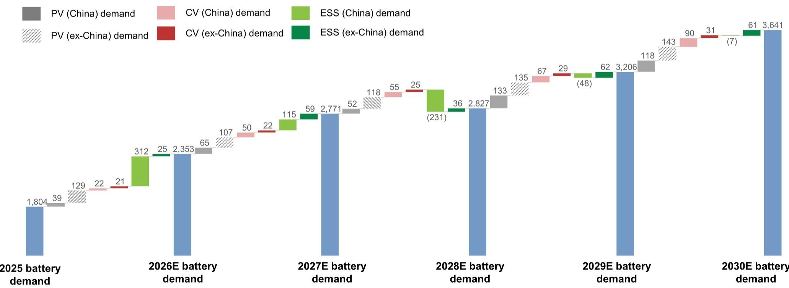
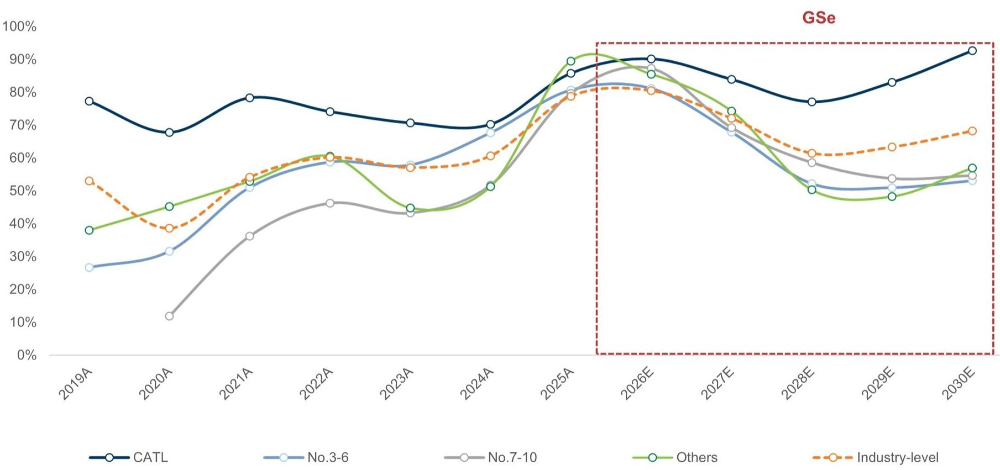
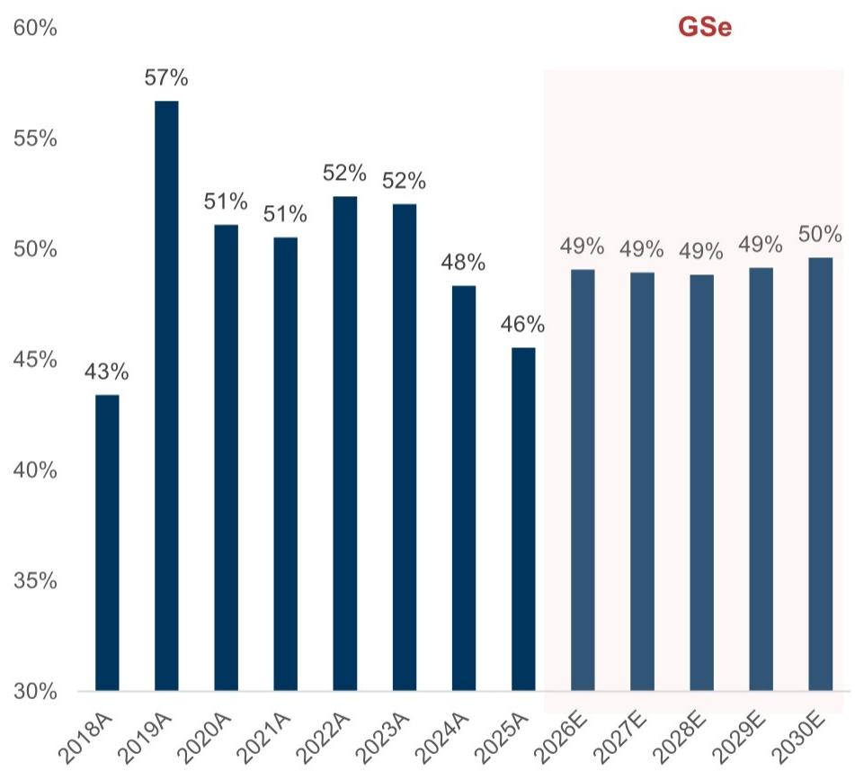
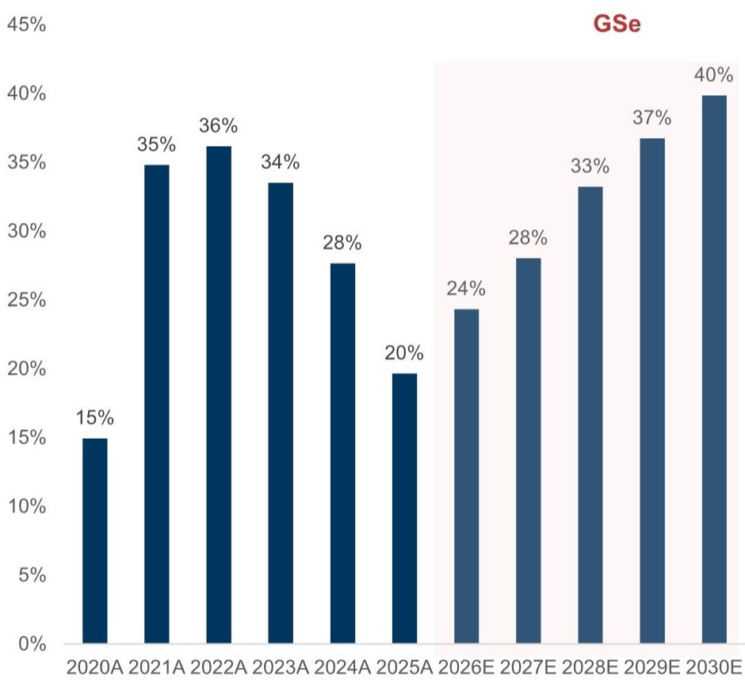
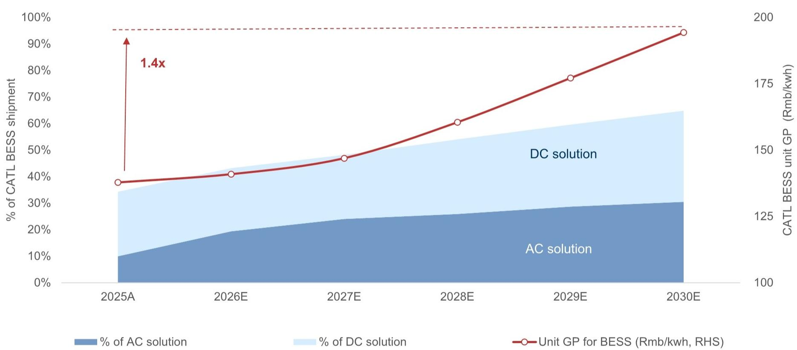
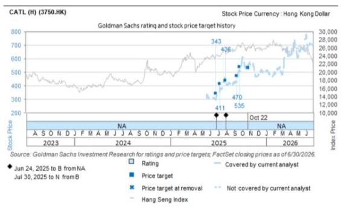
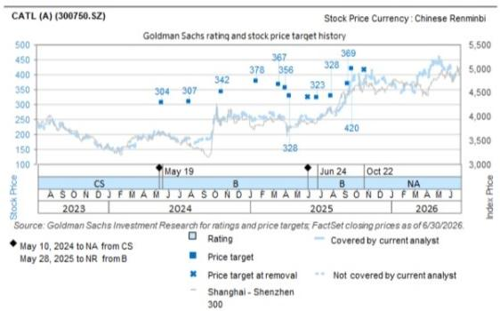

# 宁德时代（300750.SZ/3750.HK）

## 从电池到能源解决方案；开启研究

Nick Zheng, CFA Selina Yan

GS（亚洲）有限责任公司

GS（亚洲）有限责任公司

+852 2978-1405

+852 2978-0178 nick.zheng@gs.com shuling.yan@gs.com

GS与其研究报告所覆盖的公司有业务往来，并寻求建立此类业务关系。因此，读者应注意，该公司可能存在影响本报告客观性的利益冲突。读者应将本报告视为做出投资决策的单一因素。有关Reg AC认证及其他重要披露，请参阅披露附录，或访问www.gs.com/research/hedge.html。非美国关联公司雇用的分析师未在美国金融业监管局（FINRA）注册/具备研究分析师资格。

## 中国电池总出货量预计到2030年弹性较高，储能系统是增量增长的关键变量和周期性来源

中国电池需求按终端市场划分（GWh，2025-2030年预测）

  
来源：GGII、ThinkerCar、中国汽车动力电池产业创新联盟、中国海关、GS全球投资研究

## 储能系统竞争格局变化将推动产能利用率分化

中国电池制造商年度产能利用率

  
来源：公司数据、GS全球投资研究

## 我们预计宁德时代将在储能电池领域重获主导地位

达到与电动汽车电池领域相当的水平，该公司在该领域已开始重新获得份额

## 宁德时代在中国电动汽车（左轴）和储能系统（右轴）领域的份额变化

  
■ 宁德时代在中国动力电池领域的市场份额

  
■ 宁德时代在中国储能电池领域的市场份额  
来源：ICC SINO、GGII、Thinker Car、公司数据、GS全球投资研究

## 宁德时代向集成式储能系统供应商的转型被低估

我们预计宁德时代储能系统出货组合将向集成解决方案转变，从而带来更高的单位毛利

宁德时代储能系统出货组合变化及单位毛利趋势（2025-2030年预测）

  
来源：公司数据、GS全球投资研究

## 我们认为A/H股均有上行空间

# 采用分部加总法，对动力电池和储能业务分别估值

## 宁德时代A股和H股12个月目标价推导摘要

<table><tr><td colspan="6">EV/EBITDA估值</td></tr><tr><td>宁德时代-H股（3750.HK）</td><td>基准年份</td><td>EBITDA</td><td>EV/EBITDA</td><td>折现因子</td><td>估值</td></tr><tr><td>动力电池及其他</td><td>2026E-27E平均</td><td>115,637</td><td>20.0x</td><td>1.0x</td><td>2,312,749</td></tr><tr><td>储能系统</td><td>2030E</td><td>72,246</td><td>25.0x</td><td>1.3x</td><td>1,439,514</td></tr><tr><td>企业价值</td><td></td><td></td><td></td><td></td><td>3,752,262</td></tr><tr><td>- 净债务/（现金）</td><td></td><td></td><td></td><td></td><td>(362,294)</td></tr><tr><td>- 少数股东权益</td><td></td><td></td><td></td><td></td><td>43,818</td></tr><tr><td>核心业务股权估值</td><td></td><td></td><td></td><td></td><td>4,070,738</td></tr><tr><td>+ 长期股权投资（按账面价值）</td><td></td><td></td><td></td><td></td><td>80,862</td></tr><tr><td>公司总计</td><td></td><td></td><td></td><td></td><td>4,151,600</td></tr><tr><td>÷ 总股本</td><td></td><td></td><td></td><td></td><td>4,782</td></tr><tr><td>× 汇率（人民币/港元）</td><td></td><td></td><td></td><td></td><td>1.09</td></tr><tr><td>宁德时代-H股12个月目标价（港元/股）</td><td></td><td></td><td></td><td></td><td>946港元</td></tr><tr><td>当前股价（港元/股）</td><td></td><td></td><td></td><td></td><td>628</td></tr><tr><td>上行/下行空间</td><td></td><td></td><td></td><td></td><td>51%</td></tr><tr><td>隐含H/A股溢价/折价</td><td></td><td></td><td></td><td></td><td>53%</td></tr><tr><td>vs. 当前溢价/折价</td><td></td><td></td><td></td><td></td><td>58%</td></tr></table>

<table><tr><td colspan="6">EV/EBITDA估值</td></tr><tr><td>宁德时代-A股（300750.SZ）</td><td>基准年份</td><td>EBITDA</td><td>EV/EBITDA</td><td>折现因子</td><td>估值</td></tr><tr><td>动力电池及其他</td><td>2026E-27E平均</td><td>115,637</td><td>11.0x</td><td>1.0x</td><td>1,272,012</td></tr><tr><td>储能系统</td><td>2030E</td><td>72,246</td><td>18.0x</td><td>1.3x</td><td>1,036,450</td></tr><tr><td>企业价值</td><td></td><td></td><td></td><td></td><td>2,308,462</td></tr><tr><td>- 净债务/（现金）</td><td></td><td></td><td></td><td></td><td>(362,294)</td></tr><tr><td>- 少数股东权益</td><td></td><td></td><td></td><td></td><td>43,818</td></tr><tr><td>核心业务股权估值</td><td></td><td></td><td></td><td></td><td>2,626,937</td></tr><tr><td>+ 长期股权投资（按账面价值）</td><td></td><td></td><td></td><td></td><td>80,862</td></tr><tr><td>公司总计</td><td></td><td></td><td></td><td></td><td>2,707,799</td></tr><tr><td>+ 总股本</td><td></td><td></td><td></td><td></td><td>4,782</td></tr><tr><td>宁德时代-A股12个月目标价（人民币/股）</td><td></td><td></td><td></td><td></td><td>566元</td></tr><tr><td>当前股价（人民币/股）</td><td></td><td></td><td></td><td></td><td>361</td></tr><tr><td>上行/下行空间</td><td></td><td></td><td></td><td></td><td>57%</td></tr></table>

来源：Refinitiv Eikon、GS全球投资研究

## 主要风险：

1）全球电动汽车需求增长慢于预期；
2）全球储能系统需求增长慢于预期；
3）原材料成本（主要是电池金属）意外上升；
4）储能系统集成进展慢于预期；
5）海外扩张的执行和贸易政策风险；
6）动力电池和储能电池领域竞争激烈程度超预期。

披露附录

2026年7月13日

## 披露附录

## Reg AC

我们，Nick Zheng, CFA、Selina Yan，特此证明本报告中表达的所有观点准确反映了我们对标的公司及其证券的个人观点。我们还证明，我们的薪酬中没有任何部分直接或间接与本报告中表达的具体建议或观点相关。

除非另有说明，本报告封面所列个人为GS全球投资研究部门分析师。

撰稿作者：Nick Zheng, CFA GS（亚洲）有限责任公司、Selina Yan GS（亚洲）有限责任公司

除非另有说明，本报告撰稿作者披露中列出的个人为GS全球投资研究部门分析师。

## GS因子概况

GS因子概况通过将股票的关键属性与市场（即我们的评级股票池）及其行业同行进行比较，为股票提供投资背景。所描绘的四个关键属性是：增长、财务回报、倍数（例如估值）和综合（增长、财务回报和倍数的组合）。增长、财务回报和倍数是通过对每只股票的特定指标使用标准化排名来计算的。然后将指标的标准化排名进行平均，并转换为相关属性的百分位数。每个指标的具体计算可能因财年、行业和地区而异，但标准方法如下：

增长基于股票的前瞻性销售增长、EBITDA增长和每股收益增长（对于金融股，仅每股收益和销售增长），百分位数越高表示公司增长越高。财务回报基于股票的前瞻性ROE、ROCE和CROCI（对于金融股，仅ROE），百分位数越高表示公司财务回报越高。倍数基于股票的前瞻性市盈率、市净率、价格/股息（P/D）、EV/EBITDA、EV/FCF和EV/债务调整后现金流（DACF）（对于金融股，仅市盈率、市净率和P/D），百分位数越高表示股票交易倍数越高。综合百分位数计算为增长百分位数、财务回报百分位数和（100% - 倍数百分位数）的平均值。

财务回报和倍数使用GS分析师对未来至少三个季度后的财年末预测。增长使用对未来至少七个季度后的财年输入，与未来至少三个季度后的财年进行比较（所有指标均基于每股）。

有关我们如何计算GS因子概况的更详细说明，请联系您的GS代表。

## 并购排名

在我们的全球覆盖范围内，我们使用并购框架审视股票，考虑定性因素和定量因素（可能因行业和地区而异），以纳入某些公司可能被收购的可能性。然后我们分配并购排名，作为对我们评级覆盖下的公司进行评分的方法，从1到3，其中1表示公司成为收购目标的高概率（30%-50%），2表示中等概率（15%-30%），3表示低概率（0%-15%）。对于排名为1或2的公司，根据我们的标准部门指南，我们将并购组成部分纳入目标价。并购排名3被视为不重要，因此不计入我们的目标价，并且可能在研究中讨论或不讨论。

## Quantum

Quantum是GS专有数据库，提供详细的财务报表历史、预测和比率访问。它可用于对单一公司进行深入分析，或比较不同行业和市场的公司。

## GS

## 披露附录

## 披露

宁德时代（A股）和宁德时代（H股）的评级相对于其覆盖范围内的其他公司：北京金隅、博迁新材、中创新航、宁德时代（A股）、宁德时代（H股）、中国巨石、亿纬锂能、孚能科技、第一拖拉机（A股）、第一拖拉机（H股）、国轩高科、江苏恒立液压、龙工控股、银河微电、新和成、东方雨虹、瑞浦兰钧能源、瑞联新材、瑞丰新材、三一重工、中材科技、中国重汽、三棵树、蓝晓科技、万华化学、潍柴动力（A股）、潍柴动力（H股）、正力新能、浙江鼎力。

## 公司特定监管披露

以下披露涉及GS集团（及其关联公司，“GS”）与GS全球投资研究所覆盖公司之间的关系。

截至本报告前一个月末，GS实益拥有普通股1%或以上（不包括根据美国证券法无需汇总的关联公司和业务部门管理的头寸）：宁德时代（A股）（人民币348.76元）和宁德时代（H股）（587.00港元）

GS在过去12个月内因投资银行服务获得报酬：宁德时代（A股）（人民币348.76元）和宁德时代（H股）（587.00港元）

GS预计在未来3个月内将获得或寻求因投资银行服务获得报酬：宁德时代（A股）（人民币348.76元）和宁德时代（H股）（587.00港元）

GS在过去12个月内与以下公司存在投资银行服务客户关系：宁德时代（A股）（人民币348.76元）和宁德时代（H股）（587.00港元）

GS在过去12个月内与以下公司存在非投资银行证券相关服务客户关系：宁德时代（A股）（人民币348.76元）和宁德时代（H股）（587.00港元）

GS在过去12个月内与以下公司存在非证券服务客户关系：宁德时代（A股）（人民币348.76元）和宁德时代（H股）（587.00港元）

GS在以下证券或其衍生品中做市：宁德时代（A股）（人民币348.76元）和宁德时代（H股）（587.00港元）

## 披露附录

## 评级/投资银行关系分布 GS投资研究全球股票覆盖范围

<table><tr><td colspan="3">评级分布</td></tr><tr><td>买入</td><td>持有</td><td>卖出</td></tr><tr><td>50%</td><td>34%</td><td>16%</td></tr></table>

<table><tr><td colspan="3">投资银行关系</td></tr><tr><td>买入</td><td>持有</td><td>卖出</td></tr><tr><td>65%</td><td>60%</td><td>45%</td></tr></table>

截至2026年4月1日，GS全球投资研究对3,074只股票有投资评级。GS将股票指定为买入和卖出，列入各个地区的投资清单；未如此指定的股票被视为中性。就FINRA规则要求的上述披露而言，此类分配等同于买入、持有和卖出。请参阅下面的“评级、覆盖范围和相关定义”。投资银行关系图表反映了每个评级类别中GS在过去十二个月内提供过投资银行服务的标的公司百分比。

## 目标价和评级历史图表及目标价历史表格

  
所示目标价应结合所有先前发布的GS报告（可能包含或不包含目标价）以及公司、行业和金融市场的发展情况来考虑。

  
所示目标价应结合所有先前发布的GS报告（可能包含或不包含目标价）以及公司、行业和金融市场的发展情况来考虑。

<table><tr><td colspan="3">宁德时代（A股）（300750.SZ）</td></tr><tr><td>报告日期</td><td>目标价（人民币）</td><td>收盘价（人民币）</td></tr><tr><td>2026年7月8日</td><td>566.00</td><td>361.00</td></tr><tr><td>2025年9月21日</td><td>420.00</td><td>368.49</td></tr><tr><td>2025年9月11日</td><td>369.00</td><td>322.55</td></tr><tr><td>2025年7月30日</td><td>328.00</td><td>277.09</td></tr><tr><td>2025年6月24日</td><td>323.00</td><td>245.92</td></tr><tr><td>2025年4月14日</td><td>328.00</td><td>224.00</td></tr><tr><td>2025年4月4日</td><td>356.00</td><td>243.08</td></tr><tr><td>2025年3月16日</td><td>367.00</td><td>262.00</td></tr><tr><td>2025年1月19日</td><td>378.00</td><td>251.50</td></tr><tr><td>2024年10月20日</td><td>342.00</td><td>249.89</td></tr><tr><td>2024年7月28日</td><td>307.00</td><td>189.35</td></tr><tr><td>2024年5月19日</td><td>304.00</td><td>203.00</td></tr></table>

<table><tr><td colspan="3">宁德时代（H股）（3750.HK）</td></tr><tr><td>报告日期</td><td>目标价（港元）</td><td>收盘价（港元）</td></tr><tr><td>2026年7月8日</td><td>946.00</td><td>628.00</td></tr><tr><td>2025年9月21日</td><td>535.00</td><td>515.50</td></tr><tr><td>2025年9月11日</td><td>470.00</td><td>428.80</td></tr><tr><td>2025年7月30日</td><td>436.00</td><td>426.60</td></tr><tr><td>2025年7月9日</td><td>411.00</td><td>385.00</td></tr><tr><td>2025年6月24日</td><td>343.00</td><td>303.00</td></tr></table>

表格中所示目标价未针对公司行动进行调整。

# 披露附录

## 监管披露

## 美国法律法规要求的披露

请参阅上述公司特定监管披露，了解本报告提及的公司所需的任何以下披露：待处理交易中的主承销商或联合主承销商；1%或其他所有权；特定服务的报酬；客户关系类型；前期管理/联合管理的公开发行；董事职位；对于股票，做市和/或专家角色。GS作为自营商交易或可能交易本报告讨论的发行人债务证券（或相关衍生品）。

以下是额外要求的披露：所有权和重大利益冲突：GS政策禁止其分析师、向分析师报告的专业人员及其家庭成员持有分析师覆盖范围内的任何公司的证券。分析师薪酬：分析师的薪酬部分基于GS的盈利能力，其中包括投资银行收入。分析师作为高管或董事：GS政策通常禁止其分析师、向分析师报告的人员或其家庭成员在分析师覆盖范围内的任何公司担任高管、董事或顾问。非美国分析师：非美国分析师可能不是GS有限责任公司的关联人员，因此可能不受FINRA规则2241或FINRA规则2242关于与标的公司沟通、公开露面以及交易分析师所覆盖证券的限制。

评级分布：请参阅上述评级分布披露。价格图表：请参阅上述价格图表，包括前期评级和目标价的变化，或者，如果是电子格式或涉及本报告主题的多家公司，请访问GS网站https://www.gs.com/research/hedge.html。

## 美国以外司法管辖区法律法规要求的额外披露

以下披露是相关司法管辖区要求的，除非已根据美国法律法规在上文作出。澳大利亚：GS澳大利亚有限公司及其关联公司不是澳大利亚《1959年银行法》（联邦）定义的授权存款机构，在澳大利亚不提供银行服务，也不从事银行业务。除非GS另有约定，本研究及其任何访问仅面向《澳大利亚公司法》定义的“批发客户”。在制作研究报告时，GS澳大利亚全球投资研究成员可能会参加由其研究报告所涉公司和其他实体主办或组织的实地考察和其他会议。在某些情况下，如果GS澳大利亚认为在实地考察或会议的具体情况下适当且合理，此类实地考察或会议的费用可能部分或全部由相关发行人承担。如果本文件内容包含任何金融产品建议，则仅为一般性建议，由GS在不考虑客户目标、财务状况或需求的情况下编制。客户在根据任何此类建议采取行动前，应考虑该建议相对于自身目标、财务状况和需求的适当性。GS澳大利亚和新西兰某些利益披露以及GS澳大利亚卖方研究独立性政策声明的副本可在以下网址获取：https://www.goldmansachs.com/disclosures/australia-new-zealand/index.html。巴西：有关CVM第20号决议的披露信息可在以下网址获取：https://www.gs.com/worldwide/brazil/area/gir/index.html。在适用的情况下，根据CVM第20号决议第20条定义，对本研究报告内容负主要责任的巴西注册分析师为本报告开头指定的第一作者，除非文本末尾另有说明。加拿大：此信息仅供您参考，在任何情况下均不应被解释为GS有限责任公司为在加拿大购买证券而进行的广告、要约或招揽，以交易任何加拿大证券。GS有限责任公司未根据适用的加拿大证券法在任何加拿大司法管辖区注册为交易商，通常不被允许交易加拿大证券，并且可能被禁止在加拿大某些司法管辖区出售某些证券和产品。如果您希望在加拿大交易任何加拿大证券或其他产品，请联系GS集团关联公司GS加拿大公司或其他注册的加拿大交易商。香港：可向GS（亚洲）有限责任公司索取本研究报告所涉覆盖公司证券的进一步信息。印度：可从GS（印度）证券私人有限公司获取本研究报告所涉标的公司或公司的进一步信息，该公司研究分析师SEBI注册号INH000001493，地址：10th Floor, Ascent-Worli, Sudam Kalu Ahire Marg, Worli, Mumbai-400 025, India，企业识别号U74140MH2006FTC160634，电话+91 22 6616 9000，传真+91 22 6616 9001。GS可能实益拥有本研究报告所涉标的公司或公司1%或以上的证券（该术语定义见印度1956年《证券合同（监管）法》第2(h)条）。SEBI的注册和NISM的认证绝不保证中介机构的业绩或向读者提供任何回报保证。GS（印度）证券私人有限公司合规官和读者投诉联系详情、年度合规审计报告副本以及其他相关信息和披露可在以下链接找到：https://www.goldmansachs.com/worldwide/india/research-analyst。日本：见下文。韩国：除非GS另有约定，本研究及其任何访问仅面向《金融服务和资本市场法》定义的“专业读者”。可向GS（亚洲）有限责任公司首尔分行获取本研究报告所涉标的公司或公司的进一步信息。新西兰：GS新西兰有限公司及其关联公司不是新西兰《1989年新西兰储备银行法》定义的“注册银行”或“存款接受者”。除非GS另有约定，本研究及其任何访问面向《2008年金融顾问法》定义的“批发客户”。GS澳大利亚和新西兰某些利益披露的副本可在以下网址获取：https://www.goldmansachs.com/disclosures/australia-new-zealand/index.html。俄罗斯：在俄罗斯联邦分发的研究报告不是俄罗斯立法定义的广告，而是不以产品推广为主要目的的信息和分析，并且不提供俄罗斯评估活动立法意义上的评估。研究报告不构成俄罗斯法律法规定义的个人化研究交流，不针对特定客户，并且是在未分析客户财务状况、投资概况或风险概况的情况下编制的。GS对客户或任何其他人基于本研究报告可能做出的任何投资决策不承担任何责任。

## 披露附录

新加坡：GS（新加坡）私人有限公司（公司编号：198602165W），受新加坡金融管理局监管，接受对本研究的法律责任，如有任何与本研究报告相关的事宜，应联系该公司。台湾：本资料仅供参考，未经许可不得转载。读者应仔细考虑自身的投资风险。投资结果由个人读者自行负责。英国：在英国被归类为零售客户（定义见金融行为监管局规则）的人士，应结合先前GS关于本报告所涉覆盖公司的报告阅读本研究，并应参考GS国际已发送给他们的风险警告。这些风险警告的副本以及本报告中使用的某些金融术语词汇表，可向GS国际索取。

欧洲和英国：有关欧盟委员会授权条例（EU）（2016/958）第6(2)条（包括该授权条例在英国脱离欧盟和欧洲经济区后作为英国国内法律和法规实施的部分）关于研究交流客观呈现的技术安排以及特定利益或利益冲突迹象披露的技术标准的信息，可在以下网址获取：https://www.gs.com/disclosures/europeanpolicy.html，其中说明了与投资研究相关的利益冲突管理欧洲政策。

日本：GS日本有限公司是在关东财务局注册的金融工具交易商，注册号金商第69号，是日本证券业协会、日本金融期货协会、第二类金融工具业协会和日本投资管理协会的成员。股票买卖需支付与客户预先确定的佣金加上消费税。有关日本证券交易所、日本证券业协会或日本证券金融公司要求的任何适用披露，请参阅公司特定披露。

## 评级、覆盖范围和相关定义

买入（B）、中性（N）、卖出（S）分析师建议将股票作为买入或卖出纳入各个地区的投资清单。被指定为投资清单上的买入或卖出取决于股票相对于其覆盖范围的总回报潜力。任何未被指定为投资清单上的买入或卖出且具有有效评级（即未暂停评级、未评级、早期生物技术、暂停覆盖或未覆盖的股票）的股票被视为中性。每个地区管理区域信念清单，这些清单选自各自地区投资清单上的报告评级股票，代表侧重于总回报潜力大小和/或在其各自覆盖范围内实现回报的可能性的研究交流。此类信念清单中股票的添加或移除由各自地区的投资审查委员会或其他指定委员会管理，并不代表分析师对此类股票投资评级的变更。

总回报潜力代表当前股价与目标价之间的上行或下行差异，包括目标价相关时间范围内所有已支付或预期股息。所有覆盖的股票都需要目标价。总回报潜力、目标价和相关时间范围在每份添加或重申投资清单成员资格的报告中有说明。

覆盖范围：每个覆盖范围内的所有股票列表可通过主要分析师、股票和覆盖范围在https://www.gs.com/research/hedge.html获取。

未评级（NR）。当GS在涉及该公司的合并或战略交易中担任顾问角色时，当存在法律、监管或政策限制（由于GS参与交易）时，以及在特定其他情况下，根据GS政策，投资评级、目标价和盈利预测（如相关）将被移除。早期生物技术（ES）。根据GS政策，当该公司既没有通过II期临床试验的药物、治疗或医疗设备，也没有获得分销后II期药物、治疗或医疗设备的许可时，不分配投资评级和目标价。评级暂停（RS）。GS已暂停对该股票的投资评级和目标价，因为没有足够的基本面基础来确定投资评级或目标价。先前的投资评级和目标价（如有）对该股票不再有效，不应依赖。覆盖暂停（CS）。GS已暂停对该公司的覆盖。未覆盖（NC）。GS不覆盖该公司。

## 全球产品；分发实体

GS全球投资研究在全球范围内为GS客户制作和分发研究产品。位于GS全球各办事处的分析师对行业和公司以及宏观经济、货币、大宗商品和投资组合策略进行研究。本研究由以下实体分发：在澳大利亚由GS澳大利亚有限公司（ABN 21 006 797 897）分发；在巴西由GS巴西证券经纪公司分发；巴西公众沟通渠道：0800 727 5764 和/或 contatogoldmanbrasil@gs.com。工作日（节假日除外），上午9点至下午6点。在加拿大由GS有限责任公司分发；在香港由GS（亚洲）有限责任公司分发；在印度由GS（印度）证券私人有限公司分发；在日本由GS日本有限公司分发；在韩国由GS（亚洲）有限责任公司首尔分行分发；在新西兰由GS新西兰有限公司分发；在俄罗斯由GS有限责任公司分发；在新加坡由GS（新加坡）私人有限公司（公司编号：198602165W）分发；在美国由GS有限责任公司分发。GS国际已批准本研究在英国的分发。

GS国际（“GSI”），由审慎监管局（“PRA”）授权并由金融行为监管局（“FCA”）和PRA监管，已批准本研究在英国的分发。

## GS

## 披露附录

欧洲经济区：GS欧洲银行SE（“GSBE”）是一家在德国注册的信贷机构，在单一监管机制下，接受欧洲中央银行的直接审慎监管，并在其他方面接受德国联邦金融监管局（BaFin）和德国联邦银行的监管，并在欧洲经济区内分发研究。

## 一般披露

本研究仅面向我们的客户。除与GS相关的披露外，本研究基于我们认为可靠的当前公开信息，但我们不保证其准确或完整，也不应依赖于此。本文所含信息、意见、估计和预测截至本文日期，如有更改，恕不另行通知。我们力求适时更新我们的研究，但各种法规可能阻止我们这样做。除某些定期发布的行业报告外，大多数报告根据分析师的判断不定期发布。

GS开展全球全方位服务、综合性的投资银行、投资管理和经纪业务。我们与全球投资研究所覆盖的相当大比例的公司存在投资银行和其他业务关系。GS有限责任公司，美国经纪交易商，是SIPC（https://www.sipc.org）的成员。

我们的销售人员、交易员和其他专业人士可能会向我们的客户和自营交易部门提供口头或书面的市场评论或交易策略，这些评论或策略可能反映与本研究报告中所表达观点相反的意见。我们的资产管理领域、自营交易部门和投资业务可能做出与本研究报告中的建议或观点不一致的投资决策。

本报告中指定的分析师可能不时与我们的客户（包括GS销售人员和交易员）讨论，或在本报告中讨论交易策略，这些策略涉及可能对本报告中讨论的股票市场价格产生近期影响的催化剂或事件，这种影响可能在方向上与分析师对此类股票公布的预期目标价相反。任何此类交易策略都不同于且不影响分析师对此类股票的基本股票评级，该评级反映了股票相对于其覆盖范围的总回报潜力，如本文所述。

我们及我们的关联公司、高级职员、董事和员工将不时持有多头或空头头寸，作为自营商行事，并买卖本研究中提及的证券或衍生品（如有），除非法规或GS政策禁止。

在GS组织的会议上第三方演讲者（包括来自GS其他部门的个人）所持观点不一定反映全球投资研究的观点，也不是GS的官方观点。

本文引用的任何第三方，包括任何销售人员、交易员和其他专业人士或其家庭成员，可能持有与本文指定分析师所表达观点不一致的所提及产品的头寸。

本研究不构成在任何司法管辖区出售或购买任何证券的要约或招揽，如果此类要约或招揽在该司法管辖区将是非法的。它不构成个人建议，也不考虑个别客户的具体投资目标、财务状况或需求。客户应考虑本研究中的任何建议或推荐是否适合其特定情况，并在适当情况下寻求专业建议，包括税务建议。本研究中提及的投资的价格和价值以及从中获得的收入可能会波动。过往表现并非未来表现的指引，未来回报不保证，可能发生原始资本损失。汇率波动可能对某些投资的价值或价格或从中获得的收入产生不利影响。

某些交易，包括涉及期货、期权和其他衍生品的交易，会产生重大风险，并不适合所有读者。读者应审查当前的期权和期货披露文件，这些文件可从GS销售代表处或以下网址获取：https://www.theocc.com/about/publications/character-risks.jsp 和 https://www.fiadocumentation.org/fia/regulatory-disclosures_1/fia-uniform-futures-and-options-on-futures-risk-disclosures-booklet-pdf-version-2018。在要求多次买卖期权的期权策略（如价差）中，交易成本可能很大。将根据要求提供支持文件。

## 披露附录

全球投资研究提供的不同服务级别：GS全球投资研究向您提供的服务级别和类型可能与向GS内部和其他外部客户提供的服务不同，具体取决于多种因素，包括您个人对沟通频率和方式的偏好、您的风险状况和投资重点及视角（例如，市场范围、行业特定、长期、短期）、您与GS整体客户关系的规模和范围，以及法律和监管限制。例如，某些客户可能要求在特定证券的研究发布时收到通知，某些客户可能要求将分析师基本面分析中的特定数据（在我们的内部客户网站上可用）通过数据馈送或其他方式以电子方式传送给他们。分析师基本面研究观点（例如，评级、目标价或对股票盈利预测的重大变更）的任何变更，在通过电子方式在我们的内部客户网站上广泛发布的研究报告中包含此类信息之前，或通过其他必要方式向所有有权接收此类报告的客户传达之前，不会向任何客户传达。

所有研究报告同时通过电子方式在我们的内部客户网站上发布，并同时向所有客户提供。并非所有研究内容都重新分发给我们的客户或提供给第三方聚合商，GS也不对第三方聚合商重新分发我们的研究负责。如需获取与一只或多只证券、市场或资产类别相关的研究、模型或其他数据（包括相关服务），请联系您的GS代表或访问https://research.gs.com。

披露信息也可在https://www.gs.com/research/hedge.html获取，或联系研究合规部，地址：200 West Street, New York, NY 10282。

## © 2026 GS。

您仅可为自己使用而存储、展示、分析、修改、重新格式化及打印通过本服务向您提供的信息。未经GS明确书面同意，您不得转售或逆向工程此信息以计算或开发任何用于披露和/或营销的指数，或创建任何其他衍生作品或商业产品、数据或产品。未经GS明确书面同意，您不得以任何格式向任何第三方发布、传输或以其他方式复制此信息的全部或部分。前述限制包括但不限于使用、提取、下载或检索此信息的全部或部分，以训练或微调机器学习或人工智能系统，或向任何此类系统提供或复制此信息的全部或部分作为提示或输入。
