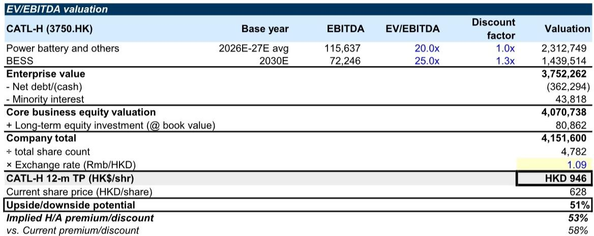
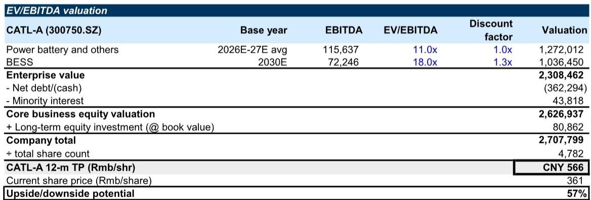

# CATL的转型：从电池制造商到综合能源解决方案提供商

中国电池总出货量预计到2030年将弹性较高，但增长结构比总量数字更具战略意义。电动汽车电池需求虽然仍是主要类别，但随着中国渗透率接近成熟，增速将放缓。真正的增量增长驱动因素——也是行业周期性的主要来源——是储能系统。一份2026年7月发布的全球研究报告预测，到本十年末，储能将占中国电池总需求的越来越大的份额，从而改变整个电池制造生态系统的竞争格局。

这种结构性转变不仅仅是数量上的故事，更是利润池的故事。而最有能力抓住这一利润池的公司是CATL，全球最大的电池制造商。该报告对其A股和H股均给出了研究观点。报告的分类加总估值显示，CATL-A和CATL-H分别有57%和51%的上涨空间，其核心论点远超公司在电动汽车电池领域的领先地位。

核心论点是，CATL正在从零部件供应商向综合能源解决方案提供商转型。这一转型已经开始，但市场尚未充分认识到。报告对CATL动力电池业务的估值采用11倍至20倍的EV/EBITDA倍数（取决于上市地点），而对储能业务则基于2030年预估EBITDA折现后，给予18倍至25倍的倍数。这一溢价不仅反映了更快的增长，更体现了具有更高利润率和更强客户粘性的根本不同的商业模式。

这一论点的时机性源于三种力量的汇聚：电动汽车电池市场的成熟、全球储能部署的加速，以及储能电池领域的竞争洗牌正在为领先者扫清道路。CATL不仅是在顺应这些趋势，更是在通过产品战略和垂直整合积极重塑它们。

## 储能市场将决定哪些电池制造商能在产能过剩中生存

报告中最重要的图表并非关于CATL的市场份额，而是关于中国电池制造商的产能利用率。数据显示出明显的分化：虽然年总产能持续扩张，但大多数制造商的利用率正在下降或停滞。相对少见的例外是CATL，其产能利用率预计将在预测期内保持高位甚至改善。

这种分化是由储能领域驱动的。中国储能电池市场正经历着报告所称的“洗牌”式竞争格局变化。在2022-2024年繁荣期涌入储能生产的中小型电池制造商，如今正面临利润压缩、技术过时和客户流失。原因是储能客户——公用事业规模项目开发商、工商业用户和电网运营商——正成为更成熟的买家。他们不再仅凭价格采购商品化电池电芯，而是要求包含电池管理系统、热管理、电力转换和长期性能保证的综合解决方案。

CATL提供这些综合解决方案的能力是其竞争护城河。报告显示，CATL在中国储能电池领域的市场份额虽有波动，但预计将重新夺回主导地位，达到与其电动汽车电池份额相当的水平，而后者在经历一段时间的侵蚀后已开始恢复。这意味着：储能洗牌并非周期性低迷，而是一次有利于规模最大、技术较强、垂直整合最深的参与者的结构性整合。

对于观察者而言，这意味着传统的以单一远期盈利倍数来评估电池公司的方法已不充分。储能业务与动力电池业务具有根本不同的经济特征，两者应分开估值。报告的分类加总方法并非学术练习，而是对市场迟迟未能认识到这种分化的必要修正。

## CATL向综合BESS解决方案的转型将重塑其利润率

报告详细介绍了CATL的电池储能系统出货组合和单位毛利润轨迹。数据显示出一个明显的转折点：CATL的BESS出货组合正从独立电芯和基础电池包转向包含电力转换系统、能源管理软件和全系统集成服务的综合解决方案。

这并非表面变化。综合BESS解决方案的单位毛利润远高于独立电芯。报告预测，随着组合转变，CATL的BESS单位毛利润将在预测期内显著上升。机制很简单：当CATL销售电芯时，它只获得制造利润。当它销售综合解决方案时，它获得电芯利润、系统集成利润、软件利润和长期服务利润。

战略逻辑超越了利润率。综合解决方案创造了转换成本。部署CATL综合BESS系统的客户更有可能在扩容、更换和软件升级时再次选择CATL。客户关系从交易型转变为经常性型。这与推动其他工业领域设备制造商从销售零部件转向销售成果的逻辑相同——也是通常导致估值倍数扩张的逻辑。

报告的估值反映了这一点。储能业务按2030年预估EBITDA折现后，以18倍至25倍的EV/EBITDA估值。这相对于动力电池业务（按2026-2027年平均EBITDA以11倍至20倍估值）存在溢价。这一溢价不仅由增长驱动，更由综合BESS收入流的更高利润率、更低周期性和更高可见性所支撑。

## 分类加总框架揭示市场为何低估CATL的储能业务

报告的估值方法具有启发性，因为它揭示了上涨空间的来源。对于CATL-A，动力电池及其他业务按2026-2027年平均EBITDA 1156亿元人民币的11倍估值，得出企业价值12720亿元人民币。BESS业务按2030年EBITDA 722亿元人民币的18倍估值，经1.3倍时间价值折现后，得出企业价值10360亿元人民币。经净现金、少数股东权益和长期股权投资调整后，总股权价值为27080亿元人民币，即每股566元人民币——较当前361元人民币的价格有57%的上涨空间。

对于CATL-H，倍数更高——动力电池20倍，BESS 25倍——反映了香港市场不同的读者基础和流动性状况。

关键洞察在于，BESS业务虽然仍处于收入贡献的早期阶段，但在分类加总计算中已约占企业总价值的40%。如果市场继续以混合方式——作为单一电池公司——来估值CATL，它将系统性地低估BESS部分。分类加总框架强制分离，从而揭示了隐藏的价值。

这一框架也为观察者提供了决策工具。关键变量并非电动汽车电池倍数——这一倍数已被充分理解且面临竞争压力。关键变量是BESS倍数和BESS EBITDA的轨迹。如果CATL的BESS整合战略成功，2030年EBITDA 722亿元人民币的估计可能偏保守。如果失败，或竞争加剧，倍数压缩可能抹去上涨空间。观察者的任务是基于CATL当前市场份额轨迹、产品路线图和执行能力的证据，评估成功的概率。

## 风险真实存在，但对拥有CATL规模和技术的公司而言可控

任何研究论点都离不开对风险的清晰评估。报告识别了六项关键风险，每一项都值得仔细考量。第一是全球电动汽车需求增长慢于预期。这是最明显的风险，适用于整个电池行业。然而，CATL的风险因其不断增长的储能业务而部分缓解，后者与电动汽车普及率的相关性较低。

第二是全球储能需求增长弱于预期。这对特定论点而言是更危险的风险，因为上涨空间取决于储能的表现。如果储能部署因政策变化、电网整合挑战或竞争技术而放缓，BESS估值倍数和EBITDA估计都需要下调。

第三是原材料成本意外上升，特别是电池金属。CATL有一定能力转嫁成本上涨，但如果系统级合同是固定价格而电芯级成本可变，综合BESS业务模式可能产生额外风险。

第四是BESS整合进展慢于预期。这是论点核心的执行风险。CATL必须成功从电芯制造商转型为系统集成商，这需要不同的工程能力、客户关系和服务基础设施。报告承认了这一风险，但未量化。观察者应关注CATL的BESS收入组合和毛利率轨迹作为领先指标。

第五是海外扩张的执行和贸易政策风险。CATL的国际战略对长期增长至关重要，但在美国和欧洲面临监管阻力，政策制定者越来越关注减少对中国电池供应链的依赖。关税、本地化要求和投资限制可能减缓CATL的海外收入增长并增加成本。

第六是动力电池和储能电池领域的竞争比预期更激烈。储能洗牌目前有利于CATL，但如果来自相邻行业的新进入者——如太阳能制造商、石油天然气公司或科技公司——以不同的成本结构或业务模式进入市场，竞争格局可能再次变化。

尽管存在这些风险，报告的结论是上涨潜力大于下跌风险。50%以上的上涨目标基于对市场份额、利润率和倍数的保守假设。如果CATL执行其BESS整合战略，实际结果可能显著更好。如果受挫，其核心电动汽车电池业务的实力——该业务仍保持高利润和现金生成能力——可部分保护下行风险。

报告并未试图预测哪种风险会实现。相反，它为观察者提供了一个评估概率加权结果的框架。关键洞察是，市场将CATL定价为电池电芯制造商，但该公司正变得更有价值：一个综合能源解决方案提供商。认知与现实之间的差距正是机会的来源。

*仅供参考。部分内容可能基于源材料通过AI辅助生成、翻译、总结或编辑，可能存在遗漏或错误。请独立核实。本文不构成专业建议。*

仅供参考。部分内容可能基于源材料通过AI辅助生成、翻译、总结或编辑，可能存在遗漏或错误。请独立核实。本文不构成专业建议。

