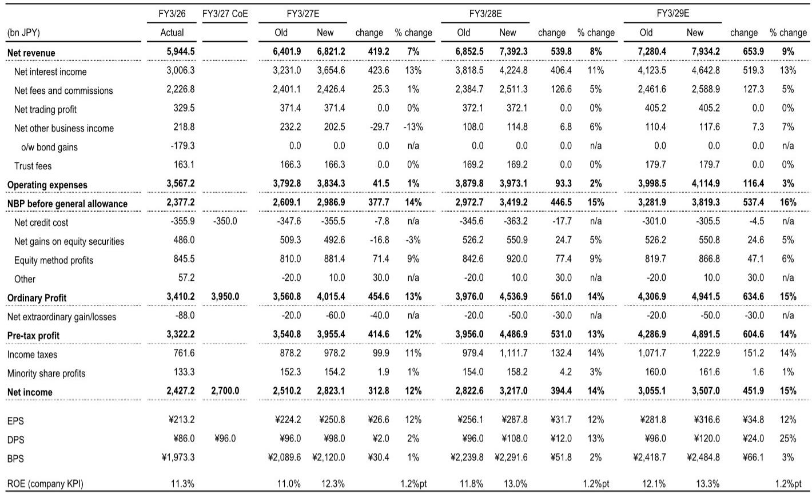
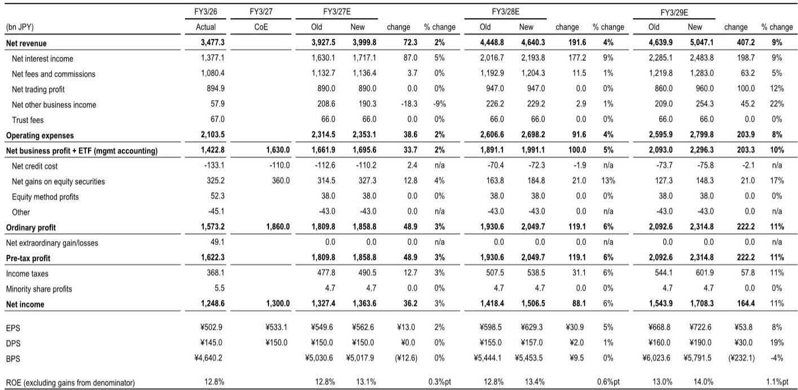
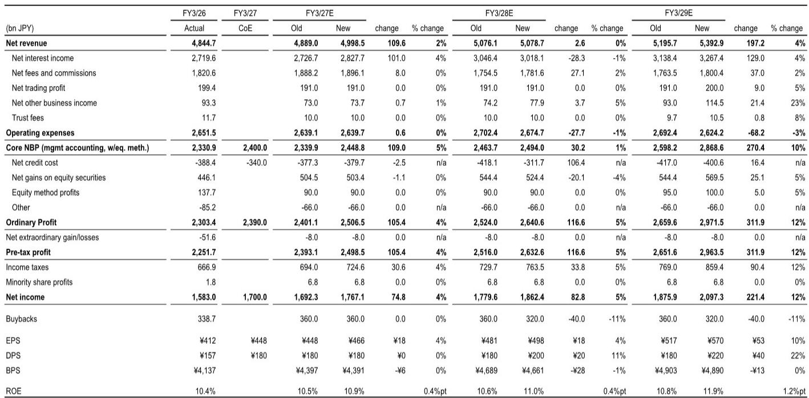

# Japan’s Megabanks Enter a Structural Profit Inflection Point — and the Market Has Not Priced It In

Japan’s three megabanks — MUFG, SMFG, and Mizuho — are approaching a rare convergence of tailwinds that the current market consensus underestimates. Loan demand is accelerating at a pace not seen in years: total bank loans rose 6.1% year-on-year in April-June, with major banks posting an even stronger 8.4% growth, according to the Bank of Japan’s Loans and Deposits statistics released July 8. This is not a one-quarter anomaly. The December 2024 rate hike, the June 2025 rate increase, and the resulting upward shift in short-term interest rates are now feeding directly into net interest income. On top of that, capital markets activity — driven by corporate governance reforms, bond issuance, and a rising TOPIX — is generating robust fee and trading revenue. The implication is clear: the megabanks are entering a period where core profitability, measured by ROE, can sustainably rise into the 12-13% range by fiscal year 2028-2029, up from the 10-12% range previously forecast. This shift warrants a re-rating of the sector.

The timing matters because the first-quarter earnings season for Japanese megabanks, starting in late July, will provide the first concrete test of whether the banks’ initial guidance was too conservative. The gap between what these banks guided for and what they are now likely to deliver, given the rate hikes and market activity, is the central observation. For observers, the question is not whether the megabanks will beat their own numbers — that appears probable — but whether the market will reprice the stocks to reflect a structurally higher ROE trajectory.

Three forces are driving this inflection. First, net interest income is expanding from both volume and spread effects. Second, capital markets revenue is no longer episodic; it is being sustained by structural changes in Japanese corporate behavior. Third, the banks are now positioned to rebuild their capital ratios organically through retained earnings, which in turn supports higher shareholder returns. Each of these forces merits a closer examination.

## The Loan Growth and Rate Hike Cycle Is Delivering a Multi-Year Net Interest Income Expansion That Is Only Beginning

The June 2025 rate hike, which brought the Bank of Japan’s policy rate to 0.75%, is not a one-off event for the megabanks’ income statements. Its full impact on net interest income will be realized over the next two fiscal years, as loan repricing, bond rebalancing, and the lagged effect of higher short-term rates flow through. For MUFG, the upward revision to net interest income is particularly pronounced: the bank’s FY3/27E net interest income forecast has been raised by 13% to ¥3,654.6 billion, and by FY3/29E the estimate stands at ¥4,642.8 billion, a 13% increase over the prior forecast. This reflects spread expansion from rising short-term rates, higher bond yields from yen bond rebalancing in the previous fiscal year, and the persistence of elevated US interest rates.

The loan growth figures underscore the breadth of this trend. The 8.4% year-on-year increase in major bank lending is not concentrated in a single sector; it reflects both corporate borrowing for capital expenditure and the shift from bridge loans to term corporate loans. For SMFG, the interest income uplift is complemented by a shift in loan portfolio composition that is improving yield. Mizuho, with its focus on corporate lending and its global corporate and investment banking (GCIB) business, is positioned to capture the most direct benefit from the current cyclical phase.

What matters for observers is the duration of this tailwind. The rate hikes of December 2024 and June 2025 have created a step-change in the interest rate environment. As these rate increases fully propagate through the loan books, net interest income should continue to rise through FY3/29. The megabanks’ initial guidance, set before the June hike, did not fully incorporate this. The upward revisions now being made are not merely catching up to reality; they are the first installment of a multi-year earnings upgrade cycle.

## Sustained Capital Markets Activity Is Generating a Structural Revenue Stream, Not a Cyclical Blip

The capital markets business for Japanese megabanks has historically been lumpy, tied to episodic equity issuance or M&A waves. That pattern is changing. The acceleration of corporate governance improvement efforts by Japanese companies — a direct result of the Tokyo Stock Exchange’s market restructuring and pressure from activist investors — is creating a steady pipeline of equity capital market (ECM) and debt capital market (DCM) deals. Bond issuances have been particularly robust, and the rise in TOPIX is generating cancellation gains on equity investment trusts and boosting fee income from asset management and advisory services.

For SMFG, the impact is visible in the upward revision to net fees and commissions, which are forecast to grow by 5% in FY3/28E and FY3/29E compared to prior estimates. For MUFG, the strength in investment banking is contributing to retained earnings accumulation, which is critical for the bank’s CET1 ratio recovery. Mizuho, as the top pick, benefits disproportionately because its GCIB focus aligns precisely with the current market environment: corporate lending, cross-border advisory, and capital markets origination are all areas where Mizuho has invested heavily.

The key insight is that this capital markets revenue stream is becoming more predictable. Japanese companies are now under sustained pressure to improve capital efficiency, unwind cross-shareholdings, and increase returns to shareholders. This creates a recurring need for equity offerings, bond refinancing, and strategic advisory. The megabanks, as the primary intermediaries for Japan Inc., are the direct beneficiaries. The risk that capital markets activity fades after a strong quarter is lower than in previous cycles because the underlying driver is structural — governance reform — not cyclical.

## The CET1 Ratio Recovery Is the Hidden Catalyst for Higher Shareholder Returns and P/B Re-Rating

One of the most closely watched metrics for Japan’s megabanks has been the CET1 ratio. At MUFG’s FY3/26 results, the CET1 ratio on a finalized basis excluding AOCI came in at 9.2%, below the bank’s target range of 9.5-10.5%. This miss weighed on the stock, as it raised questions about the bank’s ability to sustain shareholder returns while repairing its capital base.

The situation is now evolving favorably. The combination of active capital markets, loan growth, and higher net interest income is generating retained earnings at a pace that should allow MUFG to rebuild its CET1 ratio organically. The bank holds ¥132 trillion in risk assets, so accumulating several hundred billion yen in retained earnings is achievable within one to two half-year periods if the current earnings momentum holds. The first-quarter earnings will be a critical check: if MUFG reports that retained earnings accumulation is progressing, the market’s concern about the CET1 ratio should dissipate, removing a key overhang on the stock.

For observers, the CET1 ratio recovery matters because it directly enables higher shareholder returns. MUFG is assumed to maintain a 40% payout ratio and execute ¥200 billion in share buybacks in FY3/27E, rising to ¥300 billion in FY3/28E. SMFG is forecast to execute ¥360 billion in buybacks in FY3/27E. If the CET1 ratio recovers faster than expected, these buyback figures could prove conservative. The medium-term ROE targets — MUFG targeting mid-10% handle ROE, SMFG targeting 15% ROE/ROTE — become more credible when the capital base is strengthening, not weakening.

The P/B re-rating follows directly. Based on the revised normalized ROE estimates, MUFG’s target P/B has been raised to 1.69x from 1.52x, and SMFG’s to 1.56x from 1.36x. These multiples are still below the levels that would be justified if the banks achieve their medium-term ROE targets. The gap between current valuation and potential valuation is the opportunity.

## A Decision Framework for Observers: Three Questions to Answer Before First-Quarter Earnings

Heading into the megabank earnings season, observers should focus on three discrete questions that will determine whether the upward revision cycle continues or stalls.

First, how much upside is there versus each bank’s initial guidance? The tailwinds are clear: rate hikes, capital markets activity, and loan growth. The question is the magnitude of the beat. For Mizuho, the hurdle for an upward revision in the first half is relatively low, because the bank’s guidance for both FY3/27 and its FY3/29 medium-term targets assumes a policy rate of 0.75% — the same level the BOJ has now reached. This means Mizuho does not need to assume additional rate hikes to meet its targets; it only needs current conditions to persist. For MUFG and SMFG, the upside depends on whether net interest income and fee income are tracking ahead of their more conservative assumptions.

Second, what is the impact on the CET1 ratio? For MUFG specifically, the market needs to see evidence that retained earnings are accumulating and that the CET1 ratio is moving back toward the 9.5-10.5% target range. If the bank can demonstrate progress, the stock should re-rate. If not, the CET1 ratio concern will persist and cap valuation.

Third, are the banks continuing to take actions that improve ROE? This includes not only shareholder returns but also portfolio optimization, cost reduction, and strategic divestitures. The market has rewarded Japanese banks that demonstrate a clear commitment to ROE improvement. Any announcements of additional buybacks, higher payout ratios, or progress on reducing cross-shareholdings will be taken positively.

The risk to this framework is the Middle East situation and the potential for prolonged geopolitical disruption, which could weigh on market indicators and increase credit costs. Bond rebalancing due to rising long-term interest rates is another risk, as it could create unrealized losses on strategic shareholdings. These are real but manageable risks. The directional bet is that the structural tailwinds — rate hikes, governance reform, loan growth — are powerful enough to offset them.

## Mizuho’s Positioning Makes It the Best Expression of the Theme

Among the three megabanks, Mizuho stands out as the top pick for a specific reason: its business mix aligns with the current cyclical phase better than its peers. Mizuho’s focus on corporate lending and GCIB means it captures the full benefit of rising loan demand and capital markets activity without the offsetting headwinds that can affect banks with large securities portfolios or significant exposure to volatile trading revenue.

The low hurdle for an upward revision is the second reason. Because Mizuho’s guidance already assumes a 0.75% policy rate, the bank does not need to surprise on the upside from additional rate hikes. It simply needs to execute against its plan. In a market environment where the BOJ has already delivered the rate increase, Mizuho’s earnings trajectory is more predictable than that of banks that assumed a lower rate path.

The third reason is valuation. Mizuho’s target P/B of 1.56x, based on a normalized ROE of 12.48%, still leaves room for upside if the bank’s medium-term ROE targets are achieved. The combination of a clear earnings catalyst, low execution risk, and reasonable valuation makes Mizuho the most efficient way to play the Japanese megabank re-rating.

## The Structural Case for Japanese Megabanks Has Strengthened, and the First-Quarter Earnings Will Either Confirm or Challenge It

The upward revisions reflect a fundamental reassessment of the earnings power of Japan’s largest banks. Loan growth is accelerating, rate hikes are delivering net interest income expansion, capital markets activity is becoming structural, and the banks are rebuilding their capital bases. The FY3/29E ROE forecasts have been raised to 12-13%, and the target P/B multiples have been increased accordingly.

The first-quarter earnings will be the first real test. If the banks report results that confirm the tailwinds are as strong as the data suggests, the upward revision cycle will accelerate. If the results fall short, the market will need to reassess whether the structural case is as robust as it appears. Either way, the stakes are clear: Japan’s megabanks are at a profit inflection point, and the next few weeks will determine whether the market fully prices it in.

*For informational purposes only. Portions may be generated, translated, summarized, or edited with AI assistance based on source materials and may contain omissions or errors. Please verify independently. This is not professional advice.*

For informational purposes only. Portions may be generated, translated, summarized, or edited with AI assistance based on source materials and may contain omissions or errors. Please verify independently. This is not professional advice.

