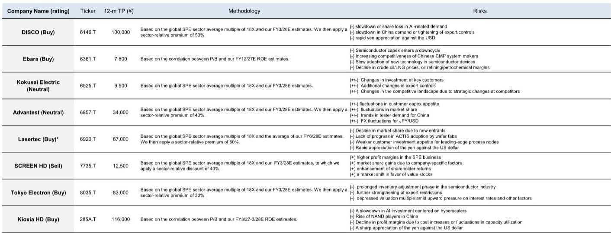

# GS：日本半导体前端设备预期偏高-含涨价预期

GS在7月初的香港读者交流中发现，市场对日本半导体前端设备公司的定价已经相当充分，甚至有些超前。40场会议传递出的信号是：读者普遍看好AI需求的持续性以及半导体设备周期的上行，但在具体子板块的偏好上，分化远比想象中明显。前端设备公司——尤其是东京电子、SCREEN控股和Kokusai Electric——获得了最多的乐观情绪，后端设备公司如Disco和Advantest则相对冷清。这份报告的价值不在于罗列哪些公司被看好，而在于揭示了一个正在形成的预期差：市场对WFE市场的规模假设，可能已经超过了GS自己的基准预测。

## 1. 读者对WFE市场的预期已高于GS基准，价格涨价预期正在扩散

报告中最值得注意的数字是：读者对2027年全球WFE市场的预期已经集中在2000亿美元附近，而GS的预测是1870亿美元。这130亿美元的差距，背后是市场对存储芯片厂新建项目持续性的高度信任。读者不仅看多2027年，对2028年之后的持续增长也抱有较强预期，部分原因是近期存储公司密集宣布的新晶圆厂计划。更值得关注的是，关于设备涨价的讨论正在升温。东京电子已经在积极推动涨价，市场开始预期这一行为会扩散到其他前端设备公司。这意味着，读者不仅接受了更高的WFE总量假设，还在为设备商的利润率改善提前定价。

> **KC评论：** 这里的关键不是2027年WFE到底是多少，而是市场已经用2000亿美元的预期在交易，而GS认为1870亿更合理。如果后续存储厂资本开支节奏变化或涨价落地不及预期，当前定价存在修正空间。

## 2. 前端与后端的分化背后，是读者对“确定性”的不同定价

读者对前端设备的偏好并非无差别。报告明确指出，三个偏好排序非常清晰：前端优于后端、存储资本开支优于非存储、CPU相关优于GPU/ASIC相关。这种排序反映的不是技术判断，而是读者对“可见度”的定价。前端设备受益于存储厂的大规模、可预测的资本开支计划，而后端设备更多依赖先进封装和测试需求的爆发，后者在时间点和规模上都不够确定。CPU相关的偏好则可能源于对AI推理侧长期需求的押注，而非训练侧GPU的短期爆发。这种结构性的偏好差异，意味着即便整个半导体设备板块上涨，不同公司的报价弹性也会显著不同。

## 3. 存储价格预期正在从“加速”转向“减速”，NAND的惊喜空间在收窄

读者对存储价格的看法也在微妙变化。报告显示，市场对三季度NAND价格的环比涨幅预期仍在15-20%之间，但已经有相当多的读者开始警惕涨幅逐步收窄的可能性。具体到Kioxia Holdings，虽然不少读者将近期报价回调视为加仓机会，但报告也观察到，由于NAND价格变化率下降，这家公司未来盈利超预期的可能性正在降低。这是一个典型的“好消息已经price in，边际变化才是关键”的场景。存储价格周期的斜率变化，将直接影响相关设备公司的订单节奏和盈利能见度。

## 4. GS选股框架的核心：增长能否转化为利润率扩张

报告在公司层面给出了一个清晰的筛选逻辑：一是公司能否通过技术变革、专有技术或市场份额提升实现超越行业平均的销售增长；二是收入增长能否有效传导至利润率的大幅提升。这个框架看似简单，但在当前市场环境下具有实际指导意义。GS在SPE板块中更新公司观点的公司——Lasertec、Ebara、Disco、东京电子——都符合这一逻辑。而Kioxia Holdings在存储领域的公司观点，则更多基于其估值与ROE的匹配度。值得注意的是，SCREEN控股被更新公司观点，报告认为其估值需要相对行业折价40%，这从反面印证了GS对“增长质量”的严格区分。

For informational purposes only. Portions may be generated,translated,summarized,or edited with AI assistance based on source materials and may contain omissions or errors. Please verify independently. This is not investment,legal,tax,accounting,or other professional advice.

For informational purposes only. Portions may be generated,translated,summarized,or edited with AI assistance based on source materials and may contain omissions or errors. Please verify independently. This is not investment,legal,tax,accounting,or other professional advice.

