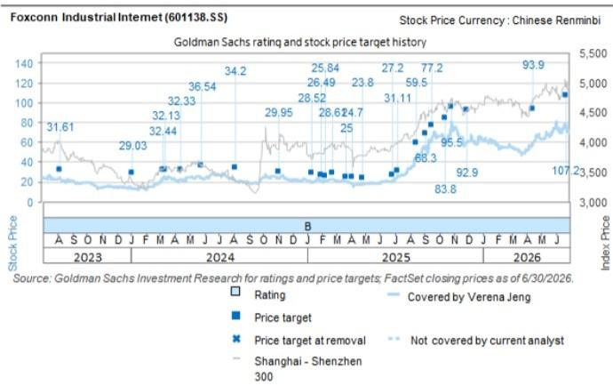

# 富士康工业互联网（601138.SS）：董事长交流与越南工厂参观——AI服务器与交换机自动化生产优势显著

我们在泰国/越南科技考察期间（7月7日至10日）参观了富士康工业互联网的工厂。管理层对AI基础设施投入的持续增长保持积极看法，并强调了公司在研发能力、全自动化生产、产品组合（组件、服务器、交换机）以及多元化生产基地方面的竞争优势。公司在越南已有超过15年的运营经验，具备成熟的生产经验、较低的折旧成本，以及与供应链、客户和当地政府建立的紧密合作关系。目前越南的产能扩建正在进行中，主要服务于AI基础设施需求，由客户需求驱动，这进一步印证了我们对公司市场领先地位的积极判断。我们对公司持积极看法，预计其将受益于：（1）AI服务器需求增长：我们近期上调了2026-2028年全球AI服务器隐含AI芯片出货量预期14%/22%/14%，上调2026-2028年美国云服务提供商资本开支预期8%/27%/25%，上调2026-2028年中国云服务提供商资本开支预期37%/44%/55%（详见全球服务器市场6月更新）；（2）AI服务器机架市场份额持续提升，客户群体扩展至NeoCloud等新兴云服务商，以及ASIC AI服务器需求增长；（3）AI服务器与交换机规格升级带来的新组件机会；（4）可折叠iPhone：新形态产品将带来新的使用场景，吸引消费者关注。

Verena Jeng  
+852-2978-1681 | verena.jeng@gs.com  
GS（亚洲）有限责任公司

1. AI基础设施投入的可持续性：管理层对未来几年AI相关投入的增长保持积极态度。云服务提供商、基础模型开发商、政府机构和企业是四类需要算力的客户群体，目前需求主要来自云服务提供商，这意味着其他三类客户群体未来仍有增长空间，而NeoCloud等新兴云服务商需求的增长正是这一趋势扩大的积极信号。主权AI可应用于国防、智慧城市、智慧交通、智慧政务等领域，考虑到数据安全，各地区将建设各自的数据中心来支持生成式AI应用，从而扩大AI数据中心需求。作为全球AI服务器领域的领先企业，公司持续收到来自各类客户的强劲需求，并据此推进产能扩建。公司的产能扩建持续进行，覆盖中国大陆、越南、墨西哥等地。

## 主要观察

Allen Chang  
+852-2978-2930 |  
allen.k.chang@gs.com  
GS（亚洲）有限责任公司

2. 竞争优势：管理层强调，公司的价值创造并非简单的组装，而是为客户最新技术（新产品导入）提供自动化生产解决方案。公司自主设计自动化生产线和设备，帮助客户以高良率及时交付最新型号产品。新产品导入阶段是最具挑战性的环节，因为这是从0到1的过程；然而，一旦全自动化生产线建成，便可轻松复制并快速提升产能。管理层强调了公司的核心关注点：（1）研发：聚焦最新技术/高端型号，全球领先客户在新产品生产环节依赖公司；（2）自动化生产：全自动化生产涵盖测试、最终包装及入库，通过数字化/AI技术进行质量控制和监控，实现关灯工厂；（3）产能扩建：快速复制最新型号的自动化生产线，以把握强劲的AI基础设施需求。公司还将继续开发AI服务器/共封装光学交换机的内部组件以优化毛利率，并转向代工模式以降低营运资金压力。

3. 越南生产：管理层强调，公司在越南已有超过15年的运营经验，这带来了具有竞争力的生产成本和丰富的越南制造经验。公司在越南拥有五个厂区，这些生产基地是公司海外生产基地中盈利能力较强的。越南工厂生产多种产品，涵盖消费电子和AI基础设施（如服务器、交换机），两者均采用高度自动化生产。高度自动化保障了产品质量、产量和工厂管理，提升了良率和运营效率。公司还采用生成式AI和AR眼镜进行员工培训和生产线复制，加速产能扩建，尤其是在海外工厂。

## 目标价风险与方法论——富士康工业互联网

我们的12个月目标价为人民币107.2元，基于23倍2027年预期市盈率。目标市盈率设定与同行的市盈率及远期基本面（净利润同比增速和营业利润率）回归分析一致。

主要下行风险：（1）AI服务器业务需求及利润低于预期；（2）由于竞争激烈，iPhone组件业务扩张低于预期；（3）新工厂产能爬坡慢于预期；（4）由于公司为iPhone提供组件，iPhone出货量低于预期。

<table><tr><td>601138.SS</td><td colspan="2">12个月目标价：人民币107.20元</td><td colspan="2">现价：人民币66.27元</td><td colspan="2">潜在空间：61.8%</td></tr><tr><td colspan="2"></td><td colspan="5">GS预测</td></tr><tr><td colspan="2"></td><td></td><td>12/25</td><td>12/26E</td><td>12/27E</td><td>12/28E</td></tr><tr><td rowspan="9" colspan="2">市值：人民币1.3万亿元/1940亿美元 企业价值：人民币1.3万亿元/1904亿美元 3个月日均交易量：人民币163亿元/24亿美元 中国大中华区科技并购排名：3 租赁包含在净债务及企业价值中？：否</td><td>收入（人民币百万元）</td><td>902,887.2</td><td>1,575,387.0</td><td>2,530,626.1</td><td>3,852,806.9</td></tr><tr><td>EBITDA（人民币百万元）</td><td>50,575.0</td><td>84,990.7</td><td>116,021.8</td><td>155,385.3</td></tr><tr><td>每股收益（人民币）</td><td>1.78</td><td>3.18</td><td>4.66</td><td>6.34</td></tr><tr><td>市盈率（倍）</td><td>21.1</td><td>20.9</td><td>14.2</td><td>10.5</td></tr><tr><td>市净率（倍）</td><td>4.4</td><td>6.7</td><td>5.5</td><td>4.5</td></tr><tr><td>股息回报表现（%）</td><td>2.6</td><td>2.6</td><td>3.9</td><td>5.3</td></tr><tr><td>净债务/EBITDA（不含租赁，倍）</td><td>(0.1)</td><td>(0.3)</td><td>(0.3)</td><td>(0.2)</td></tr><tr><td>CROCI（%）</td><td>21.5</td><td>35.2</td><td>40.1</td><td>44.0</td></tr><tr><td>自由现金流回报表现（%）</td><td>(1.6)</td><td>4.2</td><td>4.3</td><td>5.5</td></tr><tr><td colspan="2"></td><td></td><td>3/26</td><td>6/26E</td><td>9/26E</td><td>12/26E</td></tr><tr><td colspan="2"></td><td>每股收益（人民币）</td><td>0.53</td><td>0.75</td><td>0.90</td><td>1.00</td></tr></table>

来源：公司数据、GS预测、FactSet。价格截至2026年7月10日收盘。

## 附录：披露信息

## Reg AC

我们，Verena Jeng和Allen Chang，特此证明本报告中表达的所有观点准确反映了我们个人对相关公司及其证券的看法。我们还证明，我们的薪酬中没有任何部分直接或间接与本报告中表达的具体建议或观点相关。

除非另有说明，本报告封面所列人员均为GS全球投资研究部分析师。

撰稿作者：Verena Jeng GS（亚洲）有限责任公司，Allen Chang GS（亚洲）有限责任公司。

除非另有说明，本报告撰稿作者披露中列出的个人均为GS全球投资研究部分析师。

## GS因子概况

GS因子概况通过将股票的关键属性与市场（即我们评级的股票池）及其行业同行进行比较，提供投资背景信息。所描绘的四个关键属性是：增长、财务回报、估值倍数（例如估值）和综合（增长、财务回报和估值的综合指标）。增长、财务回报和估值倍数是通过使用每只股票特定指标的标准化排名计算得出的。然后将每个指标的标准化排名进行平均，并转换为相关属性的百分位数。每个指标的具体计算可能因财年、行业和地区而异，但标准方法如下：

增长基于股票的前瞻性销售增长、EBITDA增长和每股收益增长（对于金融股，仅基于每股收益和销售增长），较高的百分位数表示增长较高的公司。财务回报基于股票的前瞻性ROE、ROCE和CROCI（对于金融股，仅基于ROE），较高的百分位数表示财务回报较高的公司。估值倍数基于股票的前瞻性市盈率、市净率、价格/股息（P/D）、EV/EBITDA、EV/FCF和EV/债务调整后现金流（DACF）（对于金融股，仅基于市盈率、市净率和P/D），较高的百分位数表示交易估值倍数较高的股票。综合百分位数计算为增长百分位数、财务回报百分位数和（100% - 估值倍数百分位数）的平均值。

财务回报和估值倍数使用GS分析师对未来至少三个季度后的财年末的预测。增长使用对未来至少七个季度后的财年与未来至少三个季度后的财年相比的输入数据（所有指标均基于每股）。

有关我们如何计算GS因子概况的更详细说明，请联系您的GS代表。

## 并购排名

在我们的全球覆盖范围内，我们使用并购框架审视股票，考虑定性因素和定量因素（可能因行业和地区而异），以纳入某些公司可能被收购的潜在可能性。然后，我们分配一个并购排名，作为对我们评级覆盖范围内的公司进行评分的方法，从1到3，其中1表示公司成为收购目标的可能性高（30%-50%），2表示可能性中等（15%-30%），3表示可能性低（0%-15%）。对于排名为1或2的公司，根据我们部门的标准指引，我们在目标价中纳入并购组成部分。并购排名为3被视为不重要，因此不计入我们的目标价，并且可能在研究中讨论或不讨论。

## Quantum

Quantum是GS专有数据库，提供详细的财务报表历史、预测和比率的访问。它可用于对单一公司进行深入分析，或在不同行业和市场的公司之间进行比较。

## 披露信息

富士康工业互联网的评级相对于其覆盖范围内的其他公司：AAC、ACM Research、AMEC、ASMPT、AVC、AccoTest、Anji Micro、Asus、Auras、BOE、BYDE、Biren、CR Micro、Cambricon、Chenbro、中国移动（香港）、中国电信、中国铁塔、中国联通、中软国际、Compal、德赛西威、E Ink、E-Town Semis、亿航智能、Empyrean、Eoptolink、FOCI、Fositek、富士康工业互联网、技嘉、Gigadevice、广联达、HTC、海康威视、鸿海、地平线机器人、华虹半导体、华测导航、华勤技术（A股）、华勤技术（H股）、华海清科、英诺赛科、Innolight、浪潮、Insta360、Inventec、长电科技、Kematik、King Slide、金蝶、金山办公、LandMark、大立光、联想、领益智造、卓胜微、美图、MetaX、Mitac、南茂科技（A股）、南茂科技（H股）、北方华创、NSIG、Nexchip、OmniVision、和硕、小马智行（ADR）、小马智行（H股）、广达、RoboTechnik、锐捷网络、SG Micro、SICC、中芯国际（A股）、中芯国际（H股）、SZS、深信服、商汤科技、生益科技、深南电路、斯达半导、舜宇光学、TFC Optical、中科创达、通宇通讯、传音控股、UMT、UNIS、VPEC、Vanchip、VeriSilicon、Victory Giant、WNC、WUS、文远知行、纬创、纬颖、YJ Semitech、长飞光纤、用友网络、中兴通讯（A股）、中兴通讯（H股）、科大讯飞

## 公司特定监管披露

以下披露涉及GS集团公司（及其关联公司，“GS”）与本研究中提及的由GS全球投资研究覆盖的公司之间的关系。

GS预计在未来3个月内将或寻求就投资银行服务获得报酬：富士康工业互联网（人民币66.27元）

GS在过去12个月内因非投资银行服务获得报酬：富士康工业互联网（人民币66.27元）

GS在过去12个月内与以下公司存在投资银行服务客户关系：富士康工业互联网（人民币66.27元）

GS在过去12个月内与以下公司存在非投资银行证券相关服务客户关系：富士康工业互联网（人民币66.27元）

GS在过去12个月内与以下公司存在非证券服务客户关系：富士康工业互联网（人民币66.27元）

## 评级/投资银行关系分布

GS投资研究全球股票覆盖范围

<table><tr><td rowspan="2"></td><td colspan="3">评级分布</td><td colspan="3">投资银行关系</td></tr><tr><td>买入</td><td>持有</td><td>卖出</td><td>买入</td><td>持有</td><td>卖出</td></tr><tr><td>全球</td><td>50%</td><td>34%</td><td>16%</td><td>65%</td><td>59%</td><td>43%</td></tr></table>

截至2026年7月1日，GS全球投资研究对3,104只股票有投资评级。GS将股票指定为买入和卖出，纳入各个地区的投资清单；未如此指定的股票被视为中性。就FINRA规则要求的上述披露而言，此类指定等同于买入、持有和卖出。请参阅下文“评级、覆盖范围及相关定义”。投资银行关系图表反映了每个评级类别中GS在过去十二个月内提供过投资银行服务的公司所占的百分比。

## 目标价与评级历史图表

  
所示目标价应结合所有先前发布的GS报告（可能包含或不包含目标价）以及公司、行业和金融市场的发展情况来考虑。

## 目标价历史表格——富士康工业互联网（601138.SS）

报告日期 目标价（人民币） 收盘价（人民币）

<table><tr><td>2026年6月23日</td><td>107.20</td><td>74.10</td></tr><tr><td>2026年4月16日</td><td>93.90</td><td>59.32</td></tr><tr><td>2025年11月30日</td><td>92.90</td><td>60.72</td></tr><tr><td>2025年10月29日</td><td>95.50</td><td>80.80</td></tr><tr><td>2025年10月15日</td><td>83.80</td><td>63.38</td></tr><tr><td>2025年9月18日</td><td>77.20</td><td>64.36</td></tr><tr><td>2025年9月5日</td><td>68.30</td><td>55.83</td></tr><tr><td>2025年8月17日</td><td>59.50</td><td>44.86</td></tr><tr><td>2025年7月9日</td><td>31.11</td><td>26.60</td></tr><tr><td>2025年6月28日</td><td>27.20</td><td>21.35</td></tr><tr><td>2025年4月28日</td><td>23.80</td><td>18.00</td></tr><tr><td>2025年4月6日</td><td>24.70</td><td>19.05</td></tr><tr><td>2025年3月24日</td><td>25.00</td><td>20.84</td></tr><tr><td>2025年2月23日</td><td>28.61</td><td>23.20</td></tr><tr><td>2025年2月9日</td><td>25.84</td><td>21.55</td></tr><tr><td>2025年1月31日</td><td>26.49</td><td>21.45</td></tr><tr><td>2025年1月13日</td><td>28.52</td><td>19.72</td></tr><tr><td>2024年11月3日</td><td>29.95</td><td>23.68</td></tr><tr><td>2024年8月5日</td><td>34.20</td><td>20.42</td></tr><tr><td>2024年5月28日</td><td>36.54</td><td>24.12</td></tr><tr><td>2024年4月15日</td><td>32.33</td><td>22.24</td></tr><tr><td>2024年3月15日</td><td>32.13</td><td>23.08</td></tr><tr><td>2024年3月8日</td><td>32.44</td><td>24.87</td></tr><tr><td>2024年1月5日</td><td>29.03</td><td>13.30</td></tr><tr><td>2023年10月30日</td><td>31.61</td><td>14.60</td></tr><tr><td>2023年8月15日</td><td>31.61</td><td>21.39</td></tr><tr><td>2023年8月9日</td><td>31.61</td><td>22.25</td></tr><tr><td>2023年8月1日</td><td>31.35</td><td>22.67</td></tr></table>

表格中所示目标价未针对公司行为进行调整。

## 监管披露

## 美国法律法规要求的披露

请参阅上述公司特定监管披露，了解本报告中提及的公司所需的任何以下披露：待处理交易中的主承销商或联合主承销商；1%或以上的所有权；特定服务的报酬；客户关系类型；前期公开发行的管理/联合管理；董事职位；对于股权证券，做市和/或专家角色。GS可能作为本金交易本报告中讨论的发行人的债务证券（或相关衍生品）。

以下是额外的必要披露：所有权和重大利益冲突：GS政策禁止其分析师、向分析师汇报的专业人士及其家庭成员持有分析师覆盖范围内的任何公司的证券。分析师薪酬：分析师的薪酬部分基于GS的盈利能力，其中包括投资银行收入。分析师作为高管或董事：GS政策通常禁止其分析师、向分析师汇报的人员或其家庭成员在分析师覆盖范围内的任何公司担任高管、董事或顾问。非美国分析师：非美国分析师可能不是GS有限责任公司的关联人员，因此可能不受FINRA规则2241或FINRA规则2242关于与主题公司沟通、公开露面以及交易分析师所覆盖证券的限制。

## 美国以外司法管辖区法律和法规要求的额外披露

以下披露是相关司法管辖区要求的，除非已根据美国法律法规在上文中作出。澳大利亚：GS澳大利亚有限公司及其关联公司不是澳大利亚的授权存款机构（如1959年银行法（联邦）所定义），在澳大利亚不提供银行服务，也不从事银行业务。除非GS另有约定，本研究及其任何访问仅面向澳大利亚公司法定义的“批发客户”。在编写研究报告时，GS澳大利亚全球投资研究部门的成员可能会参加由研究报告所涉及的公司和其他实体主办或组织的实地考察和其他会议。在某些情况下，如果GS澳大利亚认为在实地考察或会议的具体情况下适当且合理，此类实地考察或会议的部分或全部费用可能由相关发行人承担。如果本文件内容包含任何金融产品建议，则仅为一般性建议，由GS在未考虑客户的目标、财务状况或需求的情况下编制。客户在根据任何此类建议采取行动之前，应考虑该建议是否适合其自身的目标、财务状况和需求。GS澳大利亚和新西兰的利益披露声明以及GS澳大利亚卖方研究独立性政策声明的副本可在以下网址获取：https://www.goldmansachs.com/disclosures/australia-new-zealand/index.html。巴西：有关CVM第20号决议的披露信息可在以下网址获取：https://www.gs.com/worldwide/brazil/area/gir/index.html。在适用的情况下，根据CVM第20号决议第20条的定义，本研究报告内容的主要巴西注册分析师为本报告开头指定的第一作者，除非文本末尾另有说明。加拿大：此信息仅供您参考，在任何情况下均不应被解释为GS有限责任公司为在加拿大购买任何加拿大证券而进行的广告、要约或招揽。GS有限责任公司未在加拿大任何司法管辖区根据适用的加拿大证券法注册为交易商，通常不允许交易加拿大证券，并且可能被禁止在加拿大某些司法管辖区销售某些证券和产品。如果您希望在加拿大交易任何加拿大证券或其他产品，请联系GS加拿大公司（GS集团公司的关联公司）或其他注册的加拿大交易商。香港：可应要求从GS（亚洲）有限责任公司获取本研究中提及的所覆盖公司证券的进一步信息。印度：可从GS（印度）证券私人有限公司获取本研究中提及的主题公司或公司的进一步信息，研究分析师 – SEBI注册号INH000001493，地址：10th Floor, Ascent-Worli, Sudam Kalu Ahire Marg, Worli, Mumbai-400 025, India，企业识别号U74140MH2006FTC160634，电话+91 22 6616 9000，传真+91 22 6616 9001。GS可能实益拥有本研究报告所提及的主题公司或公司1%或以上的证券（如1956年印度证券合约（监管）法第2(h)条所定义）。SEBI的注册和NISM的认证绝不保证中介机构的业绩，也不向读者提供任何回报保证。GS（印度）证券私人有限公司的合规官和读者投诉联系方式、年度合规审计报告副本以及其他相关信息和披露可在以下链接找到：https://www.goldmansachs.com/worldwide/india/research-analyst。日本：见下文。韩国：除非GS另有约定，本研究及其任何访问仅面向金融服务和资本市场法定义的“专业读者”。可从GS（亚洲）有限责任公司首尔分行获取本研究中提及的主题公司或公司的进一步信息。新西兰：GS新西兰有限公司及其关联公司不是新西兰的“注册银行”或“存款接受者”（如1989年新西兰储备银行法所定义）。除非GS另有约定，本研究及其任何访问面向2008年金融顾问法定义的“批发客户”。GS澳大利亚和新西兰的利益披露声明副本可在以下网址获取：https://www.goldmansachs.com/disclosures/australia-new-zealand/index.html。俄罗斯：在俄罗斯联邦分发的研究报告不是俄罗斯立法所定义的广告，而是信息和分析，其主要目的不是推广产品，并且不提供俄罗斯立法关于评估活动意义上的评估。研究报告不构成俄罗斯法律法规所定义的个性化研究交流，不针对特定客户，并且在未分析客户的财务状况、投资概况或风险概况的情况下编制。GS对客户或任何其他人基于本研究报告可能做出的任何投资决策不承担任何责任。新加坡：GS（新加坡）私人有限公司（公司编号：198602165W），受新加坡金融管理局监管，接受对本研究的法律责任，如有任何因本研究引起或与之相关的事宜，应与其联系。台湾：此材料仅供参考，未经许可不得转载。读者应仔细考虑自身的投资风险。投资结果由个人读者自行负责。英国：在英国被归类为零售客户（如金融行为监管局规则所定义）的人士，应结合先前GS关于本报告所提及公司的研究报告阅读本研究，并应参考GS国际已发送给他们的风险警告。这些风险警告的副本以及本报告中使用的某些金融术语的词汇表，可应要求从GS国际获取。

欧盟和英国：关于欧盟委员会授权条例（EU）（2016/958）第6(2)条（补充欧洲议会和理事会条例（EU）No 596/2014，包括该授权条例在英国脱离欧盟和欧洲经济区后转化为英国国内法律和法规）的披露信息，涉及研究交流或其他推荐或暗示投资策略的信息的客观呈现技术安排以及特定利益或利益冲突迹象的披露，可在以下网址获取：https://www.gs.com/disclosures/europeanpolicy.html，其中说明了与投资研究相关的利益冲突管理的欧洲政策。

日本：GS日本有限公司是在关东财务局注册的金融工具交易商，注册号Kinsho 69，是日本证券交易商协会、日本金融期货协会、第二类金融工具交易商协会和日本投资管理协会的成员。股票买卖需支付与客户预先确定的佣金加上消费税。有关日本证券交易所、日本证券交易商协会或日本证券金融公司要求的任何适用披露，请参阅公司特定披露。

## 评级、覆盖范围及相关定义

买入（B）、中性（N）、卖出（S）分析师建议将股票作为买入或卖出纳入各个地区的投资清单。被指定为投资清单上的买入或卖出取决于股票相对于其覆盖范围的总回报潜力。任何未被指定为投资清单上的买入或卖出且具有有效评级（即，非评级暂停、未评级、早期生物技术、覆盖暂停或未覆盖）的股票被视为中性。每个地区管理区域确信清单，这些清单选自各自地区投资清单中评级为买入的股票，代表侧重于总回报潜力大小和/或在其各自覆盖范围内实现回报的可能性的研究交流。此类确信清单中股票的添加或移除由每个地区的投资审查委员会或其他指定委员会管理，并不代表分析师对此类股票的投资评级发生变化。

总回报潜力代表当前股价与目标价之间的上涨或下跌差异，包括目标价相关时间范围内预期支付或预期的所有股息。所有覆盖的股票都需要目标价。总回报潜力、目标价和相关时间范围在每份添加或重申投资清单成员资格的报告中有说明。

覆盖范围：每个覆盖范围的所有股票列表可通过主要分析师、股票和覆盖范围在以下网址获取：https://www.gs.com/research/hedge.html。

未评级（NR）。当GS在涉及该公司的合并或战略交易中担任顾问角色时，当存在法律、监管或政策限制（由于GS参与交易）时，以及在某些其他情况下，根据GS政策，投资评级、目标价和盈利预测（如适用）将被移除。早期生物技术（ES）。当该公司既没有通过II期临床试验的药物、治疗或医疗设备，也没有获得分销后II期药物、治疗或医疗设备的许可时，根据GS政策，不分配投资评级和目标价。评级暂停（RS）。GS已暂停对该股票的投资评级和目标价，因为没有足够的基本面基础来确定投资评级或目标价。先前的投资评级和目标价（如有）不再对该股票有效，不应依赖。覆盖暂停（CS）。GS已暂停对该公司的覆盖。未覆盖（NC）。GS不覆盖该公司。

## 全球产品；分销实体

GS全球投资研究为GS客户在全球范围内制作和分发研究产品。位于全球各地GS办事处的分析师对行业和公司以及宏观经济、货币、大宗商品和投资组合策略进行研究。本研究由以下机构在澳大利亚分发：GS澳大利亚有限公司（ABN 21 006 797 897）；在巴西：GS巴西证券经纪有限公司；GS巴西公共沟通渠道：0800 727 5764 和/或 contatogoldmanbrasil@gs.com。工作日（节假日除外），上午9点至下午6点。在加拿大：GS有限责任公司；在香港：GS（亚洲）有限责任公司；在印度：GS（印度）证券私人有限公司；在日本：GS日本有限公司；在韩国：GS（亚洲）有限责任公司首尔分行；在新西兰：GS新西兰有限公司；在俄罗斯：GS有限责任公司；在新加坡：GS（新加坡）私人有限公司（公司编号：198602165W）；在美国：GS有限责任公司。GS国际已批准本研究在英国的分发。

GS国际（“GSI”），由审慎监管局（“PRA”）授权，受金融行为监管局（“FCA”）和PRA监管，已批准本研究在英国的分发。

欧洲经济区：GS银行欧洲有限公司（“GSBE”）是在德国注册的信贷机构，在单一监管机制内，受欧洲中央银行直接审慎监管，并在其他方面受德国联邦金融监管局（BaFin）和德国联邦银行监管，并在欧洲经济区内分发研究。

## 一般披露

本研究仅供我们的客户使用。除与GS相关的披露外，本研究基于我们认为可靠的当前公开信息，但我们不声明其准确或完整，且不应依赖于此。本文所含信息、意见、估计和预测截至本文日期，如有更改，恕不另行通知。我们寻求在适当情况下更新我们的研究，但各种法规可能阻止我们这样做。除某些定期发布的行业报告外，大部分报告根据分析师的判断不定期发布。

GS开展全球全方位、综合性的投资银行、投资管理和经纪业务。我们与全球投资研究覆盖的相当大比例的公司存在投资银行和其他业务关系。GS有限责任公司，美国经纪交易商，是SIPC成员（https://www.sipc.org）。

我们的销售人员、交易员和其他专业人士可能向我们的客户和自营交易部门提供口头或书面的市场评论或交易策略，这些评论或策略反映的观点可能与本研究表达的观点相反。我们的资产管理业务、自营交易部门和投资业务可能做出与本研究报告中的建议或观点不一致的投资决策。

本报告中指定的分析师可能不时与我们的客户（包括GS销售人员和交易员）讨论，或在本报告中讨论交易策略，这些策略涉及可能对本报告讨论的股权证券的市场价格产生短期影响的催化剂或事件，这种影响可能在方向上与分析师对此类股票发布的公开目标价预期相反。任何此类交易策略均不同于且不影响分析师对此类股票的基本股权评级，该评级反映了股票相对于其覆盖范围的总回报潜力，如本文所述。

我们及我们的关联公司、高级职员、董事和员工将不时持有本研究中提及的证券或衍生品（如有）的多头或空头头寸，作为本金进行交易，并买入或卖出，除非法规或GS政策另有禁止。

在GS安排的会议上归因于第三方演讲者（包括来自GS其他部门的个人）的观点不一定反映全球投资研究的观点，也不是GS的官方观点。

本文引用的任何第三方，包括任何销售人员、交易员和其他专业人士或其家庭成员，可能持有与本文指定分析师表达的观点不一致的所提及产品的头寸。

本研究不构成在任何司法管辖区出售或招揽购买任何证券的要约，在此类要约或招揽将是非法的。它不构成个人建议，也未考虑个别客户的特定投资目标、财务状况或需求。客户应考虑本研究中的任何建议或推荐是否适合其特定情况，并在适当情况下寻求专业建议，包括税务建议。本研究中提及的投资的价值和价格及其收入可能会波动。过往表现并非未来表现的指引，未来回报不保证，且可能发生原始资本损失。汇率波动可能对某些投资的價值或价格或收入产生不利影响。

某些交易，包括涉及期货、期权和其他衍生品的交易，会带来重大风险，并不适合所有读者。读者应查阅当前的期权和期货披露文件，这些文件可从GS销售代表处或以下网址获取：https://www.theocc.com/about/publications/character-risks.jsp 和 https://www.goldmansachs.com/disclosures/cftc_fcm_disclosures。在需要多次买卖期权的期权策略（如价差）中，交易成本可能很高。将应要求提供支持文件。

全球投资研究提供的不同服务水平：GS全球投资研究向您提供的服务水平和类型可能与向GS内部和其他外部客户提供的服务有所不同，具体取决于多种因素，包括您个人对接收沟通的频率和方式的偏好、您的风险状况和投资重点及视角（例如，市场范围、行业特定、长期、短期）、您与GS整体客户关系的规模和范围，以及法律和监管限制。例如，某些客户可能希望在特定证券的研究发布时收到通知，某些客户可能希望将分析师基本面分析中可用的特定数据通过数据馈送或其他方式以电子方式交付给他们。分析师基本面研究观点的任何变化（例如，对股权证券的评级、目标价或盈利预测的重大变化）将在通过电子方式向我们的内部客户网站广泛发布研究报告或以其他方式（如有必要）向所有有权接收此类报告的客户传达之前，不会向任何客户传达。

所有研究报告均通过电子方式发布到我们的内部客户网站，同时向所有客户提供。并非所有研究内容都会重新分发给我们的客户或提供给第三方聚合商，GS也不对第三方聚合商重新分发我们的研究负责。对于与一种或多种证券、市场或资产类别相关的研究、模型或其他数据（包括相关服务），请联系您的GS代表或访问 https://research.gs.com。

披露信息也可在以下网址获取：https://www.gs.com/research/hedge.html，或联系研究合规部，地址：200 West Street, New York, NY 10282。

## © 2026 GS。

您仅可为自己使用而存储、显示、分析、修改、重新格式化并打印通过此服务提供给您的信息。未经GS明确书面同意，您不得转售或逆向工程此信息以计算或开发任何用于披露和/或营销的指数，或创建任何其他衍生作品或商业产品、数据或产品。未经GS明确书面同意，您不得以任何格式向任何第三方发布、传输或以其他方式复制此信息的全部或部分。前述限制包括但不限于使用、提取、下载或检索此信息的全部或部分，以训练或微调机器学习或人工智能系统，或作为任何此类系统的提示或输入来提供或复制此信息的全部或部分。
