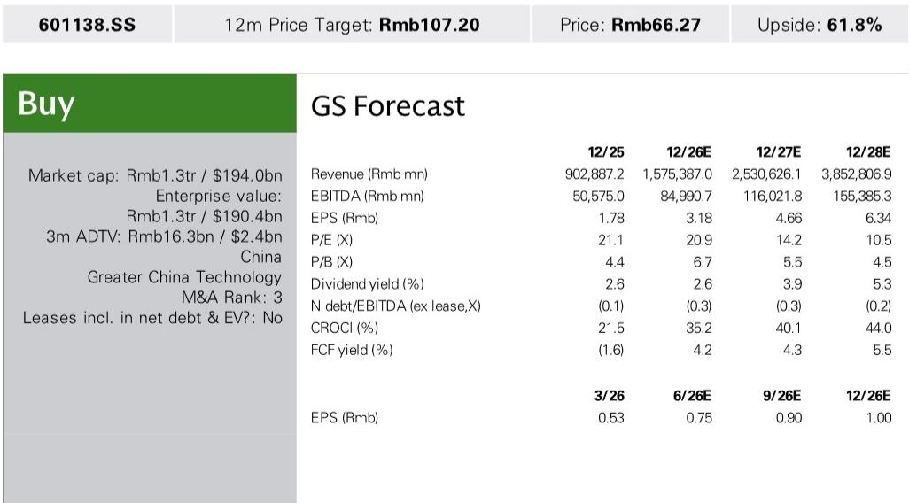
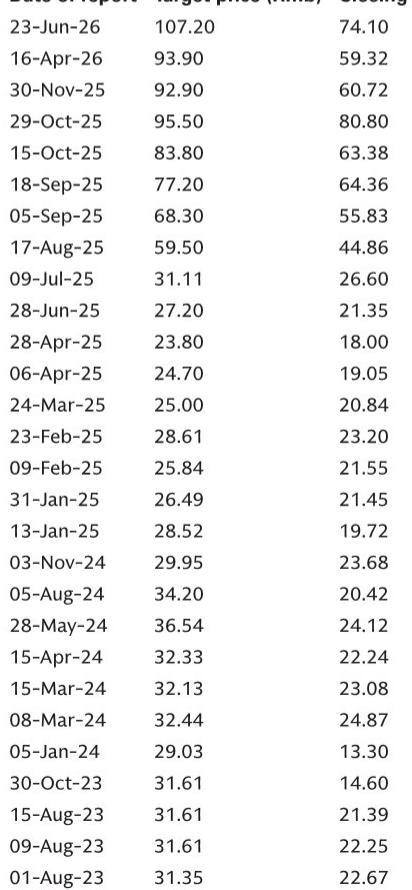

# GS：GS工业富联，董事长越南工厂参观AI服务器与交换机自动化生产观察

这份GS研报的核心判断，并非关于AI服务器出货量的简单上调。在参观工业富联越南工厂后，分析师认为，市场低估了这家公司最稀缺的能力：它不是一家组装厂，而是一家能够为全球高质量客户完成最新技术产品“从0到1”量产导入的自动化方案商。这种能力，决定了它在AI基础设施扩张周期中的议价权和可复制性。

研报上调了2026至2028年全球AI服务器隐含芯片出货量预期，同时将中国云服务提供商的资本开支预测大幅上调37%至55%。但真正支撑其长期判断的，是工业富联在越南超过15年的生产经验、自研自动化产线的快速复制能力，以及客户结构从大型云厂商向NeoCloud等新兴算力需求方的扩展。

## 1. 自动化不是降本工具，而是技术壁垒的变现方式

工业富联管理层在交流中反复强调，公司的价值增值不在组装环节，而在“新产品导入”阶段。这是从技术原型到量产之间最困难的一步——从0到1。工业富联为此自研了自动化产线和测试设备，帮助客户在最短时间内以高良率交付最新型号产品。

一旦自动化产线跑通，复制和扩产就变得相对简单。这意味着，工业富联的核心竞争力不是规模带来的成本优势，而是将客户最新技术快速转化为可量产方案的能力。这种能力一旦建立，客户对其的依赖度会显著高于普通代工厂。

> **KC评论：** 研报中提到的“熄灯工厂”并非概念，而是工业富联在越南工厂已经实现的现实——从生产、测试到包装入库，全程自动化并由AI监控质量。这种能力在海外工厂尤为重要，因为它降低了对当地熟练工人的依赖，使产能扩张速度不受制于人力培训周期。

## 2. 越南不是成本洼地，而是利润高地

工业富联在越南已有五个厂区，运营超过15年。管理层透露，这些越南工厂是公司所有海外生产基地中盈利能力较强的。原因在于：高度自动化保障了良率和运营效率，而长期深耕带来的供应链网络、客户关系和本地沟通经验，构成了难以复制的本地化壁垒。

研报特别指出，越南工厂同时生产消费电子和AI基础设施产品，两者均实现了高度自动化。公司还利用生成式AI和AR眼镜进行员工培训和产线复制，进一步加速了海外产能扩张。这意味着，工业富联的海外布局并非简单的成本套利，而是通过技术手段将管理能力标准化、可迁移。

## 3. AI需求的结构性扩张才刚刚开始

管理层对AI资本开支的持续性持乐观态度，其逻辑并非仅基于当前云服务提供商的采购。他们识别出四类算力需求方：云服务商、基础模型开发者、公共机构和企业。目前需求仍主要由云服务商贡献，但来自NeoCloud等新兴客户的需求增长，是需求结构正在扩大的积极信号。

主权AI是一个被研报重点提及的增量场景。出于数据安全考虑，各国在国防、智慧城市、智能交通、智慧政务等领域需要建设独立的数据中心来支持生成式AI应用。这将在云服务商之外，创造出一层全新的、分散但总量可观的需求。

工业富联的产能扩张正在中国大陆、越南、墨西哥等多地同步推进，且均由客户需求驱动。研报认为，这种多地产能布局，加上公司在新产品导入阶段的技术锁定效应，使其在AI服务器和交换机规格升级、新组件机会涌现的过程中，能够持续获得市场份额。

---

For informational purposes only. Portions may be generated,translated,summarized,or edited with AI assistance based on source materials and may contain omissions or errors. Please verify independently. This is not investment,legal,tax,accounting,or other professional advice.

For informational purposes only. Portions may be generated,translated,summarized,or edited with AI assistance based on source materials and may contain omissions or errors. Please verify independently. This is not investment,legal,tax,accounting,or other professional advice.

