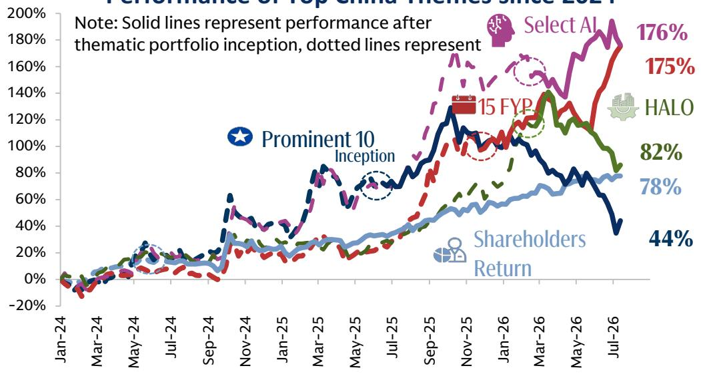
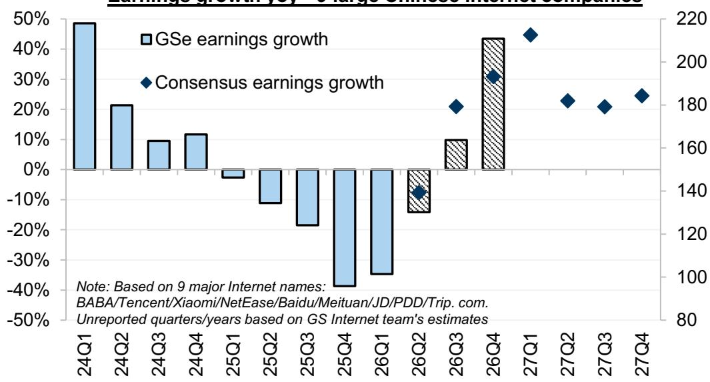
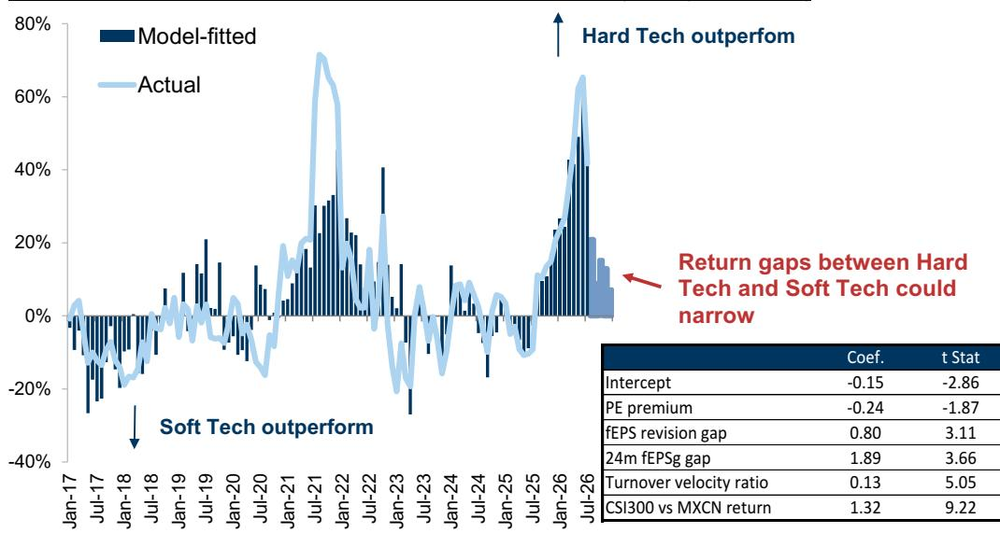

# 中国市场的结构性分化：盈利复苏是核心变量

当前中国市场中，最值得关注的并非多空分歧，而是两个结构性分化已达到极端水平。第一个分化是科创板50指数（代表境内AI硬件相关公司）与恒生科技指数（以境外互联网平台为主）之间年内回报差距达68个百分点。第二个分化是A股与H股的表现差异，境内市场显著跑赢境外市场。这些分化让不少观察者开始思考是否会出现风格切换——从A股转向H股，从硬科技转向软科技，从AI供应商转向AI应用方。这种想法可以理解，但可能为时过早。

风格切换的逻辑有一定基础：H股互联网公司估值已大幅压缩，其核心业务似乎已计入较多负面预期，AI投资的价值尚未充分体现。然而，仅凭估值因素，历史上很少能成为市场持续领先的充分条件。持续的领先切换需要企业盈利出现可见的复苏，而这一复苏可能还需数月时间。风格切换最终会发生，但需要盈利数据的确认。

从资金动向来看，全球对冲基金对中国股票的总体敞口已接近周期高点，但净敞口仍处于历史低位。这种组合表明，市场更多由追求超额收益的策略主导，而非趋势性押注。境外资金参与积极但态度谨慎，更注重个股选择而非方向性配置。公募基金对中国市场的配置比例升至多年高位，但这更多反映了新兴市场基准指数权重调整，而非看多情绪高涨。市场正在等待一个催化剂，而这个催化剂就是盈利。

## 硬科技与软科技68个百分点的分化：全球AI主题在中国市场的映射

今年中国市场的回报分化并非异常现象，而是全球投资主题的本地化体现：AI基础设施建设让硬件、半导体和设备供应商受益，同时让需要大量投入AI能力的公司承压。在美国，这一现象已被充分讨论和广泛关注。在中国，它体现在许多国际观察者不太关注的指数中。

科创板50指数（聚焦境内AI硬件和半导体公司）年内跑赢恒生科技指数68个百分点。创业板指领先上证综指19个百分点，领先沪深300指数17个百分点。这些差距在中国市场历史上未曾出现。它们不仅是中国的特有现象，也反映了全球AI瓶颈交易的特征——AI基础设施供应商获得短期收入和利润增长，而AI能力投入方则面临利润率压缩。

这对组合构建有直接影响。因宏观担忧而回避中国市场的观察者，可能错过了今年新兴市场中最具主题性的机会之一。那些对A股硬科技持谨慎态度的人，也承受了显著的机会成本。这种分化也意味着，任何风格切换本质上都是对全球AI供需格局逆转的押注，而不仅仅是中国的故事。这使得切换时机与国内AI主要投入方——中国互联网公司的盈利轨迹紧密相关。

## H股软科技开始反弹，但持续上涨需盈利复苏支撑

恒生科技指数近两周反弹约11%，由几家大型互联网公司领涨。这一走势受到消息面改善、估值处于低位以及市场可能过度反应了AI资本开支对短期盈利影响的认知推动。一个自上而下的硬科技与软科技切换模型——综合考虑估值溢价、盈利修正动量、增长差异、换手率和相对回报——现在显示，H股软科技可能在未来几个月开始缩小与A股硬科技的表现差距。

然而，该模型是时机判断工具，而非方向性信号。它告诉观察者条件何时变得更有利于切换，而非切换已经开始。关键缺失因素是盈利的可见改善。MSCI中国指数2026年第一季度盈利同比下降8%，主要受互联网板块拖累，该板块占指数盈利权重的35%。这些公司自2025年第二季度以来累计承担了超过1800亿元人民币的补贴损失，并且是国内AI资本开支的主要支持方，今年可能超过1000亿美元，明年可能达到1200亿美元。

盈利好转的路径可以识别，但不会立即实现。补贴损失收窄、AI相关收入（如云服务、智能代理和AI代币）快速增长，以及稳定的电商业务现金流，可能推动第二或第三季度盈利复苏。届时，观察者将能够量化AI投资的潜在上行空间，并可能从综合估值方法转向分部估值框架。在数据出现之前，风格切换仍是一个战术性判断，而非战略性决策。

## 中国AI公司并非泡沫，但局部过热需主动管理风险

中国AI公司是否过热，是全球AI泡沫讨论的延伸，但答案并非简单的“是”或“否”。从整体看，AI带来的效率提升和新利润、新市场空间可能带来的经济收益，比当前AI公司价格所反映的高出50%至100%。自DeepSeek时刻以来，中国AI相关市值净增长相对于这一潜力似乎较为温和。估值有所上升，但按历史标准并未达到极端水平。

然而，AI领域的某些局部已出现过热迹象。半导体板块和部分A股硬科技公司的估值相对于自身历史和全球可比公司处于较高水平。集中度风险正在以令人担忧的速度上升，杠杆也在增加。这些并非系统性泡沫的信号，但确实需要加强对风险控制、分散化以及向盈利驱动策略倾斜的关注。

对于观察者而言，整体风险与局部风险的区别具有操作上的重要性。全面回避中国AI公司可能错失更广泛生态系统中的结构性机会。盲目追逐最热门的板块则可能在情绪转变时面临显著回撤风险。正确的做法是通过多元化、以盈利为基础的组合来保持对AI主题的参与，覆盖整个价值链，而非集中于最投机的品种。

## 境外资金活跃但谨慎：在低相关性环境中优先追求超额收益

中国股市与韩国、台湾股市的回报相关性接近历史低位。这并非巧合，而是反映了国际观察者对待中国市场方式的转变。根据主要经纪商数据，对冲基金在除中国外的新兴亚洲地区的净风险敞口处于历史高位，而中国股票的净敞口处于历史低位。然而，总敞口接近周期高点，今年香港IPO中境外基石读者的参与度与2021年历史高位相当。

信息很明确：境外观察者并未放弃中国市场。他们变得更加有选择性，更专注于市场中性策略。他们愿意通过个股选择、IPO参与和配对交易来承担超额收益风险，但不愿通过广泛的方向性配置来承担市场风险。这是对宏观因素退居次要、AI驱动的微观因素主导环境的理性反应。

中美关系晴雨表——通过市场价格隐含的双边紧张程度——处于2022年以来的最低水平。这表明地缘政治风险目前并非市场定价的主要驱动因素。相反，市场由AI主题和公司基本面驱动。对于观察者而言，这意味着获得超额收益的路径在于理解中国AI生态系统的微观结构以及个股的盈利轨迹，而非做出宏观方向性判断。

## 2026年下半年的决策框架：当前优先关注A股硬科技，随盈利改善逐步布局H股软科技

2026年剩余时间的战术偏好应继续偏向中国A股，尤其是硬科技和AI基础设施领域。A股市场在周期性基础上提供更有利的盈利动量，并具有国际观察者可能低估的分散化价值。A股与H股的盈利修正差距继续有利于境内市场，换手率差异也支持A股。

尽管如此，下半年为逐步布局部分大型H股互联网公司提供了机会。年内估值压缩幅度较大，预计第二或第三季度盈利复苏可能成为持续风格切换的催化剂。关键在于保持耐心，等待盈利数据确认判断后再投入显著资金。

从行业看，AI领域之外也存在机会。在材料、资本品和保险等拥挤度较低、对AI叙事依赖度较低的领域，存在超额收益潜力。造船、新消费、医疗保健和生物科技、住房延伸价值链、券商以及猪周期等非AI微观主题，提供了额外的回报来源。主题方面，精选中国AI组合和“十五五”规划组合仍是高确信度的思路，捕捉中国经济的结构性增长动力。

2026年下半年的核心信息是耐心和精准。风格切换终将到来，但将由盈利驱动，而非情绪驱动。在盈利复苏之前布局的观察者将获得回报，但过早行动可能陷入虚假启动。硬科技与软科技的分化将收窄，但只有在盈利数据使其无可争议时才会发生。

*仅供参考。部分内容可能基于源材料通过AI辅助生成、翻译、总结或编辑，可能存在遗漏或错误。请独立核实。本文不构成专业建议。*

仅供参考。部分内容可能基于源材料通过AI辅助生成、翻译、总结或编辑，可能存在遗漏或错误。请独立核实。本文不构成专业建议。

