# Thailand / Vietnam Tech Tour: Six Observations from Factory Visits across PCB, Networking, and AI Server Supply Chain

We visited 10 companies during a Thailand / Vietnam tour on July 7–10, covering the AI servers and Networking supply chain from Greater China Technology: (1) PCB: ZDT (4958.TW) / Avary (002938.SZ), Victory Giant (300476.SZ), WUS (002463.SZ), Delton (001389.SZ), Dynamic (603175.SS), (2) Drilling tools: Dtech (301377.SZ), (3) Optical module, FAU, and (4) ODM: FII (601138.SS). We summarize the key observations in this report. Read more: Make in Vietnam; Vietnam Tech Tour takeaways (2019); Make in India; India Tech Tour takeaways (2023); Thailand Tech Tour takeaways (2025).

## Six Observations

1. **Capacity expansion**: Companies we visited in Thailand / Vietnam are all in capacity expansion, irrespective of how long they have been in the area, and the expansion is mostly for AI infrastructure, across AI servers, CPO switch, PCB for AI servers / optical modules, Optical modules, Optical engines, edge AI devices, etc. The capacity expansion reflects ongoing strong AI demand, emerging AI supply chain / ecosystem in Southeast Asia, and customers' requirement on production sites diversification, despite the lowering urgency since late 2025. The capacity expansion echoes our positive view on AI capex upcycle, which is driven by rising AI server racks, specification upgrade consumes more capacity (e.g. AI PCB with higher layers would consume more time pressing and drilling), and more IT racks to support AI workloads in AI data centers (e.g. LPU racks, CPU racks, networking racks, storage racks, power racks, cooling racks, etc.).

2. **AI clusters in Southeast Asia**: Capacity diversification has been driven by geopolitical tension, while mainland China remains the hub of manufacturing with comprehensive supply chain and strong production efficiency. Being close to customers or supply chain are usually the key reasons cited for why a company chooses certain country to diversify capacity: (1) Vietnam: Microsoft, Dell, Apple supply chain, such as Hon Hai / FII, AAC, Wistron, AVC, etc., (2) Thailand: Google, HP supply chain, such as Quanta, Inventec, Celestica, Auras, etc., (3) Malaysia: Amazon supply chain, such as Wiwynn, Chenbro, etc. Vietnam is close to supply chain in mainland China, only a 2-3 hour drive from the Vietnam-China boarder in Guangxi to major production sites in Northern Vietnam, such as Bac Giang or Bac Ninh, suggesting relatively better flexibility in logistics e.g. companies do not need to wait for flight or freight. Thailand is the largest automotive production hub in Southeast Asia, with a relatively comprehensive PCB supply chain in the country, attracting PCB suppliers.

3. **Products in Thailand / Vietnam**: Production sites in Southeast Asia are usually roles to meet global-tier clients' needs on diversification, and thus naturally for products already in mass production; however, these products are also high value-adds and for AI data centers, reflecting the capability of producing AI products in Thailand / Vietnam, despite lower efficiency compared to mainland China. Companies who are relatively new in the country could still produce the latest products in mainland China to secure the product quality, manufacturing speed, and proprietary information protection.

4. **Labour and Hiring**: Companies we visited shared that the labour costs is generally lower in Thailand / Vietnam compared to mainland China; however, the production efficiency is also lower. For example, the productivity of one person from mainland China could equal up to 3 from Thailand. We observe that campuses in Vietnam have sizable dormitories (e.g. up to 20k workers), while most campuses in Thailand have not yet set up a dormitory but offer transportation (e.g. bus) for workers. There are also more mandarin speakers in Vietnam compared to Thailand, reducing potential difficulties with training. Local workers are major contributors (50% or more of campus workers) in both Vietnam and Thailand, and hiring is not that difficult, especially in Thailand, as people from Myanmar are often employed. Turnover rate is also manageable. Companies we visited noted offering better compensation compared to local companies and with a solid working environment (e.g. air conditioning in factories) or move-up opportunities for local workers to join the management team.

5. **Production costs**: Companies we visited highlighted that mainland China remains the most efficient place for manufacturing given close proximity to supply chain and long experience. The labour costs in Thailand / Vietnam is lower compared to mainland China; however, the production efficiency is also lower. Besides this, if raw material (e.g. CCL) needs to ship from mainland China, the tariff and transportation costs could drive up the costs by 15-20%. Nevertheless, companies also mentioned customers are willing to pay even though the costs can be up to 20% more expensive compared to that in mainland China, and companies are adopting more automated production to reduce the reliance on workers and to explore potential to drive further productivity. Generative AI, AR glasses, and digitalization are also used in factories, supporting training and production lines duplication, which are especially helpful when expanding capacity overseas.

6. **AI investments continue**: ODMs we visited in Thailand / Vietnam remain positive on the AI capex upcycle, based on customers' request on capacity with willingness to prepay or subsidize the equipment to secure the capacity, expanding customer base on AI infrastructure and edge AI devices, and growing AI applications and token consumption. Companies we visited mentioned that AI capex from global leading CSPs (cloud services providers) remains strong, along with growing demand from model developers / NeoClouds, and could further expand to government (Sovereign AI), and enterprises, offering long-term sustainability on AI infrastructure demand. Companies also see global leading brand customers working on innovative edge AI devices, developing physical AI personal assistant, which could also drive AI demand. The positive tone echoes our positive view on AI servers, where we raised global AI servers implied AI chips shipment estimates by 14% / 22% / 14% in 2026-28E, US CSP capex raised by 8% / 27% / 25% in 2026E-28E, and China CSP capex raised by 37% / 44% / 55% in 2026E-28E (Global Server TAM June updates).

## Company Observations

**Avary (002938.SZ)**: Key discussions focused on the company's Thailand capacity expansion progress, products / technology, strategy and location. Overall, management retains a strong commitment in capacity expansion in Thailand, with new capacity to contribute in coming quarters covering servers PCB, optical module PCB, and smart devices PCB. The factory is highly automated with renewable energy to secure the production speed, quality, volume, and sustainability. Read more: Avary Thailand tour takeaways.

Exhibit 1: Avary Thailand Campus  
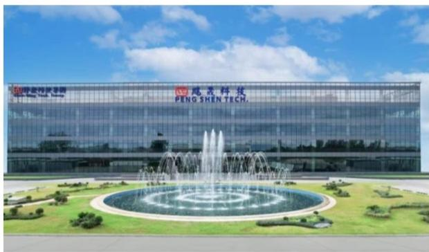  
Source: Company data

Exhibit 2: Avary Thailand Campus  
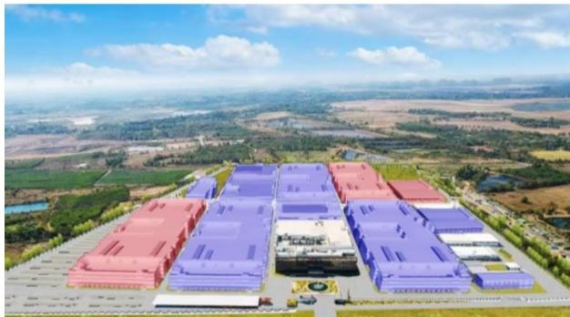  
White: completed; Purple: under construction; Red: planned.  
Source: Company data

**Victory Giant (300476.SZ)**: Victory Giant has three Thailand factory sites: A1, A2, and A3. A1 is already in mass production, and A2 is under construction, with the company aiming to start mass production in 3Q26. Key discussions focused on the company's Thailand capacity expansion progress, Thailand production efficiency, opportunities and challenges. Overall, management noted that the company's Thailand capacity expansion diversification is on track, and is positive on expanding high-end PCB products in Thailand sites, enabling the company to better support demand from global-tier clients. Read more: Victory Giant Thailand tour takeaways.

Exhibit 3: Victory Giant Thailand site  
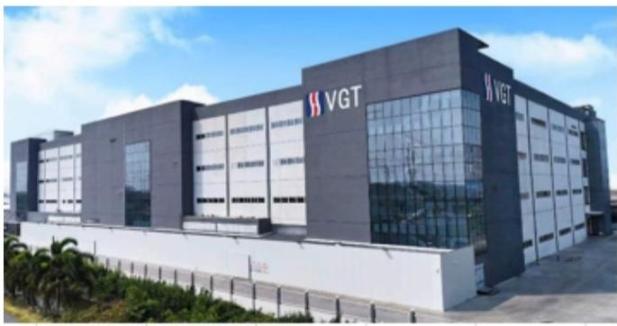  
Source: Company data

Exhibit 4: Victory Giant PCB products  
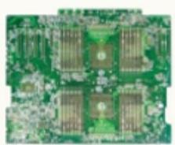  
High-layer-count MLPCB

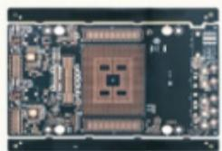  
High-build-up HDI  
Source: Company data

**WUS (002463.SZ)**: Production in Thailand continues to increase with 90%+ utilization rate by 1Q26 and over 70% of their global-tier clients in data communication have completed plant verification, supporting Thailand factories future growth. We remain positive on WUS's leading position in AI networking PCB market, driving product mix upgrade and WUS's profitability. The company's overseas capacity should enable it better capture the rising AI PCB end-demand globally and enhance its product delivery capability amid the geopolitical uncertainties. Read more: WUS Thailand Tour takeaways.

Exhibit 5: WUS AI PCB products  
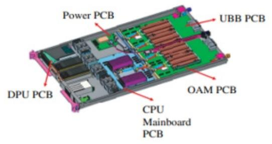  
Source: Company data

Exhibit 6: WUS networking PCB products  
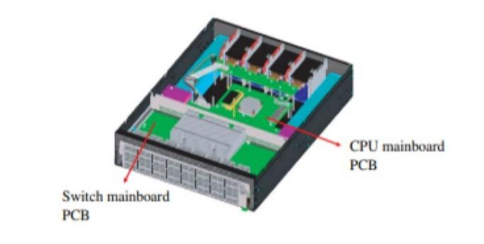  
Source: Company data

**FII (601138.SS)**: Management remains positive on the AI capex upcycle, and highlighted their competitive advantages in strong R&D, fully automated production, comprehensive offerings (components, servers, switches), and diversified production sites. The company has been in Vietnam for over 15 years, with strong production experience, low depreciation costs, close networking across supply chain, customers, and authorities. Capacity expansion in Vietnam is ongoing, which is for AI infrastructure, requested by customers, echoing our positive view on FII's leading market position. Read more: FII Chairman & Vietnam factory tour takeaways.

Exhibit 7: FII server solution  
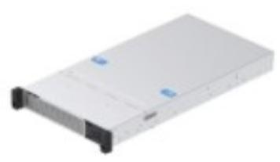  
Source: Company data

Exhibit 8: FII thermal solution  
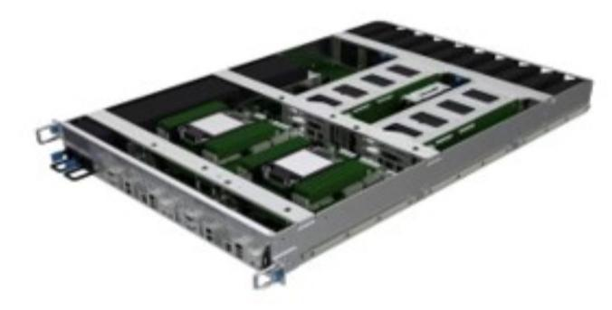  
Source: Company data

**Dynamic Electronics (603175.SS)**: Key discussions focused on Thailand production sites expansion plan, PCB product mix, upstream material supply, Thailand production's opportunities and challenges. Overall, management is positive on rising capex spending on the company's Thailand production sites at Rmb3.3bn, which is mainly used for new capacity of P5 and P5A factories, targeting AI PCB products for AI servers, optical transceivers. Despite margin pressures on higher material cost and new capacity ramp up, management expects to see improving profitability ahead with scale expansion, PCB mix upgrade, and improving production efficiency. Read more: Dynamics Chairman and Thailand PCB factory visit takeaways.

Exhibit 9: Dynamic Electronics production site  
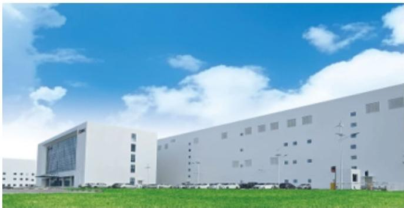  
Source: Company data

Exhibit 10: Dynamic Electronics Thailand campus  
  
Source: Company data

**Delton (001389.SZ)**: The company announced an investment plan of US$80m towards its subsidiary in Thailand in Apr 2026 (link), aiming to expand its capacity for high-end PCB in Thailand plant and enhancing the company's global market competitiveness. Management mentioned that Delton's Thailand plant mainly serves overseas clients' AI PCB demand, and the utilization rate improvement of Thailand plant supported Delton's strong 1H26 earnings growth. Overall, management expects strong solid growth for its Thailand plant, riding on the rising end-demand and specification upgrades of AI PCB. Read more: Delton Thailand tour takeaways.

Exhibit 11: Delton Thailand production site  
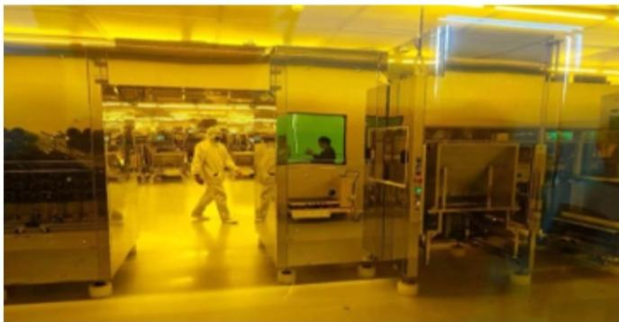  
Source: Company data

Exhibit 12: Delton Thailand production site  
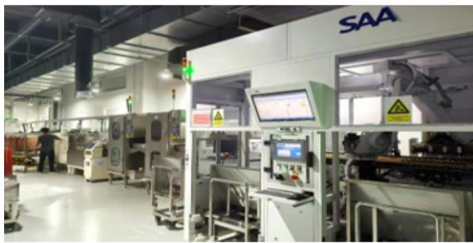  
Source: Company data

**DTech (301377.SZ)**: The company's Thailand plant monthly capacity reached 6m units in Apr 2026 (link), per management, with continuous capacity ramp up expected in 2H26, supporting Dtech's shipments growth and enabling it to capture the rising demand from major clients' overseas plants. Management holds a positive view on the PCB drill demand from major clients' overseas plants, and Dtech is expanding its Thailand plant capacity to capture the demand. Read more: DTech Thailand tour takeaways.

Exhibit 13: DTech Thailand production site  
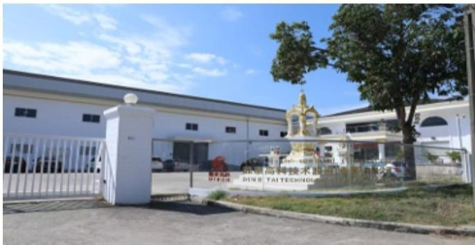  
Source: Company data

Exhibit 14: Dtech Thailand production site  
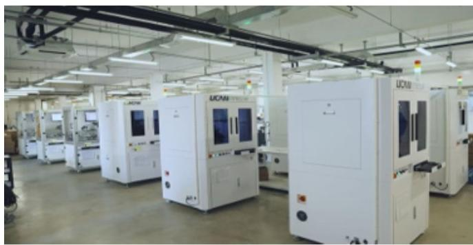  
Source: Company data
