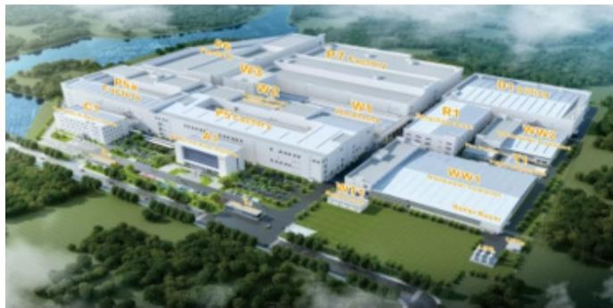

# Southeast Asia Is Becoming the Second Production Spine for AI Infrastructure, Not Just a Diversion Strategy

The most striking finding from a July 2026 tour of ten companies across Thailand and Vietnam is not that capacity is moving. It is that every single facility visited, regardless of how long the company had been operating in the region, was in active expansion specifically for AI infrastructure. This is not a hedging play. It is a structural buildout. The expansion covers the full stack: AI servers, co-packaged optics switches, PCBs for servers and optical modules, optical engines, and edge AI devices. The scale and specificity of this investment tell a clear story: Southeast Asia is no longer an overflow zone for low-end manufacturing. It is becoming the second production spine for the world's most demanding AI supply chain.

The timing matters. The tour took place in July 2026, a moment when the initial geopolitical urgency to diversify had eased since late 2025. Yet companies continued to invest. This suggests that the drivers have shifted from reactive risk management to proactive capacity creation. Customers are not just asking for diversification. They are prepaying and subsidizing equipment to secure that capacity. The report explicitly states that ODMs remain positive on the AI capex upcycle based on customer willingness to fund expansion. That is a signal that demand visibility extends years forward, not quarters.

What follows is an interpretation of what this means for strategy, cost structure, supply chain architecture, and the competitive dynamics that will define the next phase of AI hardware production.

## The Capacity Buildout in Southeast Asia Is Driven by Three Structural Forces, Not Just Geopolitics

The report's first and most emphatic observation is that capacity expansion is universal across the visited companies. But the reasons behind it are more layered than a simple relocation narrative. Three distinct forces are at work, and they reinforce one another.

First, AI demand itself is growing. The report notes that global AI server implied chip shipments estimates were raised by 14 percent, 22 percent, and 14 percent for 2026 through 2028 respectively. This is not incremental growth. It is compound acceleration. Second, specification upgrades are consuming more capacity per unit. AI PCBs with higher layer counts require longer pressing and drilling times. A single advanced server rack now demands more manufacturing throughput than its predecessor. Third, the AI data center is no longer just a GPU rack. It now includes LPU racks, CPU racks, networking racks, storage racks, power racks, and cooling racks. Each of these requires its own PCB, its own assembly, and its own testing. The total number of IT racks supporting AI workloads is expanding the addressable production volume far beyond what a single product category would suggest.

These three forces together mean that even if geopolitical tensions were to fully resolve, the production capacity required to meet AI demand would still need to grow. Southeast Asia is where that growth is being built because mainland China, while still the efficiency leader, cannot absorb the entire incremental volume without creating concentration risk that customers are unwilling to accept.

## The Division of Labor Between Thailand, Vietnam, and Malaysia Is Not Random; It Follows Customer Supply Chains

One of the most actionable insights from the tour is that the choice of country is not arbitrary. It is dictated by which global customer cluster a supplier serves. The report maps this clearly. Vietnam hosts the Microsoft, Dell, and Apple supply chain. This includes Hon Hai, AAC, Wistron, and AVC. Thailand hosts the Google and HP supply chain, with Quanta, Inventec, Celestica, and Auras. Malaysia hosts the Amazon supply chain, with Wiwynn and Chenbro.

This clustering matters for two reasons. First, it means that the ecosystem in each country is becoming self-reinforcing. Suppliers locate near their anchor customers, and those customers attract further suppliers. The result is that a PCB maker serving Google will likely expand in Thailand, while one serving Microsoft will go to Vietnam. Second, it creates logistical advantages that go beyond proximity. Vietnam is only a two-to-three-hour drive from the China border in Guangxi to major production sites in Bac Giang or Bac Ninh. This allows for truck-based logistics rather than air freight, which is faster and cheaper. Thailand, meanwhile, is the largest automotive production hub in Southeast Asia and already has a relatively comprehensive PCB supply chain, which attracts further PCB investment.

For a strategic planner, this means that location decisions should not be made on labor cost or tax incentives alone. The correct question is: which customer cluster do you need to serve, and which country has the existing infrastructure for that cluster?

## Production in Southeast Asia Is for High-Value AI Products, Not Just Low-End Diversion

A common assumption is that overseas factories handle mature, low-complexity products while cutting-edge work stays in mainland China. The tour evidence contradicts this directly. The report states that production sites in Southeast Asia are producing high-value-add products for AI data centers. Companies that are relatively new to the region can still produce the latest products in their China facilities, but the intent is clearly to shift advanced production to Southeast Asia over time.

This is a critical distinction. If Southeast Asian factories were only making legacy products, the strategic implication would be limited. But the report shows that AI PCBs, optical modules for co-packaged optics, and AI server components are being manufactured in Thailand and Vietnam today. The capability exists, even if efficiency is lower. The gap is in productivity, not in technology.

The implication for buyers and observers is that supply chain diversification is no longer a trade-off between security and capability. The capability is already being built. The question is how quickly the efficiency gap can be closed through automation and experience.

## Labor Productivity Is the Binding Constraint, and Automation Is the Only Scalable Solution

The tour revealed a clear and consistent pattern on labor. Costs are lower in Thailand and Vietnam compared to mainland China, but productivity is also lower. The report gives a specific ratio: one worker from mainland China can equal up to three workers from Thailand. This is not a trivial gap. It means that a factory in Thailand needs three times the headcount to achieve the same output, which erodes the labor cost advantage and introduces complexity in training, management, and quality control.

The report also notes that campuses in Vietnam have sizable dormitories for up to 20,000 workers, while most Thai campuses rely on bus transportation. Vietnam has more Mandarin speakers, which reduces training friction. Local workers make up 50 percent or more of the workforce in both countries, and hiring is not difficult, especially in Thailand where workers from Myanmar are employed. Turnover is manageable, and companies offer better compensation and working conditions than local alternatives.

But the real strategic insight is in how companies are responding to the productivity gap. They are not simply accepting lower output. They are adopting more automated production to reduce reliance on workers. They are using generative AI, AR glasses, and digitalization to support training and to duplicate production lines more efficiently when expanding overseas. This is exactly the kind of technology deployment that turns a constraint into a competitive advantage. The companies that master automation in Southeast Asia will not only close the productivity gap but may eventually leapfrog less automated facilities in China.

## The Cost Premium for Southeast Asian Production Is Real but Customers Are Willing to Pay It

The report provides a concrete cost framework. If raw materials such as copper-clad laminate need to be shipped from mainland China, tariffs and transportation can drive total costs up by 15 to 20 percent. Labor costs are lower, but lower productivity offsets much of that benefit. The net result is that production in Thailand or Vietnam can be up to 20 percent more expensive than equivalent production in mainland China.

Yet customers are willing to pay this premium. This is a pivotal data point. It means that the value of supply chain diversification exceeds the cost penalty for these customers. The premium is not a temporary concession. It is a structural feature of the new supply chain architecture. Companies that build capacity in Southeast Asia are not taking a margin hit. They are passing the cost to customers who have already accepted it.

The implication for financial analysis is straightforward. Do not model Southeast Asian production as a cost disadvantage that will shrink over time. Model it as a cost structure that reflects a new equilibrium where geographic diversification is a paid-for feature, not a burden.

## AI Investment Momentum Is Broadening from Hyperscalers to Sovereign and Enterprise Customers

The tour's final takeaway is that the AI capex cycle is not dependent on a narrow set of buyers. The ODMs visited reported that demand from global leading cloud service providers remains strong, but they also see growing demand from model developers, NeoClouds, and potentially from governments through sovereign AI initiatives and from enterprises. The report explicitly states that this broadening customer base offers long-term sustainability for AI infrastructure demand.

Equally important, the ODMs see global leading brand customers working on innovative edge AI devices, including physical AI personal assistants. This suggests that the next wave of AI demand may not come from data centers alone but from distributed edge devices that require their own PCB and assembly capacity. If that materializes, the Southeast Asian factories being built today will be well positioned to serve that demand because they are already being designed for flexibility and scale.

The report also notes that companies see opportunities in using AI itself to improve factory operations. Generative AI tools are being deployed for training, and digital twins are used to replicate production lines. This creates a virtuous cycle: AI demand drives factory expansion, and those factories use AI to become more efficient, which in turn makes further expansion more economical.

## Decision Framework: How to Evaluate a Supplier's Southeast Asia Strategy

Based on the evidence from this tour, a structured evaluation of any PCB, networking, or AI server supplier with Southeast Asian operations should consider five factors.

First, assess the alignment between the supplier's location and its customer base. A supplier in Thailand serving Google is in a stronger position than one in Thailand serving Microsoft, because the supply chain ecosystem in Thailand is built around Google and HP. Mismatch creates logistical friction.

Second, evaluate the product mix in the overseas facility. If the factory is only producing legacy products, the supplier is not building capability for the future. The tour shows that advanced AI products are being made in Thailand and Vietnam today. A supplier that cannot do this is falling behind.

Third, measure the automation trajectory. The productivity gap is real, but it is also solvable. Suppliers that are investing in automated production, AI-assisted training, and digital line duplication will close the gap faster than those relying on manual labor scale.

Fourth, understand the customer willingness to pay. The 20 percent cost premium is a structural feature, not a bug. Suppliers that have secured customer commitments to absorb this premium have a more predictable revenue and margin profile.

Fifth, track the capacity expansion timeline. The report shows that companies are adding capacity in phases, with new factories coming online in 2026 and beyond. A supplier that is still in the planning stage while peers are in mass production will lose market share in the fastest-growing segment of the market.

These five factors provide a lens for distinguishing between suppliers that are building a durable competitive advantage in Southeast Asia and those that are merely reacting to pressure.

*For informational purposes only. Portions may be generated, translated, summarized, or edited with AI assistance based on source materials and may contain omissions or errors. Please verify independently. This is not investment, legal, tax, accounting, or other professional advice.*

For informational purposes only. Portions may be generated, translated, summarized, or edited with AI assistance based on source materials and may contain omissions or errors. Please verify independently. This is not investment, legal, tax, accounting, or other professional advice.

