# Porsche AG (P911_p.DE)

# 预计第二财季表现稳健，成本优化持续推进，911车型组合有望抵消下一年度销量变化；维持积极看法

P911_p.DE

12个月目标价：€57.00

当前价：€45.13

潜在空间：26.3%

预计第二财季表现稳健，与我们近期提出的积极研究观点一致：我们预计公司该季度息税前利润为7.85亿欧元（对比市场一致预期5.86亿欧元），对应利润率8.5%（市场一致预期6.6%）。我们估计，拨备转回与额外重组成本的净影响约为5000万欧元正面效应，推动利润率高于全年5.5-7.5%的指引区间。从基础业务看，我们预计该季度将受益于911车型组合的改善，这与我们的积极观点相符。

自我们上调评级以来，成本优化动能正在增强：自6月11日我们上调评级后，公司对外沟通及媒体报道均指向成本优化步伐加快，第二项人员优化方案已接近敲定，规模可能等于或大于第一项（涉及约3,900人，占员工总数41,800人），由此产生的重组成本预计将被拨备转回完全抵消。市场讨论中关于将Cayenne生产从布拉迪斯拉发迁至保时捷自有莱比锡或祖文豪森工厂的消息，表明在10月7日资本市场日之前，公司正进一步推进精简。

911平均售价可能进一步走高，抵消销量下降的影响：我们将2027财年销量同比预期下调至-11%（此前为-2%），2026财年维持-10%不变，主要考虑到相关市场环境变化及燃油版Macan停产对销量的影响，但我们认为911的强势表现是一个持续被低估的抵消因素。我们现在将2027财年的定价提升与车型组合因素一并纳入考量，将911平均售价增速预期上调至+8%（此前约为5%），并计入约1,000辆备受关注的911 GT2 RS车型，其平均售价约为47.5万欧元。

下调近期销量预期，但大部分被车型组合因素抵消：我们将保时捷2026/27/28财年每股盈利预测分别调整+2.4%/-2.2%/-2.9%，以反映我们对销量、成本举措及911平均售价组合（受GT2车型推动）的最新看法。我们基于2027/28财年混合每股盈利预测2.87欧元，以20倍市盈率得出12个月目标价57欧元（此前为59欧元）。我们维持积极看法。

Christian Frenes  
+44(20)7051-8641 | christian.frenes@gs.com  
GS International

Robert Triulzi  
+44(20)7552-2281 | robert.triulzi@gs.com  
GS International

Monika Mengting Liu, CFA +44(20)7051-7601 | monika.liu@gs.com GS International

## 关键数据

GS预测

<table><tr><td colspan="5">GS预测</td></tr><tr><td></td><td>12/25</td><td>12/26E</td><td>12/27E</td><td>12/28E</td></tr><tr><td>营收（百万欧元） 新</td><td>36,272.0</td><td>36,038.7</td><td>35,677.8</td><td>37,601.6</td></tr><tr><td>营收（百万欧元） 旧</td><td>36,272.0</td><td>36,038.7</td><td>37,115.6</td><td>38,862.1</td></tr><tr><td>息税前利润（百万欧元）</td><td>413.0</td><td>2,284.4</td><td>3,034.9</td><td>4,036.0</td></tr><tr><td>每股盈利（欧元） 新</td><td>0.47</td><td>1.84</td><td>2.46</td><td>3.27</td></tr><tr><td>每股盈利（欧元） 旧</td><td>0.47</td><td>1.79</td><td>2.52</td><td>3.37</td></tr><tr><td>市盈率（倍）</td><td>100.2</td><td>24.5</td><td>18.3</td><td>13.8</td></tr><tr><td>股息率（%）</td><td>2.1</td><td>2.7</td><td>2.9</td><td>3.3</td></tr><tr><td>投入资本回报率（%）</td><td>10.3</td><td>8.7</td><td>9.9</td><td>10.4</td></tr><tr><td>净债务/息税折旧摊销前利润（倍）</td><td>1.1</td><td>0.9</td><td>0.7</td><td>0.4</td></tr><tr><td></td><td>3/26</td><td>6/26E</td><td>9/26E</td><td>12/26E</td></tr><tr><td>每股盈利（欧元）</td><td>0.44</td><td>0.64</td><td>0.28</td><td>0.96</td></tr></table>

GS因子画像

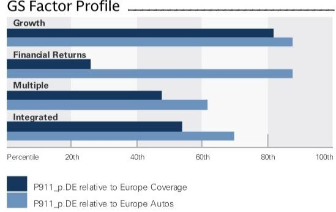  
来源：公司数据，GS预测。详情请参阅披露信息。

## 保时捷（P911_p.DE）

积极

自2026年6月11日起的评级

比率与估值

<table><tr><td></td><td>12/25</td><td>12/26E</td><td>12/27E</td><td>12/28E</td></tr><tr><td>企业价值/销售额（倍）</td><td>1.4</td><td>1.3</td><td>1.3</td><td>1.2</td></tr><tr><td>企业价值/息税折旧摊销前利润（含租赁）（倍）</td><td>8.5</td><td>7.3</td><td>6.4</td><td>5.4</td></tr><tr><td>企业价值/息税折旧摊销前利润（不含租赁）（倍）</td><td>8.5</td><td>7.3</td><td>6.4</td><td>5.4</td></tr><tr><td>企业价值/息税前利润（倍）</td><td>120.4</td><td>20.8</td><td>15.4</td><td>11.2</td></tr><tr><td>市盈率（倍）</td><td>100.2</td><td>24.5</td><td>18.3</td><td>13.8</td></tr><tr><td>自由现金流回报表现（%）</td><td>0.8</td><td>1.5</td><td>4.9</td><td>6.9</td></tr><tr><td>股息率（%）</td><td>2.1</td><td>2.7</td><td>2.9</td><td>3.3</td></tr><tr><td>企业价值/总投入资本（倍）</td><td>0.9</td><td>0.8</td><td>0.7</td><td>0.7</td></tr><tr><td>投入资本回报率（%）</td><td>10.3</td><td>8.7</td><td>9.9</td><td>10.4</td></tr><tr><td>已投资本回报率（%）</td><td>1.0</td><td>5.3</td><td>7.1</td><td>9.6</td></tr><tr><td>资产回报率（%）</td><td>0.5</td><td>2.9</td><td>3.8</td><td>4.9</td></tr><tr><td>库存周转天数</td><td>61.1</td><td>60.1</td><td>59.6</td><td>57.8</td></tr><tr><td>资产周转率（倍）</td><td>2.3</td><td>2.2</td><td>2.1</td><td>2.2</td></tr><tr><td>净债务/权益（不含租赁）（%）</td><td>28.6</td><td>24.2</td><td>19.6</td><td>12.4</td></tr><tr><td>资本支出/折旧摊销（%）</td><td>57.5</td><td>96.5</td><td>65.7</td><td>67.2</td></tr><tr><td>自由现金流覆盖股息（倍）</td><td>0.3</td><td>0.6</td><td>1.7</td><td>2.1</td></tr></table>

增长与利润率（%）

资产负债表（百万欧元）

<table><tr><td colspan="5">资产负债表（百万欧元）</td></tr><tr><td></td><td>12/25</td><td>12/26E</td><td>12/27E</td><td>12/28E</td></tr><tr><td>现金及现金等价物</td><td>4,996.0</td><td>6,203.4</td><td>7,913.1</td><td>10,369.9</td></tr><tr><td>应收账款</td><td>1,282.4</td><td>1,673.3</td><td>1,594.1</td><td>1,553.7</td></tr><tr><td>存货</td><td>6,006.4</td><td>5,856.6</td><td>5,785.7</td><td>6,123.6</td></tr><tr><td>金融服务资产</td><td>-</td><td>-</td><td>-</td><td>-</td></tr><tr><td>其他流动资产</td><td>7,653.2</td><td>8,140.9</td><td>8,436.2</td><td>8,737.9</td></tr><tr><td>流动资产合计</td><td>19,938.0</td><td>22,284.7</td><td>24,139.5</td><td>27,195.5</td></tr><tr><td>不动产、厂房及设备净额</td><td>15,702.0</td><td>17,039.1</td><td>17,163.2</td><td>17,169.0</td></tr><tr><td>无形资产净额</td><td>8,243.0</td><td>7,046.0</td><td>5,726.3</td><td>4,602.3</td></tr><tr><td>总投资</td><td>3,710.5</td><td>3,523.4</td><td>3,488.4</td><td>3,453.4</td></tr><tr><td>其他长期资产</td><td>5,121.5</td><td>5,641.3</td><td>6,330.3</td><td>7,034.2</td></tr><tr><td>资产总计</td><td>52,715.0</td><td>55,534.5</td><td>56,847.7</td><td>59,454.4</td></tr><tr><td>应付账款</td><td>3,244.0</td><td>3,568.5</td><td>3,399.5</td><td>3,475.1</td></tr><tr><td>短期债务</td><td>4,908.0</td><td>5,049.0</td><td>5,049.0</td><td>5,049.0</td></tr><tr><td>短期租赁负债</td><td>-</td><td>-</td><td>-</td><td>-</td></tr><tr><td>其他流动负债</td><td>5,968.6</td><td>6,204.4</td><td>5,924.4</td><td>5,924.4</td></tr><tr><td>流动负债合计</td><td>14,120.6</td><td>14,821.9</td><td>14,372.9</td><td>14,448.5</td></tr><tr><td>长期债务</td><td>6,711.0</td><td>7,211.9</td><td>7,987.4</td><td>8,774.7</td></tr><tr><td>长期租赁负债</td><td>-</td><td>-</td><td>-</td><td>-</td></tr><tr><td>其他长期负债</td><td>8,763.0</td><td>8,510.6</td><td>8,390.6</td><td>8,390.6</td></tr><tr><td>长期负债合计</td><td>15,474.0</td><td>15,722.5</td><td>16,378.0</td><td>17,165.3</td></tr><tr><td>负债合计</td><td>29,594.6</td><td>30,544.4</td><td>30,750.9</td><td>31,613.8</td></tr><tr><td>优先股</td><td>--</td><td>--</td><td>--</td><td>--</td></tr><tr><td>普通股权益合计</td><td>22,991.0</td><td>24,891.7</td><td>26,039.7</td><td>27,838.3</td></tr><tr><td>少数股东权益</td><td>129.5</td><td>98.5</td><td>57.3</td><td>2.4</td></tr><tr><td>负债及权益总计</td><td>52,715.1</td><td>55,534.6</td><td>56,847.8</td><td>59,454.5</td></tr><tr><td>金融服务调整</td><td>2,625.4</td><td>2,819.7</td><td>3,028.5</td><td>3,246.8</td></tr></table>

<table><tr><td></td><td>12/25</td><td>12/26E</td><td>12/27E</td><td>12/28E</td></tr><tr><td>总营收增长</td><td>(9.5)</td><td>(0.6)</td><td>(1.0)</td><td>5.4</td></tr><tr><td>息税折旧摊销前利润增长</td><td>(39.7)</td><td>10.6</td><td>13.2</td><td>14.0</td></tr><tr><td>息税前利润增长</td><td>(92.7)</td><td>453.1</td><td>32.9</td><td>33.0</td></tr><tr><td>净利润增长</td><td>(88.0)</td><td>390.1</td><td>6.2</td><td>33.1</td></tr><tr><td>每股盈利增长</td><td>(88.0)</td><td>289.3</td><td>33.6</td><td>33.1</td></tr><tr><td>每股股息增长</td><td>(56.5)</td><td>20.0</td><td>8.3</td><td>15.4</td></tr></table>

价格表现  
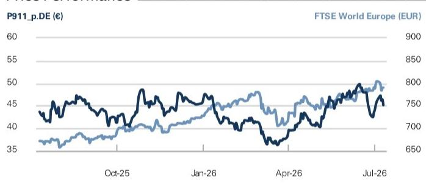

<table><tr><td></td><td>3个月</td><td>6个月</td><td>12个月</td></tr><tr><td>相对表现</td><td>10.3%</td><td>(4.3)%</td><td>1.9%</td></tr><tr><td>相对富时世界欧洲指数（欧元）</td><td>5.5%</td><td>(9.3)%</td><td>(12.6)%</td></tr></table>

<table><tr><td colspan="5">现金流量表（百万欧元）</td></tr><tr><td></td><td>12/25</td><td>12/26E</td><td>12/27E</td><td>12/28E</td></tr><tr><td>净利润</td><td>444.8</td><td>2,977.0</td><td>3,142.8</td><td>4,182.9</td></tr><tr><td>加回折旧摊销</td><td>5,451.0</td><td>4,201.4</td><td>4,305.8</td><td>4,329.0</td></tr><tr><td>加回少数股东权益</td><td>-</td><td>-</td><td>-</td><td>-</td></tr><tr><td>营运资本净变动</td><td>(2,166.4)</td><td>(1,264.0)</td><td>(1,803.1)</td><td>(1,227.6)</td></tr><tr><td>其他经营活动现金流</td><td>(115.6)</td><td>(1,344.0)</td><td>(907.8)</td><td>(1,219.9)</td></tr><tr><td>经营活动现金流</td><td>3,613.8</td><td>4,570.4</td><td>4,737.7</td><td>6,064.5</td></tr><tr><td>资本支出</td><td>(3,136.0)</td><td>(4,056.3)</td><td>(2,828.8)</td><td>(2,910.6)</td></tr><tr><td>收购</td><td>-</td><td>-</td><td>-</td><td>-</td></tr><tr><td>处置</td><td>54.0</td><td>-</td><td>-</td><td>-</td></tr><tr><td>其他</td><td>(670.0)</td><td>8.0</td><td>-</td><td>-</td></tr><tr><td>投资活动现金流</td><td>(3,752.0)</td><td>(4,048.3)</td><td>(2,828.8)</td><td>(2,910.6)</td></tr><tr><td>偿还租赁负债</td><td>(135.0)</td><td>100.7</td><td>118.6</td><td>(300.1)</td></tr><tr><td>已付股息（普通股及优先股）</td><td>(2,095.3)</td><td>(911.0)</td><td>(1,093.2)</td><td>(1,184.3)</td></tr><tr><td>债务净变动</td><td>630.0</td><td>475.0</td><td>775.5</td><td>787.3</td></tr><tr><td>其他融资现金流</td><td>392.3</td><td>1,020.6</td><td>0.0</td><td>0.0</td></tr><tr><td>融资活动现金流</td><td>(1,208.0)</td><td>685.4</td><td>(199.2)</td><td>(697.1)</td></tr><tr><td>现金净变动</td><td>(1,388.2)</td><td>1,207.4</td><td>1,709.7</td><td>2,456.8</td></tr><tr><td>再投资率（%）</td><td>54.3</td><td>69.5</td><td>43.2</td><td>39.9</td></tr></table>

来源：FactSet。价格为2026年7月10日收盘价。  
来源：公司数据，GS预测。

利润表（百万欧元）

<table><tr><td></td><td>12/25</td><td>12/26E</td><td>12/27E</td><td>12/28E</td></tr><tr><td>总营收</td><td>36,272.0</td><td>36,038.7</td><td>35,677.8</td><td>37,601.6</td></tr><tr><td>总营业费用</td><td>(29,136.0)</td><td>(28,488.8)</td><td>(26,873.7)</td><td>(27,973.5)</td></tr><tr><td>研发费用</td><td>(1,329.0)</td><td>(1,233.4)</td><td>(1,300.2)</td><td>(1,426.1)</td></tr><tr><td>其他营业收支</td><td>57.0</td><td>169.3</td><td>(163.2)</td><td>163.1</td></tr><tr><td>息税折旧摊销前利润</td><td>5,864.0</td><td>6,485.8</td><td>7,340.7</td><td>8,365.0</td></tr><tr><td>折旧摊销</td><td>(5,451.0)</td><td>(4,201.4)</td><td>(4,305.8)</td><td>(4,329.0)</td></tr><tr><td>息税前利润</td><td>413.0</td><td>2,284.4</td><td>3,034.9</td><td>4,036.0</td></tr><tr><td>净利息收支</td><td>31.8</td><td>692.6</td><td>107.9</td><td>146.9</td></tr><tr><td>联营公司损益</td><td>-</td><td>-</td><td>-</td><td>-</td></tr><tr><td>处置损益</td><td>-</td><td>-</td><td>-</td><td>-</td></tr><tr><td>其他净额合计</td><td>-</td><td>-</td><td>-</td><td>-</td></tr><tr><td>税前利润</td><td>444.8</td><td>2,977.0</td><td>3,142.8</td><td>4,182.9</td></tr><tr><td>所得税拨备</td><td>(135.0)</td><td>(904.6)</td><td>(942.8)</td><td>(1,254.9)</td></tr><tr><td>少数股东权益</td><td>121.0</td><td>38.9</td><td>41.2</td><td>54.9</td></tr><tr><td>优先股股息</td><td>-</td><td>-</td><td>-</td><td>-</td></tr><tr><td>净利润（扣除非常项目前）</td><td>430.8</td><td>2,111.3</td><td>2,241.2</td><td>2,983.0</td></tr><tr><td>税后非常项目</td><td>-</td><td>-</td><td>-</td><td>-</td></tr><tr><td>净利润（扣除非常项目后）</td><td>430.8</td><td>2,111.3</td><td>2,241.2</td><td>2,983.0</td></tr><tr><td>每股盈利（基本，扣除非常项目前）（欧元）</td><td>0.47</td><td>2.32</td><td>2.46</td><td>3.27</td></tr><tr><td>每股盈利（基本，扣除非常项目后）（欧元）</td><td>0.47</td><td>1.84</td><td>2.46</td><td>3.27</td></tr><tr><td>加权平均流通股数（基本）（百万）</td><td>911.0</td><td>911.0</td><td>911.0</td><td>911.0</td></tr><tr><td>税率（%）</td><td>30.4</td><td>30.4</td><td>30.0</td><td>30.0</td></tr><tr><td>已宣告普通股股息</td><td>911.0</td><td>1,093.2</td><td>1,184.3</td><td>1,366.5</td></tr><tr><td>每股股息（欧元）</td><td>1.00</td><td>1.20</td><td>1.30</td><td>1.50</td></tr></table>

## 近期上调评级后的关键图表

图表1：我们预计近期平均售价将显著提升，受911车型组合成熟推动…… 保时捷911各代车型变体组合  
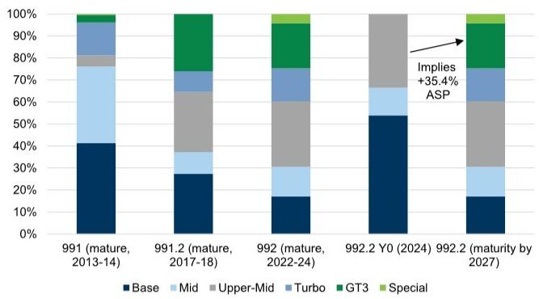  
来源：EEA，GS全球研究

图表2：……而历史上高端车型的爬坡曾受到供应商不可抗力因素的干扰 911车型隐含欧盟平均售价（千欧元）；25-27年GS预测组合  
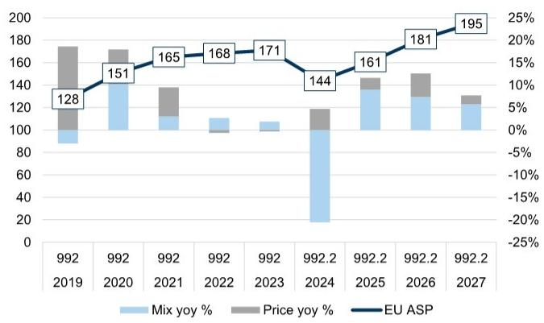  
来源：EEA，ADAC，GS全球研究

图表3：与此同时，我们认为保时捷在销售及管理费用方面有较大优化空间…… 保时捷销售及管理费用（百万欧元）及占营收比例（%）  
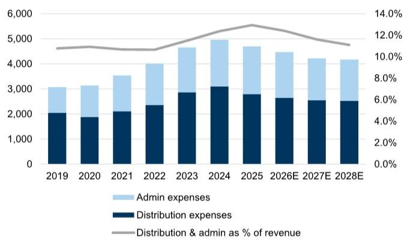  
来源：公司数据，GS全球研究

图表4：……该比例明显高于行业内的高端及豪华同行 各车企销售及管理费用占营收比例  
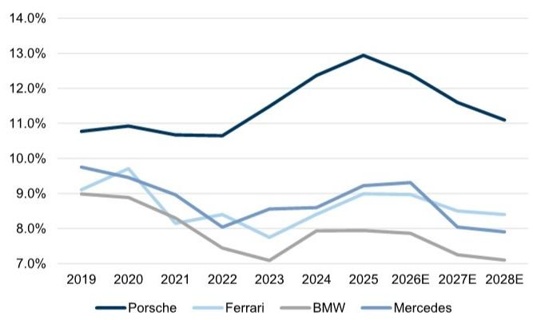  
来源：公司数据，GS全球研究

图表5：我们预计近期主要依靠价格/组合及销售管理费用举措来抵消；中期则期待销量恢复 26E至30E GS预测汽车业务息税前利润分解  
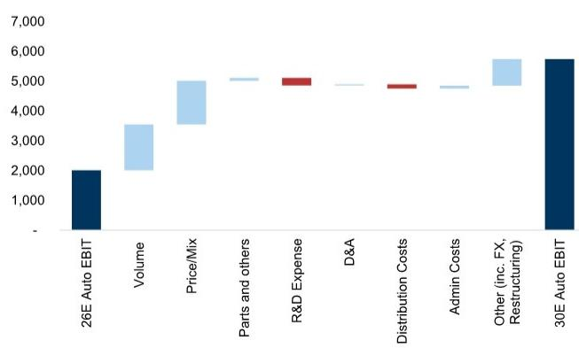  
来源：公司数据，GS全球研究

图表6：我们认为保时捷多年期的每股盈利恢复路径，在近期内可支撑其估值溢价 两年远期每股盈利（左轴，欧元）；两年远期市盈率及历史中位数（右轴）；虚线为基于GS预测每股盈利、目标价及隐含市盈率  
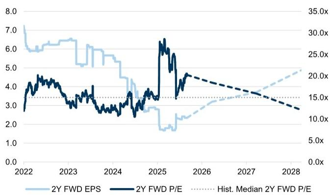  
来源：彭博，GS全球研究

## 成本优化动能加速，911有望进一步抵消下一年度销量下降

我们于6月11日将保时捷评级上调至积极，强调尽管存在结构性挑战，但盈利修正仍有上行空间，且我们认为这些因素已在当前报价中得到较大程度的反映。我们的差异化观点集中于两个被低估的近期抵消机制：i) 911车型组合正常化推动平均售价提升，以及ii) 间接成本削减，主要体现在销售及管理费用方面。自6月11日以来，重要的消息面及公司对外沟通均表明成本优化动能正在加速，同时911持续表现强劲，进一步支持了我们的观点。

## 成本优化动能加速，进展符合我们的积极观点

## 第二项人员优化方案接近敲定

在我们上调评级时指出的若干进展，此后已由公司处理或见诸媒体报道，进一步强化了我们对复苏的看法。我们曾指出，保时捷CEO可能会推动另一项人员优化方案，根据最新管理层指引，该方案现已接近敲定，市场讨论表明其规模可能等于或大于第一项方案（涉及约3,900人，占截至2025财年员工总数41,800人）。在第二财季业绩预告电话会上，管理层强调公司2026财年将额外产生约3亿欧元的重组成本，使扣除关税影响后的总额达到12-13亿欧元。然而，这些额外影响将被2025财年计提的供应商成本拨备转回完全抵消，该拨备金额超出预期。

虽然这些额外重组的细节尚未公布，但我们认为相关成本很可能与正在谈判的第二项人员优化方案有关。近期《商报》的一篇文章支持了这一观点，文中提到保时捷已裁减三个高级销售领导职位并整合职责，同时进一步证实一项涉及约4,000人额外裁减的人员方案已进展顺利，且仍有进一步空间。我们认为这些进展具有建设性，支持了我们的观点，即保时捷新管理层将着力于间接费用及销售管理费用基础，这些费用相较于历史水平和同行已明显偏高。

图表7：与此同时，我们认为保时捷在销售及管理费用方面有较大优化空间…… 保时捷销售及管理费用（百万欧元）及占营收比例（%）  
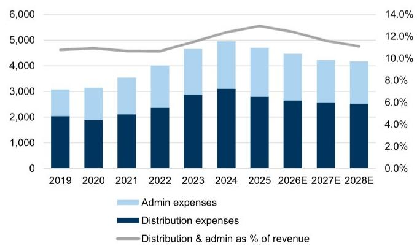  
来源：公司数据，GS全球研究

图表8：……该比例明显高于行业内的高端及豪华同行 各车企销售及管理费用占营收比例  
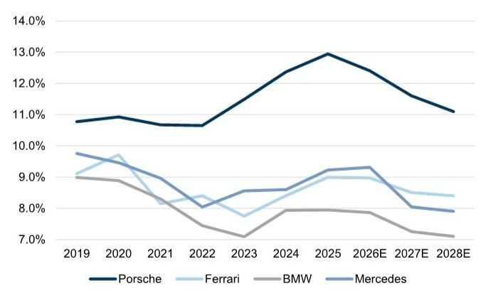  
来源：公司数据，GS全球研究

## Cayenne可能迁至保时捷自有工厂

我们在上调评级时还指出，Cayenne的生产可能从大众旗下的布拉迪斯拉发迁至保时捷自有莱比锡或祖文豪森工厂。随后《商报》的一篇文章称，保时捷CEO正在积极权衡这一决定。虽然该决定及其可能的损益影响更适合视为中期利好，但我们认为这些考虑是成本举措和公司精简步伐加速的又一积极信号，尤其是在10月7日资本市场日即将到来之际。

图表9：保时捷拥有制造灵活性，仅拥有祖文豪森和莱比锡工厂，且在中国没有生产。公司近期还退出了奥斯纳布吕克 保时捷产品、平台及生产基地  
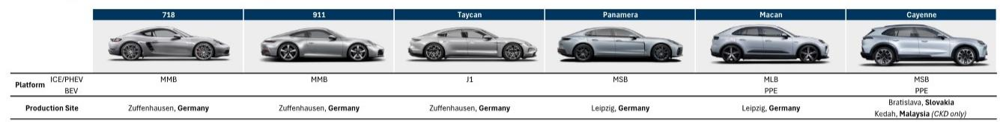  
来源：公司数据，GS全球研究

## 911平均售价有望走高，GT2车型将抵消2027/28财年销量下降

## 基于中国市场及产品发布信息，进一步下调近期销量预期

我们进一步下调近期销量展望，因中国市场最新动态及管理层评论表明近期销量降幅大于此前预期。我们现在预计2026/27财年销量分别下降-10%/-11%（此前为-10%/-2%）。特别是，随着已有14年历史的燃油版Macan于今夏停产，我们预计该车型的销售将在2027财年结束，而考虑到宏观环境，eMacan不太可能显著替代这一业务。在新产品发布方面，我们现在预计新款燃油版Macan要到2028年才能开始有效爬坡，纯电718将于2028年底推出，燃油版718则要到2029年与新K1一同推出，这将对近期营收预期构成压力。

图表10：保时捷已表示近期销量将受到下降的影响…… 按车型分类的交付量（左轴，辆）；单车营收（右轴，千欧元）  
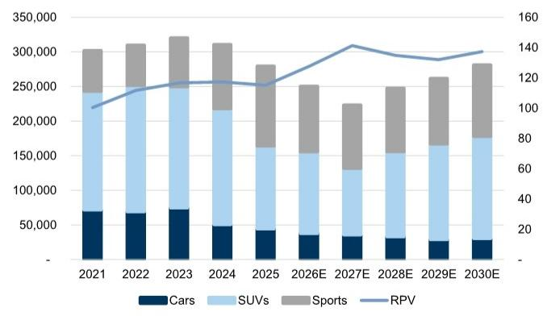  
来源：公司数据，GS全球研究

图表11：……而调整效应在2025财年显著影响了盈利能力 集团营收（百万欧元，左轴）；集团息税前利润率（占营收百分比，右轴）  
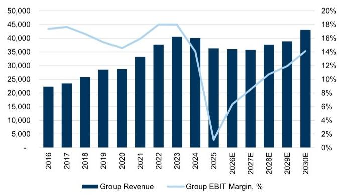  
来源：公司数据，GS全球研究

## 911定价及特别版车型将抵消2027财年销量影响

我们认为有两个关键因素持续被低估，可作为近期销量影响的抵消机制，尽管我们进一步下调销量预期对盈利预测构成了额外拖累。首先，如我们在上调评级时所述，最新一代992.2 911车型的成熟——根据历史代际规律，我们预计将在2027财年成熟——有望显著提升911车型的平均售价。我们对此分析进行了修订，将保时捷对911系列的定价提升纳入2027财年考量（此前仅考虑组合效应），将2027财年平均售价增速预期从此前的约5%上调至+8%。其次，我们计入了1,000辆（2027/28财年分别为800/200辆）尚未发布但备受讨论且近期有媒体报道的911 GT2 RS车型，这是992.2代中最高质量的专属911车型，GS预测平均售价为47.5万欧元。我们还注意到，类似于918 Spyder（2013-15年销售）的超级跑车有可能发布，但我们未将其纳入预测。我们认为这两个因素是近期的抵消机制，且我们认为读者对此仍认识不足。

图表12：992.2发布年份组合与先前代际成熟组合的差异，显示了不可抗力因素造成的干扰 保时捷911各代车型变体组合  
  
来源：EEA，GS全球研究

图表13：假设组合在2027年成熟，我们预计2026/27财年911平均售价将分别提升约12%/8% 基于欧盟注册数据和ADAC定价数据的保时捷911隐含欧盟平均售价（千欧元）；25-27年使用GS预测，假设组合在2027年成熟  
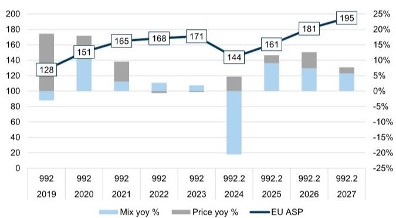  
来源：EEA，ADAC，GS全球研究

特别版相对基础车型的增量价格（千欧元，左轴
