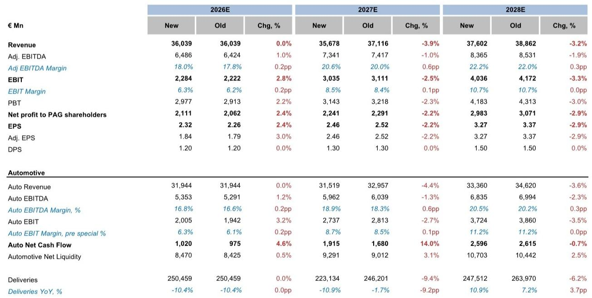
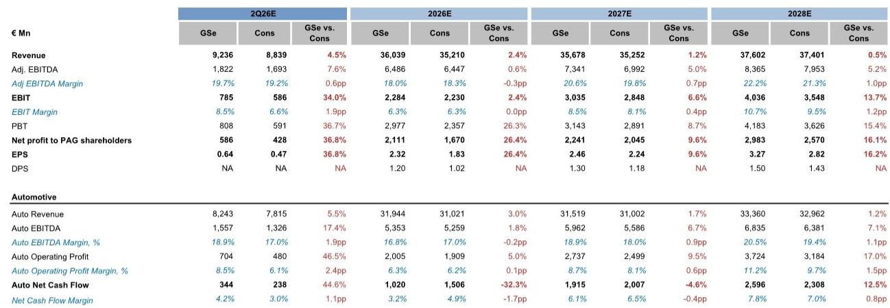
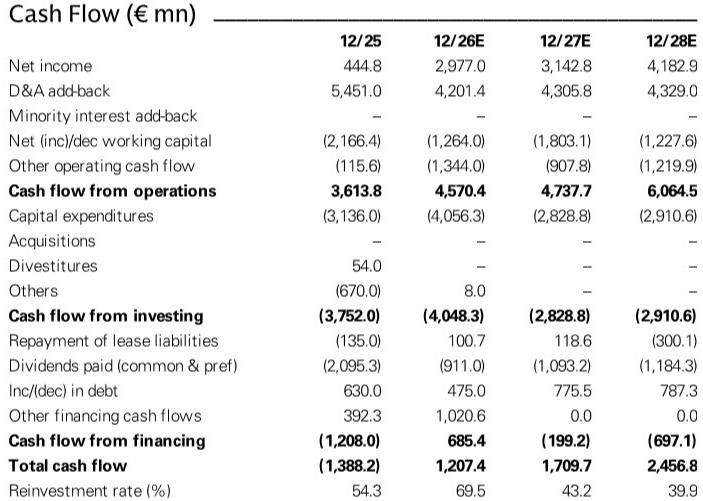

# Porsche's Earnings Inflection Is Real: Cost Momentum and 911 Pricing Power Will Override a Steeper Volume Decline

Porsche AG is approaching its second-quarter 2026 earnings report with a structural story that observers have been slow to price. The company is expected to report an EBIT of EUR 785 million against a visible-alpha consensus of EUR 586 million, implying an 8.5% margin versus the consensus estimate of 6.6%. That gap is not an anomaly. It reflects a deliberate, company-driven acceleration of restructuring activity and a product mix shift that is still being underestimated by the market.

The core tension in the Porsche equity story has been clear since late 2025: volumes are falling, but earnings power is not collapsing proportionally. The market has treated the volume decline as the dominant variable. The evidence now suggests that the offset mechanisms—cost restructuring and 911 average selling price (ASP) expansion—are gaining force faster than consensus expects, and they are doing so in a sequence that makes the second quarter a critical inflection point.

What matters now is not whether Porsche can grow unit sales. It cannot, at least through FY27. What matters is whether the earnings-per-share trajectory can decouple from the volume trajectory. The data on cost momentum, 911 mix maturation, and the specific financial mechanics of the current quarter all point to an affirmative answer.

## The Second Quarter Will Deliver an EBIT Surprise Because of a Net Positive Provision Dynamic, Not Just Operating Momentum

Porsche's 2Q26 EBIT of EUR 785 million is not simply a function of better car sales. The quarter includes a net EUR 50 million positive effect from the combination of a provision reversal and additional restructuring costs. That net benefit lifts the reported margin above the 5.5-7.5% full-year corridor, which is itself a signal. The company is willing to take restructuring charges now because it has a provision cushion from prior supplier cost bookings that came in above expectations.

This is not accounting manipulation. It is a deliberate sequencing decision. Porsche booked higher-than-expected supplier cost provisions in FY25. Those provisions are now being unwound in FY26 precisely as the company accelerates headcount reduction and factory streamlining. The net effect is that restructuring becomes cash-flow-neutral or even margin-accretive in the near term, while the structural cost base improves for the medium term.

The underlying operating performance in the quarter will also benefit from an improving 911 mix, consistent with the thesis that the model cycle is maturing into its highest-value variants. The combination of a provision-related tailwind and a genuine mix improvement means the 2Q26 result will likely reset observer expectations about what Porsche can earn even as volume declines continue.

## Cost Momentum Has Accelerated Since Mid-Year, With a Second Personnel Package Likely Larger Than the First

When Porsche was upgraded to Buy on 11 June, the thesis included the expectation that management would push for another personnel reduction program. That expectation has now been confirmed. Management has indicated on the 2Q26 pre-close call that the company will incur an additional EUR 300 million in restructuring costs for FY26, bringing total ex-tariff restructuring to EUR 1.2-1.3 billion. Critically, these additional costs will be fully offset by the unwind of the supplier cost provisions.

The second personnel package is close to finalization, and market discussion suggests it could be equal to or larger than the first package, which covered approximately 3,900 of Porsche's 41,800 employees. A Handelsblatt report has corroborated that Porsche has already cut three senior sales leadership roles and consolidated responsibilities, while a package of approximately 4,000 additional cuts is well advanced with room for further action.

The significance goes beyond headcount numbers. Porsche's SG&A expense as a percentage of revenue sits materially above both premium and luxury automotive peers. The company has acknowledged this bloat, and the current management team is acting on it with unusual speed. The 7 October Capital Markets Day will be the venue where the full scope of the cost program is likely laid out, but the direction of travel is already clear.

## The 911 Model Cycle Is Entering Its Most Profitable Phase, and the GT2 RS Will Add a High-Margin Volume Tailwind

The most underappreciated element of the Porsche earnings story is the 911 ASP trajectory. The model cycle is maturing into its highest-value variants. Historically, the 911 mix has been burdened by supplier force majeure events that disrupted the top-end ramp. Those disruptions are now behind the company, and the mix is normalizing toward higher-priced derivatives.

The analyst has revised FY27 911 ASP growth to +8% from approximately +5% previously, and this revision includes approximately 1,000 units of the widely discussed 911 GT2 RS at an ASP of EUR 475,000. That single variant adds a material earnings contribution because it carries disproportionately high margins. The GT2 RS is not a volume car; it is a profit-pool car.

This ASP expansion is critical because it offsets a steeper volume decline. The analyst has cut FY27 volume growth to -11% year-on-year, from -2% previously, reflecting China weakness and the production stop of the internal-combustion Macan. The FY26 volume estimate is unchanged at -10%. The combination of lower volumes and higher per-unit revenue means total revenue will decline only modestly, while EBIT grows.

The implication is that Porsche's earnings power is becoming less dependent on unit sales and more dependent on mix and pricing. That is a fundamental shift in the business model's sensitivity, and it has direct implications for valuation multiples.

## A Potential Cayenne Production Relocation Signals a Deeper Streamlining Agenda Ahead of the Capital Markets Day

Beyond the personnel reductions, there is a structural cost initiative that has received less attention but carries significant medium-term implications. Porsche is actively considering relocating Cayenne production from the Volkswagen-owned Bratislava plant to one of its own factories in Leipzig or Zuffenhausen.

This would be a strategically important move for two reasons. First, it would reduce Porsche's dependence on a Volkswagen-owned facility, giving the company greater control over production scheduling and cost structure. Second, it would increase capacity utilization at Porsche's own plants, which are currently underutilized relative to their fixed-cost base.

A Handelsblatt article has confirmed that Porsche's CEO is actively weighing this decision. While the P&L impact would be best viewed as a medium-term benefit, the very fact that it is being considered is a positive signal of the management team's willingness to challenge legacy production arrangements. It reinforces the narrative that cost streamlining is accelerating as the company heads toward the 7 October Capital Markets Day.

## A Decision Framework for Observers: How to Evaluate Porsche's Earnings Path Through FY28

The following framework translates the available data into a structured set of questions that observers can use to assess whether the earnings inflection is sustainable.

**First, assess the cost restructuring trajectory.** The first personnel package covered 3,900 employees. The second package is likely equal or larger. The key question is whether the total reduction reaches a level that brings SG&A as a percentage of revenue closer to the premium peer average. The analyst estimates suggest that the restructuring costs are fully offset by provision unwinds in FY26, meaning there is no net P&L drag from the restructuring itself. The benefit will appear in FY27 and FY28 as the lower cost base flows through.

**Second, monitor the 911 ASP realization.** The FY27 ASP growth assumption of +8% is driven by mix and pricing, including the GT2 RS contribution. The key risk is that the GT2 RS launch is delayed or that mix normalization takes longer than expected. The historical pattern shows that 911 ASP has been suppressed by supplier disruptions; if those disruptions are genuinely resolved, the ASP trajectory should be sustainable. The analyst's FY28 EPS estimate of EUR 3.27 implies a P/E of 13.8x at the current price, which is not demanding if the ASP story holds.

**Third, evaluate the volume decline's composition.** The -11% FY27 volume decline is driven by China weakness and the ICE Macan production stop. The China exposure is a structural headwind that is unlikely to reverse quickly. However, the Macan stop is a one-time event; the electric Macan will eventually replace the volume. The question is whether the electric Macan margins are acceptable. If they are, the volume recovery in FY28 and beyond will be additive to earnings, not just replacement.

**Fourth, watch the Capital Markets Day for cost targets.** The 7 October event is the venue where management is expected to provide medium-term margin targets and cost reduction goals. If the company sets a credible path to restoring EBIT margins toward the 15-17% range, the current valuation would look inexpensive. If the targets are vague or the cost program appears insufficient, the earnings recovery will be slower.

The analyst uses a FY27/28 blended EPS estimate of EUR 2.87 and applies a 20x P/E multiple, yielding a price target of EUR 45.13. The P/E multiple of 20x is above the current forward multiple of 18.3x on FY27 estimates, reflecting the view that the earnings recovery path justifies a premium valuation in the near term.

The critical insight is that the EPS trajectory is improving even as volumes decline. In FY25, Porsche earned EUR 0.47 per share. In FY26, the analyst expects EUR 1.84. In FY27, EUR 2.46. In FY28, EUR 3.27. That is a compound annual growth rate of approximately 90% from FY25 to FY28. No volume growth is required to achieve it. The earnings recovery is driven entirely by cost restructuring and 911 mix improvement. That is the argument for owning the stock, and the second-quarter results will provide the first major test of whether the argument holds.

*For informational purposes only. Portions may be generated, translated, summarized, or edited with AI assistance based on source materials and may contain omissions or errors. Please verify independently. This is not investment, legal, tax, accounting, or other professional advice.*

For informational purposes only. Portions may be generated, translated, summarized, or edited with AI assistance based on source materials and may contain omissions or errors. Please verify independently. This is not investment, legal, tax, accounting, or other professional advice.

