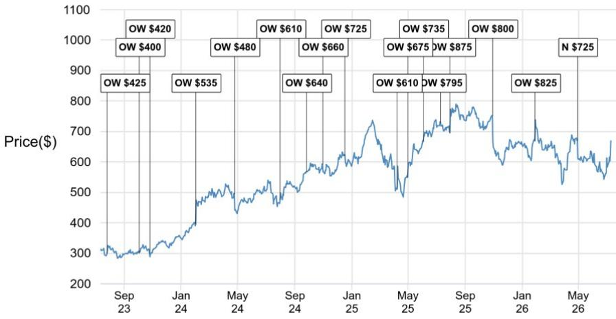
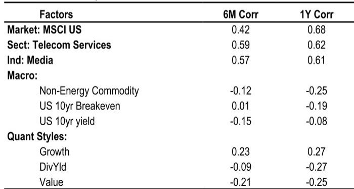
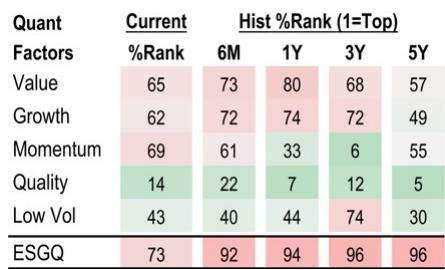

# Meta的AI转型已见成效，但商业化验证才刚刚开始

Meta Platforms重新吸引了市场关注。自2026年6月下旬以来，该公司报价上涨23%，而同期标普500指数上涨3%，这一变化主要源于市场对其人工智能战略预期的显著转变。推动因素不仅仅是新模型的发布，而是一次结构性调整：Meta正从封闭的内部AI路线转向外部商业化，向开发者开放其模型，并表明准备与前沿AI实验室直接竞争。来自Meta MSL部门的多模态推理模型Muse Spark 1.1，标志着在缩小与Anthropic、OpenAI和Google的能力差距方面迈出了重要一步。然而，对于观察者而言，关键问题不在于Meta能否构建有竞争力的模型，而在于Meta能否将模型能力转化为可持续的回报来源，其规模足以支撑预计到2027年将达到2020亿美元的资本支出轨迹。

Meta当前的发展态势中存在一个明显的张力。一方面，公司展示了更快的模型迭代速度、更低的API定价以及将其计算基础设施商业化的意愿。另一方面，预计到2027年，公司的自由现金流将转为负值，从模型优势到企业级应用的路径仍未得到验证。市场定价中包含了乐观预期。但根本性的考验在于三个相互关联领域的执行情况：模型竞争力、企业市场渗透以及资本配置纪律。

## Muse Spark 1.1使Meta更接近前沿，但能力本身并不能创造回报

Meta推出Muse Spark 1.1标志着其模型开发周期的显著加速。在公司通过MSL进行战略调整约一年后，这款多模态推理模型在智能体和编码能力方面展现出显著进步。Meta声称Muse Spark 1.1在多项基准测试中优于Google的Gemini。更重要的是，公司即将推出的Watermelon模型预计将达到GPT 5.5的性能水平。这一发展轨迹表明，Meta不仅仅是在追赶，它正在将自己定位为在报告所称的“个人超级智能”前沿进行竞争。

这一战略意义体现在两个方面。首先，与Anthropic、OpenAI和Google更紧密的竞争定位表明，Meta现在可以可信地参与企业级AI市场，而不仅仅是面向消费者的广告生态系统。其次，持续的模型进步为AI产品周期奠定了基础，该周期可能超越数字广告，延伸至智能体工作流、企业自动化和开发者平台。然而，能力是产生回报的必要但不充分条件。Meta必须证明开发者和企业将基于其平台进行构建，而不仅仅是评估其模型。市场为Meta AI产品付费的意愿将取决于可靠性、生态系统深度和信任度——这些因素公司尚未在大规模上得到验证。

## Meta的API定价策略是进入企业市场的精心设计

Meta的模型API现已进入公开预览阶段，这是公司首次明确的外部AI商业化形式。其定价策略颇具进取性。Meta的收费约为Anthropic和OpenAI领先模型成本的25%。这不是简单的降价，而是一种战略性的市场进入机制，旨在加速开发者采用和企业实验。

其逻辑很直接。通过将价格定在竞争对手的一小部分，Meta降低了开发者的转换成本，并减少了企业试用的风险。公司能够采取这种方式，是因为其核心回报引擎仍然是数字广告。API业务不需要立即盈利就能具有战略价值。它需要产生使用数据、开发者反馈和生态系统锁定。随着时间的推移，随着模型的改进和企业整合的加深，Meta可以上调价格或推出高级服务层级。API回报的稳态运营利润率可能具有吸引力，但前提是规模足够大以覆盖可观的推理成本。

风险在于，低价可能意味着低感知价值。企业可能会将较低成本与较差的可靠性或安全性联系起来，尤其是在受监管的行业。Meta必须通过一致的运行时间、稳健的安全功能和企业级支持来克服这种认知。公司与广告商的现有关系提供了分发优势，但企业AI采购与广告购买是截然不同的领域。早期迹象令人鼓舞，但从试点到生产部署的转化将决定API策略是产生有意义的回报，还是仍然停留在边缘实验阶段。

## 到2027年14GW的计算能力既创造选择权也带来压力

路透社报道称，Meta计划在2026年达到7吉瓦的计算能力，并在2027年弹性较高至14GW。这些数字令人值得注意。作为背景，报告指出，SpaceX与主要AI实验室之间的近期计算交易定价为每瓦30至50美元，显著高于行业平均的每瓦10至20美元的云服务费率。如果Meta能够构建并利用这一能力，它将拥有可与最大规模云服务商相媲美的基础设施。

马克·扎克伯格将这一能力扩张描述为灵活性的体现。Meta目前内部使用其所有计算资源，但公司可以选择通过租赁协议或构建更广泛的云服务产品来将闲置能力商业化。CEO将其描述为如果Meta相对于内部需求过度建设时的“后盾”。这是一种审慎的表述，但也揭示了潜在风险。预计2026年1420亿美元和2027年2020亿美元的资本支出意味着Meta正在押注于其自身AI产品和外部计算服务的巨大未来需求。如果这种需求实现，回报可能相当可观。如果没有，Meta将面临巨大的固定成本和不断贬值的资产。

报告预测，公司的自由现金流将从2025年的470亿美元下降到2026年的14亿美元，并在2027年转为负值，达到负188亿美元。这一轨迹无法无限期持续。Meta必须从其AI投入中产生现金，或者放缓支出。公司通过债务或股权融资的能力提供了缓冲，但报告指出，股价上涨可能重新引发关于股权融资的讨论，类似于Google在2026年6月初的举措。市场只有在看到可见的商业化进展时，才会容忍高额支出。

## 评估Meta AI发展前景的分析框架

对于评估Meta当前状况的观察者而言，关键在于区分三种具有截然不同风险回报特征的场景。第一种场景是，Meta的模型进步和API策略获得动力，带来有意义的企业采用和外部回报。在这种情况下，当前的资本支出轨迹是合理的，盈利上行空间可能很大。第二种场景是，Meta的模型保持竞争力，但未能实现广泛的企业采用，使公司依赖广告回报来证明其AI支出的合理性。在这种情况下，利润率压缩，公司估值倍数降低。第三种场景是，模型开发停滞或竞争对手领先，使Meta的基础设施投入成为沉没资产。

观察者的分析框架应关注三个领先指标。首先，Meta模型API的开发者与企业采用情况：生产部署的数量（而不仅仅是试用账户）将表明低价策略是否有效。其次，Muse Spark 1.1及未来模型在Meta自身产品中的内部使用情况：如果Meta无法有效地将其模型整合到广告和社交平台中，外部客户不太可能信任它们。第三，资本支出相对于回报增长的轨迹：如果资本支出继续以远超回报增长的速度扩张，而没有相应的商业化信号，调整风险就会增加。

报告指出，估值并非低廉，但也并非极端。市场在等待执行证明的同时，给予Meta选择权的认可。

## 商业化验证将定义Meta的下一阶段

Meta已经做到了许多人曾怀疑它无法做到的事情。它重建了AI能力，推出了有竞争力的前沿模型，并开始了外部商业化的进程。公司报价也因此做出了反应。但容易的部分已经过去。下一阶段要求Meta将模型能力转化为可重复的企业回报、开发者生态系统忠诚度，以及其前所未有的基础设施投入的可证明回报。

公司拥有三个不应被低估的优势。其约40亿的用户基础为AI产品提供了无与伦比的分发渠道。其广告业务产生可观的现金流，可以为实验提供资金。其积极定价的意愿为其进入由现有企业主导的市场提供了切入点。但这些优势并非保证。技术平台的历史表明，构建一个出色的模型与围绕它构建一个出色的业务是不同的。Meta现在必须证明它能够两者兼顾。

接下来的十二到十八个月将是决定性的。如果Meta能够证明其API业务正在获得真正的动力，其模型正在被整合到企业工作流中，并且其计算能力正在产生回报，那么其发展前景将大大增强。如果不能，每年2000亿美元资本支出的压力将变得越来越难以合理化。目前，证据令人鼓舞但不完整。Meta已经赢得了作为AI竞争者被认真对待的权利。但它尚未赢得作为AI竞争者被估值的权利。

*仅供参考。部分内容可能基于源材料通过AI辅助生成、翻译、总结或编辑，可能存在遗漏或错误。请独立核实。本文不构成任何专业建议。*

仅供参考。部分内容可能基于源材料通过AI辅助生成、翻译、总结或编辑，可能存在遗漏或错误。请独立核实。本文不构成任何专业建议。

