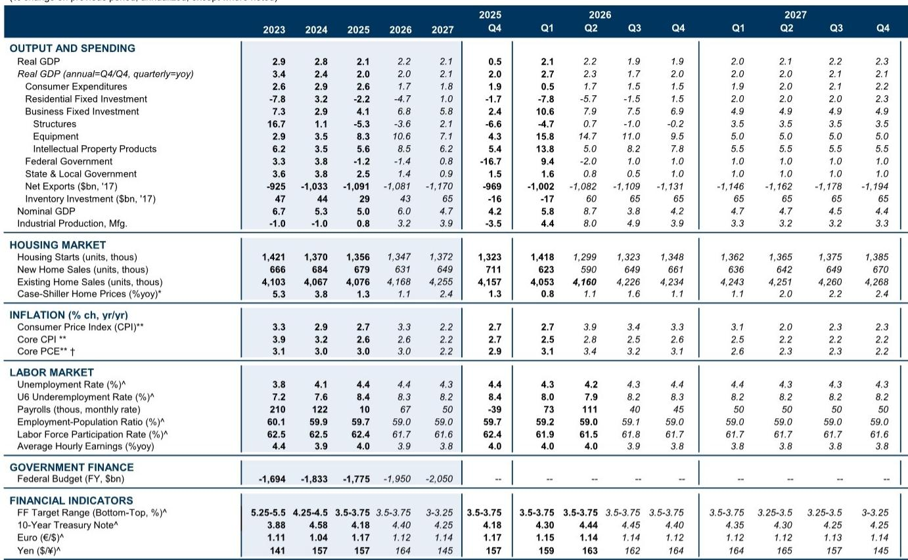
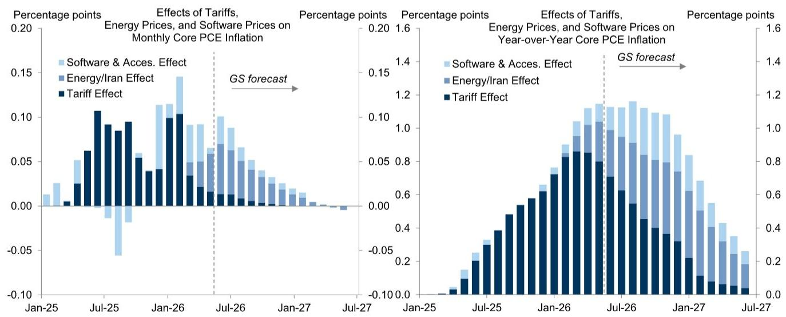
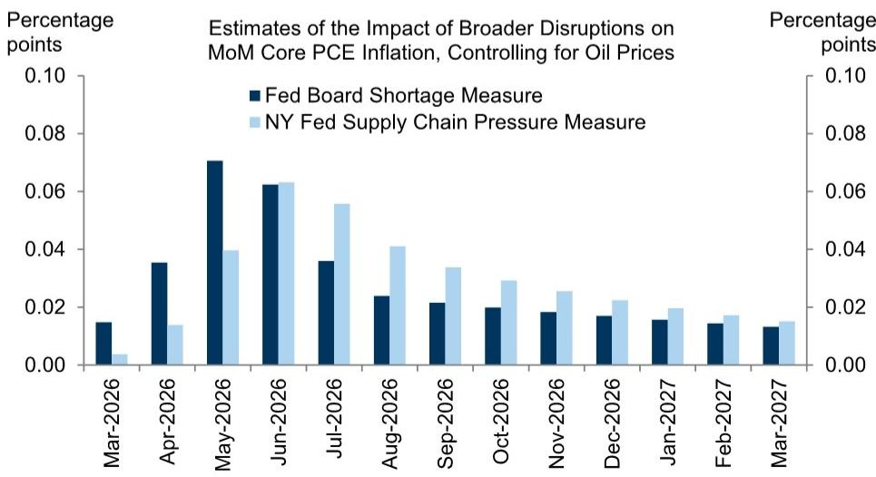

# 中东局势对宏观环境的影响：当前压力已缓解，但后续变化仍需关注

近期美国与伊朗之间的新一轮冲突，引发了市场对霍尔木兹海峡供应中断的担忧。然而，从商品价格数据来看，实际情况并不像标题所呈现的那样令人紧张。在此次局势升级中，原油价格仅温和上涨，目前仍比4月底和5月初的水平低约30%。零售汽油价格已下跌15%，航空燃油价格下跌35%，其他波斯湾出口产品如甲醇和聚乙烯的价格，也已从战时高点大幅回落。尽管航运成本持续上升，但仍远低于2021-2022年的峰值，且仅占美国消费品进口成本的1-2%。冲突带来的直接通胀压力已基本逆转。

这一点之所以重要，是因为美联储正在持续的通胀与放缓的经济之间寻找平衡，而中东局势一直是通胀前景的关键上行风险。对于即将发布的通胀报告以及美联储的政策决策，核心问题不在于已经造成了多少损害，而在于未来还有多少潜在的干扰。基于两个独立的统计模型，答案是：对月度核心通胀的增量影响已在第二季度达到峰值，假设局势不再升级，第三季度将明显下降，第四季度将进一步回落。数据显示，战争冲击的严重程度和持续时间，尚不足以动摇通胀预期，而衡量持续通胀风险的综合指标，仍处于美联储可以容忍的范围内。

然而，这一相对乐观的基线情况，留给美联储的容错空间非常有限。预计今年剩余时间内，核心PCE通胀路径将以每月20-23个基点的速度运行，由于统计方法调整，同比通胀率将在8月降至约3.2%，此后在美联储剩余会议前仅会小幅下降。这一轨迹将使美联储在2026年剩余时间内维持现有政策立场，但这也意味着，任何新的供应冲击——无论是来自中东、关税还是其他来源——都可能将通胀推回需要政策回应的区间。真正的风险不仅在于油价上涨的机械传导，更在于，对于一家已经历多年通胀意外的央行而言，又一次供应冲击所带来的累积心理效应。

## 战争带来的大部分商品价格冲击已经逆转，限制了直接的通胀威胁

冲突通胀影响正在消退的最具体证据，来自商品市场本身。在此次局势升级中，原油价格仅温和上涨，仍比战时峰值低约30%。零售汽油价格已下跌15%，这将有助于6月整体CPI的下降。航空燃油价格下跌35%，将在未来几个月对机票价格产生影响。其他波斯湾出口产品如甲醇、聚乙烯和氮的价格，在战争初期飙升后也已回落；大多数产品现已接近战前水平，尽管硫磺和氨的价格仍处于高位。

航空和海运成本持续上升，但背景因素至关重要。这些上涨既反映了与战争相关的影响，如燃油附加费和网络效率降低，也反映了无关因素，如运力增长有限、海运旺季提前开始，以及强劲的半导体出货量推高航空货运费率。但这些涨幅仍远小于2021-2022年，且对消费者价格的影响应较为温和，因为国际航运成本仅占美国消费品进口成本的1-2%。

自6月27日首次报道原油油轮遇袭事件后，海湾国家的石油流量开始下降，但按7天平均值计算，仍高于低点。全球可见石油总库存在6月中旬触底，此后逐步增加，这表明石油库存虽未得到显著补充，但也并非处于极低水平。商品价格下降、航运成本上涨可控以及石油库存充足，这些因素共同意味着，对消费者价格的直接传导将是有限的。

## 两个统计模型确认：增量通胀影响已在第二季度见顶，下半年将消退

对于即将发布的通胀报告以及美联储而言，一个关键问题是，冲突造成的干扰将对消费者价格产生多大的后续影响。两个独立的统计工具提供了一致的答案：影响已经见顶，并将在未来几个月显著下降。

第一个模型估算了从商品价格到消费者价格的传导，涵盖了成品油差价、对运输成本的影响，以及通过从受油价和天然气价格冲击更严重的其他经济体进口而产生的溢出效应。在基线情景下，该模型假设成品油差价在未来几个月内逐步正常化，运输成本的变化与其与油价的通常关系保持一致。该模型表明，假设冲突不再升级导致能源价格再次上涨，对月度核心PCE通胀的增量影响已在第二季度达到峰值，第三季度将明显下降，第四季度将进一步回落。

第二个模型使用美联储理事会和纽约联储经济学家构建的短缺和供应链压力指标，来估算冲突相关干扰在能源领域之外的更广泛影响。这些指标在与伊朗的战争期间，其上升幅度远小于疫情期间，并且在上周袭击事件发生前，已从峰值显著回落。该模型首先估算这些指标、能源价格和消费者价格之间的历史关系；然后估算自战争开始以来，导致短缺和供应链压力指标出现当前走势的一系列冲击；最后，在控制油价变化影响的情况下，估算这些冲击对消费者价格的影响。该模型也表明，除非局势进一步升级，否则对月度通胀的影响已在5月和6月达到峰值，并将在第三和第四季度大幅下降。

这些结果应被视为对影响时机的第二意见，而非对商品价格传导效应的叠加，因为两种方法之间可能存在大量重叠。但它们的一致性强化了结论：冲突带来的增量通胀影响已经过去，而非尚未到来。

## 战争冲击尚未动摇通胀预期，但累积风险正在上升

美联储官员的一个主要担忧是，长期使通胀居高不下的系列供应冲击，可能对通胀预期构成风险。尽管目前有大量关于通胀预期的数据，但评估这一风险比人们想象的更为复杂，因为各项指标传递的信息不一，且部分指标的可靠性有所下降。

基于市场的通胀补偿指标仍处于低位，似乎正受到美联储官员更多关注。一些消费者通胀预期指标，尤其是密歇根大学的指标，数值较高，但越来越受到质疑，因为消费者调查的回应变得更加政治化，与宏观经济结果的关联性减弱。综合来看，这些趋势意味着，只要冲突不再进一步升级、油价不再面临上行压力，美联储的“共同通胀预期指数”将在第二季度保持在近期范围内，然后略有缓和。这一总体信息不会特别令人担忧。

衡量持续通胀风险的综合指标也传递了类似信息。它捕捉了初始冲击可能引发自我维持的高通胀的几种方式，例如，使企业认为超常规的价格上涨是正常的，推高通胀预期，或启动工资-价格反馈循环。该指标也表明，除非局势进一步升级，否则战争带来的通胀冲击可能尚未严重或持久到足以引发通胀蔓延。

这一前提至关重要。过去几年，美联储已经吸收了多次供应冲击——疫情干扰、乌克兰战争初期的能源冲击、关税，以及现在的中东冲突。每一次冲击都是可控的，但累积效应造成了一种风险：下一次冲击可能成为打破预期的临界点。这不是一个机械的计算；它是一个难以建模的心理阈值。

## 观察框架：通胀路径使美联储维持现有立场，但容错空间极为有限

战争、关税以及AI效应测量偏差对月度核心PCE通胀的综合影响，可能仍会保持温和正值，但在下半年将急剧减弱；而对同比通胀率的影响，则可能在年底前大致保持稳定。将这些影响纳入自下而上的通胀模型，表明月度核心PCE通胀率将在6月达到约24个基点，并在随后的几个月内保持在20-23个基点的区间。同比通胀率可能在8月下降约0.2个百分点至3.2%，届时美国经济分析局将纳入通胀测量的方法调整；但在此之后，预计在美联储2026年剩余会议前，该比率仅会小幅下降。

这一预测的通胀路径将使美联储在2026年剩余时间内维持现有政策立场，但容错空间极小，并可能导致FOMC内部出现一些分歧。对于观察者而言，关键的决策框架是评估局势再次升级的可能性及其潜在影响。如果油价在8月底前回升至每桶100美元并维持到年底，模型表明，这将使未来几个月的月度核心通胀路径提高3-4个基点。这是一个有意义但并非灾难性的增长。

然而，又一次供应冲击对货币政策讨论的影响，可能比单纯的传导数学计算所显示的更为显著。它将加剧人们对已经持续很长时间的系列供应冲击以及难以预知其何时结束的挫败感。它将引发担忧，即这些冲击最终可能足以动摇通胀预期。在这种情况下，美联储的反应函数不仅取决于通胀数据，还取决于关于冲击是暂时性还是结构性的叙事，以及央行的信誉是否面临风险。因此，观察者不仅应关注油价和通胀数据，还应关注美联储沟通的基调以及FOMC内部的分歧程度。容错空间很小，下一次冲击——如果到来——其重要性可能超过数字本身所暗示的。

*仅供参考。部分内容可能基于源材料通过AI辅助生成、翻译、总结或编辑，可能存在遗漏或错误。请独立核实。本文不构成任何专业建议。*
