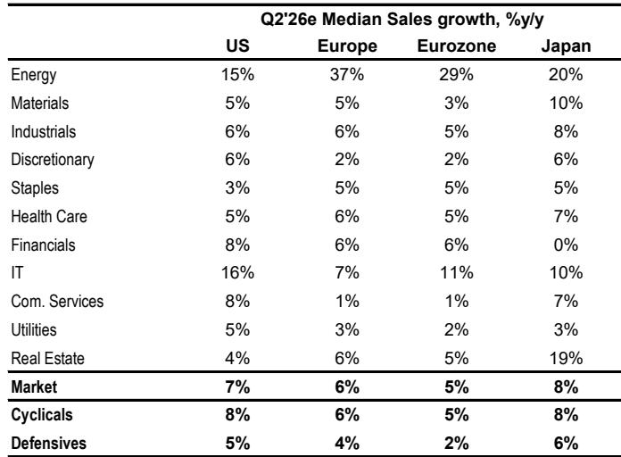
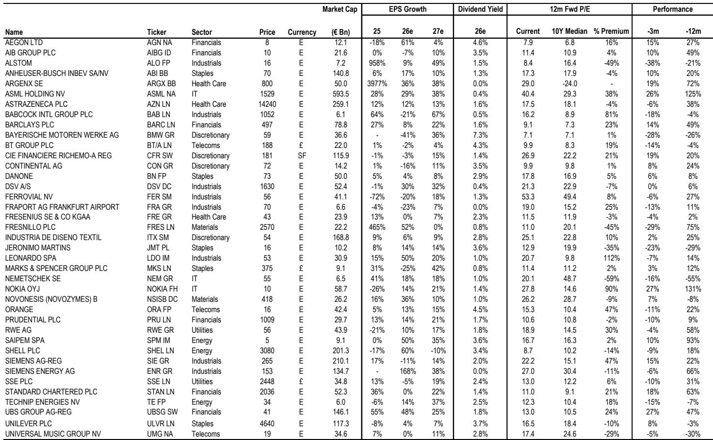
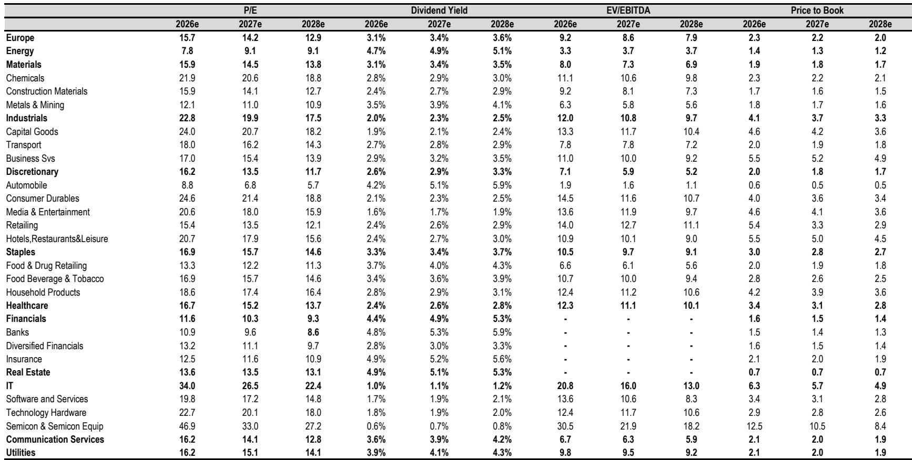

# 业绩预期在财报季前持续上调，而非下调：这是一个积极信号，而非警示信号

读者进入第二季度财报季时，面临一个不同寻常的模式。2026年第二季度的共识业绩预期并未像大多数报告周期那样在结果公布前被下调。相反，它们持续上升。对于标普500指数，共识预期每股收益同比增长约22%，而欧元区约为12%。从表面上看，这些数字似乎较为激进。但剔除少数大盘股扭曲效应后的中位数每股收益增长预测，两个地区均处于更易实现的8%水平。整体数据与中位数之间的差距几乎完全由信息技术领域与人工智能相关的增长以及能源领域的基数效应驱动——去年同期的油价显著较低。这并非分析师过度乐观的迹象，而是基本面真正改善的信号，得到了活跃指标上升、盈利修正范围扩大以及欧洲经济终于显现持久复苏迹象的支持。

2026年第二季度地缘政治不确定性较高，尤其是围绕伊朗冲突。然而，所有地区的2026年全年每股收益预期持续走高。自年初以来，标普500指数2026年每股收益预期上升约7%，而欧洲预期上升约2.5%。这种预期上升并非集中在少数几个行业。在MSCI欧洲指数中，约70%的一级行业年初至今录得净正面盈利修正，这一比例在美国和日本大致相似。即使是普遍被认为面临压力的行业，如非必需消费品，也未出现市场叙事可能暗示的大幅下调。修正的广度至关重要，因为它表明盈利改善是结构性的，而非少数与人工智能相关的个股或油价顺风因素的狭隘功能。

读者的关键问题是，这种财报季前预期上升的模式是否可持续，还是会为失望情绪埋下伏笔。领先指标和宏观数据的证据表明是前者。经合组织领先指标正在加速。欧元区Citi经济意外指数大幅上升，上涨超过85点并进入净正值区域。欧元区信贷增长持续改善。美国初请失业金人数保持韧性。这些指标与盈利进一步上行的前景一致，尤其是周期性行业，历史上它们一直是活跃背景改善的主要受益者。宏观环境不仅具有支撑性，而且正在积极强化盈利修正周期。

本文论证了第二季度财报季很可能确认建设性的盈利前景，盈利领导力的扩大是真实的且仍有空间，读者应将地缘政治头条驱动的任何波动视为增加敞口的机会，而非降低风险的理由。论证分为五个部分。首先，解释为什么预期上升的模式与过去的周期根本不同，以及为什么应将其解读为强势信号。其次，审视支撑盈利前景的行业层面动态，特别关注银行、半导体、能源和消费行业。第三，强调美国和欧洲盈利修正之间的趋同，并解释为什么欧洲的改善可能持续。第四，将这些见解转化为投资组合配置的决策框架。第五，讨论可能破坏建设性前景的风险，并解释为什么基本情景仍然有利。

## 财报季前缺乏下调反映的是真正的基本面改善，而非分析师的懈怠

在典型的盈利周期中，财报季开始前三到四周，随着公司预先公布弱于预期的业绩以及分析师下调预测，通常会有一系列稳步的下调。这种模式降低了门槛，使公司在报告时更容易“超越”预期。当前周期打破了这一模式。负面预公告远低于历史平均水平。预期持续向上漂移。一些读者将此解读为警示信号，认为缺乏下调意味着预期过高，正面惊喜的空间有限。这种解读误解了当前周期的性质。

预期的向上漂移反映了第二季度显现的经济活动的真正改善。欧洲的制造业复苏在2026年初尚属试探性，现已获得动力。欧元区综合采购经理人指数尽管近几个月略有下降，但仍保持在扩张水平之上。欧洲的财政刺激，特别是与国防支出和基础设施投资相关的部分，正在为工业和周期性行业提供顺风。信贷条件正在改善，欧元区银行对私营部门的贷款继续从2024-2025年的低谷复苏。在美国，劳动力市场保持韧性，工业部门受益于与人工智能相关的基础设施和回流投资的持续支出。这些并非短暂因素。它们代表了经济环境的结构性转变，很可能持续到2026年下半年。

美国和欧元区第二季度中位数每股收益增长预测均为8%，这与中期盈利扩张的历史模式一致。这也得到了营收增长前景的支持，美国中位数销售增长预测为7%，欧洲为5%。当前环境下较高的油价，历史上与美国和欧洲公司强劲的营收交付一致。销量改善、某些行业的定价能力以及成本纪律带来的正经营杠杆相结合，意味着利润率可能保持韧性。读者不应将财报季前缺乏下调与过度乐观混为一谈。这些预期是可实现的，宏观数据也支持它们。

## 行业层面动态揭示盈利基础正在扩大，超越信息技术和能源领域

第二季度整体每股收益增长数据受到两个行业的显著影响：信息技术领域，与人工智能相关的盈利推动美国同比增长63%；能源领域，2025年第二季度油价较低的基数效应产生了超过100%的增长率。剔除这两个行业，市场整体增长率在美国从22%降至约11%，在欧洲从12%降至低个位数。这导致一些读者认为盈利改善是狭隘且脆弱的。这种观点是不正确的。盈利改善的广度体现在修正数据中，而不仅仅在预期水平上。

在MSCI欧洲指数中，自2026年1月以来每股收益修正正向变化最大的行业包括必需消费品（改善59个百分点）、原材料（57个百分点）、能源（43个百分点）、房地产（28个百分点）和工业（22个百分点）。这些通常不是由人工智能或油价动态驱动的行业。它们反映了基础业务条件的真正改善。原材料和工业的改善尤其值得注意，因为这些行业与制造业周期和资本支出趋势密切相关。它们的修正已决定性地转为正值，这一事实表明欧洲工业复苏是真实的，并且正在获得动力。

在行业层面，有几个具体动态值得强调。银行可能交出令人安心的业绩，受到高利率环境下净利息收入增加以及贷款增长改善（尤其是在欧洲）的支持。半导体价格表现与盈利之间的差距一直在扩大，如果业绩确认强劲的盈利轨迹，该领域存在反弹潜力。能源行业盈利相对于油价不再显示任何缓冲，这意味着油价的任何进一步上行将直接传导至盈利，而下行风险已被定价。消费行业仍然喜忧参半，美国消费者显示出韧性，而欧洲消费者信心依然低迷。然而，市场可能看穿消费行业的短期疲软，预期2026年下半年将出现转折点，届时实际工资增长改善且通胀继续缓和。

## 欧洲盈利修正已进入明确的正面区域，自2025年初以来首次缩小与美国的差距

当前盈利周期中最重要的发展之一是欧洲盈利修正的改善。自2022年以来的大部分时间里，欧洲每股收益预期持续面临下调，反映了该地区受能源危机、乌克兰战争以及长期经济停滞的影响。这一模式现已逆转。欧元区每股收益修正近几周持续上升，并已进入明确的正面区域。美国和欧元区盈利修正之间的差距已大幅缩小，并即将自2025年初以来首次完全弥合。

这种改善并非昙花一现。它得到了多种因素的支持，这些因素很可能持续到2026年下半年。欧洲的财政背景正变得更具支持性，国防、基础设施和绿色转型支出增加。信贷条件正在改善，欧元区银行报告家庭和企业的贷款需求均有所增强。中国经济的稳定，尽管仍不平衡，正在为欧洲出口导向型行业提供顺风，尤其是在德国和意大利。前提是伊朗冲突不会完全重新升级，欧洲盈利的改善很可能持续，该地区有望在2026年实现强劲的两位数每股收益增长，这与2022-2025年期间的特征——停滞——形成对比。

美国和欧洲盈利修正的趋同对投资组合配置具有重要影响。这表明美国和欧洲股票之间的表现差距——过去几年一直是一个主导特征——可能缩小。欧洲股票相对于美国存在估值折价，如果盈利增长趋同，这一折价应该会收窄。欧洲盈利的改善也为欧元区金融部门提供了顺风，该部门高度暴露于国内经济和利率周期。对于一直低配欧洲的全球读者而言，盈利修正数据提供了重新考虑这一立场的理由。

## 在盈利环境扩大的背景下进行投资组合配置的决策框架

第二季度财报预览的证据为投资组合构建提供了一系列明确的启示。第一个也是最重要的启示是，盈利领导力的扩大是真实的，并且仍有空间。2026年第一季度特征性的极其狭窄的参与度——少数几只超大盘科技股推动了指数层面的大部分回报——正在让位于一个更平衡的环境，更广泛的行业正在为盈利增长做出贡献。这种扩大有利于市场内部结构，并应降低股票市场因单一行业或股票而出现大幅回调的脆弱性。

第二个启示是，周期性行业在2026年下半年可能跑赢防御性行业。经合组织领先指标的加速、信贷条件的改善以及劳动力市场的韧性，都指向一个有利于周期性行业的宏观环境。在周期性行业中，最暴露于制造业周期的行业，如工业、原材料和部分科技领域，提供了最佳的风险回报。银行也处于有利地位，考虑到支持性的利率环境和改善的贷款增长。

第三个启示是，欧洲盈利的改善提供了增加对该地区敞口的理由。美国和欧洲盈利修正的趋同，加上估值折价，表明欧洲股票具有吸引力的上行潜力。欧元区金融部门高度暴露于国内经济和利率周期，是参与这一主题的特别有吸引力的方式。欧洲盈利的改善也为欧元兑美元提供了顺风，这将进一步支持未对冲国际读者的回报。

第四个启示是，读者应将地缘政治头条驱动的任何波动视为增加敞口的机会，而非降低风险的理由。伊朗冲突仍然是一个不确定性来源，但市场已日益擅长将地缘政治风险定价为暂时性的。双方强烈的降级激励，加上经济数据的韧性，表明地缘政治背景在2026年下半年可能改善。由地缘政治头条引发的下跌应被视为买入机会，而非降低风险的信号。

## 可能破坏建设性前景的风险是可控的，基本情景仍然有利

没有哪个盈利前景是没有风险的，当前周期也不例外。最重大的风险是伊朗冲突持续升级，扰乱石油供应或引发更广泛的地区冲突。这种结果将对全球增长、通胀和企业盈利产生重大影响。然而，这并非基本情景。双方避免全面冲突的激励仍然强烈，市场已展现出日益增强的看穿地缘政治噪音的能力。

第二个风险是欧洲经济活动的改善被证明是暂时的。欧洲复苏部分由财政刺激和出口反弹驱动，如果全球需求减弱或财政支持撤回，这两者都可能消退。然而，信贷条件的改善和劳动力市场的韧性表明复苏具有真正的动力。欧洲出现双底衰退的风险似乎较低。

第三个风险是美国科技领域与人工智能相关的盈利繁荣被证明是不可持续的。如果人工智能投资的预期回报未能实现，或者监管阻力出现，该领域可能面临显著回调。然而，盈利改善在科技领域之外的广度意味着，即使该领域出现回调，也不一定会破坏更广泛的市场。美国8%的中位数每股收益增长预测并不依赖于人工智能主题。它得到了广泛行业和改善的宏观环境的支持。

第四个风险是通胀被证明比预期更持久，迫使央行维持甚至提高利率。更高的利率将对股票估值构成阻力，尤其是对长久期成长股。然而，改善的活跃背景和企业盈利的韧性表明，经济可以容忍更长时间的高利率。引发衰退的政策失误风险似乎较低。

总体而言，风险是可控的，基本情景仍然有利。盈利预期上升、活跃指标改善以及行业参与度扩大的结合，为2026年下半年的股票市场提供了坚实基础。关注整体增长数据并得出结论认为预期过高的读者，正在忽略更大的图景。盈利周期正在扩大，机会集正在扩展。第二季度财报季很可能确认这一观点。

*仅供参考。部分内容可能基于源材料通过人工智能辅助生成、翻译、总结或编辑，可能包含遗漏或错误。请独立核实。这不构成投资、法律、税务、会计或其他专业建议。*

仅供参考。部分内容可能基于源材料通过人工智能辅助生成、翻译、总结或编辑，可能包含遗漏或错误。请独立核实。这不构成投资、法律、税务、会计或其他专业建议。

