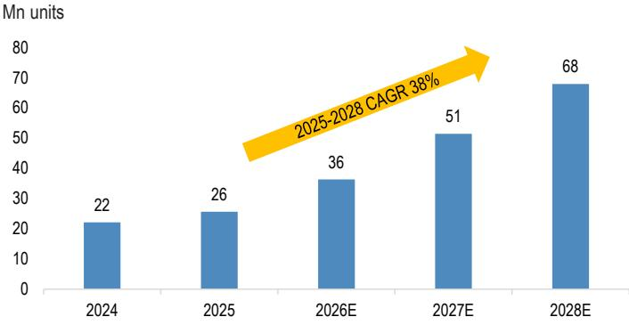
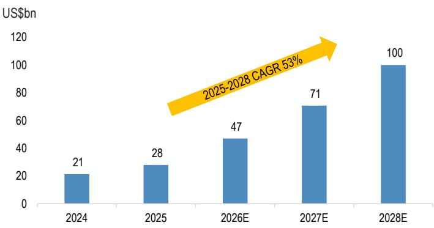
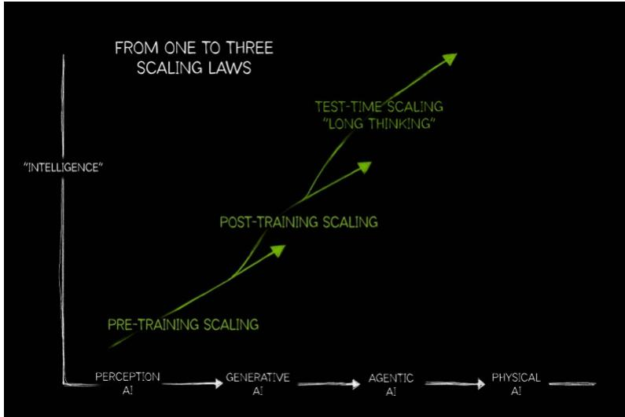
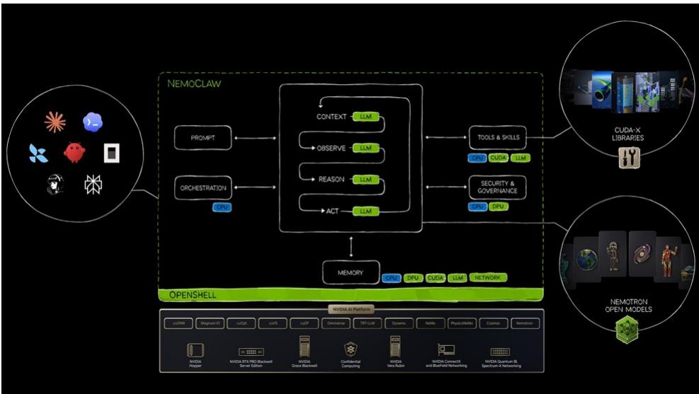
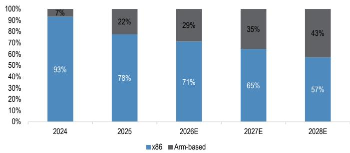
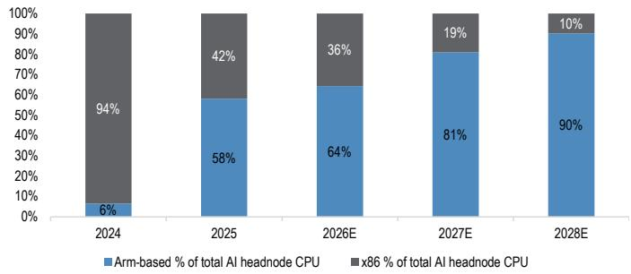

# 服务器CPU增长周期研究

## 服务器CPU出货量模型

在本报告中，我们介绍了一个服务器CPU出货量模型，并预测服务器CPU总出货量将从2025年的2600万颗增长至2028年的6800万颗（年复合增长率38%）。我们将服务器CPU需求分为三类：(1) AI主节点CPU、(2) 代理型AI服务器CPU、(3) 通用服务器CPU。基于半导体团队对CoWoS的估算（链接），AI加速器出货量在2025-2028财年预计将呈现约50%的年复合增长率，我们看到AI主节点CPU需求呈现阶梯式增长，且CPU与加速器的配比趋势持续上升。通用服务器CPU应继续保持约5%的稳定年复合增长率，而代理型AI CPU则是突破性增长方向，预计2025-2028年将实现155%的年复合增长率。总体而言，我们认为未来几年通用服务器出货量可以维持20%以上的增长。这一超级周期对台积电、欣兴电子、信骅科技、嘉泽、纬颖、健鼎、创意电子、日月光以及SK海力士、三星电子等亚洲科技领域的存储器厂商具有积极影响。

- AI需求重塑服务器CPU格局。我们预测AI加速器出货量将从2024年的760万颗增长至2028年的3250万颗，且由于AI加速器日益复杂，主节点CPU的配比也在提升。加速器与CPU的比例也在压缩——从传统HGX服务器的约4:1降至NVL72计算托盘的约2:1，下一代TPU设计可能达到约1:1。ARM架构CPU正在抢占份额，这得益于英伟达的Vera和谷歌的Axion，我们估计到2028年ARM可能占据AI主节点CPU需求的约90%。我们还预计ARM将在代理型AI服务器中扩大份额，因为超大规模云服务商正在为新兴工作负载采用自研CPU路线图。因此，我们预计到2028年，ARM架构CPU在整体服务器CPU市场中的占比将达到约43%（2025年约为22%）。尽管如此，我们仍预计x86 CPU市场在此期间将实现25%的加速年复合增长率（而上一周期为持平至低个位数增长）。

- 新型AI推理编排驱动代理型AI服务器需求。随着AI工作负载从训练转向推理，我们预计超大规模云服务商将在加速器周围部署更多通用服务器，以改善总体拥有成本。增量需求主要体现在外部存储服务器（如KV缓存）和围绕GPU处理查询编排的计算服务器。虽然加速器与CPU服务器没有固定比例，但我们的粗略分析表明今年约为0.5倍（每两个加速器配一个CPU），随着加速器复杂度的提升，这一比例将随时间上升。这将成为通用服务器需求的关键增量驱动因素（到2028年将占通用服务器CPU市场的50%以上，而去年不到10%）。

- 受益于服务器CPU超级周期的公司。服务器CPU、BMC、基板和插座需求之间存在高度相关性。我们预计信骅科技、嘉泽和欣兴电子将是这一服务器CPU超级周期的主要受益者，驱动因素包括强劲的出货量需求、持续的内容升级以及潜在的产品价格上涨。AMD在x86服务器CPU中的持续份额增长对台积电和日月光作为主要代工/封测厂商也有利。存储器厂商可能受益于DIMM/SOCAMM需求的增长。在下游，我们认为服务器PCB制造商（如健鼎）和通用服务器ODM（如纬颖、英业达）也可能受益于强劲的服务器需求。

详见第9页的分析师认证和重要披露，包括非美国分析师披露。

## 技术 - 硬件

Albert Hung AC
(886-2) 2725-9875
albert.hung@jpmchase.com
摩根证券（台湾）有限公司/ 摩根证券（亚太）有限公司/ 摩根经纪（香港）有限公司

Gokul Hariharan AC
(852) 2800-8564
gokul.hariharan@JPM.com
摩根证券（亚太）有限公司/ 摩根经纪（香港）有限公司

Anthony Leng
(886-2) 2725-9240
anthony.leng@JPM.com
摩根证券（台湾）有限公司

Jennifer Hsieh
(886-2) 2725-9868
jennifer.hsieh@JPM.com
摩根证券（台湾）有限公司

## 目录

AI推理周期加速服务器CPU增长周期 3
自上而下的方法论.... 3
强劲的加速器需求 + 上升的CPU配比 = AI服务器主节点CPU指数级增长.... 4
代理型AI CPU成为服务器CPU需求的新驱动力.... 5
用自下而上的估算三角验证自上而下的预测.... 7
ARM架构CPU加速渗透，受ARM配比上升驱动.... 7

# AI推理周期加速服务器CPU增长周期

我们推出自有的服务器CPU需求模型。我们将CPU需求分为三类——(1) AI服务器主节点CPU、(2) 常规服务器CPU、(3) 代理型AI CPU——并预测服务器CPU总出货量将从2025年的2600万颗增长至2028年的6800万颗（年复合增长率38%）。随着AI应用从训练向推理过渡，我们预计代理型AI和AI主节点CPU需求将驱动一个"超级"通用服务器CPU周期。

我们还通过将出货量预测与三个子领域的平均售价假设相结合，对服务器CPU市场规模进行了估算。考虑到持续的供应紧张和持续的CPU升级周期，我们假设CPU价格每年上涨约10%。因此，我们预测服务器CPU市场规模在2025-2028年将实现53%的年复合增长率，到2028年达到约1000亿美元，这得益于出货量增长和平均售价的持续提升。

图1：服务器CPU出货量趋势及年复合增长率  
  
来源：摩根估算。Gartner®。

图2：服务器CPU收入市场规模预测及年复合增长率  
  
来源：Gartner®。摩根估算。

## 自上而下的方法论

我们以Gartner数据为基础，确定了2024年服务器CPU总出货量，并预测了未来几年各细分领域的服务器CPU需求。我们基于摩根半导体团队（由Gokul Hariharan主导）的AI加速器预测（链接）以及每个服务器节点中AI加速器与主节点CPU的比例，来预测AI服务器主节点CPU需求。我们假设2024年没有代理型AI活动，并据此推导出2024年隐含的常规服务器CPU需求。

对于2025年和2026年，我们假设非AI服务器主节点CPU出货量（常规服务器加代理型AI CPU）同比增长11%/30%，达到2300万/2900万颗，而2024年为2000万颗。再加上300万/700万颗AI服务器主节点需求，2025/2026年服务器CPU总出货量可能达到2600万/3600万颗（同比增长16%/42%）。

2026年之后，我们预计服务器CPU总出货量将同比增长42%/32%，驱动因素包括代理型AI CPU相对于AI加速器的配比上升、强劲的AI服务器需求以及常规服务器CPU 5%的年复合增长率。总体而言，我们预测2025-2028年服务器CPU出货量的年复合增长率为38%。

表1：服务器CPU预测 - 自上而下的方法论

<table><tr><td>单位：百万颗</td><td>2024</td><td>2025</td><td>2026E</td><td>2027E</td><td>2028E</td><td>2025-28年复合增长率</td></tr><tr><td colspan="7">1. AI服务器主节点</td></tr><tr><td>全球AI加速器出货量（百万颗）</td><td>7.6</td><td>9.6</td><td>16.1</td><td>25.2</td><td>32.5</td><td>50%</td></tr><tr><td>同比</td><td></td><td>27%</td><td>67%</td><td>56%</td><td>29%</td><td></td></tr><tr><td>主节点中每个CPU的平均加速器数</td><td>4.1</td><td>3.0</td><td>2.3</td><td>2.2</td><td>1.9</td><td></td></tr><tr><td>所需主节点服务器CPU（百万颗）</td><td>1.8</td><td>3.2</td><td>7.1</td><td>11.3</td><td>16.8</td><td>74%</td></tr><tr><td>同比</td><td></td><td>73%</td><td>124%</td><td>59%</td><td>48%</td><td></td></tr><tr><td colspan="7">2. 常规服务器增长（非AI工作负载）</td></tr><tr><td>非AI工作负载的传统服务器（百万台）</td><td>11.6</td><td>11.9</td><td>12.5</td><td>13.1</td><td>13.8</td><td></td></tr><tr><td>同比</td><td>2%</td><td>3%</td><td>5%</td><td>5%</td><td>5%</td><td></td></tr><tr><td>每台服务器的CPU数</td><td>1.8</td><td>1.8</td><td>1.8</td><td>1.8</td><td>1.8</td><td></td></tr><tr><td>非AI工作负载CPU（百万颗）</td><td>20.3</td><td>20.9</td><td>21.9</td><td>23.0</td><td>24.2</td><td>5%</td></tr><tr><td>同比</td><td></td><td>3%</td><td>5%</td><td>5%</td><td>5%</td><td></td></tr><tr><td colspan="7">3. 代理型AI CPU集群</td></tr><tr><td>每个加速器的CPU比例</td><td>0.0</td><td>0.17</td><td>0.45</td><td>0.68</td><td>0.83</td><td></td></tr><tr><td>代理型AI CPU总量（百万颗）</td><td>0.0</td><td>1.6</td><td>7.3</td><td>17.1</td><td>27.0</td><td>155%</td></tr><tr><td>同比</td><td></td><td></td><td>352%</td><td>134%</td><td>58%</td><td></td></tr><tr><td colspan="7">服务器CPU总出货量（百万颗）</td></tr><tr><td>服务器CPU总出货量</td><td>22.1</td><td>25.7</td><td>36.3</td><td>51.4</td><td>67.9</td><td>38%</td></tr><tr><td>同比</td><td></td><td>16%</td><td>42%</td><td>42%</td><td>32%</td><td></td></tr><tr><td>服务器CPU总出货量（不含AI服务器主节点）</td><td>20.3</td><td>22.5</td><td>29.2</td><td>40.1</td><td>51.1</td><td>31%</td></tr><tr><td>同比</td><td></td><td>11%</td><td>30%</td><td>37%</td><td>27%</td><td></td></tr></table>

来源：摩根估算。2024年服务器CPU总出货量数据来自Gartner®。全球AI加速器出货量基于半导体团队的CoWoS估算（链接）。

## 强劲的加速器需求 + 上升的CPU配比 = AI服务器主节点CPU指数级增长

我们看到AI服务器主节点CPU的配比在上升。每台AI服务器中每个CPU对应的AI加速器数量从4:1降至2:1，未来几代甚至达到1:1，尤其是在AI ASIC服务器中。我们将此归因于AI服务器架构日益复杂，导致对CPU编排的需求增加。值得注意的是，AI加速器预测基于摩根半导体团队（由Gokul Hariharan主导）的CoWoS估算（链接）。

- 英伟达GPU服务器：NVL72计算托盘中加速器与CPU的比例从HGX服务器的4:1降至2:1。我们还看到NVL72服务器机架中NVLink交换托盘对CPU的需求。有趣的是，未来几代HGX服务器中加速器与CPU的比例有所上升（从4:1升至8:1），这可能是由于HGX服务器架构对CPU的需求相对较低。

- AMD GPU服务器：我们的研究显示，MI300系列和AMD MI455 Helio服务器中GPU与CPU的比例为4:1。

- 谷歌TPU服务器：我们的研究显示，TPU v8服务器有两种设计，TPU与CPU的比例分别为1:1和2:1，未来几代可能达到1:1。我们假设TPU v8代中1:1和2:1设计的比例为50%/50%。

- AWS Trainium服务器：我们的研究显示，T3液冷项目中Trainium与CPU的比例将从T2和风冷T3项目的16:1降至4:1。

- 微软/元/其他AI ASIC服务器：我们假设其余AI ASIC服务器的加速器与CPU比例为4:1。

AI服务器主节点CPU配比的上升，加上强劲的AI加速器需求，可能推动AI服务器主节点CPU需求呈指数级增长。总体而言，我们预测2025-2028年AI服务器主节点CPU的年复合增长率约为74%。

表2：AI服务器主节点CPU预测

<table><tr><td>AI加速器（百万颗）</td><td>2024</td><td>2025</td><td>2026E</td><td>2027E</td><td>2028E</td><td>备注</td></tr><tr><td>英伟达</td><td>4.5</td><td>6.2</td><td>8.9</td><td>10.0</td><td>11.6</td><td></td></tr><tr><td>HGX（x86基础）</td><td>4.3</td><td>2.6</td><td>3.0</td><td>2.1</td><td>2.0</td><td></td></tr><tr><td>NVL72（ARM基础）</td><td>0.1</td><td>3.6</td><td>5.9</td><td>7.9</td><td>9.6</td><td></td></tr><tr><td>AMD</td><td>0.5</td><td>0.7</td><td>0.7</td><td>1.5</td><td>2.3</td><td></td></tr><tr><td>TPU</td><td>1.7</td><td>1.8</td><td>4.4</td><td>8.9</td><td>11.6</td><td></td></tr><tr><td>v4/5/6/7</td><td>1.7</td><td>1.7</td><td>2.7</td><td>1.7</td><td>-</td><td></td></tr><tr><td>v8</td><td>-</td><td>0.1</td><td>1.7</td><td>7.2</td><td>8.6</td><td></td></tr><tr><td>v9</td><td>-</td><td>-</td><td>-</td><td>-</td><td>3.0</td><td></td></tr><tr><td>AWS</td><td>0.8</td><td>1.5</td><td>1.9</td><td>3.5</td><td>3.5</td><td></td></tr><tr><td>Inferentia 2</td><td>0.5</td><td>0.1</td><td>-</td><td>-</td><td>-</td><td></td></tr><tr><td>Trn 2</td><td>0.3</td><td>1.5</td><td>0.6</td><td>-</td><td>-</td><td></td></tr><tr><td>Trn 3</td><td>-</td><td>-</td><td>1.3</td><td>3.5</td><td>-</td><td></td></tr><tr><td>Trn 4</td><td>-</td><td>-</td><td>-</td><td>-</td><td>3.5</td><td></td></tr><tr><td>元</td><td>-</td><td>-</td><td>0.3</td><td>0.5</td><td>1.1</td><td></td></tr><tr><td>微软</td><td>-</td><td>-</td><td>0.2</td><td>0.8</td><td>0.8</td><td></td></tr><tr><td>其他</td><td></td><td></td><td>0.2</td><td>0.4</td><td>0.8</td><td></td></tr><tr><td>AI加速器总量（百万颗）</td><td>7.4</td><td>10.1</td><td>16.5</td><td>25.6</td><td>31.7</td><td></td></tr><tr><td>每个CPU的平均加速器数</td><td>2024</td><td>2025</td><td>2026E</td><td>2027E</td><td>2028E</td><td></td></tr><tr><td>英伟达</td><td>3.9</td><td>2.5</td><td>2.4</td><td>2.4</td><td>2.3</td><td>8 GPU配2 CPU</td></tr><tr><td>HGX（x86基础）</td><td>4.0</td><td>4.0</td><td>4.0</td><td>8.0</td><td>8.0</td><td>2 GPU配1 CPU；R200改为8:1 GPU/CPU比例</td></tr><tr><td>NVL72（ARM基础）</td><td>2.0</td><td>2.0</td><td>2.0</td><td>2.0</td><td>2.0</td><td></td></tr><tr><td>AMD</td><td>4.0</td><td>4.0</td><td>4.0</td><td>4.0</td><td>4.0</td><td></td></tr><tr><td>TPU</td><td>4.0</td><td>3.8</td><td>1.5</td><td>1.5</td><td>1.3</td><td></td></tr><tr><td>v4/5/6/7</td><td>4.0</td><td>4.0</td><td>1.5</td><td>1.5</td><td>1.5</td><td>假设v4/v5为4:1，v6/7为2:1</td></tr><tr><td>v8</td><td>1.5</td><td>1.5</td><td>1.5</td><td>1.5</td><td>1.5</td><td>v8有两个版本，1:1或2:1</td></tr><tr><td>v9</td><td>1.0</td><td>1.0</td><td>1.0</td><td>1.0</td><td>1.0</td><td></td></tr><tr><td>AWS</td><td>5.3</td><td>14.5</td><td>14.3</td><td>10.0</td><td>2.0</td><td>假设平均8个Inferentia配2个CPU</td></tr><tr><td>Inferentia 2</td><td>4.0</td><td>4.0</td><td>4.0</td><td>4.0</td><td>4.0</td><td></td></tr><tr><td>Trn 2</td><td>16.0</td><td>16.0</td><td>16.0</td><td>16.0</td><td>16.0</td><td></td></tr><tr><td>Trn 3</td><td>13.6</td><td>13.6</td><td>13.6</td><td>10.0</td><td>6.4</td><td rowspan="2">80%风冷（16:1）和20%液冷（4:1），2027/28年摩根估AC/LC比例为50%/50%和20%/80%</td></tr><tr><td>Trn 4</td><td>2.0</td><td>2.0</td><td>2.0</td><td>2.0</td><td>2.0</td></tr><tr><td>元</td><td>4.0</td><td>4.0</td><td>4.0</td><td>4.0</td><td>4.0</td><td></td></tr><tr><td>微软</td><td>4.0</td><td>4.0</td><td>4.0</td><td>4.0</td><td>4.0</td><td></td></tr><tr><td>其他</td><td>4.0</td><td>4.0</td><td>4.0</td><td>4.0</td><td>4.0</td><td></td></tr><tr><td>综合比例</td><td>4.0</td><td>3.2</td><td>2.3</td><td>2.3</td><td>1.9</td><td></td></tr><tr><td>AI主节点CPU（百万颗）</td><td>2024</td><td>2025</td><td>2026E</td><td>2027E</td><td>2028E</td><td></td></tr><tr><td>英伟达</td><td>1.1</td><td>2.4</td><td>3.7</td><td>4.2</td><td>5.1</td><td></td></tr><tr><td>AMD</td><td>0.1</td><td>0.2</td><td>0.2</td><td>0.4</td><td>0.6</td><td></td></tr><tr><td>TPU</td><td>0.4</td><td>0.5</td><td>2.9</td><td>5.9</td><td>8.7</td><td></td></tr><tr><td>AWS</td><td>0.1</td><td>0.1</td><td>0.1</td><td>0.4</td><td>1.7</td><td></td></tr><tr><td>元</td><td>-</td><td>-</td><td>0.1</td><td>0.1</td><td>0.3</td><td></td></tr><tr><td>微软</td><td>-</td><td>-</td><td>0.1</td><td>0.2</td><td>0.2</td><td></td></tr><tr><td>其他</td><td>-</td><td>-</td><td>0.1</td><td>0.1</td><td>0.2</td><td></td></tr><tr><td>总计</td><td>1.8</td><td>3.2</td><td>7.1</td><td>11.3</td><td>16.8</td><td></td></tr></table>

来源：摩根估算。AI加速器估算基于半导体团队的CoWoS估算（链接）。

## 代理型AI CPU成为服务器CPU需求的新驱动力

随着我们进入代理型AI时代，聚焦于测试时扩展（即长思考），CPU在编排、运行工具和技能、存储和安全方面发挥着越来越重要的作用。例如，Vera CPU不仅位于NVL72机架系统中，还作为独立CPU应用于整个Vera Rubin平台，包括存储服务器和CPU服务器。

图3：智能阶段  
  
来源：英伟达。

图4：代理 = 大语言模型 + 框架；CPU在代理型AI生态系统中扮演关键角色  
  
来源：英伟达。

我们将今年强劲的通用服务器需求（据我们估算同比增长30-40%）主要归因于代理型AI的新兴需求。为了量化代理型AI需求，我们假设2023/2024年没有代理型AI活动，并计算2025年和2026年代理型AI CPU与AI加速器的隐含比例。然后，我们基于对这一比例和2027/2028年AI加速器需求的估算，来预测代理型AI CPU需求。

为了推导代理型AI CPU需求与AI加速器需求的隐含比例，我们假设2023-2026年常规服务器需求的年复合增长率约为3%，并从服务器CPU总需求中减去AI服务器主节点CPU和常规服务器CPU需求后，得出2025/2026年的代理型AI CPU需求。我们预计这一比例在未来几年将快速上升，原因是代理型AI需求的快速增长。

总体而言，我们预测2025-2028年代理型AI CPU需求的年复合增长率为155%，我们认为这是服务器CPU总需求的关键增长驱动因素。

## 用自下而上的估算三角验证自上而下的预测

在以下分析中，我们用自下而上的估算来三角验证自上而下的预测。我们以Gartner数据为基础，确定2024年和2025年英特尔/AMD服务器CPU出货量。对于2025-2028年，我们预测x86/ARM服务器CPU出货量的年复合增长率分别为25%/72%。我们基于行业研究和AI服务器主节点CPU需求框架，估算了其余ASIC CPU厂商的CPU需求。

表3：摩根服务器CPU自下而上估算

<table><tr><td>自下而上CPU出货量细分</td><td>2024</td><td>2025</td><td>2026E</td><td>2027E</td><td>2028E</td><td>2025-28年复合增长率</td></tr><tr><td>x86</td><td>20.6</td><td>19.9</td><td>25.8</td><td>33.2</td><td>38.8</td><td>25%</td></tr><tr><td>ARM</td><td>1.5</td><td>5.8</td><td>10.5</td><td>18.2</td><td>29.1</td><td>72%</td></tr><tr><td>总计</td><td>22.1</td><td>25.7</td><td>36.3</td><td>51.4</td><td>67.9</td><td>38%</td></tr><tr><td>x86占比</td><td>93%</td><td>78%</td><td>71%</td><td>65%</td><td>57%</td><td></td></tr><tr><td>ARM占比</td><td>7%</td><td>22%</td><td>29%</td><td>35%</td><td>43%</td><td></td></tr></table>

来源：Gartner®。摩根估算。

对于每个厂商，我们将需求分为三类：AI服务器主节点CPU、常规服务器CPU和代理型AI CPU。我们使用AI服务器主节点CPU预测（表2）来确定AI主节点CPU需求。我们假设2024/2025年代理型AI CPU部署规模较小，并推导出隐含的常规服务器CPU需求。对于2026-2028年，我们假设各类别常规服务器CPU需求的年复合增长率为5%。

然后，我们使用代理型AI CPU需求（2026-2028年）和其余CPU类别作为平衡项，使自下而上的构建与自上而下的总量保持一致。总体而言，我们预计代理型AI CPU需求将全面上升。

表4：摩根服务器CPU自下而上估算 - 按应用细分

<table><tr><td>自下而上 - 按应用划分的CPU（百万颗）</td><td>2024</td><td>2025</td><td>2026E</td><td>2027E</td><td>2028E</td></tr><tr><td>x86</td><td>20.6</td><td>19.9</td><td>25.8</td><td>33.2</td><td>38.8</td></tr><tr><td>通用</td><td>18.9</td><td>17.9</td><td>18.8</td><td>19.8</td><td>20.7</td></tr><tr><td>代理型AI</td><td>-</td><td>0.6</td><td>4.5</td><td>11.3</td><td>16.4</td></tr><tr><td>AI主节点</td><td>1.7</td><td>1.3</td><td>2.5</td><td>2.2</td><td>1.6</td></tr><tr><td>ARM架构</td><td>1.5</td><td>5.8</td><td>10.5</td><td>18.2</td><td>29.1</td></tr><tr><td>通用</td><td>1.4</td><td>2.9</td><td>3.1</td><td>3.3</td><td>3.4</td></tr><tr><td>代理型AI</td><td>0.0</td><td>1.0</td><td>2.8</td><td>5.8</td><td>10.6</td></tr><tr><td>AI主节点</td><td>0.1</td><td>1.8</td><td>4.6</td><td>9.1</td><td>15.1</td></tr><tr><td>服务器CPU总需求</td><td>22.1</td><td>25.7</td><td>36.3</td><td>51.4</td><td>67.9</td></tr></table>

来源：Gartner®。摩根估算。

## ARM架构CPU加速渗透，受ARM配比上升驱动

我们预测ARM架构CPU的采用率到2028年将达到约43%，而2025年约为22%，驱动因素包括AI服务器主节点中采用率的上升以及x86 CPU的供应紧张。我们估计，到2028年，ARM架构CPU将占AI服务器主节点CPU总需求的90%，而2024年不到10%，这主要得益于采用英伟达ARM架构CPU的NVL72服务器架构的推广，以及谷歌在其TPU服务器中采用自研CPU。

与传统服务器配备高核心数CPU、具有更好的多线程和核心分区能力不同，AI服务器主节点和代理型AI服务器需要低延迟、高能效的CPU来处理AI工作负载。ARM架构CPU，如英伟达的Vera，可能是为AI任务专门设计的。总体而言，我们预计2025-2028年ARM架构和x86 CPU需求的年复合增长率分别为72%和25%。

图5：服务器CPU总量 - x86/ARM架构出货量构成  
  
来源：Gartner®。摩根估算。其他主要包括ARM架构CPU。

图6：AI服务器主节点 - x86/ARM架构出货量构成  
  
来源：Gartner®。摩根估算。

本报告讨论的公司（除非另有说明，本报告中的所有报价均为2026年7月9日收盘价）日月光科技控股有限公司(3711.TW/新台币677.00元/超配)、信骅科技股份有限公司(5274.TWO/新台币13,665.00元/超配)、创意电子(3443.TW/新台币4,340.00元/中性)、嘉泽(3533.TW/新台币1,955.00元/超配)、SK海力士(000660.KS/韩元2,221,000[2026年7月10日]/超配)、三星电子(005930.KS/韩元289,750[2026年7月10日]/超配)、台积电(2330.TW/新台币2,415.00元/超配)、健鼎科技(3044.TW/新台币448.50元/超配)、欣兴电子(3037.TW/新台币875.00元/超配)、纬颖科技(6669.TW/新台币5,040.00元/超配)

分析师认证：本报告封面标注"AC"的研究分析师（或当多位研究分析师主要负责本报告时，封面或文档内标注"AC"的研究分析师分别就其在本研究中涵盖的每个证券或发行人认证）证明：(1) 本报告中表达的所有观点准确反映了研究分析师对任何及所有标的证券或发行人的个人观点；(2) 研究分析师的任何薪酬中没有任何部分直接或间接与本报告中研究分析师提出的具体建议或观点相关。对于封面列出的所有韩国研究分析师（如适用），他们还根据KOFIA要求证明，研究分析师的分析是善意进行的，且观点反映了研究分析师自身的意见，没有受到不当影响或干预。

本报告中列出的所有作者均为研究分析师，除非另有说明，他们均制作独立研究。在欧洲，行业专家（销售和交易）可能作为联系人出现在本报告中，但并非报告的作者或研究部门成员。

## 重要披露

- 做市商/流动性提供者：摩根是三星电子、SK海力士或相关实体金融工具的做市商和/或流动性提供者。

- 主承销商或联合主承销商：摩根在过去12个月内担任三星电子、SK海力
