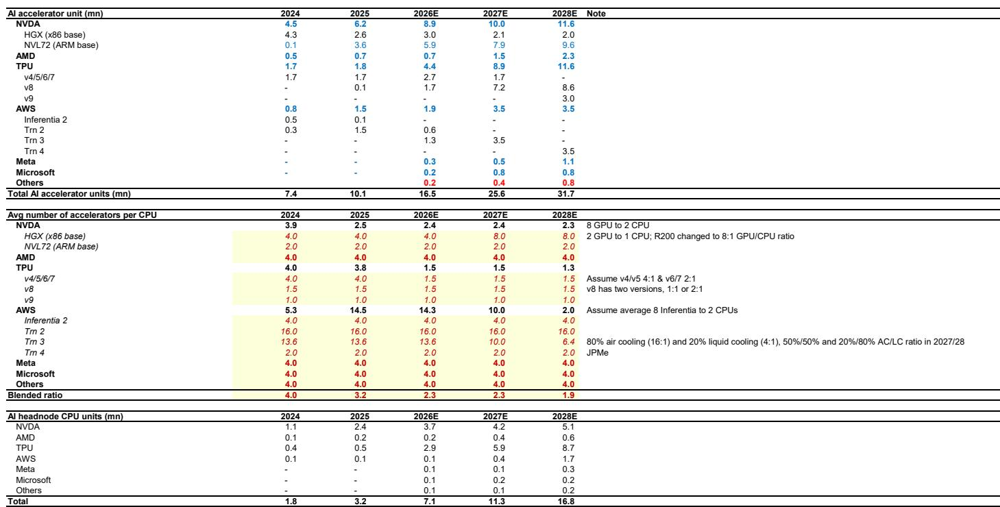
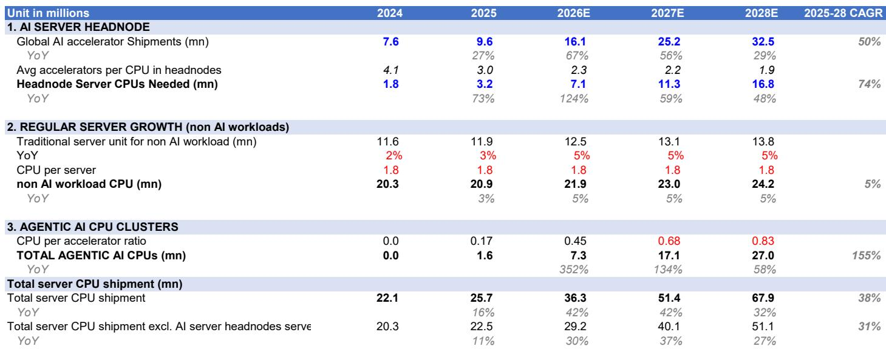
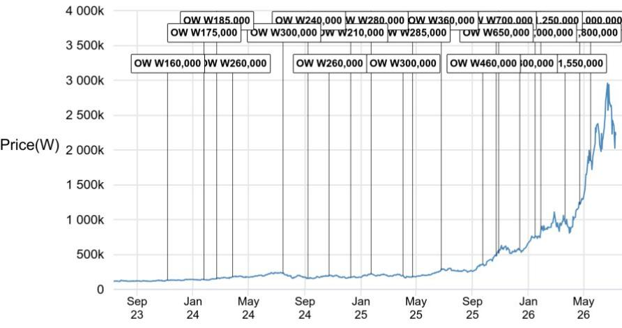

# 服务器CPU出货模型观察

服务器CPU市场正在经历一轮结构性的需求变化，其驱动力来自AI推理与智能体工作负载的增长。相关研究在最新发布的服务器CPU出货模型中给出了一个关键判断：到2028年，全球服务器CPU年出货量将从2025年的2600万颗增长至6800万颗，对应38%的年复合增长率。这个数字本身并不令人意外，真正值得关注的是增长结构的根本性变化——传统通用服务器CPU仅贡献约5%的年复合增长，而智能体AI服务器CPU将以155%的年复合增速成为最大的增量来源。

报告将服务器CPU需求拆分为三个互不重叠的类别：AI头节点CPU、通用服务器CPU，以及智能体AI服务器CPU。这种拆分方式本身就揭示了市场正在发生的分化。AI头节点CPU的增速主要取决于两个变量：AI加速器的出货量，以及每颗CPU所承载的加速器数量。研究团队基于产能估算，预测全球AI加速器出货量将从2024年的760万颗增长至2028年的3250万颗，年复合增速约50%。与此同时，加速器与CPU的配比正在快速压缩——从传统服务器的4:1，降至计算托盘中的2:1，甚至下一代设计中可能达到1:1。这意味着，即使加速器出货量不变，单台AI服务器对CPU的需求也在增加。

> **观察：** 加速器与CPU配比的压缩，本质上是AI服务器架构复杂度提升的副产品。过去一颗CPU可以管理四颗GPU，现在因为更复杂的通信与编排需求，每两颗GPU就需要一颗CPU。这个趋势在ASIC服务器中更为明显，未来可能进一步向1:1演进。对于CPU供应商而言，这相当于在AI服务器出货量增长之外，额外叠加了一层“单位需求乘数”。

智能体AI服务器CPU是报告中最具想象力的变量。研究认为，随着AI工作负载从训练转向推理，云服务商会在加速器集群周围部署更多的通用服务器，用于处理缓存、查询编排、工具调用和安全管控等任务。这类需求在2024年几乎可以忽略不计，但到2028年，智能体AI CPU将占据通用服务器CPU市场超过50%的份额，而2024年这一比例还不到10%。报告给出的预测是，智能体AI CPU出货量将从2025年的约160万颗升至2028年的2700万颗，年复合增速高达155%。

## 1. ARM架构正在改写服务器CPU的竞争格局

ARM在服务器CPU市场的渗透速度可能超出多数人的预期。模型显示，到2028年，ARM架构将占据约43%的服务器CPU出货量，而2025年这一比例仅为22%。驱动因素来自两个方向：一是相关公司的CPU正在成为AI头节点的主流选择；二是云服务商在智能体AI服务器中越来越多地采用自研ARM架构CPU。

值得注意的是，x86阵营并非没有增长。报告预计，x86服务器CPU在2025至2028年间仍可实现25%的年复合增速，远高于上一个周期中接近零的增长。这意味着整个服务器CPU市场的规模在快速扩大，ARM的份额上升并非以x86的相对调整为代价，而是增量市场中的结构性再分配。

## 2. 供应链受益者集中在高附加值环节

服务器CPU出货量的增长，会沿着供应链传导至多个细分领域。研究指出，CPU出货量与基板管理控制器、CPU插座、基板的需求之间存在高度相关性。相关公司被列为最直接的受益者，驱动因素包括出货量增长、单机内容升级以及潜在的价格变化。

相关公司在x86服务器CPU领域的持续份额提升，也对代工和封测合作伙伴构成利好。存储供应商则有望受益于内存需求的增加。在下游，服务器PCB厂商和通用服务器ODM也将受益于整体服务器需求的增长。

## 3. 一个可复用的观察框架：从“加速器中心”转向“CPU中心”

这份报告提供了一个值得长期跟踪的分析框架：不再以AI加速器出货量作为衡量AI基础设施研究的相对少见指标，而是将CPU需求拆解为三个独立变量——加速器出货量、加速器与CPU配比、以及智能体AI工作负载的CPU密度。这三个变量各自有不同的驱动逻辑和增速曲线，合在一起才能完整描述服务器CPU市场的真实图景。

对于产业决策者而言，这意味着需要重新评估供应链中的价值分布。过去两年市场高度关注GPU和存储的供需情况，但CPU、基板管理控制器、基板、插座等环节的增量需求可能被系统性低估。当加速器与CPU配比从4:1压缩至2:1甚至1:1时，每颗加速器所对应的CPU价值量正在增加。这个趋势在2026年之后会变得更加显著，因为届时智能体AI CPU的基数将开始大幅攀升。

For informational purposes only. Portions may be generated,translated,summarized,or edited with AI assistance based on source materials and may contain omissions or errors. Please verify independently. This is not investment,legal,tax,accounting,or other professional advice.

For informational purposes only. Portions may be generated,translated,summarized,or edited with AI assistance based on source materials and may contain omissions or errors. Please verify independently. This is not investment,legal,tax,accounting,or other professional advice.

