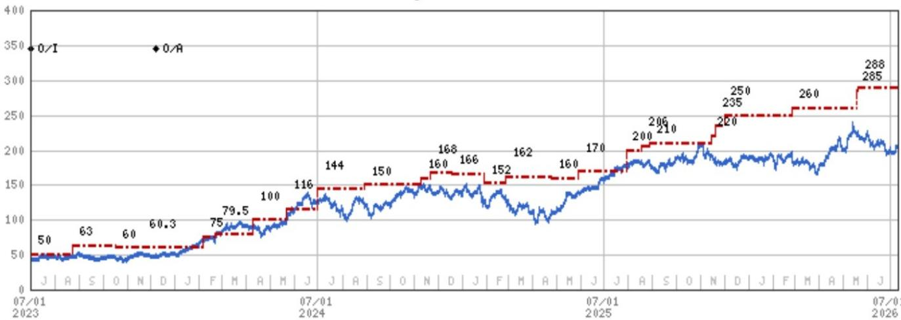
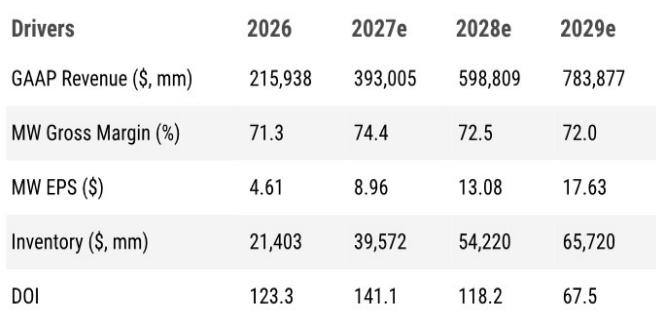

# NVIDIA Is No Longer Just a Growth Stock — And That Changes the Research Framework Entirely

NVIDIA is approaching $100 billion in quarterly revenue, yet the company's executive team recently described its growth rates as "accelerating." That is not a contradiction. It is a signal that the demand structure underpinning the business has fundamentally changed. The company is no longer dependent on a single hyperscaler buying cycle or a narrow set of frontier AI labs. It now operates across three distinct growth segments, each with different demand drivers, competitive dynamics, and risk profiles. Understanding the architecture of this diversification is the only way to assess whether NVIDIA can sustain its valuation — or whether the market is mispricing its future.

The immediate catalyst for this reassessment comes from a recent non-deal roadshow involving NVIDIA's CEO, CFO, and head of investor relations. The meetings revealed a company that is actively reshaping its investor base, redefining its product roadmap under real constraints, and laying out a decision framework for how it will allocate capital between growth and return. The core insight for observers is this: NVIDIA is transitioning from a pure-play growth name with a concentrated ownership base into a diversified compute platform that must appeal to both growth and value-oriented observers simultaneously. That transition will determine whether the stock's multiple compression is a temporary phenomenon or a structural re-rating.

The report that informs this analysis details three segment-based growth drivers, a deliberate shift in investor targeting, and a product roadmap navigating memory shortages and form-factor changes. The following sections unpack what each of these developments means for the research framework, and why the conventional debate — ASICs versus GPUs, hyperscalers versus neoclouds — misses the more important strategic picture.

## NVIDIA's Growth Now Rests on Three Distinct Demand Engines, Each With Its Own Competitive Dynamics

The company's new segmentation divides data center revenue into three categories: AI labs, traditional hyperscalers, and a combined segment of neoclouds, enterprise, and sovereign customers. Each accounts for a meaningful share of revenue — roughly 20%, 50%, and 50% respectively, with some overlap in the accounting — but more importantly, each faces fundamentally different constraints and competitive pressures.

AI labs, which represent about 20% of total demand, are the most concentrated and the most exposed to custom silicon competition. One prominent frontier model was developed almost entirely on an ASIC, meaning NVIDIA had minimal exposure to that workload initially. That share has since risen to nearly 50%, but the fact that an ASIC-first approach can succeed at scale is a real data point. It confirms that hyperscaler-developed alternatives are not theoretical. They are live, they are competitive, and they will capture some portion of frontier training demand. The counterargument, which the company and its channel contacts support, is that NVIDIA's total cost per token remains the best in the industry. Less expensive silicon does not automatically produce better token economics, and NVIDIA's share of compute has actually climbed from 2024 to 2026. Both NVIDIA and Broadcom's AI businesses are growing over 80% next year, and both remain supply-constrained at those levels. The takeaway is not that ASICs will displace NVIDIA, but that the AI lab segment will become a two-supplier market where NVIDIA retains the majority share but faces periodic share-loss scares that will test conviction.

The hyperscaler segment, roughly half of revenue, is where the scale is largest but the constraints are shifting. Land space and power availability are now the binding limits on growth, not compute supply. That is a structural shift. When hyperscalers could build data centers freely, the only question was how many GPUs they would deploy. Now the question is how much power they can secure and how efficiently they can deploy it. This constraint actually benefits NVIDIA in two ways. First, it forces hyperscalers to prioritize the most compute-dense, power-efficient solutions, which is exactly where NVIDIA's architecture excels. Second, it expands NVIDIA's addressable market through networking and CPU sales. The company reiterated its $20 billion CPU target for this year, with nearly half of that volume coming from standalone CPU racks — not just head-node attach. The Vera CPU, purpose-built for single-threaded AI workloads with a large die, smaller core counts, and memory optimization, is scheduled for the second half of the year. This is not a marginal add-on sale. It is a new product category that extends NVIDIA's reach into the CPU-dominated portions of the data center, directly competing with established x86 architectures.

The third segment — neoclouds, enterprise, and sovereign — is already about half of data center revenue and carries the highest growth potential with the least competitive pressure. Power and space limitations, combined with geopolitical reshoring initiatives, are driving every region to develop its own AI capacity. This creates a fragmented, long-tail opportunity that takes time to start but delivers substantial scale when it materializes. The company cited retail, finance, and biotech as specific verticals where sovereign and industrial AI demand is emerging. Neocloud customers remain a strong growth vector, and the recently announced co-investment model — which allows NVIDIA to provide credit assurance in exchange for revenue sharing — could turn the company into a partial owner of a large network of GPU clouds. That is a structural shift in business model, moving from pure hardware vendor to platform participant with upside exposure to utilization and token economics.

## The Shift Toward Value-Oriented Observers Is a Strategic Response to Ownership Constraints, Not a Signal of Slowing Growth

Part of the roadshow's explicit purpose was to broaden the observer base to include more value-centric observers. This is not a cosmetic exercise. NVIDIA faces a practical ownership problem: it is so widely held among growth funds that many have reached maximum position sizes. When a stock is the largest company in the world by market capitalization, further growth-oriented buying is constrained by portfolio concentration limits. The only way to expand the shareholder base is to attract observers who use different valuation frameworks — and that means demonstrating that the company can generate and return cash at scale.

The numbers support this shift. With 50% or more of free cash flow moving toward cash return starting now, NVIDIA is no longer a reinvest-everything story. It is a capital-return story layered on top of a growth story. The management team has navigated the company from small cap to megacap, adapting its communication strategy at each stage. The current adaptation involves showing value-oriented observers that the multiple — currently around 22x consensus CY27 EPS, roughly in line with the broader market and at a discount to compute semiconductor peers — embeds an overly conservative view of earnings power. The argument is not that NVIDIA should trade at a premium to the market, but that the discount to peers like AMD, Broadcom, and Intel is unjustified given the visibility of the growth pipeline and the expanding SAM from networking and CPU.

For value-oriented observers, the key metric is not revenue growth alone but the sustainability of margins and the magnitude of cash return. Gross margins are projected at 74.4% for CY27, declining modestly to 72% by CY29 as product mix shifts toward lower-margin systems and networking. That is still an exceptionally high margin structure for a hardware company, and the cash flow generation at those margins supports a growing dividend and buyback program. The stock's current P/E of 22.6x on CY27 consensus EPS of $8.98 implies that the market is pricing in a sharp deceleration or margin compression that the company's own guidance and product roadmap do not support.

## The Product Roadmap Is on Track, but Memory Constraints Are Forcing Real Trade-Offs

Recent rumors that the Rubin Ultra platform could slip to 2028 were explicitly denied during the meetings. The company confirmed that Rubin Ultra will ship next year, though with form-factor changes as the Kyber rack is replaced by a "better solution" that potentially supports a larger single-rack scale-up domain. This is presented as a positive: the company continues to take risks with its product roadmap but will quickly course-correct to derisk ramps. Important technologies including 800-volt power delivery and optical scale-up between racks remain on schedule.

The more significant constraint is memory. The report states that the memory shortage will last for several years. If the industry requires 10x token growth each year and memory supply is "basically static" relative to that ramp, something has to give. NVIDIA has already cut the LPDDR5 content per rack in half to meet rack demand. This is a concrete example of the trade-off: the company is sacrificing per-rack memory capacity to maximize total compute output. The implication is that future shifts in architecture will continue to optimize compute and networking to compensate for memory scarcity. The company explicitly stated that compute, networking, and memory are inter-related, and that it is possible to use the other two to optimize a shortage of the third.

This has direct implications for the memory supply chain. The offsets are happening because of a multi-year shortage, not because memory is becoming less important. Observers of memory companies should interpret this as a demand signal that is being partially suppressed by architectural workarounds, not as evidence of structural decline. The company also highlighted the importance of Groq technology, which uses SRAM that historically was much more expensive than DRAM. This suggests that as memory constraints persist, alternative memory architectures will gain relevance, potentially reshaping the competitive landscape for memory suppliers.

## A Decision Framework for Observers: How to Evaluate NVIDIA Across the Three Growth Segments

The following framework translates the report's analysis into actionable questions for portfolio positioning.

**Segment 1: AI Labs (20% of demand).** The key question is whether NVIDIA can maintain its share as ASIC alternatives mature. The evidence suggests that NVIDIA will retain majority share but will face periodic share-loss events. The appropriate response is to monitor the cost-per-token comparison across frontier model training runs. As long as NVIDIA maintains a meaningful advantage in total cost of ownership, share losses will be contained. If the gap narrows, the AI lab segment becomes a source of multiple compression.

**Segment 2: Hyperscalers (50% of revenue).** The binding constraint here is power and space, not compute. This favors NVIDIA's density advantage and creates an expanding SAM through networking and CPU. The key metric to track is the attach rate of Vera CPU in standalone racks. If Vera achieves meaningful penetration outside the head node, it validates the thesis that NVIDIA is becoming a full-stack data center platform, not just a GPU supplier. If Vera remains a niche product, the hyperscaler SAM expansion is limited.

**Segment 3: Neoclouds, Enterprise, and Sovereign (50% of revenue).** This is the most underappreciated growth driver. The fragmented, long-tail nature of this demand means that growth will be lumpy and unpredictable on a quarterly basis, but the structural tailwind from reshoring and sovereignty is powerful. The co-investment model is the most important development in this segment. If NVIDIA becomes a partial owner of GPU clouds through revenue-sharing agreements, it gains exposure to utilization rates and token economics that are independent of hardware sales cycles. This is a business model innovation that could fundamentally change the revenue composition over the next three to five years.

Across all three segments, the unifying factor is that NVIDIA's competitive advantage is not just in silicon but in the full-stack integration of compute, networking, and software. The open-source Nemotron model development illustrates this: by enabling enterprise customers to customize AI models around their own proprietary data and use cases, NVIDIA extends its moat beyond hardware into the application layer. Enterprises that build on Nemotron are less likely to switch to alternative hardware architectures because the full-stack optimization would need to be rebuilt.

The bottom line is that NVIDIA is executing a multi-dimensional growth strategy that is not fully reflected in a single P/E multiple. The stock's discount to compute peers, combined with the accelerating cash return program, creates an asymmetric risk-reward profile for observers who can look past the headline revenue growth rate and understand the structural diversification beneath it. The market is pricing NVIDIA as if its growth will recede to the mean of the semiconductor industry. The evidence from the roadshow suggests the opposite: the growth is broadening, the constraints are shifting in NVIDIA's favor, and the business model is evolving toward recurring platform participation. That is not a story that fits neatly into a growth or value box. It is a story that demands a more nuanced framework — and that is precisely the opportunity.

*For informational purposes only. Portions may be generated, translated, summarized, or edited with AI assistance based on source materials and may contain omissions or errors. Please verify independently. This is not professional advice.*

For informational purposes only. Portions may be generated, translated, summarized, or edited with AI assistance based on source materials and may contain omissions or errors. Please verify independently. This is not professional advice.

