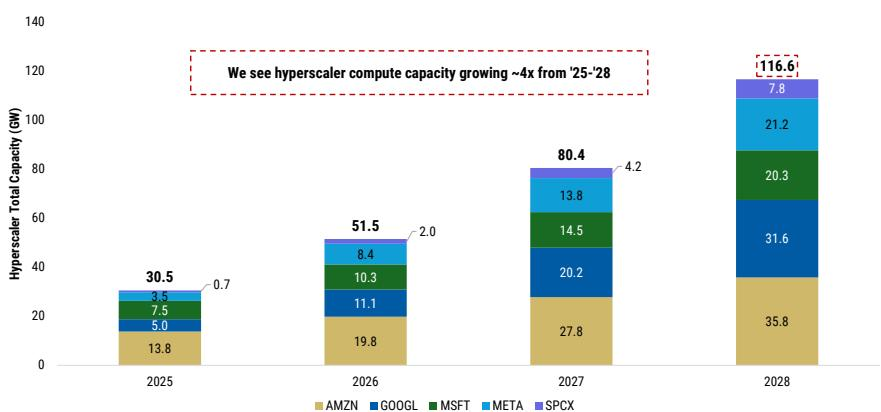
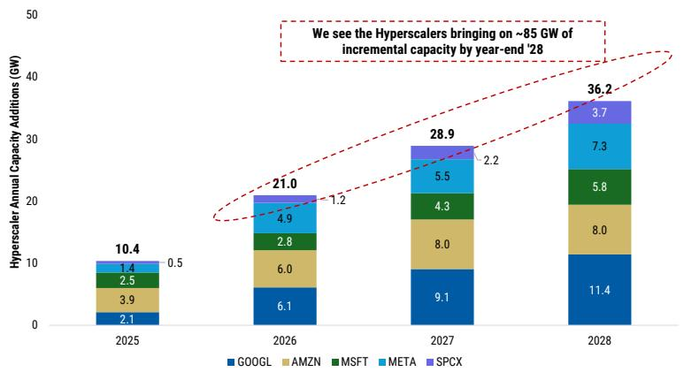
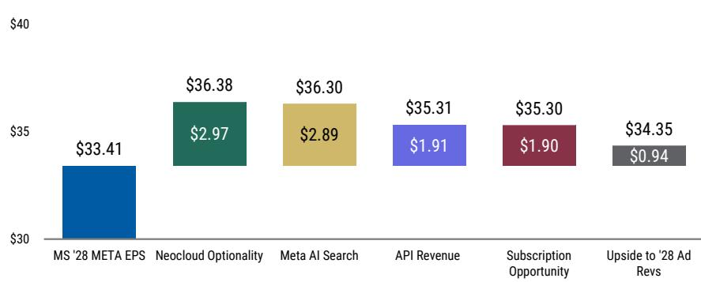
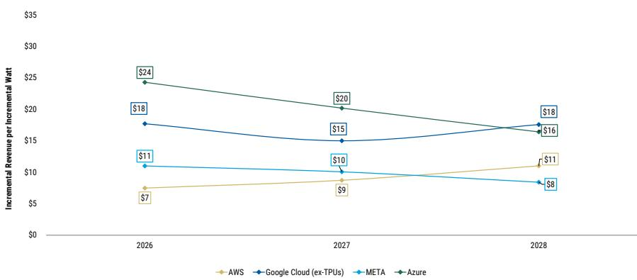

<table><tr><td colspan="2">Brian Nowak, CFA</td></tr><tr><td>Equity Analyst</td><td></td></tr><tr><td>Brian.Nowak@morganstanley.com</td><td>+1 212 761-3365</td></tr><tr><td>Julian Herrera</td><td></td></tr><tr><td>Research Associate</td><td></td></tr><tr><td>Julian.Herrera@morganstanley.com</td><td>+1 212 761-1784</td></tr><tr><td>Gregory Gao</td><td></td></tr><tr><td>Research Associate</td><td></td></tr><tr><td>Greg.Gao@morganstanley.com</td><td>+1 212 296-3125</td></tr><tr><td>Nikhil Javeri</td><td></td></tr><tr><td>Research Associate</td><td></td></tr><tr><td>Nikhil.Javeri1@morganstanley.com</td><td>+1 212 761-3742</td></tr><tr><td>Kavya A Narayanan</td><td></td></tr><tr><td>Research Associate</td><td></td></tr><tr><td>Kavya.Narayanan@morganstanley.com</td><td>+1 212 761-4183</td></tr></table>

# \$1.4trln of Capex, 4X in Compute Capacity, and AI Revenue Streams to Watch into '28

Updated bottom up cost per GW and rising forward capacity expectations cause us to raise hyperscaler capex to \$1.4t in '28 painting a path to 120 GW (from 30 in '25). META top pick with 5 under-appreciated call options, and AMZN and GOOGL hyperscale revs set to accelerate with strong profitability

The Ecosystem Remains Compute-Constrained And Urgency to Spend Remains High...We have written extensively about the rising value, strategic importance and monetization optionality associated with access to compute (see here and here). In effect, limitations on chips/racks, powered shells (see our thematic teams' work here, led by Stephen Byrd) and other bottlenecks are stretching timelines from breaking ground to opening data centers to as much as 3 years. Furthermore, we also believe growing social backlash to data center development and political uncertainty into the '28 presidential election are causing hyperscalers to start building sooner to emphasize job creation. This adds even further to inflationary pressures. As such, we expect capex spend to continue to head higher (now expected to reach to \$1.2tr/\$1.4tr across the five primary companies we track) and are laser focused on companies' ability to bring on capacity to drive and benefit from incremental AI-enabled revenue (from bare metal compute to fuller stack first/third party software and services).

...As We Now See Hyperscaler Capex Reaching \~\$1.2tr/\$1.4tr in '27/'28... As detailed here, we continue to utilize a bottom-up model around required capex for compute capacity coming online. We have estimates for IT hardware costs (server racks with chips, memory, CPU, networking, etc.) and costs outside of the racks (building materials, electrical and mechanical systems) to arrive at the estimated cost to build each GW of capacity...by chip type (across 10 different chips). Please see Exhibit 10 for our latest estimates on cost per GW...which are going up by \~20% (for GPUs) due to further inflationary pressure on memory and powered shell-related costs. We then apply these building costs to the estimated GPU/ASIC supply allocations by hyperscaler to arrive at forward capex.

We raised our GOOGL forward capex substantially in Alphabet Inc.: Diving into '28 Compute Capacity, TPU Sales and Revenue to Come (29 Jun 2026). Today we are raising our META and AMZN (AWS) capex, as we raise our META '27/'28 capex by 29%/22%, reaching \$225bn/\$250bn...and our AMZN company-wide capex by 15%/29%, reaching \$308bn/\$318bn.

## INTERNET

North America
Industry View
Attractive

Please let us know if interested in our updated bottom-up cost per GW, GW capacity, or new Meta API monetization models to flex, adjust and utilize.

Exhibit 1: We are raising '27/'28 total hyperscaler capex (ex-SPCX, included for first time) by 9%/10%, now modeling \~\$1.2tr/\$1.4tr of '27/'28 capex:

  
Source: Company data, MS Estimates, Note: AMZN represents total company capex, SPCX represents terrestrial compute capex. Note: MSFT capex estimates are calendar year.

...Which We See Leading to a 4x Lift in Available Compute Capacity by '28: But we see this spend leading to more compute capacity...with total hyperscaler available compute expected to approach 120GW by '28, up from \~30 in '25. While GOOGL is expected to add the most compute capacity (9 GW/11 GW in '27/'28) we see AWS having the most available compute in '28 (at 35 GW vs GOOGL at 31 GW). We see META reaching 14/21 total GW of capacity by '27/'28, up from \~3.5 GW at YE25. Note that this compares to a recent press article that spoke to the company having \~14 GW by YE27. For META, we see 55%/90% of additions in '26/'27 being first party, with 45%/10% coming from third party relationships.

Exhibit 2: Our bottom-up work shows how total hyperscaler compute capacity is set to reach \~120 GW by '28...up from \~30 GW in '25:

  
Source: Company data, MS Estimates, Note: SPCX represents terrestrial compute capacity. Note: GOOGL capacity represents additions for both internal GOOGL and Google Cloud, and we expect $\sim 1/2$ of capacity additions to go towards each. Note: MSFT capacity estimates represent fiscal year estimates. Note: META capacity estimates include both internally owned and externally leased capacity.

Exhibit 3: ...with GOOGL expected to add the most capacity, followed by AMZN and META.

  
Source: Company data, MS Estimates, Note: SPCX represents terrestrial compute capacity. Note: GOOGL capacity represents additions for both internal GOOGL and Google Cloud, and we expect \~1/2 of capacity additions to go towards each. Note: MSFT capacity estimates represent fiscal year estimates. Note: META capacity estimates include both internally owned and externally leased capacity.

Which Revenue Streams and Factors Matter Most To META, AMZN and GOOGL to Justify the Spend and Drive Outperformance? AMZN, GOOGL, META are currently trading at 16X-20X '28 EPS. Given the still rising spend, we expect investors to remain hyper focused on signal of materially incremental, durable, and profitable revenue growth. So how do we think about each of these in 2H and into '27?

Exhibit 4: AMZN, GOOGL, META are currently trading at 16X-20X '28 EPS:

<table><tr><td>Peer Set</td><td>Current Price</td><td>Price Target</td><td>% Upside</td><td>&#x27;28 EPS</td><td>&#x27;28 P/E (Current)</td><td>&#x27;28 P/E (PT)</td><td>&#x27;26-&#x27;28 EPS CAGR</td><td>&#x27;28 PEG (Current)</td><td>&#x27;28 PEG (PT)</td></tr><tr><td>AMZN</td><td>$246</td><td>$330</td><td>34%</td><td>$15</td><td>16x</td><td>22x</td><td>25%</td><td>0.6x</td><td>0.9x</td></tr><tr><td>GOOGL</td><td>$357</td><td>$415</td><td>16%</td><td>$19</td><td>19x</td><td>22x</td><td>14%</td><td>1.4x</td><td>1.6x</td></tr><tr><td>META</td><td>$666</td><td>$775</td><td>16%</td><td>$33</td><td>20x</td><td>23x</td><td>1%</td><td>14.3x</td><td>16.6x</td></tr></table>

Source: Company Data, MS Estimates

META: 5 Under-appreciated Call Options and EPS Drivers...Remains Top Pick. \$775 PT has 15% Upside, But There Could Be More. As shown below, and detailed in Meta Platforms Inc: 4 Products to Turn Meta Back into an "AI Winner" (2 Jun 2026) we now see 5 META call options for higher earnings power beyond our base case \~\$33 of '28 EPS that are not priced. We recognize the risk of these and that the company needs to deliver these products to drive higher earnings power and multiple expansion...but META still has the most call optionality, where the market is penalizing them for the spend and not giving them credit for potential revenue from the spend.

In aggregate these could represent as much as \~\$10 of EPS (or \~30% upside to our estimates)...meaning META could be trading at \~15X '28 EPS right now if all these went right. You don't need them all, but you just need META to successfully ship and scale these products for the market to feel more confident in the ROIC on this spend.

Exhibit 5: Wee see multiple under-appreciated \$1-3 EPS call options at META...giving us many paths to \$38-\$40 of '28 EPS.  
  
Source: Company data, MS Estimates

Sizing the API Revenue Opportunity from Supply and Demand Side While we have previously sized the neocloud, search, and subscription opportunities, the launch and pricing of Muse Spark 1.1 to third parties is notable as it is priced anywhere from 30%-85% below private company offerings.

Exhibit 6: Muse Spark 1.1 is priced meaningfully below its peers on the frontier.

<table><tr><td>Model</td><td>Input $/1M Tokens</td><td>Output $/1M Tokens</td><td>Input Pricing vs Muse Spark</td><td>Output Pricing vs Muse Spark</td></tr><tr><td>Muse Spark 1.1</td><td>$1.25</td><td>$4.25</td><td>Baseline</td><td>Baseline</td></tr><tr><td>Frontier Model A</td><td>$2.00</td><td>$6.00</td><td>(38%)</td><td>(29%)</td></tr><tr><td>Frontier Model B</td><td>$5.00</td><td>$30.00</td><td>(75%)</td><td>(86%)</td></tr><tr><td>Frontier Model C</td><td>$5.00</td><td>$25.00</td><td>(75%)</td><td>(83%)</td></tr><tr><td>Frontier Model D</td><td>$2.00</td><td>$10.00</td><td>(38%)</td><td>(58%)</td></tr><tr><td>Frontier Model E</td><td>$2.00</td><td>$12.00</td><td>(38%)</td><td>(65%)</td></tr></table>

Source: Company data, MS Estimates

As a result, we aim to size META's API revenue opportunity in the context of the advertisers/companies most likely to use it. But it all starts with capacity allocation, and in our methodology we bridge to API revenue from GPUs required for a given amount of capacity, and what we know from public benchmarks on tokens/GPUs as well as Muse Spark 1.1's API pricing. Using this, we estimate that every 100 MW of compute allocated toward Meta's API could generate as much as \$8bn of revenue and \~\$2 of '28 EPS. With Meta expected to add \~10 GW of compute across '26/'27, clearly they will have capacity if demand is there.

But the demand from companies and advertisers will be key to driving adoption (with tools like business agents, coding assistants, ad campaign management, and a model harness expected to be developed). If the tools drive ROI, we would expect adoption...so tools Meta develops will be important. Other LLMs currently charge \$200-\$300 per month for their premium tiers of products. In our base case, we assume that 25%, or \~4mn of Meta's 15mn advertisers pay it \~\$200/month for its products, which again yields \$8bn of revenue and \~\$2 of '28 EPS.

To be clear, this new business does come with higher execution risk, but we are hopeful/confident that Meta's existing advertiser/business relationships (and aggressive pricing) should give it a head start in building out a business here. To facilitate the API business, we estimate META would only need to allocate \~100MW of GB300 capacity, as shown below, and could easily serve additional API demand with its \~21GW capacity base by YE28, yielding further upside to revenue and EPS.

## Please let us know if interested in our META API revenue model.

Exhibit 7: From a capacity perspective, we estimate that every 100 MW of GB300 capacity deployed toward the API for Muse Spark 1.1 could create as much as \~6% upside to our '28 EPS...

<table><tr><td colspan="2">META API Revenue Based on GB300 Capacity Deployed to API</td></tr><tr><td>Capacity Deployed Towards API (MW)</td><td>100</td></tr><tr><td>(/) KW Per Rack</td><td>135</td></tr><tr><td>(=) Racks Deployed Towards API</td><td>741</td></tr><tr><td>(X) GPUs Per Rack</td><td>72</td></tr><tr><td>(=) GPUs Deployed Towards API</td><td>53,333</td></tr><tr><td>(X) Tokens/Second/GPU</td><td>4,300</td></tr><tr><td>(X) Seconds per Year</td><td>31,536,000</td></tr><tr><td>(X) GPU Utilization</td><td>75%</td></tr><tr><td>(=) Tokens per Year (tn)</td><td>5,424</td></tr><tr><td>(X) Blended Token Pricing</td><td>$1.58</td></tr><tr><td>(=) API Revenue ($mn)</td><td>$8,588</td></tr><tr><td>% Upside to &#x27;28 Revenue</td><td>2%</td></tr><tr><td>API Revenue</td><td>$8,588</td></tr><tr><td>(X) Gross Margin</td><td>75%</td></tr><tr><td>(=) Gross Profit</td><td>$6,441</td></tr><tr><td>(X) GP Flow Through</td><td>100%</td></tr><tr><td>(=) Incremental EBIT</td><td>$6,441</td></tr><tr><td>(X) Marginal Tax Rate</td><td>21%</td></tr><tr><td>(=) Net Income</td><td>$5,089</td></tr><tr><td>(/) Shares Outstanding</td><td>2,669</td></tr><tr><td>(=) EPS Upside</td><td>$1.91</td></tr><tr><td>% Upside to &#x27;28 EPS</td><td>6%</td></tr></table>

Source: Company data, MS Estimates

Exhibit 8: In our base case, we assume that 25%, or \~4mn of Meta's 15mn advertisers pay \~\$200/month for its products, which yields \~\$8bn of revenue and \~\$2 of EPS.

<table><tr><td>Advertisers (mn)</td><td>15</td><td>15</td><td>15</td><td>15</td><td>15</td></tr><tr><td>(X) Advertiser Penetration of API</td><td>15%</td><td>25%</td><td>35%</td><td>45%</td><td>55%</td></tr><tr><td>(=) Advertisers Using API (mn)</td><td>2.3</td><td>3.8</td><td>5.3</td><td>6.8</td><td>8.3</td></tr><tr><td>API Revenue ($mn)</td><td>$8,588</td><td>$8,588</td><td>$8,588</td><td>$8,588</td><td>$8,588</td></tr><tr><td>(/) Advertisers Using API (mn)</td><td>2.3</td><td>3.8</td><td>5.3</td><td>6.8</td><td>8.3</td></tr><tr><td>(=) Annual Spend Per Customer</td><td>$3,817</td><td>$2,290</td><td>$1,636</td><td>$1,272</td><td>$1,041</td></tr><tr><td>(/) Months in Year</td><td>12</td><td>12</td><td>12</td><td>12</td><td>12</td></tr><tr><td>(=) Monthly Spend per Customer</td><td>$318</td><td>$191</td><td>$136</td><td>$106</td><td>$87</td></tr></table>

Source: Company data, MS

## AMZN: Strong AWS Revenue, Profitability and Backlog Ahead. \$330 PT has \~35% Upside.

First, AMZN compute capacity is scaling nicely and likely set to drive better than expected (and priced) AWS revenue growth. Indeed, even our 35%/40% '26/'27 AWS revenue growth is arguably conservative given it only implies \$7/\$9 of incremental revenue/incremental watt. For more on this please see Internet: GOOGL's \$50/Watt Deal and What It Signals for GOOGL, AMZN, META and GenAI ROIC (17 Jun 2026).

We also expect AWS backlog to rise substantially, up \$110bn Q/Q in 2Q, reaching \~\$475bn due to private lab deals. This should give the market more confidence in multi-year growth durability. We also think AWS's access to almost all of the leading models, small/medium and customized models position it as a winner in a world where optimizing token cost per task is the key. Bedrock is a winner here. Lastly, remember that if META does indeed scale its agentic offerings, it is likely to run partially on Graviton (see here), further supporting AWS's strong AI positioning.

## Please let us know if interested in our updated AWS model and backlog files.

Second, AMZN's Retail business remains (our view) an under-appreciated GenAI winner with improving algorithmic matching, a stronger ad business, and a call option for even stronger long-term unit economics with robotics (see here).

Exhibit 9: We see upward bias to forward hyperscaler revenue estimates as implied incremental revenue per incremental watt looks conservative...most notably at AWS:  
  
Source: Company data, MS Estimates

GOOGL: Leading Full Stack AI Winner with Accelerating Cloud Business and Improving '28 Visibility...But Tactical Risk on Capacity. \$415 PT has \~20% Upside: We detailed our views about GOOGL's on-prem cloud and third party TPU opportunity in Alphabet Inc.: Diving into '28 Compute Capacity, TPU Sales and Revenue to Come (29 Jun 2026). This, in our view is the key thesis driver as we model 77%/78% Google Cloud growth in 2Q:26/'26. But we also expect continued strong Search Growth (17.5%/16% growth in 2Q:26/'26)...and 11%/8% growth in '27/'28 as GOOGL continues to ship more engagement and monetization drivers.

Lastly, while Gemini 3.5 is delayed per GOOGL's timeline set at I/O, we also look for further model and productization of Gemini models in 2H to give the market further confidence in GOOGL's tech leadership and monetization positioning ahead. One tactical risk we flag on GOOGL is we believe they are compute constrained (see its latest rental deal with SPCX). As such, the extent to which compute constraints hold back revenue growth or the pace of product launches could be headwinds to near-term numbers and/or multiple. This seems to be less of a risk at META and AMZN.

SPCX is covered by Adam Jonas

## Changes to Our Estimates

We are updating our bottom-up cost per GW framework for further inflationary pressures...which translate into a \~20% increase in GPU costs

1. Increasing Rack Costs: In Greater China Technology Hardware: Analysis of Rubin rack BOM, component content, and ODM value-added (20 May 2026), our colleagues in Asia published updated Rubin/Blackwell BOMs. Notably, due to recent price increases, memory moves from a LSD% to HSD% of our Blackwell (GB300, GB200) rack estimates and from a HSD% to \~25% of our Vera Rubin rack estimates.

2. Increasing Outside the Rack Costs: Extended lead times for electrical/mechanical equipment, building materials, limited availability of skilled labor, and moving to behind the meter power solutions are resulting in rising powered shell development costs. Leveraging industry data sources (see here, here, here and here), we now model \~\$11-13mn/MW of outside the rack costs for GB200, TPU and Trainium and we estimate this moves notably higher into the \~\$16-19mn/MW for next gen GB300, Vera Rubin and Rubin Ultra. Admittedly, we were too low on our prior outside the rack estimates (\~\$10mn/MW and lower for hyperscalers with AMZN with scale, standardized designs on conventional data centers).

Together, these changes increase our estimated cost per GW to \~\$35bn for GB200, \~\$39bn for GB300, and \~\$49bn for Vera Rubin, while our custom ASIC estimates move to \~\$27bn for TPUv7 and \~\$20bn for Trainium3. Please see Exhibit 10 for the changes to our cost estimates of GPU/ASIC gigawatt scale data center deployments.

Exhibit 10: We update our cost per GW across rack architectures, adjusting for increasing costs both in and outside of the rack:  
  
Source: Company data, MS Estimates

META Model Update: Raise '27/'28 Capex by 29%/22%...As Higher Depreciation Pushes '27/'28 EPS Down 3%/7%, Maintain \$775 PT, Remain OW: Flowing through our increased capex estimates (\$225bn/\$250bn in '27/'28), our EPS comes down by 3%/7% in '27/'28. Note we are also laying in \$40bn of new debt issuance into our model to cover the capex. With that said, we are also raising our '28 revenue modestly (by 1%) given increasing confidence in more monetization of the core (engagement and monetization strong) and further next generation monetization call options (Meta AI, diffusion models, subscription revenue, neocloud, an API or compute business and more). Additionally, we roll our valuation forward to the mid-year, and applying a 23X P/E multiple on the average of our '27/'28 EPS, we maintain our \$775 PT, implying \~15% upside from current levels.

Exhibit 11: META Model Estimate Changes

<table><tr><td></td><td>2026Prior</td><td>2027Prior</td><td>2028Prior</td></tr><tr><td>Total revenue</td><td>256,708.4</td><td>310,030.1</td><td>367,221.8</td></tr><tr><td>Advertising revenue</td><td>250,261.7</td><td>301,728.7</td><td>356,890.4</td></tr><tr><td>Payments/other revenue</td><td>6,446.7</td><td>8,301.4</td><td>10,331.4</td></tr><tr><td>Mobile as a % of total advertising revenue</td><td>98.3%</td><td>98.5%</td><td>98.6%</td></tr><tr><td>Mobile ad revenue</td><td>245,934.3</td><td>297,115.2</td><td>351,879.5</td></tr><tr><td>% change Y/Y</td><td></td><td></td><td></td></tr><tr><td>Cost of revenue (ex-SBC)</td><td>66,804.8</td><td>90,645.7</td><td>116,915.0</td></tr><tr><td>Gross profit</td><td>189,903.6</td><td>219,384.4</td><td>250,306.9</td></tr><tr><td>Gross margin</td><td>74.0%</td><td>70.8%</td><td>68.2%</td></tr><tr><td>Total operating expenses (GAAP)</td><td>96,959.8</td><td>115,141.5</td><td>141,666.8</td></tr><tr><td>Sales and marketing (ex-SBC)</td><td>10,296.1</td><td>11,119.3</td><td>12,986.9</td></tr><tr><td>Research and development (ex-SBC)</td><td>52,610.3</td><td>67,360.7</td><td>87,131.3</td></tr><tr><td>General and administrative (ex-SBC)</td><td>10,137.3</td><td>11,278.0</td><td>13,587.2</td></tr><tr><td>Stock-based compensation</td><td>23,916.0</td><td>25,383.5</td><td>27,961.4</td></tr><tr><td>Non-recurring items</td><td>0.0</td><td>0.0</td><td>0.0</td></tr><tr><td>Depreciation and amortization (included in expense lines)</td><td>32,082.1</td><td>55,900.4</td><td>90,052.6</td></tr><tr><td>Total operating expenses % of Rev</td><td></td><td></td><td></td></tr><tr><td>Sales and Marketing (ex-SBC)</td><td>4.0%</td><td>3.6%</td><td>3.5%</td></tr><tr><td>Research and development (ex-SBC)</td><td>20.5%</td><td>21.7%</td><td>23.7%</td></tr><tr><td>General and administrative (ex-SBC)</td><td>3.9%</td><td>3.6%</td><td>3.7%</td></tr><tr><td>Stock-based compensation</td><td>9.3%</td><td>8.2%</td><td>7.6%</td></tr><tr><td>Non-recurring items</td><td>0.0%</td><td>0.0%</td><td>0.0%</td></tr><tr><td>Depreciation and amortization (included in expense lines)</td><td>12.5%</td><td>18.0%</td><td>24.5%</td></tr><tr><td>Total costs and operating expenses (GAAP) Y/Y % Change</td><td>39.2%</td><td>25.7%</td><td>25.7%</td></tr><tr><td>Total costs and operating expenses (non-GAAP)</td><td>43.8%</td><td>29.1%</td><td>27.8%</td></tr><tr><td>GAAP Operating Income</td><td>92,943.8</td><td>104,243.0</td><td>108,640.1</td></tr><tr><td>Margin</td><td>36%</td><td>34%</td><td>30%</td></tr><tr><td>EBITDA (adjusted)</td><td>148,942.0</td><td>185,526.9</td><td>226,654.1</td></tr><tr><td>EBITDA margin (adjusted)</td><td>58.0%</td><td>59.8%</td><td>61.7%</td></tr><tr><td>Incremental EBITDA margin</td><td>47.8%</td><td>68.6%</td><td>71.9%</td></tr><tr><td>EPS (GAAP)</td><td>$32.83</td><td>$34.16</td><td>$35.79</td></tr><tr><td>Average basic shares</td><td>2,566.3</td><td>2,584.4</td><td>2,604.9</td></tr><tr><td>Average diluted shares</td><td>2,596.7</td><td>2,614.9</td><td>2,635.7</td></tr><tr><td>Capex</td><td>144,981.4</td><td>174,549.4</td><td>205,549.4</td></tr><tr><td>Free Cash Flow</td><td>13,160.0</td><td>15,692.3</td><td>30,784.1</td></tr><tr><td>Free Cash Flow per Share</td><td>$5.07</td><td>$6.00</td><td>$11.68</td></tr></table>

Source: Company data, MS Estimates

<table><tr><td>2026Current</td><td>2027Current</td><td>2028Current</td></tr><tr><td>254,652.9</td><td>309,659.1</td><td>371,363.2</td></tr><tr><td>248,206.2</td><td>301,357.7</td><td>361,031.8</td></tr><tr><td>6,446.7</td><td>8,301.4</td><td>10,331.4</td></tr><tr><td>98.3%</td><td>98.5%</td><td>98.6%</td></tr><tr><td>243,913.4</td><td>296,749.5</td><td>355,962.4</td></tr><tr><td>66,212.4</td><td>94,088.4</td><td>124,720.6</td></tr><tr><td>188,440.4</td><td>215,570.6</td><td>246,642.7</td></tr><tr><td>74.0%</td><td>69.6%</td><td>66.4%</td></tr><tr><td>96,224.7</td><td>113,822.4</td><td>141,802.1</td></tr><tr><td>10,218.5</td><td>10,524.2</td><td>12,621.3</td></tr><tr><td>52,211.5</td><td>66,680.5</td><td>87,394.8</td></tr><tr><td>10,058.6</td><td>11,264.7</td><td>13,509.3</td></tr><tr><td>23,736.1</td><td>25,353.1</td><td>28,276.7</td></tr><tr><td>0.0</td><td>0.0</td><td>0.0</td></tr><tr><td>32,082.3</td><td>60,689.6</td><td>103,819.2</td></tr><tr><td>4.0%</td><td>3.4%</td><td>3.4%</td></tr><tr><td>20.5%</td><td>21.5%</td><td>23.5%</td></tr><tr><td>3.9%</td><td>3.6%</td><td>3.6%</td></tr><tr><td>9.3%</td><td>8.2%</td><td>7.6%</td></tr><tr><td>0.0%</td><td>0.0%</td><td>0.0%</td></tr><tr><td>12.6%</td><td>19.6%</td><td>28.0%</td></tr><tr><td>38.0%</td><td>28.0%</td><td>28.2%</td></tr><tr><td>41.8%</td><td>32.4%</td><td>30.5%</td></tr><tr><td>92,215.7</td><td>101,748.3</td><td>104,840.6</td></tr><tr><td>36%</td><td>33%</td><td>28%</td></tr><tr><td>148,034.1</td><td>187,790.9</td><td>236,936.5</td></tr><tr><td>58.1%</td><td>60.6%</td><td>63.8%</td></tr><tr><td>47.9%</td><td>72.3%</td><td>79.6%</td></tr><tr><td>$32.49</td><td>$32.99</td><td>$33.41</td></tr><tr><td>2,574.0</td><td>2,610.4</td><td>2,637.6</td></tr><tr><td>
