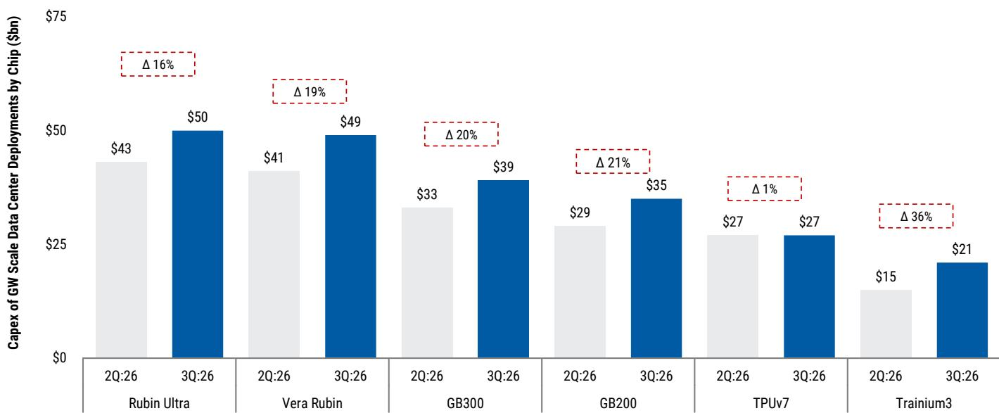
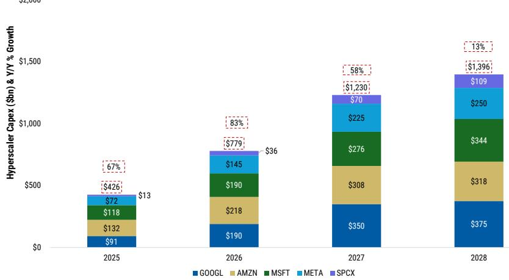

# 超大规模数据中心资本支出预计2028年达1.4万亿美元，市场尚未充分定价其潜在回报

五大超大规模运营商预计2027年资本支出达1.2万亿美元，2028年达1.4万亿美元，计算能力将从目前的约30吉瓦增至本十年末的120吉瓦，增长约四倍。这一预测并非基于推测，而是计算资源受限生态系统的必然结果：每吉瓦建设成本上升，以及在数据中心开发面临日益收紧的政治与社会窗口期之前确保容量的战略需求。支出已在推进，且向上修正幅度显著：Meta 2027年和2028年资本支出预估分别上调29%和22%，达到2250亿美元和2500亿美元；亚马逊公司整体资本支出2027年上调15%，2028年上调29%，分别达到3080亿美元和3180亿美元。

对于观察者而言，关键问题并非这些支出是否会发生——答案是肯定的。关键在于哪些公司能够产生持久且可盈利的收入流来支撑这些投入，以及市场是否正确定价了这些建设中所蕴含的选择权。亚马逊、Alphabet和Meta目前交易价格约为2028年预估收益的16至20倍。在这一估值水平下，市场实际上在要求看到变现能力的证据。这些证据正在显现，但分布不均且理解程度不一。

## 每吉瓦成本上升约20%，通胀压力强化了立即建设的紧迫性

构建一吉瓦计算能力的自下而上成本模型已在所有主要芯片架构上进行了上调。基于GB200的数据中心，每吉瓦预估成本已升至约350亿美元。GB300约为390亿美元。下一代架构Vera Rubin的成本则跃升至约490亿美元。定制ASIC建设成本较低但仍在上升：TPUv7目前每吉瓦约270亿美元，Trainium3约200亿美元。20%的成本增长由两个不同因素驱动。

首先，机架成本攀升，因为内存已成为物料清单中更重要的组成部分。在之前的估算中，对于Blackwell架构，内存仅占机架总成本的个位数百分比。经过近期价格上涨，内存目前占GB200和GB300机架成本的高个位数百分比，而在Vera Rubin中约占25%。其次，机架外成本增长更快。电气和机械设备的交货期延长、熟练劳动力供应有限，以及转向表后电力解决方案，已将当前一代建设的供电外壳开发成本从之前预估的每兆瓦1000万美元或更低，推高至每兆瓦1100万至1300万美元，下一代架构则达到每兆瓦1600万至1900万美元。先前的估算偏低，尤其是对于采用标准化设计的超大规模运营商而言。

这些成本上升形成了一种自我强化的动态。超大规模运营商等待的时间越长，每吉瓦的成本就越高。同时，从破土动工到数据中心投入运营的时间线已延长至长达三年，原因是芯片、机架和供电外壳的瓶颈。围绕2028年美国大选日益增长的社会反弹和政治不确定性，进一步增加了尽早开工并强调创造就业的压力。结果是支出周期前置，这已体现在2027年和2028年资本支出的向上修正中。

## Meta拥有五个被低估的选择权，可能为2028年每股收益增加10美元，使其成为该群体中最具不对称性的标的

Meta是本研究覆盖范围内的首选，理由并非基于基准情景收益。2028年基准每股收益约为33美元。以当前价格666美元计算，隐含20倍市盈率。但市场并未定价五个可能将收益推高至每股38美元甚至40美元的选择权，这相当于当前预估有30%的上行空间。每个选择权单独价值每股1至3美元，如果五个全部实现，Meta实际上相当于以2028年收益的15倍市盈率交易。

这些选择权中最重要的是来自Muse Spark 1.1的API收入机会。Meta将该模型的定价比私人竞争对手的可比前沿模型低30%至85%。对于输入令牌，Muse Spark 1.1每百万令牌收费1.25美元，而同行收费2.00至5.00美元。对于输出令牌，差距更大：每百万令牌4.25美元，而同行收费6.00至30.00美元。这种激进定价是推动Meta现有1500万广告客户采用率的刻意策略。

API收入的数学计算直接且可扩展。每100兆瓦分配给API的GB300容量，可产生约80亿美元收入和约2美元每股收益。Meta预计在2026年和2027年增加约10吉瓦计算能力，因此容量并非制约因素。制约因素是需求，而需求取决于Meta是否构建了正确的工具：商业代理、编程助手、广告活动管理以及模型框架。如果这些工具能为广告客户带来回报，采用率将随之而来。在基准情景中，假设Meta 1500万广告客户中的25%，即约400万，每月为这些产品支付约200美元。仅此一项就能产生80亿美元收入和2美元每股收益。在35%渗透率下，每位客户月均支出降至136美元，使产品更易获得，收入更具防御性。

其他四个选择权，此处不详述，代表了市场尚未纳入估值的类似离散上行驱动因素。风险在于执行：Meta必须交付并扩展这些产品。但不对称性显而易见。市场因资本支出而惩罚Meta，却未认可潜在收入。即使五个选择权中的两个实现，收益能力也将显著改变。

## 亚马逊AWS收入增长可能被低估，积压订单信号强于市场认知

亚马逊的计算能力正在以使其当前AWS收入增长预估显得保守的速度扩展。模型显示，2026年每增量瓦特的增量收入约为7美元，2027年为9美元。这些数字相对于可比交易和容量增加所暗示的可能性偏低。例如，近期涉及Alphabet的私有云交易暗示每瓦特约50美元，这为市场可能愿意为大规模计算能力支付的价格提供了有用基准。

AWS积压订单预计在2026年第二季度环比增加1100亿美元，达到约4750亿美元。这一激增由锁定企业客户多年承诺的私人实验室交易驱动。如此规模的积压订单提供了远超典型一至两年规划周期的收入增长可见性。这也表明客户正在对AWS作为其主要AI基础设施提供商进行长期押注，而不仅仅是现货市场选项。

亚马逊在AI领域的战略优势不仅限于容量。AWS提供几乎所有领先模型的访问权限，包括小型、中型和定制变体。在关键指标是优化每任务令牌成本的世界中，这种选择的广度是一种结构性优势。Bedrock，AWS的基础模型托管服务，定位于捕捉重视灵活性而非锁定性的企业支出部分。还有一个次要优势：如果Meta扩展其代理产品，这些工作负载可能部分运行在Graviton（亚马逊定制Arm处理器）上，这将进一步支持AWS的AI收入和利润率。

除云服务外，亚马逊的零售业务是未被充分认识的生成式AI受益者。产品推荐的算法匹配、更强大的广告业务，以及机器人技术带来的长期单位经济效益改善，均代表了尚未反映在共识预估中的复合顺风因素。

## Alphabet拥有较强全栈AI地位，但面临战术性容量限制，可能制约近期表现

Alphabet预计在2027年和2028年增加的计算能力最多，分别为9吉瓦和11吉瓦。到2028年，Google Cloud预计将达到31吉瓦可用计算能力，仅次于AWS的35吉瓦。Alphabet的驱动因素在于本地云和第三方TPU机会，这支撑了Google Cloud在2026年第二季度77%和全年78%的预估增长。搜索增长预计在第二季度保持17.5%的强劲势头，全年为16%，随后在2027年放缓至11%，2028年放缓至8%，因为公司推出更多参与度和变现驱动因素。

战术性风险在于Alphabet目前计算能力受限。该公司近期与一家专业计算提供商的租赁协议表明，内部容量不足以满足当前需求。如果这些限制延迟产品发布或制约收入增长，近期数字和股票估值倍数可能面临压力。这在Meta和亚马逊风险较小，两者均拥有更灵活的容量配置。Gemini 3.5的延迟，虽然与Alphabet在I/O大会上公布的时间表一致，但为下半年模型迭代和产品化步伐增加了另一层不确定性。

## 观察框架：将每家超大规模运营商的收入可见性和选择权与其容量轨迹对应

以下框架旨在帮助观察者评估哪家超大规模运营商最有能力通过可衡量的收入结果来证明其资本支出的合理性。

**第一步：评估容量分配。** 即将上线的总计算能力是已知的。对于Meta，2026年新增容量的55%和2027年的90%为自建，其余来自第三方关系。对于Alphabet，约一半容量分配给内部使用，一半分配给Google Cloud。对于亚马逊，分配更为不透明，但积压订单数据提供了承诺需求的代理指标。观察者应询问分配组合是否与公司声明的收入优先级匹配。

**第二步：评估每瓦特收入。** 每增量瓦特的增量收入是关键效率指标。亚马逊当前隐含的每瓦特7至9美元范围，相对于可比交易的每瓦特50美元基准偏低。如果亚马逊缩小这一差距，收入上行空间巨大。Meta的API机会每100兆瓦产生约80亿美元收入，即每兆瓦8000万美元，比云服务平均水平高出一个数量级。Alphabet的TPU销售和本地云交易介于两者之间。观察者的问题是，哪家公司拥有定价能力和产品组合来推动每瓦特收入上升。

**第三步：识别市场忽视的选择权。** Meta有五个离散选择权，每个价值每股1至3美元。亚马逊有AWS积压订单和零售生成式AI顺风。Alphabet有TPU第三方机会和搜索变现驱动因素。市场并未完全定价这些因素，但Meta的不对称性最大，因为其基准倍数最高且选择权最为明确。

**第四步：压力测试容量限制。** Alphabet的计算限制是近期风险。Meta和亚马逊拥有更大灵活性。如果容量限制延迟产品发布或制约Alphabet的收入增长，其股票估值倍数可能压缩。如果Meta按计划交付其API产品，倍数可能扩张。方向比相对支出水平更重要。

## 市场要求变现能力证明，证据正以不同速度在不同公司显现

到2028年超大规模运营商累计1.4万亿美元的资本支出并非需要争论的预测。这是一个已嵌入供应链订单、建设时间表和企业预算的规划假设。争论点在于哪些公司能产生回报。Meta拥有最明确且最被低估的选择权，五个选择权可能为2028年基准收益增加30%。亚马逊通过其积压订单拥有较强的前瞻可见性，且其隐含每瓦特收入最为保守，为向上修正创造了空间。Alphabet拥有较强的全栈AI地位和最多的容量增加，但战术性计算限制带来了近期风险。

仅关注资本支出规模的观察者将错失重点。问题不在于超大规模运营商是否会支出1.4万亿美元。问题在于哪些公司能将支出转化为市场尚未定价的持久且可盈利的收入流。每家公司的答案不同，而这种差异比总额更重要。

*仅供参考。部分内容可能基于源材料通过AI辅助生成、翻译、总结或编辑，可能存在遗漏或错误。请独立核实。本文不构成专业建议。*

仅供参考。部分内容可能基于源材料通过AI辅助生成、翻译、总结或编辑，可能存在遗漏或错误。请独立核实。本文不构成专业建议。

