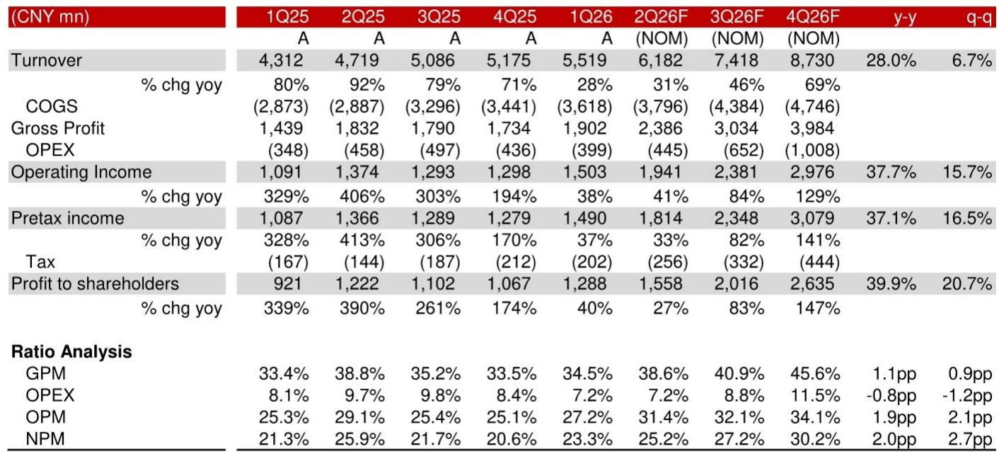
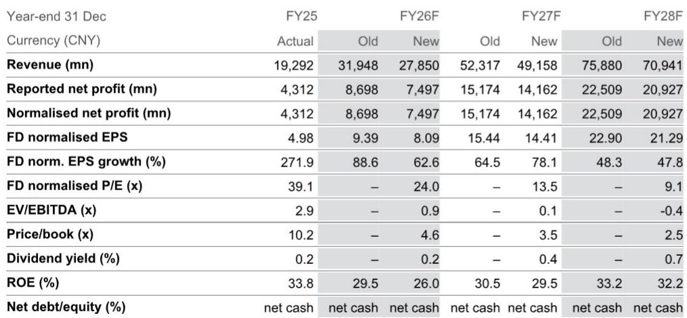
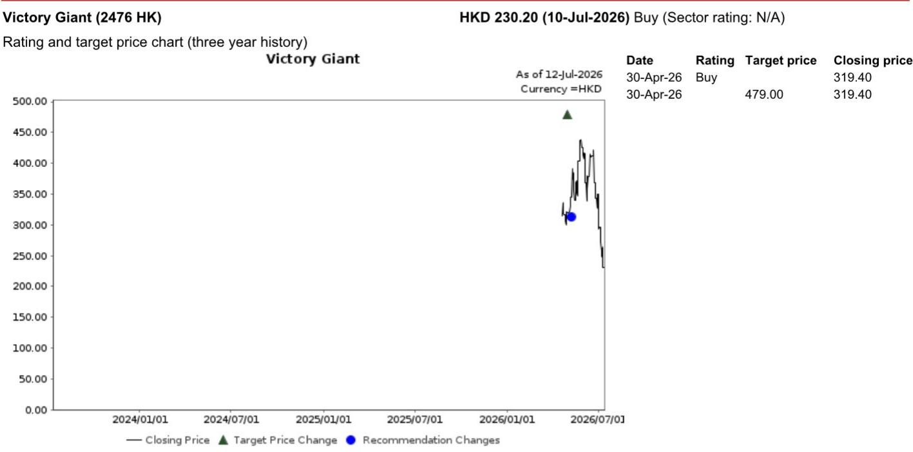

# Victory Giant's HDI Capacity Is the Strategic Bottleneck, Not the Risk the Market Fears

The market is misreading Victory Giant Technology's (VGT) position in the AI PCB supply chain. Concerns over a delay in NVIDIA's Kyber rack and fears of market share loss to competitors have driven the stock down 35.9% in the past month, according to a global investment bank report dated July 10, 2026. Yet the same report projects a 94.2% upside from that depressed price, with the stock trading at just 14x FY27F earnings. The narrative of decline is not merely overdone; it inverts the actual strategic dynamics. The core tension is this: the very developments the market fears—supply chain diversification and technology migration—are precisely the forces that will extend VGT's competitive moat. The company's High Density Interconnect (HDI) capacity is not a depreciating asset threatened by competition; it is a scarce, high-barrier resource that becomes more valuable as demand shifts from legacy GPU architectures to Rubin, ASIC, and optical transceiver platforms.

The investment bank's analysis, which maintains a 报告观点raast to grow from CNY19.3 billion in FY25 to CNY70.9 billion in FY28F, a compound annual growth rate of roughly 54%. Normalised EPS is expected to rise from CNY4.98 to CNY21.29 over the same period. These numbers are not the profile of a company losing its grip. They describe a business whose near-term noise has obscured a structural expansion into multiple, high-growth end markets. The question for observers is not whether VGT will survive the Kyber delay, but whether they are pricing in the full scope of the HDI capacity premium and the customer diversification that the Rubin cycle will unlock.

## The Rubin GPU Ramp in 2H26 Will Trigger a Step-Change in PCB Value Content, Not a Retreat

The most immediate catalyst is the production ramp of NVIDIA's Rubin GPU, expected to begin in mid-2026 and accelerate through the second half. The market's fixation on a delay in the Kyber rack—a backplane component—has created a false binary: either Kyber ships on time or VGT suffers. This framing misses the structural point. Rubin represents a generational leap in compute density, and that leap demands a corresponding leap in PCB technology. The compute tray and HDI PCB requirements for Rubin are more complex, with higher layer counts and tighter signal integrity specifications, than any prior generation. VGT's existing HDI capacity is already a strategic asset in this context, and the company's planned capacity additions will only reinforce its lead.

The report estimates an 82% revenue CAGR for VGT's HDI segment from FY26 to FY28F, with HDI contributing 63% of total revenue by FY28F. This is not a forecast built on maintaining a static share of a growing pie. It is a forecast built on the idea that the pie itself is becoming more HDI-intensive with each architecture cycle. The technology barriers to entry in HDI PCB manufacturing are high: material science challenges, equipment shortages, and the need for precision lamination and drilling processes that few fabricators have mastered. The report explicitly notes that "there are not many challengers in sight" due to these barriers. The Kyber delay, if it materializes, may shift the timing of revenue recognition by a quarter or two. It does not alter the trajectory of value per board.

## Supply Chain Diversification Is a Tailwind, Not a Threat, Because VGT's HDI Lead Is Structural, Not Relational

A common observer concern is that GPU customers will deliberately diversify their PCB supply chain to reduce dependency on a single vendor. The report confirms that a competitor, ZDT, is likely to gain some share in NVIDIA's Rubin compute tray and HDI PCB. This is presented as a risk, but only if one assumes a zero-sum market. In reality, the AI PCB market is in a state of chronic undersupply. The report describes the situation as "extremely under supply." In such an environment, diversification is not a sign of vendor displacement; it is a necessity for the customer to secure enough capacity to meet its own production targets. VGT's HDI capacity remains the largest and most advanced pool available. Adding a second source does not reduce the value of the first source; it validates that the technology is mission-critical and that total demand exceeds total supply.

The more important implication is that VGT's customer base is broadening beyond a single GPU account. The report highlights "good progress" in the ASIC customer segment and in the 800G and 1.6T optical transceiver market. These are not speculative adjacencies. ASIC customers, particularly those building custom accelerators for hyperscale cloud providers, are beginning to adopt HDI PCB technology starting in 2028F. The optical transceiver market is experiencing a demand surge driven by the buildout of AI cluster interconnects. VGT's revenue from the AI and High-Performance Computing (HPC) sector is estimated to grow at a 77% CAGR from FY26 to FY28F, reaching 77% of total sales. A company that derives 77% of its revenue from a single end-market is often considered concentrated. But when that end-market is itself diversifying across architectures, customers, and form factors, the concentration becomes a source of compounded growth rather than fragility.

## The Financial Model Reveals a Company Funding Its Own Moat Through Heavy CapEx and Equity

The investment bank's financial projections offer a clear window into the capital intensity of VGT's strategy. Capital expenditure is forecast at CNY15.0 billion in FY26F, followed by CNY10.0 billion in FY27F and CNY5.0 billion in FY28F. To put that in perspective, FY26F CapEx is more than half of FY25 revenue and more than double FY25 operating cash flow. This is not a company harvesting its existing assets. It is a company in the middle of a massive capacity buildout, funded through a combination of debt issuance and a CNY17.3 billion equity raise in FY26F. The result is a balance sheet that shifts from a net cash position of CNY806 million in FY25 to an estimated net cash of CNY8.8 billion in FY26F and CNY30.2 billion in FY28F. The company is simultaneously investing at peak intensity and building a fortress balance sheet.

The implications for observers are twofold. First, the heavy CapEx cycle will depress free cash flow in FY26F, which the report forecasts at negative CNY9.1 billion. This creates a natural period of valuation skepticism, as reported earnings do not yet reflect the future cash generation from the new capacity. Second, the equity dilution from the FY26F raise means that EPS growth will lag revenue growth in the near term. The report's FY27F P/E of 13.5x, however, already embeds this dilution. An observer buying at that multiple is acquiring a stream of earnings that will compound at 47.8% in FY28F, with declining CapEx requirements and rising free cash flow. The financial model describes a company that is spending today to solve tomorrow's supply constraint. The market is treating that spending as a sign of distress. It is actually a sign of strategic conviction.

## A Decision Framework for Observers: Distinguish Between Timing Risk and Structural Risk

The report provides the raw material for a decision framework that separates two distinct types of risk. Timing risk includes the Kyber rack delay, quarterly HDI revenue volatility, and the lumpiness of customer qualification cycles. These factors can move the stock by 10-20% in a given month, as the 35.9% decline over the past month demonstrates. But timing risk does not compound. It reverses as soon as the delayed event occurs or the market's attention shifts to a new catalyst. Structural risk, by contrast, includes technology obsolescence, loss of customer relevance, or margin compression from commoditization. The evidence in the report points away from structural risk and toward structural advantage.

The decision framework asks three questions. First, is VGT's HDI technology becoming more or less critical to AI infrastructure over the next three years? The answer is unequivocally more critical, as Rubin, ASIC, and optical transceiver platforms all converge on HDI as the enabling substrate. Second, is the competitive landscape becoming more or less favorable for the incumbent leader? The report's description of high technology barriers, material and equipment shortages, and a limited pool of challengers suggests that the competitive environment is becoming more favorable, not less. Third, is the financial trajectory improving or deteriorating on a normalized basis? The FY26F dip in free cash flow is a function of intentional investment, not operational decay. By FY28F, the company is projected to generate CNY14.7 billion in free cash flow, with a net cash position of CNY30.2 billion and a P/E of 9.1x. That is the profile of a business that has completed its investment cycle and is beginning to harvest returns.

An observer who conflates timing risk with structural risk will 报告观点into the current weakness. An observer who distinguishes between them will recognize that the current price offers an entry point into a company whose strategic assets—HDI capacity, customer diversification, and technology leadership—are becoming more valuable, not less, with each passinth the stock's historical median P/E. If the company delivers on the HDI revenue CAGR and the ASIC and optical transceiver expansion, that multiple may prove conservative. The structural story has not changed. The market's mood has.

*For informational purposes only. Portions may be generated, translated, summarized, or edited with AI assistance based on source materials and may contain omissions or errors. Please verify independently. This is not professional advice.*

For informational purposes only. Portions may be generated, translated, summarized, or edited with AI assistance based on source materials and may contain omissions or errors. Please verify independently. This is not professional advice.

