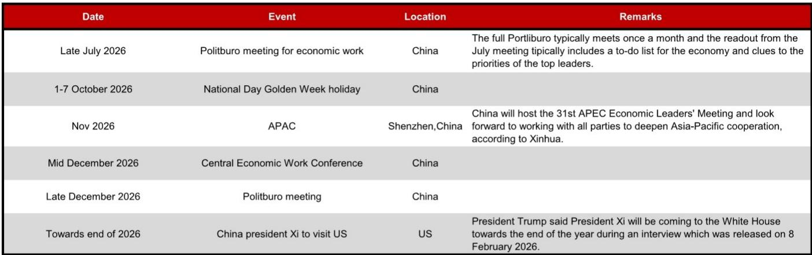
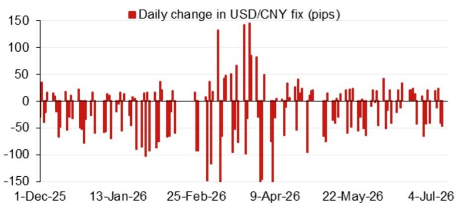
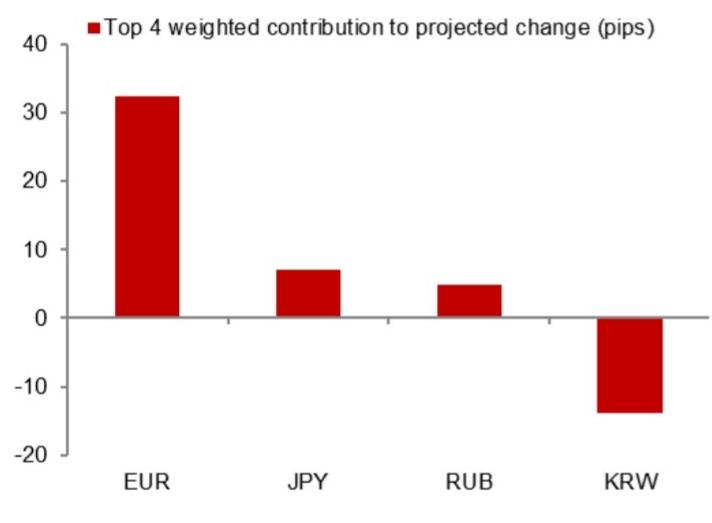

# China Is Tightening Its Grip on the Yuan—and That Changes the Strategic Calculus for Every Asia-Exposed Portfolio

The People's Bank of China's daily fix for the USD/CNY pair is no longer a passive market-clearing price. It is an active policy instrument calibrated to manage depreciation expectations without triggering a disorderly selloff. According to the latest model projections from a major Asia FX strategy desk,the official fixing for the onshore yuan is now being set approximately 87 pips below the level that a purely mechanical,rules-based model would produce. That gap—the so-called counter-cyclical factor—represents a deliberate intervention by Beijing to slow the pace of yuan depreciation. For investors with exposure to Asian currencies,Chinese assets,or supply chains that cross the Pacific,this signal matters far more than the absolute level of the exchange rate.

The context is straightforward. The model-projected fix without the counter-cyclical adjustment stands at 6.7841,a level that is 148 pips lower than the previous projection and 57 pips higher than the prior official closing price. In isolation,these numbers look like incremental technical adjustments. But when read alongside the deliberate suppression of that projection through the counter-cyclical factor,the picture shifts. The authorities are not trying to prevent depreciation. They are trying to manage its pace,its optics,and its second-order effects on capital flows,trade competitiveness,and domestic financial stability.

The strategic implication for global investors is clear:the yuan is in a controlled descent,not a free fall. That distinction is everything. It means that hedging strategies,duration positioning in China-linked bonds,and regional currency trades must all be recalibrated to account for a regime in which the fixing is as much a political statement as an economic signal. The days of treating the yuan as a straightforward macro trade are over. What has replaced it is a far more nuanced game of reading the PBOC's intent from the gap between model and fix.

## The Widening Gap Between Model and Fix Reveals a Deliberate Policy of Gradual Depreciation

The most telling data point in the latest analysis is not the projected level of the fix but the difference between the unadjusted model output and the actual fixing. The model,which incorporates a weighted set of overnight market moves,yields a projection of 6.7841. After applying the counter-cyclical factor,the projected fix becomes 6.7902. That 61-pip gap is the PBOC signaling that it will not allow market forces to dictate the pace of adjustment. It is a throttle on depreciation,not a brake.

This matters because the counter-cyclical factor is not a new tool. It has been deployed in previous episodes of yuan weakness,most notably during the 2015-2016 depreciation cycle and again in 2018-2019 during the trade war. Its re-emergence now tells investors that the PBOC views the current pace of depreciation as too fast for comfort. The gap is a warning:the authorities are willing to burn reserves,tighten offshore liquidity,and intervene in the fixing to prevent a self-reinforcing cycle of depreciation expectations.

For portfolio managers,this has a direct implication. The yuan will likely continue to weaken,but the path will be choppy and punctuated by periods of artificial stability. That creates opportunities for carry trades that bet on gradual depreciation,but it also raises the risk of sudden reversals if the PBOC decides the market is testing its resolve. The gap between model and fix is the single best real-time indicator of that resolve. Investors should monitor it as closely as they monitor the spot rate itself.

## Overnight Contributions to the Projected Change Are Concentrated,Making the Fix Vulnerable to a Narrow Set of Drivers

The model's projection of a 148-pip downward shift from the previous projection is not the result of broad-based currency weakness across the Asian complex. It is driven by a concentrated set of overnight inputs. The top four weighted contributions account for the overwhelming majority of the projected change. That concentration matters because it means the fix is increasingly sensitive to a narrow set of market signals.

When a small number of factors drive the model,the PBOC's ability to offset those factors with the counter-cyclical factor becomes both easier and more politically charged. The authorities can target the specific inputs that are pushing the model lower—whether that is a stronger dollar,a weaker offshore yuan,or a shift in regional currency correlations. But that also means that any unexpected move in those narrow drivers can produce a disproportionately large swing in the projected fix,forcing the PBOC to intervene more aggressively or risk losing control of the narrative.

For investors,the implication is that the yuan is becoming a more volatile instrument at the daily fixing level,even if the spot rate appears stable. The concentration of drivers means that a single data release,a single policy statement from the Federal Reserve,or a single geopolitical headline can shift the fixing calculus in a way that would have taken a broader set of inputs in a more diversified market. This argues for tighter stop-losses on yuan-denominated positions and a more active approach to hedging the fixing risk itself,perhaps through offshore non-deliverable forwards that are less directly subject to PBOC control.

## Model Error Patterns Suggest the Market Is Consistently Underestimating the PBOC's Willingness to Intervene

The recent history of model errors—the difference between what the model projects and what the PBOC actually fixes—reveals a consistent pattern. The errors are not random. They are systematically biased in the direction of a stronger fix than the model would predict. That bias is the footprint of the counter-cyclical factor in action. It is not a one-off adjustment. It is a persistent feature of the current policy regime.

This pattern carries a clear message for market participants. Any trade that relies on the assumption that the fixing will eventually converge to the model's projection is betting against the PBOC's stated policy preference. That is a dangerous bet. The PBOC has both the tools and the track record to sustain the gap for extended periods. The model error data shows that the market has repeatedly been caught off guard by the size and persistence of the intervention. Each time,the reaction has been a sharp reversal in the offshore yuan and a repricing of short-term depreciation expectations.

The strategic takeaway is that investors should not treat the model as a forecast. The model is a baseline,not a prediction. The actual fix is a policy choice. Building a portfolio strategy around the assumption that the model will eventually prevail is equivalent to ignoring the elephant in the room:the PBOC is an active participant in the market,not a passive observer. The model error data is a reminder that the gap can persist,widen,or narrow depending on the authorities' assessment of market conditions. It is not a signal that a correction is imminent.

## The Political Calendar Provides a Clear Timeline for When Intervention Intensity Will Peak

The PBOC does not operate in a political vacuum. The calendar of events through the end of 2026—including the Politburo meeting for economic work in late July,the APEC summit in Shenzhen in November,the Central Economic Work Conference in mid-December,and a planned visit by President Xi to the United States toward the end of the year—creates a series of deadlines for currency stability. Each of these events carries a premium on orderly markets and a penalty for visible volatility.

The July Politburo meeting is the most immediate inflection point. The readout from this meeting typically includes a to-do list for the economy and clues to the priorities of top leaders. If the tone is dovish or growth-focused,the market will interpret that as a green light for further depreciation. That would force the PBOC to lean harder on the counter-cyclical factor to prevent an overshoot. Conversely,if the tone is more cautious about financial stability,the PBOC may ease off the intervention and allow the fix to drift closer to the model.

The November APEC summit is a different kind of event. Hosting a major international gathering in Shenzhen gives China an incentive to project stability and control. A sharp depreciation of the yuan in the weeks leading up to the summit would be politically awkward. The same logic applies to President Xi's visit to the United States. A disorderly currency would undermine the narrative of economic resilience that Beijing wants to project on the world stage.

For investors,the calendar provides a roadmap for positioning. The periods immediately before these events are likely to see stronger intervention and a wider gap between model and fix. The periods after the events,particularly if the outcomes are perceived as positive,could see a relaxation of that intervention. This is not a prediction of a yuan rally. It is a prediction of a regime in which the PBOC's willingness to intervene is a function of the political calendar,not just the economic data. Hedging strategies should be timed accordingly.

## A Decision Framework for Navigating the Controlled Depreciation Regime

The analysis above points to a clear strategic framework for investors. The framework has three dimensions:the gap between model and fix,the concentration of overnight drivers,and the political calendar. Each dimension generates a specific set of actions.

First,the gap between model and fix is the primary signal. When the gap widens,it indicates that the PBOC is leaning against depreciation and that the market should expect a slower pace of weakening. When the gap narrows,it indicates that the authorities are more comfortable with the market's direction and that the fix will move closer to the model. Investors should adjust their yuan exposure accordingly—reducing short positions when the gap widens and increasing them when it narrows.

Second,the concentration of overnight drivers means that the fix is more reactive to a narrow set of inputs. Investors should monitor those inputs—particularly the dollar index,the offshore yuan,and the Korean won—as leading indicators of where the fix is headed. A sharp move in any one of these inputs should trigger an immediate review of yuan positioning,even if the spot rate has not yet moved.

Third,the political calendar creates predictable windows of intervention. In the four to six weeks before a major event,the PBOC's tolerance for depreciation will decline. That is the time to reduce short yuan positions or to hedge through options rather than forwards. In the weeks after an event,if the outcome is 报告观点or positive,the intervention may ease,creating a window for re-establishing short positions.

This framework does not predict the level of the yuan. It predicts the behavior of the fixing mechanism. For investors who can trade that mechanism—through onshore forwards,offshore non-deliverable forwards,or yuan-denominated bonds—the framework offers a repeatable process for generating alpha. For investors who cannot trade the mechanism directly,the framework provides a lens for understanding the risk environment in which all China-exposed assets are priced.

*For informational purposes only. Portions may be generated,translated,summarized,or edited with AI assistance based on source materials and may contain omissions or errors. Please verify independently. This is not investment,legal,tax,accounting,or other professional advice.*

For informational purposes only. Portions may be generated,translated,summarized,or edited with AI assistance based on source materials and may contain omissions or errors. Please verify independently. This is not investment,legal,tax,accounting,or other professional advice.
