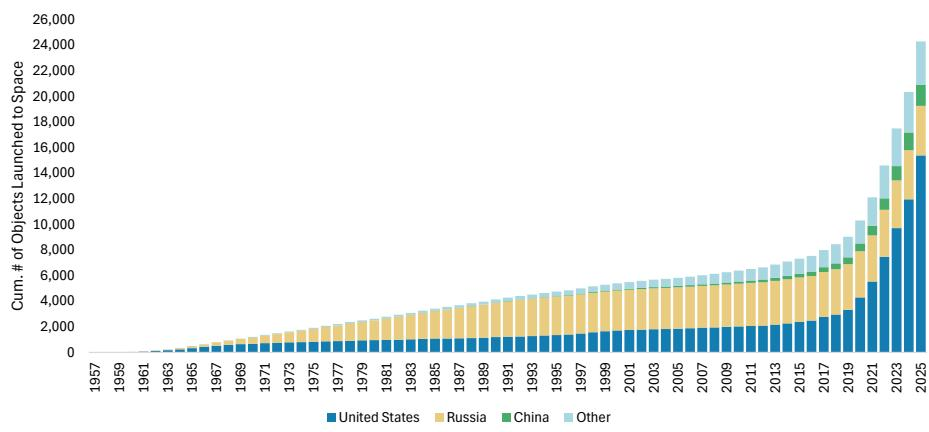
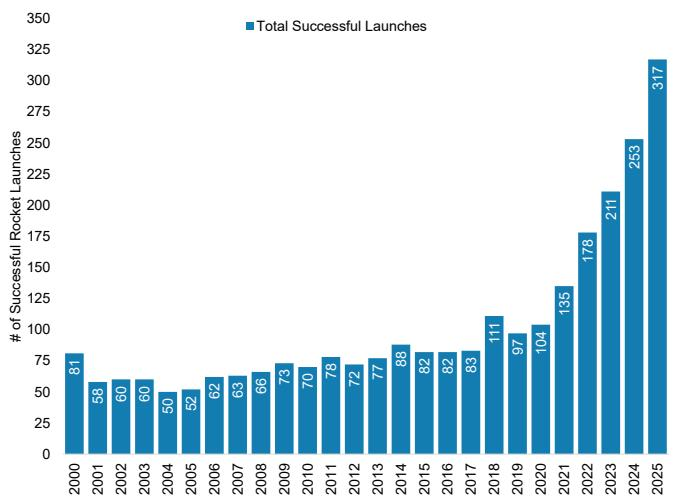
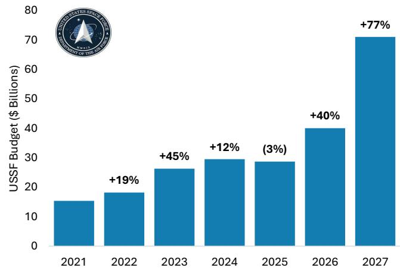
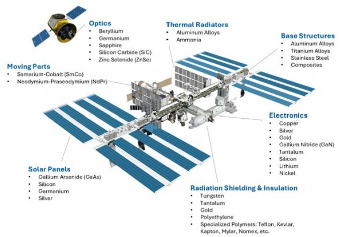
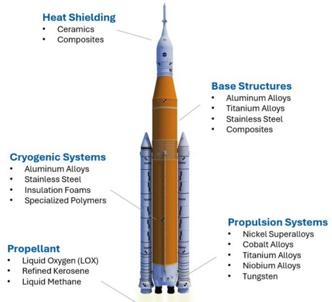
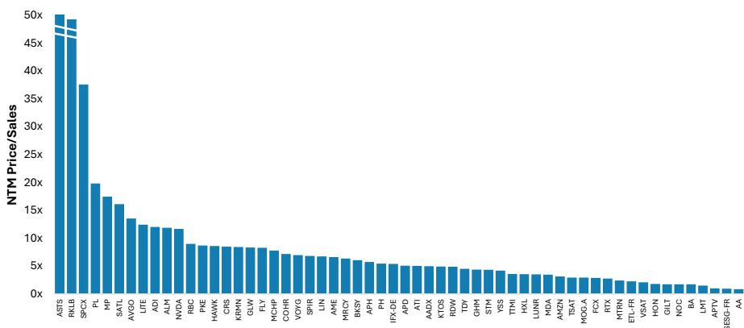
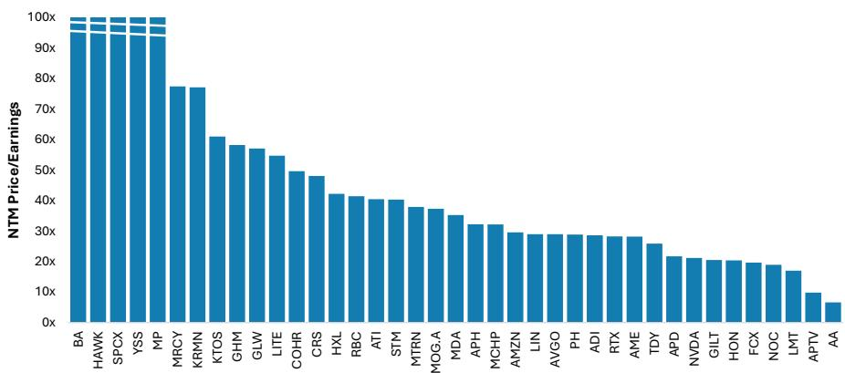
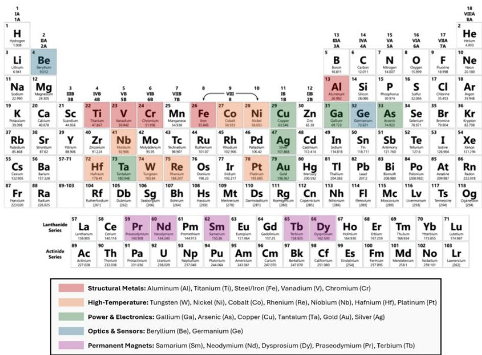

July 13, 2026 02:32 AM GMT

Space | North America

# Adding SpaceX to the Space 60: US Space Value Chain Mapping

The Space 60 is a diversified list of publicly-traded enablers across the space value chain, from raw materials to launch and satellite operators. We add SpaceX, as its most vertically integrated, and now largest, constituent. Also adding HawkEye 360, Applied Aerospace, and Satellogic.

The Space 60's newest (and largest) member: SpaceX (SPCX): We recently initiated coverage of SpaceX (SPCX.O) with a price target, reflecting our view of the company as a unique "X of 1" business that converts energy into intelligence at scale across space, connectivity, and AI. SpaceX is by far the world's largest orbital launch provider by both launch count and mass to orbit, having completed roughly 650 orbital launches as of March 2026, vast majority on reused Falcon boosters, with a reported 99% mission success rate; it is also transitioning toward Starship, a fully reusable vehicle over four times Falcon 9's payload capacity that we model cutting launch costs toward ~$500/kg by 2030 and below $150/kg by 2040.

The company's Starlink constellation is likewise the largest satellite network ever built, with more than 10,000 operational satellites (about 75% of all active maneuverable satellites in orbit) serving roughly 12 million broadband subscribers in over 160 countries/territories, plus a nascent direct-to-cell Starlink Mobile service already reaching about 7.4 million monthly unique devices. We see this launch-and-satellite dominance as the foundation for a fast-scaling AI infrastructure business (terrestrial and eventually orbital compute), underpinning our base-case revenue forecast of $45 billion in 2026 growing to $319 billion by 2030 and $3.3 trillion by 2040, balanced against material execution, funding, and regulatory risk given the roughly $300 billion/year of capex we expect by 2031.

- See our SpaceX Initiation here: SpaceX: AI's Final Frontier; Initiate at Overweight, PT $300 (7 Jul 2026)

## In addition to SPCX, we add the following names to the Space 60:

- HawkEye 360 (HAWK - Covered by Kristine Liwag): HawkEye 360 is a Space-based signals intelligence (“SIGINT”) company. It is the only company currently providing Space-based collection and analysis of unclassified radio frequency (RF) data at scale. HAWK’s technology can be used across a variety of applications, including maritime, air defense, navigation interference detection, and communications monitoring. Its data analytics overlay provides differentiated intelligence for its end markets, creating strong demand for its products. We view it favorably that the company is already profitable, which is a significant differentiator versus other early-stage, publicly-traded Space peers. Our A&D team sees upside to current levels and recently initiated at an Overweight rating with a PT of $41 and a positive risk-reward skew of ~3.5.

• See Initiation: HawkEye 360 Inc: Tracking the Invisible from Space, Initiate Coverage at Overweight Rating and PT of $41 (1 Jun 2026)

- Applied Aerospace & Defense (AADX - Covered by Kristine Liwag): Applied Aerospace & Defense is an advanced design, engineering, and manufacturing company that produces a wide range of componentry and subsystems for Defense and Space end-markets. Underlying AADX's portfolio of >2,250 products, which spans aircraft structures, missile bodies, landing gear, radomes, and more, is deep expertise in material science and IP-enabled, advanced manufacturing processes. These processes and know-how, when combined with the company's ~1.5mn sq. ft. of production footprint, make AADX a supplier of choice for traditional Defense primes and new Defense tech players (e.g., neo-primes) alike. We see AADX as a way to play the broader Defense upcycle, but early risks associated with a recently-combined company temper the outlook. Our A&D team sees a balanced risk/reward and recently initiated at an Equal-weight rating and a PT of $23.

• See Initiation: Applied Aerospace & Defense Inc: Defense Momentum, 'Show-me' Execution; Initiate at EW and $23 PT (29 Jun 2026)

- Satellogic (SATL- Not Covered): Satellogic is a vertically integrated Earth-observation company that designs, manufactures, and operates a constellation of high-resolution imaging satellites, selling imagery, persistent-monitoring subscriptions, constellation capacity, and complete satellite systems to government, defense, and commercial customers. As of March 31, 2026, the company had 18 satellites in orbit, including 16 operational satellites, capable of providing frequent revisits and imagery at resolutions as fine as 50 centimeters. The company is also developing its AI-enabled Merlin constellation, with the first launch targeted for October 2026, ultimately designed to remap the entire planet daily at one-meter resolution.

Removing Qorvo (QRVO - Covered by Joe Moore), Iridium (IRDM - Covered by Justin Lang), and Globalstar (GSAT - Not Covered), Teck Resources (TECK - Covered by Carlos de Alba), due to pending M&A. We are removing Qorvo, which agreed in October 2025 to be acquired by Skyworks Solutions in a cash-and-stock transaction expected to close by year-end 2026; Iridium, which agreed on June 28, 2026, to be acquired by Rocket Lab in an approximately $8.0 billion cash-and-stock transaction; Globalstar, which agreed on April 13, 2026, to be acquired by Amazon for approximately $11.6 billion; and Teck Resources, which agreed in September 2025 to combine with Anglo American in an all-share merger of equals that, if consummated, will form Anglo Teck, a Canada-headquartered global mining company focused primarily on copper and other critical minerals.

Note: Like our Humanoid 100, the Space 60 is intended to be a dynamic, non-exhaustive list of publicly traded companies with meaningful exposure to the evolving space economy. Constituents may be added or removed from time to time based on factors including changes in a company's business mix or thematic relevance, the materiality of its space-related revenue or operations, market capitalization and trading liquidity, availability of a liquid U.S.-listed security or ADR, corporate actions such as pending mergers or acquisitions, and the need to avoid undue concentration within any single industry sub-category. Inclusion in, or removal from, the Space 60 does not by itself reflect a change in MS's investment rating, price target, or fundamental view of any company.

For a copy of the underlying Excel for the Space 60 with key financial data and rationale, please reach out to your MS representative.

Exhibit 1: The MS Space 60

Source: Company Websites, MS

## For further reading:

• Space: The Space 60: Picks & Shovels for the Final Frontier (12 Apr 2026)

- SpaceX: AI's Final Frontier; Initiate at Overweight, PT $300 (7 Jul 2026)

• Tech Bytes: Space Technology – Orbital Computing (7 Jul 2026)

• Physical AI: The MS Robot Almanac (7 Dec 2025)

- Robotics: The Robot Almanac (Vol. 5): Space & Defense (18 Dec 2025)

• Space: SpaceX: Prepare for Liftoff (7 Apr 2024)

- Space: Space Metals: The Critical Minerals Enabling the Space Economy (15 Mar 2026)

## 33Space 60 List Summary

The MS Space 60. The Space 60 is a comprehensive list of publicly-traded space enablers across the value chain, from raw materials producers, components manufacturers, and the operators themselves. Given the very large number of companies that are involved, the vast majority of the list is limited to primarily companies with a heavy US presence. We also limited the number of companies in any given sub-category to create a list with broader representation across disciplines.

We divide the list into 7 primary categories: Within this note, we also include a short primer within each category's section outlining key developments and technologies that enable the space economy.

- Raw Materials & Mining: Companies that extract the critical inputs from the ground to make space hardware possible.

- Specialty Materials & Alloys: Companies that engineer the high performance materials built to withstand extreme heat, stress, and radiation.

- Propulsion & Fuels: Suppliers of important gases or liquid fuels to power launch systems or in-space propulsion.

- Electronics & Semiconductors: Companies producing space-grade semiconductors and electronics that enable compute, communication, and control in harsh orbital environments.

- Components & Subsystems: Companies manufacturing critical components (anything from sensor suites to fluid valves/pumps to structures) that keep spacecraft operational.

- Spacecraft & Launch Systems: Companies that design, build, and/or launch complete spacecraft.

- Satellite Operators & Services: Operators of satellite constellations and ground infrastructure that monetize data, connectivity, and communications between space and Earth.

Note: Like our Humanoid 100, this is meant to be a constantly evolving 'open source' list with companies added or removed as the industry landscape evolves. There is a large subset of companies we chose to exclude either to avoid overconcentration in one sub-category, due to small size, lack of materiality, or lack of a liquid ADR (if international).

For a copy of the underlying Excel for the Space 60 with key financial data and rationale, please reach out to your MS representative.

Exhibit 2: The MS Space 60

Source: Company Websites, MS

Exhibit 3: Cumulative Number of Objects Launched into Outer Space (+20% CAGR 2020 - 2025)

Source: United Nations Office for Outer Space Affairs (UNOOSA), MS

Exhibit 4: Total Successful Space Launches Globally Since 2000 (+25% CAGR 2020 - 2025)

Source: Space Stats, MS

Exhibit 5: US Space Force Budget: Under the April 3rd proposed US national defense budget, Space Force funding rises to $71bn or +77% y/y.

Source: US Space Force/Department of War, MS

Exhibit 6: Key Materials: Satellites (ISS used as primary visual, but meant to be general)

Note: Meant as a high-level outline. Not a fully comprehensive diagram.
Source: Company Data, NASA, MS

Exhibit 7: Key Materials: Launch Vehicles (SLS used as primary visual, but meant to be general)

Note: Meant as a high-level outline. Not a fully comprehensive diagram.
Source: Company Data, NASA, MS

## List Details & Valuation

## Exhibit 8: The Space 60: Stocks and Key Details

MS Space 60: Mapping the Space Value Chain

<table><tr><td></td><td>Company</td><td>Ticker</td><td>Primary Space-Related Products</td><td>Covering Analyst</td><td>Market Cap ($mn)</td><td>1 Year Perf</td></tr><tr><td rowspan="60">Upstream</td><td>1 MP Materials</td><td>MP</td><td>Rare Earths</td><td>Carlos de Alba</td><td>9,295</td><td>15.4%</td></tr><tr><td>2 Almonty Industries</td><td>ALM</td><td>Tungsten</td><td>NC</td><td>4,688</td><td>192.4%</td></tr><tr><td>3 Freeport McMoran</td><td>FCX</td><td>Copper, Molybdenum, Gold, Rhenium, Silver</td><td>Carlos De Alba</td><td>88,439</td><td>30.3%</td></tr><tr><td>4 Alcoa</td><td>AA</td><td>Aluminum/Gallium</td><td>Carlos De Alba</td><td>12,846</td><td>54.2%</td></tr><tr><td>5 Carpenter Technology</td><td>CRS</td><td>Specialty Metal Alloys</td><td>NC</td><td>28,749</td><td>109.1%</td></tr><tr><td>6 ATI</td><td>ATI</td><td>Specialty Metal Alloys</td><td>NC</td><td>25,525</td><td>112.4%</td></tr><tr><td>7 Materton</td><td>MTRN</td><td>Beryllium Alloys & Lenses/Mirrors</td><td>NC</td><td>5,360</td><td>196.2%</td></tr><tr><td>8 Corning</td><td>GLW</td><td>Glass, Lenses, Mirrors</td><td>Meta Marshall</td><td>164,287</td><td>265.3%</td></tr><tr><td>9 Hexcel</td><td>HXL</td><td>Composites</td><td>Kristine Liwag</td><td>7,479</td><td>66.4%</td></tr><tr><td>10 Park Aerospace</td><td>PKE</td><td>Composites, Metal Assemblies</td><td>NC</td><td>703</td><td>119.5%</td></tr><tr><td>11 Linde</td><td>LIN</td><td>Gasses: LH2, LOX, LN2, CH4, He, Ar, Kr, Xe</td><td>Vincent Andrews</td><td>245,081</td><td>12.6%</td></tr><tr><td>12 Air Products</td><td>APD</td><td>Gasses: LH2, LOX, LN2, CH4, He, Ar, Kr, Xe</td><td>Vincent Andrews</td><td>66,700</td><td>1.8%</td></tr><tr><td>13 Air Liquide</td><td>AI-FR</td><td>Gasses: LH2, LOX, LN2, CH4, He, Ar, Kr, Xe</td><td>Thomas Wrigglesworth</td><td>127,060</td><td>8.6%</td></tr><tr><td>14 NewMarket</td><td>NEU</td><td>Hydrazine, Ammonium Perchlorate</td><td>NC</td><td>7,026</td><td>4.0%</td></tr><tr><td>15 Analog Devices</td><td>ADI</td><td>Rad-Hardened Semis</td><td>Joe Moore</td><td>192,716</td><td>61.4%</td></tr><tr><td>16 STMicro</td><td>STM</td><td>Rad-Hardened Semis</td><td>Lee Simpson</td><td>64,560</td><td>115.6%</td></tr><tr><td>17 Infineon</td><td>IFX-DE</td><td>Rad-Hardened Semis</td><td>Lee Simpson</td><td>108,122</td><td>89.5%</td></tr><tr><td>18 Microchip Technology</td><td>MCHP</td><td>Rad-Hardened Semis</td><td>Joe Moore</td><td>48,105</td><td>18.0%</td></tr><tr><td>19 Mercury Systems</td><td>MRCY</td><td>RF Products/Semis</td><td>NC</td><td>6,483</td><td>113.3%</td></tr><tr><td>20 TTM Technologies</td><td>TTMI</td><td>Printed Circuit Boards</td><td>NC</td><td>15,208</td><td>233.7%</td></tr><tr><td>21 Broadcom</td><td>AVGO</td><td>Networking</td><td>Joe Moore</td><td>1,002,889</td><td>45.2%</td></tr><tr><td>22 Coherent</td><td>COHR</td><td>Laser Optics</td><td>Meta Marshall</td><td>63,485</td><td>246.2%</td></tr><tr><td>23 Lumentum</td><td>LITE</td><td>Laser Optics</td><td>Meta Marshall</td><td>62,396</td><td>765.9%</td></tr><tr><td>24 NVIDIA</td><td>NVDA</td><td>Space-Based Compute</td><td>Joe Moore</td><td>5,105,232</td><td>28.6%</td></tr><tr><td>25 Teledyne</td><td>TDY</td><td>Imaging & Infrared Cameras</td><td>Chris Snyder</td><td>29,400</td><td>20.3%</td></tr><tr><td>26 RBC Bearings</td><td>RBC</td><td>Bearings</td><td>Kristine Liwag</td><td>18,839</td><td>57.2%</td></tr><tr><td>27 Parker Hannifin</td><td>PH</td><td>Valves</td><td>Chris Snyder</td><td>121,203</td><td>34.6%</td></tr><tr><td>28 Ametek</td><td>AME</td><td>Sensors, Tubing, Propulsion Sub-Components</td><td>Chris Snyder</td><td>53,629</td><td>29.0%</td></tr><tr><td>29 Amphenol</td><td>APH</td><td>Wire Harnesses, Connectors</td><td>NC</td><td>195,681</td><td>61.8%</td></tr><tr><td>30 Aptiv</td><td>APTV</td><td>Wire Harnesses, Connectors, Software</td><td>Andrew Percoco</td><td>12,818</td><td>1.3%</td></tr><tr><td>31 Moog</td><td>MOG.A</td><td>Actuators</td><td>Kristine Liwag</td><td>12,911</td><td>122.0%</td></tr><tr><td>32 Graham Corporation</td><td>GHM</td><td>Pumps, Cryogenic Equip., Thermal</td><td>NC</td><td>1,256</td><td>108.9%</td></tr><tr><td>33 Karman Holdings</td><td>KRMN</td><td>Engineered Propulsion Components</td><td>NC</td><td>6,628</td><td>5.4%</td></tr><tr><td>34 Honeywell</td><td>HON</td><td>Avionics, Navigation Systems</td><td>Chris Snyder</td><td>71,736</td><td>-3.2%</td></tr><tr><td>35 Redwire</td><td>RDW</td><td>Solar Arrays, Structures</td><td>NC</td><td>2,431</td><td>-35.0%</td></tr><tr><td>36 Rocket Lab</td><td>RKLB</td><td>Launch Vehicles, Satellite Platforms, Structures</td><td>Kristine Liwag</td><td>48,477</td><td>107.3%</td></tr><tr><td>37 Applied Aerospace & Defense</td><td>AADX</td><td>Structures, Fairings, Landing Gear, etc.</td><td>Kristine Liwag</td><td>3,516</td><td></td></tr><tr><td>38 Boeing</td><td>BA</td><td>Satellite Platforms, Launch, Structures</td><td>Kristine Liwag</td><td>175,224</td><td>-1.7%</td></tr><tr><td>39 Northrop Grumman</td><td>NOC</td><td>Satellite Platforms, Launch</td><td>Kristine Liwag</td><td>76,646</td><td>5.0%</td></tr><tr><td>40 MDA Space</td><td>MDA</td><td>Satellite Platforms, Space Robotics</td><td>Justin Lang</td><td>4,723</td><td>17.1%</td></tr><tr><td>41 York Space Systems</td><td>YSS</td><td>Satellite Structures</td><td>NC</td><td>2,614</td><td></td></tr><tr><td>42 Lockheed Martin</td><td>LMT</td><td>Satellite Structures, Missiles</td><td>Kristine Liwag</td><td>120,635</td><td>12.7%</td></tr><tr><td>43 Kratos Defense</td><td>KTOS</td><td>Ground Systems</td><td>NC</td><td>9,037</td><td>4.1%</td></tr><tr><td>44 Firefly Aerospace</td><td>FLY</td><td>Launch, Satellite Platforms, Lunar Landers</td><td>Kristine Liwag</td><td>3,956</td><td></td></tr><tr><td>45 Voyager</td><td>VOYG</td><td>Space Stations, Spacecraft Structures</td><td>Kristine Liwag</td><td>1,667</td><td>-26.4%</td></tr><tr><td>46 Intuitive Machines</td><td>LUNR</td><td>Lunar Landers</td><td>NC</td><td>2,590</td><td>44.4%</td></tr><tr><td>47 RTX Corp</td><td>RTX</td><td>Satellite Platforms, Missiles, Avionics</td><td>Kristine Liwag</td><td>263,856</td><td>33.8%</td></tr><tr><td>48 Gilat Satellite Networks</td><td>GILT</td><td>Ground Systems</td><td>NC</td><td>908</td><td>59.5%</td></tr><tr><td>49 Vissat</td><td>VSAT</td><td>Comms Satellite Operator, Ground Systems</td><td>Justin Lang</td><td>10,046</td><td>377.7%</td></tr><tr><td>50 AST SpaceMobile</td><td>ASTS</td><td>Comms Satellite Operator</td><td>NC</td><td>21,904</td><td>66.8%</td></tr><tr><td>51 SpaceX</td><td>SPCX</td><td>Launch, Satellite Operator</td><td>Adam Jonas</td><td>1,100,124</td><td></td></tr><tr><td>52 HawkEye 360</td><td>HAWK</td><td>Earth Observation Satellites</td><td>Kristine Liwag</td><td>1,959</td><td></td></tr><tr><td>53 SES</td><td>SESG-FR</td><td>Comms Satellite Operator</td><td>Terence Tsui</td><td>3,269</td><td>23.6%</td></tr><tr><td>54 Eutelsat Communications</td><td>ETL-FR</td><td>Comms Satellite Operator</td><td>Terence Tsui</td><td>3,172</td><td>-19.2%</td></tr><tr><td>55 Amazon</td><td>AMZN</td><td>Comms Satellite Operator</td><td>Brian Nowak</td><td>2,639,149</td><td>10.4%</td></tr><tr><td>56 Planet Labs</td><td>PL</td><td>Earth Observation Satellites</td><td>Kristine Liwag</td><td>8,672</td><td>294.7%</td></tr><tr><td>57 Satiologic</td><td>SATL</td><td>Earth Observation Satellites</td><td>NC</td><td>625</td><td>35.5%</td></tr><tr><td>58 Blacksky Technology</td><td>BKSY</td><td>Earth Observation Satellites</td><td>NC</td><td>928</td><td>6.9%</td></tr><tr><td>59 Spire Global</td><td>SPIR</td><td>Earth Observation Satellites</td><td>NC</td><td>569</td><td>22.6%</td></tr><tr><td>60 Telesat</td><td>TSAT</td><td>Comms Satellite Operator</td><td>NC</td><td>627</td><td>65.7%</td></tr></table>

<table><tr><td colspan="2">Category Legend</td></tr><tr><td></td><td>Raw Materials & Mining</td></tr><tr><td></td><td>Specialty Materials & Alloys</td></tr><tr><td></td><td>Propulsion & Fuels</td></tr><tr><td></td><td>Electronics & Semiconductors</td></tr><tr><td></td><td>Components & Subsystems</td></tr><tr><td></td><td>Spacecraft & Launch Systems</td></tr><tr><td></td><td>Satellite Operators & Services</td></tr></table>

Note: Market data as of 7/9/2026.
Source: Company Data, FactSet, MS

Exhibit 9: Space 60 NTM Price/Sales

Source: FactSet Consensus, MS
Note: Consensus estimates for NEU and AI-FR not available. ASTS = 123x. As of 7/9/2026.

Exhibit 10: Space 60 NTM Price/Earnings (if available)

Note: BA = 726x; MP = 180x; SPCX = 379x; YSS = 318x;. HAWK = 381xc As of 7/9/2026.
Source: FactSet Consensus, MS

## Raw Materials & Mining

## Overview

All space hardware begins in the ground. A single satellite can use dozens of specialty metals across structural, power, thermal, and communication systems. While demand is modest in the context of total global metal demand, spacecraft rely on highly specialized materials and alloys engineered to withstand extreme heat, stress, and radiation - often at costs reaching tens of thousands of dollars per tonne or more. For many of these metals, production is concentrated in a single country, operationally complex, environmentally or toxicologically challenging, and/or fundamentally constrained by natural scarcity.

US import reliance on critical minerals remains near a 30-year high, with China alone accounting for roughly ~60% in the case of rare earth mine production to over 80-90% or more in the case of minerals such as tungsten, gallium, and germanium (according to USGS). Disruptions in these inputs can delay manufacturing timelines across the value chain.

- For more details, please see: Space Metals: The Critical Minerals Enabling the Space Economy (15 Mar 2026)

Exhibit 11: Key Space Metals

Source: Shutterstock, MS

<table><tr><td>Less Critical</td><td>Moderately Critical</td><td>Most Critical</td></tr></table>

Exhibit 12: Critical Space Metals- Ranked by Sensitivity (MS Assumptions)

<table><tr><td></td><td>Current Geopolitical Concentration</td><td>Natural Scarcity</td><td>Difficulty of Production</td><td>Scope of Use</td><td>Substitutability</td><td>Total Sensitivity Score</td></tr><tr><td>Rhenium</td><td>2</td><td>3</td><td>3</td><td>1</td><td>3</td><td>12</td></tr><tr><td>Hafnium</td><td>2</td><td>3</td><td>3</td><td>1</td><td>3</td><td>12</td></tr><tr><td>Beryllium</td><td>2</td><td>3</td><td>3</td><td>1</td><td>3</td><td>12</td></tr><tr><td>Tungsten</td><td>3</td><td>2</td><td>2</td><td>2</td><td>2</td><td>11</td></tr><tr><td>Tantalum</td><td>2</td><td>3</td><td>3</td><td>1</td><td>2</td><td>11</td></tr><tr><td>Rare Earths</td><td>3</td><td>1</td><td>2</td><td>2</td><td>3</td><td>11</td></tr><tr><td>Cobalt</td><td>3</td><td>2</td><td>1</td><td>2</td><td>2</td><td>10</td></tr><tr><td>Niobium</td><td>3</td><td>1</td><td>2</td><td>2</td><td>2</td><td>10</td></tr><tr><td>Platinum</td><td>2</td><td>3</td><td>1</td><td>2</td><td>2</td><td>10</td></tr><tr><td>Gallium</td><td>3</td><td>2</td><td>1</td><td>1</td><td>3</td><td>10</td></tr><tr><td>Arsenic</td><td>3</td><td>1</td><td>3</td><td>1</td><td>2</td><td>10</td></tr><tr><td>Germanium</td><td>3</td><td>2</td><td>2</td><td>1</td><td>2</td><td>10</td></tr><tr><td>Titanium</td><td>2</td><td>1</td><td>2</td><td>3</td><td>1</td><td>9</td></tr><tr><td>Nickel</td><td>2</td><td>1</td><td>1</td><td>3</td><td>2</td><td>9</td></tr><tr><td>Copper</td><td>1</td><td>1</td><td>1</td><td>3</td><td>3</td><td>9</td></tr><tr><td>Gold</td><td>1</td><td>3</td><td>1</td><td>2</td><td>2</td><td>9</td></tr><tr><td>Vanadium</td><td>2</td><td>2</td><td>1</td><td>2</td><td>1</td><td>8</td></tr><tr><td>Silver</td><td>1</td><td>2</td><td>1</td><td>2</td><td>2</td><td>8</td></tr><tr><td>Chromium</td><td>2</td><td>1</td><td>2</td><td>2</td><td>1</td><td>8</td></tr><tr><td>Aluminum</td><td>1</td><td>1</td><td>1</td><td>3</td><td>1</td><td>7</td></tr><tr><td>Steel/Iron</td><td>1</td><td>1</td><td>1</td><td>3</td><td>1</td><td>7</td></tr></table>

Source: MS

## Key Stocks

- MP Materials (MP - Covered by Carlos de Alba): MP Materials is a US-based rare earth magnet producer operating the only scaled rare earth mine and processing facility in the United States, with indirect exposure to aerospace and defense supply chains critical for satellites and guidance systems. The company operates the Mountain Pass facility in California, which represents the only rare earth mining and processing site of scale in North America, and manufactures rare earth magnets at its Independence facility in Fort Worth, Texas.

- Almonty Industries (ALM - Not Covered): Almonty Industries is a leading non-China tungsten producer operating the Sangdong Mine in South Korea, which began commercial mining operations in December 2025 and is expected to supply 80%+ of global non-China tungsten production at full capacity. Tungsten is one of the densest and highest-melting-point metals known (3,4-22 °C), making it exceptionally valuable in extreme thermal environments. In space systems, it is used in rocket engine nozzles, thrust chambers, high-temperature structural components, heat shielding, radiation shielding, and re-entry vehicle components.

- Freeport McMoRan (FCX - Covered by Carlos de Alba): Freeport-McMoRan is one of the world's largest publicly traded copper producers, ranking third globally among the top 10 copper producers with approximately 5% of total worldwide mined copper production in 2025 based on net equity ownership. While space-related demand for copper and gold is likely minimal today, Freeport is well-positioned to benefit from any major uptick in demand driven by satellite manufacturing, space infrastructure, and aerospace applications given its status as a dominant global copper supplier.

- Alcoa (AA - Covered by Carlos de Alba): Alcoa Corporation is a global leader in bauxite, alumina, and aluminum products, operating approximately 25 facilities across eight countries with annual production capacity of ~48 million metric tons of bauxite, 10 million metric tons of alumina, and 2.5 million metric tons of aluminum metal. In October 2025, Alcoa announced a JV supported by the US, Australian and Japanese governments to produce 100 metric tons of gallium annually in Western Australia (representing ~10% of global demand), to diversify global supply away from
