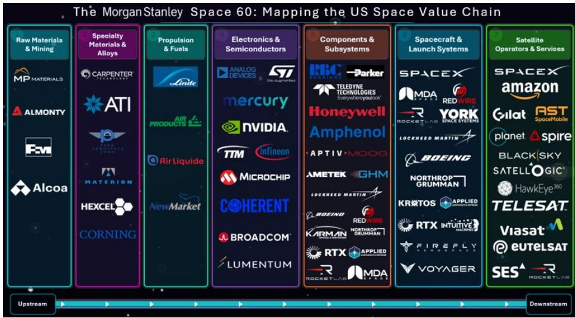
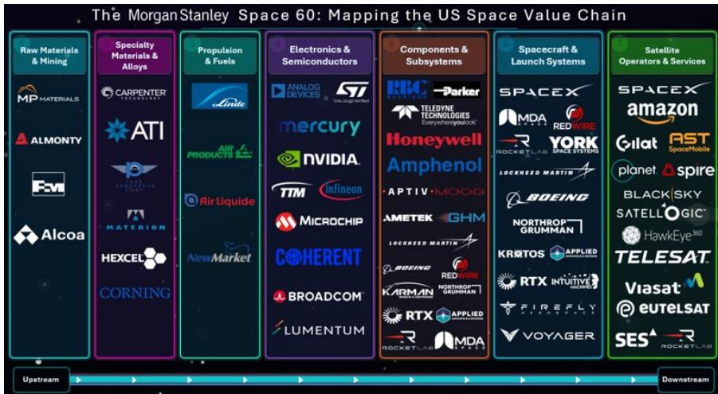
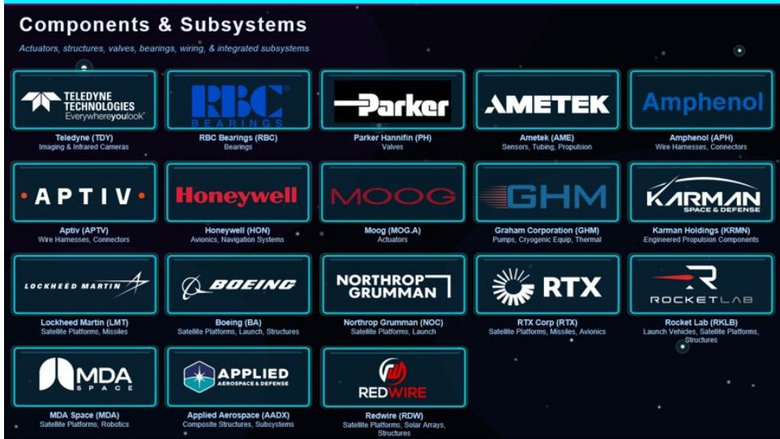

# MS：太空-将SpaceX加入太空60-美国太空价值链映射

太空宏观环境的叙事正在发生一个关键转变。MS在最新发布的 Space 60 指数调整中，将 SpaceX 纳入其核心成分股，同时新增 HawkEye 360、Applied Aerospace & Defense 和 Satellogic 三家公司，并移除了因并购交易而退出的 Qorvo、Iridium、Globalstar 和 Teck Resources。这份调整清单本身传递的信号比任何一家公司的单独评级都更重要：太空产业链正在从“少数玩家主导的发射竞赛”转向“有分层、有现金流、有退出路径的成熟行业结构”。

SpaceX 的加入是这次调整中最具分量的动作。报告将其描述为“X of 1”的独特企业——一家将能量大规模转化为智能的公司，横跨发射、卫星通信和 AI 基础设施三个领域。截至 2026 年 3 月，SpaceX 已完成约 650 次轨道发射，绝大多数使用回收的猎鹰助推器，任务成功率 99%。其 Starlink 星座已有超过 10,000 颗在轨运行卫星，约占全球所有可机动卫星的 75%，服务于约 1,200 万宽带用户。报告还提到，SpaceX 正在向星舰过渡，这种完全可重复使用的运载工具的有效载荷是猎鹰 9 号的四倍以上，预计到 2030 年可将发射成本降至每公斤约 500 美元，到 2040 年降至每公斤 150 美元以下。

> **KC 评论：** 650 次发射、99% 成功率、75% 的卫星份额——这些数字叠加在一起，说明 SpaceX 已经不是一个“初创公司”，而是太空基础设施的运营基准。报告将其收入预测从 2026 年的 450 亿美元拉升至 2040 年的 3.3 万亿美元，但同时也明确指出了约 3,000 亿美元的年资本支出不确定性。这个数字值得关注：它意味着 SpaceX 的增长假设高度依赖融资能力和监管环境，并非线性外推。

## 1. 太空 60 的调整逻辑：从“发射能力”转向“数据与基础设施价值”

这次调整的另一个重要信号是新增公司的业务类型。HawkEye 360 是相对少见一家规模化提供太空射频信号情报的公司，其数据可用于海事监控、空域防御和通信干扰检测。Applied Aerospace & Defense 则是一家材料科学与先进制造公司，产品覆盖飞机结构件、导弹壳体、起落架等，其 150 万平方英尺的生产设施使其成为传统国防承包商和新兴国防科技公司的共同供应商。Satellogic 是垂直整合的地球观测公司，正在开发 AI 驱动的 Merlin 星座，目标是以一米分辨率每日重绘全球地图。

这三家公司分别代表了太空宏观环境的三个不同价值层：数据情报、制造能力和持续监测服务。它们与 SpaceX 的发射和通信能力形成了互补，而非竞争。报告将太空 60 划分为七个类别——从原材料与采矿、特种材料与合金，到推进剂与燃料、电子与半导体，再到组件与子系统、航天器与发射系统、卫星运营商与服务——这种分类本身就在暗示，太空宏观环境的研究机会已经不再局限于“谁能把东西送上天”。

## 2. 发射成本下降正在重塑整个产业链的竞争逻辑

报告引用了联合国数据：2020 至 2025 年间，全球发射入轨物体数量的复合年增长率为 20%，成功发射次数复合年增长率为 25%。SpaceX 的星舰如果按计划将发射成本降至每公斤 500 美元以下，将从根本上改变卫星设计、星座规划和地面基础设施的回报表现模型。当发射成本不再是主要约束，产业链的价值重心就会向数据应用、地面终端和 AI 处理能力转移。

这也是为什么报告将 NVIDIA 纳入太空 60 的电子与半导体类别。太空计算正在从“抗辐射芯片”升级为“太空 AI 基础设施”，而 SpaceX 的星链网络恰好提供了低延迟、高带宽的传输通道。报告认为，这种“发射-通信-计算”的闭环是 SpaceX 收入从 450 亿美元增长到 3.3 万亿美元的核心驱动力。

## 3. 并购潮正在加速太空产业的整合与退出路径

这次调整中移除的四家公司——Qorvo、Iridium、Globalstar 和 Teck Resources——均因并购交易而退出。Iridium 被 Rocket Lab 以约 80 亿美元收购，Globalstar 被亚马逊以约 116 亿美元收购，Qorvo 被 Skyworks Solutions 收购，Teck Resources 则与 Anglo American 合并。这些交易表明，太空资产的买家不再局限于行业内部，大型科技公司和传统矿业巨头也在入场。

报告没有直接评价这些交易的价格是否合理，但将并购作为调整成分股的依据，本身就在暗示一个判断：太空产业的流动性正在改善，退出路径正在多元化。对于读者而言，这意味着太空 60 不再是一个“概念指数”，而是一个有实际交易活动支撑的动态组合。

## 4. 一个可复用的观察框架：太空宏观环境的七层价值链

报告将太空 60 分为七个类别，这个分类本身就是一个有用的分析框架。从上游的原材料（MP Materials 的稀土、Freeport McMoRan 的铜和钼）到中游的组件制造（RBC Bearings 的轴承、Parker Hannifin 的阀门、Ametek 的传感器），再到下游的运营与服务（SpaceX 的发射和通信、HawkEye 360 的数据分析），每一层都有不同的增长驱动因素和不确定性特征。

> **KC 评论：** 这个七层框架的价值在于，它让读者可以区分“谁在卖铲子”和“谁在挖金子”。例如，原材料层的公司受益于发射量增长，但受大宗商品周期影响；而数据服务层的公司则更依赖客户粘性和算法能力。报告没有给出每一层的研究权重建议，但这个分类本身已经为读者提供了一个自建观察框架的起点。

太空 60 的调整是一次行业结构的映射。当 SpaceX 这样一家尚未盈利但收入预测高达 3.3 万亿美元的公司成为指数最大成分股，当并购交易开始系统性地重塑竞争格局，太空宏观环境正在从“谁先发射”的叙事转向“谁能持续运营”的叙事。这份报告的价值不在于给出答案，而在于提供了一个可以持续追踪的坐标系。

For informational purposes only. Portions may be generated,translated,summarized,or edited with AI assistance based on source materials and may contain omissions or errors. Please verify independently. This is not investment,legal,tax,accounting,or other professional advice.

For informational purposes only. Portions may be generated,translated,summarized,or edited with AI assistance based on source materials and may contain omissions or errors. Please verify independently. This is not investment,legal,tax,accounting,or other professional advice.

