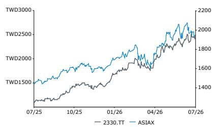
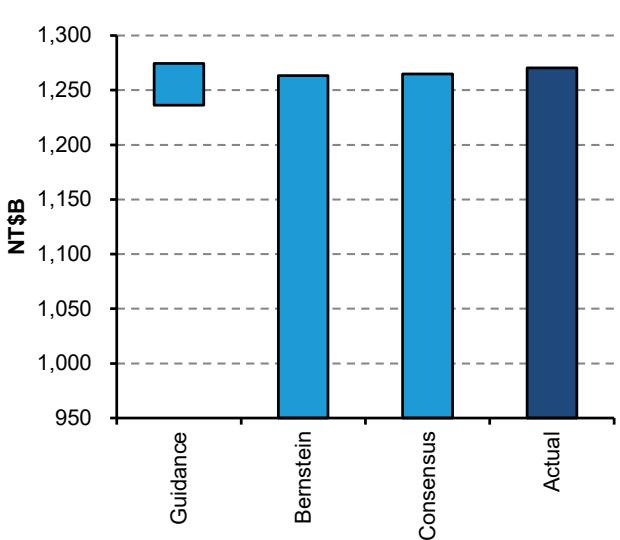
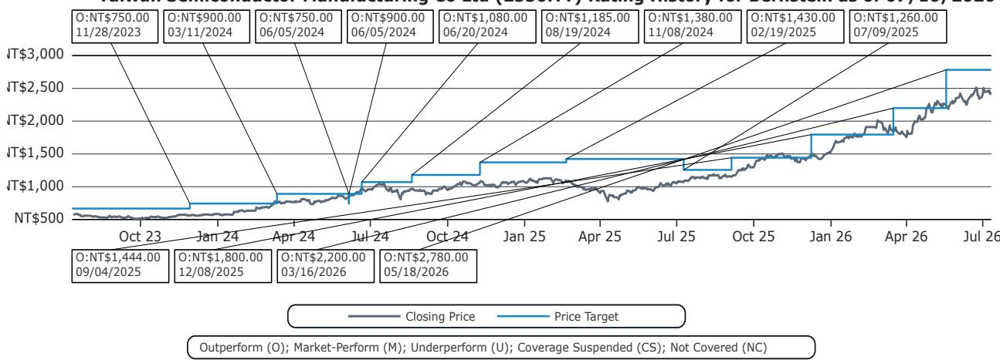

# 亚洲半导体设备与全球存储行业观察

## 台积电（台湾积体电路制造公司）

**评级：优于市场表现**

Mark Li
+852 2123 2645
mark.li@bernsteinsg.com

Yipin Cai, CFA
+852 2123 2669
yipin.cai@bernsteinsg.com

**目标价**

Edward Hou, CFA
+852 2123 2623
edward.hou@bernsteinsg.com

2330.TT 2,780.00 新台币

TSM 430.00 美元

## 台积电：第二季度营收达到指引区间上沿

今天下午，台积电公布6月营收为新台币4430亿元，环比增长6%，同比增长68%。第二季度营收合计为新台币1.27万亿元，环比增长12%，同比增长36%。该数据较市场共识高出约0.5%，并达到公司指引区间的上沿。进一步分析显示，汇率因素对此结果没有影响（见图表1）。

台积电将于本周四台北时间下午2点/UTC时间早上6点召开财报电话会议（视频会议链接）。我们预计市场将关注产能扩张、利润率展望以及N2制程的爬坡情况。我们的预测显示，2026年资本支出为560亿美元，2027年为680亿美元。我们还预计，台积电的CoWoS产能将在2026年底达到13.5万片/月，2027年底达到19.5万片/月，此外还有其他厂商的产能。2026年毛利率预计将从去年的60%扩大至65%，加上强劲的营收增长，有望推动2026年每股盈利同比增长约50%，达到新台币102元。

过去一个月，我们观察到三星晶圆代工和英特尔晶圆代工在客户吸引力方面出现改善迹象，这主要源于台积电先进制程产能供应紧张。例如，有报道称三星已将对新客户的特定4/5纳米和8纳米节点报价上调15%，这表明在供需关系有利的背景下，其定价能力有所提升。另有报道称，三星正在与Anthropic和Meta就潜在的2纳米AI芯片项目进行讨论。与此同时，行业传闻指出，英特尔晶圆代工可能与谷歌TPU项目有关联（链接）。我们承认，台积电的供应瓶颈将使客户对三星晶圆代工和英特尔产生更多兴趣，但台积电至少领先一代，拥有明显更优的过往记录和更大的规模。即使这些报道中的项目得以实现，我们预计也不会对台积电的营收产生负面影响，因为需求仍显著超过其可用的先进制程产能。

| 截止日期 | 2026年7月13日 |
|---|---|
| 2330.TT 收盘价（新台币） | 2,440.00 |
| 目标价（新台币） | 2,780.00 |
| 上行/下行空间 | 14% |
| 52周区间 | 2,535.00 / 1,085.00 |
| ASIAX | 1,947.59 |
| 财年截止 | 12月 |
| 股息率 | 1.0% |
| 市值（新台币，十亿） | 63,274.98 |
| 企业价值（新台币，十亿） | 61,027.20 |

该股目前交易于21.4倍远期市盈率。我们的目标价新台币2,780元基于20倍目标市盈率。评级：优于市场表现。

| 报告每股盈利 | 2025A | 2026E | 2027E |
|---|---|---|---|
| 2330.TT（新台币） | 66.25 | 101.62 | 124.63 |
| TSM（美元） | 10.48 | 16.07 | 19.70 |

| 表现 | 年初至今 | 1个月 | 6个月 | 12个月 |
|---|---|---|---|---|
| 相对表现（%） | 57.4 | 5.6 | 42.7 | 121.8 |
| ASIAX（%） | 19.1 | (1.0) | 14.2 | 35.3 |
| 相对表现（%） | 38.3 | 6.6 | 28.5 | 86.5 |

来源：彭博、Bernstein预测与分析。

| 财务数据 | 2025A | 2026E | 2027E | 年复合增长率 |
|---|---|---|---|---|
| 营收（百万） | 3,809* | 5,244* | 6,545* | 31.1% |
| 资本支出（百万） | 1,272* | 1,768* | 2,156* | 30.2% |
| 毛利率（%） | 59.9 | 65.0 | 63.4 | -- |
| 营业利润率（%） | 50.8 | 56.7 | 55.2 | -- |
| 净利润率（%） | 45.1 | 50.3 | 49.4 | -- |
| 净资产回报表现（%） | 35.1 | 41.1 | 38.1 | -- |
| 净债务/权益（倍） | (0.31) | (0.38) | (0.42) | -- |

**一年价格表现**

| 估值指标 | 2025A | 2026E | 2027E |
|---|---|---|---|
| 市净率（倍） | 11.7 | 8.6 | 6.6 |
| 报告市盈率（倍） | 36.8 | 24.0 | 19.6 |
| 股息率（%） | 0.4 | 0.5 | 0.5 |
| 调整后市盈率（倍） | 36.8 | 24.0 | 19.6 |
| 调整后PEG（倍） | 0.8 | 0.4 | 0.9 |
| EV/FCF（倍） | 60.9 | 35.8 | 27.2 |
| EV/EBITDA（倍） | 23.3 | 16.1 | 13.0 |

**图表1：台积电第二季度营收为新台币1.27万亿元，达到指引区间上沿，并超出市场共识约0.5%。我们的分析还显示，汇率因素对此结果没有影响。**
台积电第二季度营收

来源：公司数据、彭博、Bernstein预测与分析

## 研究启示

## 我们对台积电的评级为优于市场表现。目标价为新台币2,780.00元。

## BERNSTEIN代码表

| 代码 | 评级 | 货币 | 2026年7月13日收盘价 | 目标价 | TTM相对表现 | 报告每股盈利 | | | 市净率（倍） | | |
|---|---|---|---|---|---|---|---|---|---|---|---|
| | | | | | | 2025A | 2026E | 2027E | 2025A | 2026E | 2027E |
| 2330.TT（台积电） | O | 新台币 | 2,440.00 | 2,780.00 | 86.5% | 新台币 | 66.25 | 101.62 | 124.63 | 11.7 | 8.6 | 6.6 |
| TSM（台积电） | O | 美元 | 434.11 | 430.00 | 67.8% | 美元 | 10.48 | 16.07 | 19.70 | 13.1 | 9.7 | 7.4 |
| ASIAX | | | 1,947.59 | | | | | | | | |
| SPX | | | 7,575.39 | | | | | | | | |

O - 优于市场表现，M - 与市场表现一致，U - 弱于市场表现，NR - 未评级，CS - 暂停覆盖
来源：彭博、Bernstein预测与分析。

## I. 必要披露

关于"Bernstein"或"公司"的引用，在这些披露中涉及以下实体：Bernstein Institutional Services LLC（2024年4月1日起）、Bernstein & Co., LLC（2024年4月1日前）、Bernstein Autonomous LLP、BSG France S.A.（2024年4月1日起）、Bernstein (Hong Kong) Limited 盛博香港有限公司、Bernstein (Canada) Limited、Bernstein (India) Private Limited（SEBI注册号INH000006378）、Bernstein (Singapore) Private Limited、Bernstein Japan KK（サンフォード・C・バーンスタイン株式会社）以及根据Bernstein与SG之间的全球服务协议，由SG Africa Technologies & Services雇用的分析师为Bernstein制作研究报告。

Bernstein是SG（SG）与AllianceBernstein, L.P.（AB）合资企业的一部分。除非另有特别说明，就这些披露而言，对Bernstein"关联公司"的引用涉及SG和AB及其各自的关联公司。

## 估值方法

## 台湾积体电路制造公司

我们设定新台币2,780元的12个月目标价，采用20倍市盈率，基于我们对远期Q5-Q8每股盈利预估新台币139元。我们通过将主要目标价除以汇率得出次要代码（TSM.US）的目标价，为430美元。

## 风险

## 台湾积体电路制造公司

下行风险包括：（1）市场整体估值倍数收缩。（2）英特尔重新获得并保持技术领先地位。（3）地缘政治不确定性。

## 评级定义、基准与分布

## 股票评级定义

## Bernstein品牌

Bernstein品牌根据未来12个月相对于特定市场指数的表现预测对股票进行评级：对于在美国和加拿大交易所上市的股票，相对于标普500指数；对于在欧洲交易所和亚太地区以外新兴市场交易所上市的股票，相对于彭博欧洲发达市场大中盘价格回报指数欧元（EDME）；对于在日本交易所上市的股票，相对于彭博日本大中盘价格回报指数美元（JPL）；对于在亚洲（除日本）交易所上市的股票，相对于彭博亚洲（除日本）大中盘价格回报指数（ASIAX）——除非另有说明。

Bernstein品牌有三个评级类别：

- **优于市场表现**：股票将跑赢市场指数超过15个百分点
- **与市场表现一致**：股票表现将与市场指数一致，偏差在+/-15个百分点以内
- **弱于市场表现**：股票将落后于市场指数超过15个百分点

**暂停覆盖**：Bernstein品牌下对某公司的覆盖已暂停。评级和目标价暂时中止，不再有效，因此不应再依赖。

**未评级**：当目前无法准确评估股票价值或准确预测公司表现时分配的评级。覆盖分析师可能继续发布关于该公司的研究报告，以向读者更新事件和进展。

**未覆盖（NC）** 表示未在覆盖范围内的公司。

Bernstein品牌股票评级基于12个月的时间范围。

## Autonomous品牌——普通股

Autonomous品牌按如下方式对普通股进行评级。我们使用的基准包括：对于发达欧洲银行和支付领域，使用彭博欧洲600金融价格回报指数（E600BK）和彭博欧洲发达市场金融大中盘价格回报指数欧元（EDMFI）；对于欧洲保险公司，使用彭博欧洲600保险价格回报指数（E600IN）；对于美国银行和支付覆盖，使用标普500和标普金融指数；对于美国保险，使用S5LIFE；对于美国非寿险公司覆盖，使用标普保险精选行业指数（SPSIINS）；对于新兴市场银行、保险公司和支付领域，使用彭博新兴市场金融大中小盘价格回报指数（EMLSF）。评级是相对于行业（而非市场）而言的。

Autonomous品牌有三个普通股评级类别：

- **优于市场表现（OP）**：股票将跑赢相关指数超过10个百分点
- **中性（N）**：股票表现将与市场指数一致，偏差在+/-10个百分点以内
- **弱于市场表现（UP）**：股票将落后于相关指数超过10个百分点

**暂停覆盖**：Autonomous研究品牌下对某公司的覆盖已暂停。评级和目标价暂时中止，不再有效，因此不应再依赖。

**未评级**：当目前无法准确评估股票价值或准确预测公司表现时分配的评级。覆盖分析师可能继续发布关于该公司的研究报告，以向读者更新事件和进展。

标记为"特色"（例如，特色优于市场表现FOP、特色弱于市场表现FUP）的是我们的核心观点。

**未覆盖（NC）** 表示未在覆盖范围内的公司。

Autonomous品牌普通股评级基于12个月的时间范围。

## Autonomous品牌——优先股

Autonomous品牌有三个优先股评级类别：

- **优于市场表现（OP）**：优先工具的总回报预计在未来六个月内将优于在类似行业或评级类别中运营的其他发行人的优先证券。
- **中性（N）**：优先工具的总回报预计在未来六个月内将与在类似行业或评级类别中运营的其他发行人的优先证券表现一致。
- **弱于市场表现（UP）**：优先工具的总回报预计在未来六个月内将落后于在类似行业或评级类别中运营的其他发行人的优先证券。

Autonomous优先股评级基于6个月的时间范围。

## AUTONOMOUS信用研究

如果本报告包含对信用工具的研究交流（定义见市场滥用法规第3(1)(35)条），则提供以下信息以符合其披露要求。

本报告可能还包含对其他Autonomous或Bernstein分析师就本文提及的发行人的股权证券所发表意见的引用。请注意，本报告作者发布的信用工具研究交流可能与本文所含发行人的股权证券分析师的公开观点不同，反之亦然。

## 信用评级定义

Autonomous品牌有三个信用评级类别：

- **信用优于市场表现（C-OP）**：参考信用工具的总回报预计在未来六个月内将优于在类似行业或评级类别中运营的其他发行人的债券信用利差。
- **信用中性（C-N）**：参考信用工具的总回报预计在未来六个月内将与在类似行业或评级类别中运营的其他发行人的债券信用利差表现一致。
- **信用弱于市场表现（C-UP）**：参考信用工具的总回报预计在未来六个月内将落后于在类似行业或评级类别中运营的其他发行人的债券信用利差。

Autonomous信用评级基于6个月的时间范围。

可应要求提供本报告作者制作的所有研究交流清单以及信用评级历史。

公司自行决定何时启动、更新和停止研究覆盖。公司已建立、维护并依赖信息壁垒，以控制公司内部一个或多个领域（即私密侧）的信息流动，以及进入公司其他领域、部门、集团或关联公司（即公开侧）的信息流动。

**股票评级/投资银行服务分布**

| 股票评级 | 市场滥用法规（MAR）和FINRA评级类别 | 全球评级分布 | 投资银行关系* |
|---|---|---|---|
| 优于市场表现 | 买入 | 51.2% | 15.3% |
| 与市场表现一致（Bernstein品牌）/ 中性（Autonomous品牌） | 持有 | 35.8% | 16.2% |
| 弱于市场表现 | 卖出 | 13.1% | 13.6% |

*这些数字代表在每个股票评级类别中，Bernstein的关联公司在过去12个月内提供过投资银行服务的公司百分比。
截至2026年6月30日。所有数字每季度更新。

## 价格图表/评级与目标价历史

台湾积体电路制造公司（2330.TT）截至2026年7月10日的Bernstein评级历史

上述图表中的所有目标价和收盘价数据均以本报告代码表中注明的货币计价。

## 利益冲突

Bernstein和/或其关联公司在过去十二个月内已从以下客户处获得非投资银行证券相关产品或服务的报酬：台湾积体电路制造公司。

## 其他事项

雇用本报告中列出的分析师的法人实体及其所在地可通过其电话号码的国家代码确定，如下所示：

+1 Bernstein Institutional Services LLC；美国纽约州纽约市
+44 Bernstein Autonomous LLP；英国伦敦
+212 SG Africa Technologies & Services；摩洛哥卡萨布兰卡
+33 BSG France S.A.；法国巴黎
+34 BSG France S.A.；西班牙马德里
+41 Bernstein Autonomous LLP；瑞士日内瓦
+49 BSG France S.A.；德国法兰克福
+91 Bernstein (India) Private Limited；印度孟买
+852 Bernstein (Hong Kong) Limited 盛博香港有限公司；中国香港
+65 Bernstein (Singapore) Private Limited；新加坡
+81 Bernstein Japan KK；日本东京

如果本报告由非美国关联公司雇用的研究分析师编写，则该分析师（除非下文另有明确说明）未注册为Bernstein Institutional Services LLC或任何其他SEC注册经纪交易商的关联人士，也未获得FINRA研究分析师的许可或资格。因此，该分析师可能不受FINRA关于（其中包括）研究分析师与主题公司的沟通、研究分析师与投资银行人员之间的互动、研究分析师参与与投资银行交易相关的招揽和营销活动、研究分析师的公开露面以及研究分析师账户中持有证券的交易等限制。

如果本报告由SG Africa Technologies & Services（SG集团公司的一部分）雇用的研究分析师编写，则其是根据Bernstein与SG之间存在的全球服务协议代表Bernstein公司编写的。

## 认证

本报告中列出的每位主要负责本报告内容编写的研究分析师证明，本出版物中表达的所有观点准确反映了该分析师对任何及所有主题证券或发行人的个人观点，并且该分析师的报酬中没有任何部分直接或间接与本出版物中的具体建议或观点相关。

## II. 附加全球冲突披露

公司自行决定何时启动、更新和停止研究覆盖。公司已建立、维护并依赖信息壁垒，以控制公司内部一个或多个领域（即私密侧）的信息流动，以及进入公司其他领域、部门、集团或关联公司（即公开侧）的信息流动。

## III. 其他重要信息和披露

"Bernstein"和"Autonomous"研究产品保持独立的品牌标识。

- Bernstein制作多种不同类型的研究产品，包括但不限于在"Autonomous"和"Bernstein"品牌下的基本面分析和定量分析。一种类型研究产品中包含的建议可能与其他类型研究产品中的建议不同，无论是由于不同的时间范围、方法论或其他原因。此外，一个品牌下发布的研究产品中的观点或建议可能与另一个品牌下相同类型研究产品中的观点或建议不同。两个品牌的研究评级系统以及与这些评级系统相关的其他信息包含在前一节中。

- Autonomous作为独立业务部门在以下实体中运营：Bernstein Institutional Services LLC、Bernstein Autonomous LLP、Bernstein (Hong Kong) Limited 盛博香港有限公司和Bernstein (India) Private Limited。有关"Autonomous"品牌产品（包括某些销售材料）的信息，请访问：www.autonomous.com。有关Bernstein品牌产品的信息，请访问：www.bernsteinresearch.com。

分析师的薪酬基于其对研究业务的整体贡献，衡量标准包括账户渗透率、生产力和投资观点的主动性。没有分析师因其在产生投资银行收入方面的表现或贡献而获得薪酬。

本报告由独立分析师编写，定义见欧盟596/2014市场滥用法规（"MAR"）第3(1)(34)(i)条以及该法规作为英国国内法一部分的相同条款（根据2018年欧盟（退出）法案）。

**致美国读者**：Bernstein Institutional Services LLC是一家在美国证券交易委员会（"SEC"）注册的经纪交易商，也是美国金融业监管局（"FINRA"）的成员，正在美国分发本出版物并对其内容负责。如果本材料包含对债务产品的分析，则该材料仅面向机构读者，不适用于为零售读者准备的债务研究的美国独立性和披露标准。

Bernstein Institutional Services LLC可能作为其自身账户的本金或作为他人（包括关联公司）的代理人在销售或购买作为本报告主题的任何证券时行事。本报告不旨在满足任何特定个人、实体或账户的目标或需求。

**致加拿大读者**：如果本出版物涉及加拿大注册的公司，则由Bernstein (Canada) Limited在加拿大分发，该公司由加拿大投资监管组织许可和监管。如果出版物涉及非加拿大注册的公司，则由Bernstein Institutional Services LLC（由SEC和FINRA许可和监管）根据国际交易商豁免在加拿大分发。

本文件不得传递给加拿大的任何人，除非该人符合NI 31-103第1.1节定义的"许可客户"资格。

**致巴西读者**：本报告由Bernstein Institutional Services LLC编写，Banco BTG Pactual S.A.（"BTG"）负责在巴西分发本报告。

**致英国读者**：本出版物已由Bernstein Autonomous LLP在英国发布或批准发布，该公司由金融行为监管局授权和监管，地址为60 London Wall, London EC2M 5SH，电话+44 (0)20-7170-5000。在英格兰和威尔士注册，编号OC343985。

本文件仅分发给以下人士：（i）在投资相关事务方面具有专业经验，属于《2000年金融服务和市场法（金融促进）令2005》（经修订，"金融促进令"）第19(5)条范围内的人士；（ii）属于金融促进令第49(2)(a)至(d)条（"高净值公司、非法人协会等"）的人士；（iii）在英国境外的人士；或（iv）可以合法地传达或促使传达与发行或销售任何证券相关的投资活动邀请或诱因（在FSMA第21条的含义内）的人士（所有此类人士统称为"相关人士"）。本文件仅针对相关人士，非相关人士不得依据或依赖本文件行事。本文件所涉及的任何投资或投资活动仅面向相关人士，并且仅与相关人士进行。

**致欧洲经济区成员国读者**：本出版物由BSG France SA分发，该公司由审慎监管和解决局（ACPR）和金融市场管理局（AMF）授权和监管。

**致香港读者**：本出版物由Bernstein (Hong Kong) Limited 盛博香港有限公司在香港分发，该公司由香港证券及期货事务监察委员会（中央实体编号AXC846）许可和监管，可进行第4类（就证券提供意见）受规管活动，并受SFC公开登记册中所述的许可条件约束（https://www.sfc.hk/publicregWeb/corp/AXC846/details）。本出版物仅面向专业读者，定义见《证券及期货条例》（第571章）。本报告的目的仅为提供对其中提及的发行人的分析，不旨在用于违反香港法律的任何目的。

**致新加坡读者**：本出版物由Bernstein (Singapore) Private Limited在新加坡分发，仅面向《2001年新加坡证券及期货法》（"SFA"）定义的认可读者或机构读者。新加坡的接收者应就本出版物引起或与之相关的事项联系Bernstein (Singapore) Private Limited。Bernstein (Singapore) Private Limited受新加坡金融管理局监管，并根据SFA获得资本市场服务牌照，可进行证券和集合投资计划等资本市场产品的交易，并作为豁免财务顾问提供关于证券的建议以及发布和传播分析报告。Bernstein (Singapore) Private Limited在新加坡注册，公司注册号20213710W，地址为8 Marina Boulevard, #12-01, Marina Bay Financial Centre, Singapore 018981，电话+65-6326-7000。

**致中华人民共和国读者**：本文件中提及的证券未在中华人民共和国（就此类目的而言，不包括香港和澳门特别行政区或台湾，"中国"）发售或销售，也不得在违反中国任何适用法律的情况下直接或间接在中国发售或销售。

本文件不构成向中国任何人士出售证券的要约或购买证券的要约邀请，如果在该中国进行此类要约或邀请是非法的。

我们不表示本文件可以在中国合法分发，或者任何证券可以在中国合法发行，符合任何适用的注册或其他要求，或根据可用的豁免，也不承担促进任何此类分发或发行的责任。特别是，我们未采取任何行动允许在中国公开发行任何证券或分发本文件。因此，证券未通过本文件或任何其他文件在中国境内发售或销售。本文件或任何广告或其他发售材料不得在中国分发或发布，除非在会导致遵守任何适用法律和法规的情况下。

**致日本读者**：本出版物由Bernstein Japan KK（サンフォード・C・バーンスタイン株式会社）在日本分发，该公司在日本注册为金融工具业务运营商，注册号为关东财务局（FIBO）第3387号，受金融厅监管。它也是日本投资管理协会的成员。本出版物仅面向日本的合格机构读者，定义见《金融工具和交易法》第2条第(3)款第(i)项。

对于通过Daiwa集团株式会社（"Daiwa"）获得Bernstein网站访问权限的日本机构客户读者，您对本文件的访问不应被理解为Bernstein正在为您提供任何目的的研究交流。虽然Bernstein编写了本文件，但您的关系是且将继续与Daiwa保持，Bernstein与您既无合同关系也无任何义务。

**致澳大利亚读者**：Bernstein (Hong Kong) Limited 盛博香港有限公司负责在澳大利亚分发研究。它受美国法律下的证券交易委员会、英国法律下的金融行为监管局监管，这与澳大利亚法律不同。Bernstein (Hong Kong) Limited 盛博香港有限公司免于持有《2001年公司法》要求的澳大利亚金融服务许可证，以向批发客户提供以下金融服务：

- 提供金融产品建议；
- 交易金融产品；
- 为金融产品做市；以及
- 提供托管或存管服务。

**致印度读者**：本出版物由Bernstein (India) Private Limited（SCB India）在印度分发，该公司由印度证券交易委员会（"SEBI"）根据《SEBI（研究分析师）条例，2014》许可和监管，注册号INH000006378，并作为股票经纪人注册，注册号INZ000213537。SCB India目前从事研究和股票经纪服务业务。更多信息请访问www.bernsteinresearch.in。

- SCB India是一家根据《2013年公司法》于2017年4月12日成立的私人有限公司，公司识别号U65999MH2017FTC293762，注册办公室位于Level 3A, 4th Floor, First International Financial Centre, Plot Nos C-54 and C-55, G Block, Near CBI Office, Bandra Kurla Complex, Bandra (East), Mumbai 400098, Maharashtra, India（电话：+91-22-68421401）。
- 有关SCB India关联公司（即关联公司/集团公司）的详细信息，请发送电子邮件至MUM-BERNSTEIN-InCompliance@bernsteinsg.com。
- 截至本报告日期，SCB India没有任何纪律处分历史。
- 除非上文另有说明，SCB India和/或其关联公司（即关联公司/集团公司）、编写本报告的研究分析师及其亲属：
  - 在主题公司中没有任何财务利益；
  - 在主题公司的证券中不拥有百分之一或以上的实际/受益所有权；
  - 未从事任何针对印度公司的投资银行活动；
  - 在过去十二个月内未为任何印度公司管理或共同管理过公开发行；
  - 在过去12个月内未从主题公司获得任何投资银行服务或商人银行服务的报酬；
  - 在过去十二个月内未从主题公司获得经纪服务报酬；
  - 未从主题公司或第三方获得与本报告中的具体建议或观点相关的任何报酬或其他利益；以及
  - 目前没有，但将来可能，作为本报告所覆盖公司金融工具的做市商。
  - 截至本报告日期，在主题公司中没有任何利益冲突。
- 除非上文另有说明，在本研究报告分发日期之前的十二个月内，主题公司不是SCB India的客户。SCB India及其关联公司（即关联公司/集团公司）在过去十二个月内未从主题公司获得除投资银行、商人银行或经纪服务以外的产品或服务的报酬。
- 编写本报告的首席研究分析师、分析师团队成员及其家庭成员不是本报告所覆盖公司的高级职员、董事、员工或顾问委员会成员。
- 我们的合规官/申诉官是Rupal Talati女士，可通过电话+91-22-68421451或MUM-BERNSTEIN-InCompliance@bernsteinsg.com / Scbin-investorgrievance@bernsteinsg.com联系。
- SCB India的研究读者章程和条款与条件可在其网站上获取，可通过Bernstein (India) Private Limited (https://bernsteinresearch.in/) 查阅。
- 免责声明：SEBI的注册和NISM的认证绝不保证中介机构的业绩或为读者提供任何回报保证。证券市场的投资受市场风险影响。投资前请仔细阅读所有相关文件。

**致瑞士读者**：本文件由Bernstein Autonomous LLP在瑞士提供，仅面向《瑞士集体投资计划法》（"CISA"）第10条及相关《集体投资计划条例》规定中定义的合格读者，并严格遵守适用的瑞士法律法规。本文件中提及的产品可能不适合所有类型的读者。本文件基于2008年1月瑞士银行家协会（SBA）发布的《金融研究独立性指令》。

**致中东读者**：Bernstein Autonomous LLP, DIFC分支的主要办公室位于Gate Village 06, DIFC, Dubai, UAE。Bernstein Autonomous LLP, DIFC分支由迪拜金融服务局（DFSA）监管，注册号CL10040，提供安排交易投资和提供金融产品建议的服务。所有通信和服务仅面向专业客户和市场对手方（定义见DFSA规则手册）。非专业客户和市场对手方的人士，如零售客户，不是我们通信或服务的预期接收者。

## 法律事项

所有研究出版物通过公司密码保护的网站bernsteinresearch.com和autonomous.com发布给客户。某些（但非全部）研究出版物也通过第三方供应商提供给客户，或通过替代电子方式作为便利重新分发给客户。

本出版物已按照公司投资研究利益冲突管理政策发布和分发，该政策副本可从Bernstein Institutional Services LLC, Director of Compliance, 245 Park Avenue, New York, NY 10167获取。有关Bernstein业务的额外披露和信息，请访问我们的网站www.bernsteinresearch.com。

本文所述的证券可能并非在所有司法管辖区或对某些类别的读者都有资格出售，如果该许可配置与本文所述实体持有的许可证不一致。本文件仅根据法律允许进行分发。本出版物不针对或意图分发给任何位于任何地方、州、国家或其他司法管辖区的任何个人或实体，如果此类分发、出版、可用性或使用违反法律或法规，或会使本文提及的任何实体或其任何子公司或关联公司受制于该司法管辖区的任何注册或许可要求。本出版物基于我们认为可靠的公共来源，但我们不对出版物的准确性或完整性作出任何陈述。我们不承担告知您报告信息或此处意见任何变更的义务。本出版物由本文提及的实体编写和发布，用于分发给符合条件的对手方或专业客户。本出版物不是购买或出售任何证券的要约，也不构成投资、法律或税务建议。本文提及的投资可能不适合您。读者必须根据自己的具体情况，在咨询其专业顾问的情况下做出自己的投资决策。研究价值可能波动，以外币计价的投资可能因汇率变动的影响而价值波动。关于投资过去表现的信息不一定是未来表现的指南、指标或保证。

本报告面向并仅针对我们的客户，这些客户是上述监管机构定义的"合格对手方"、"专业客户"、"机构读者"和/或"专业读者"，不得重新分发给上述监管机构定义的零售客户。收到本报告的零售客户应注意，本文所述实体的服务不适用于他们，不应依赖本文材料做出投资决策。此类行为的结果不会使本文所述实体对由此产生的任何损失承担责任，因为本文所述实体未注册/授权/许可与零售客户交易，也不会与零售客户签订任何合同协议/安排。本报告根据客户可能与本文所述实体签订的任何协议的条款和条件提供。所有研究报告通过电子方式发布到我们的客户门户，同时分发给符合条件的客户。

本报告中的信息由Bernstein仅为客户的内部业务使用而编写。客户可以仅为这一有限用途存储、展示、分析、重新格式化并打印本报告中的信息。未经Bernstein明确书面同意，客户不得出于任何目的复制、更改、创建衍生作品、转售、逆向工程、商业利用、共享或分发本文所含信息的任何部分。这些限制包括提取数据或使用内容开发指数或其他产品。此外，您不得使用本报告或其任何部分来训练或微调任何第三方机器学习或人工智能系统，或作为任何此类系统的提示或输入。未经Bernstein明确书面同意，您也不得在您自己的内部机器学习或人工智能系统中进行上述任何操作。

Bernstein可能在其材料准备过程中使用人工智能工具。任何此类材料在发布前均经过Bernstein研究分析师的审查。

本报告仅为信息目的编写，基于我们认为可靠的当前公开信息，但本文所述实体不保证或陈述（明示或暗示）本文所依据的信息和数据来源的准确性、完整性、非误导性或适用于预期目的，即使本文所述实体依赖信誉良好或可信的数据提供商，也不应将其视为如此。表达的意见是作者截至材料上显示日期的当前意见，我们不承担告知您报告信息或此处意见任何变更的义务。

本文中对SG的任何引用纯粹是事实性的，基于公开可用的信息，仅用于比较目的。它们不构成对SG证券的意见或建议。

本出版物由本文提及的实体编写和发布，用于分发给符合条件的对手方或专业客户。本报告中的信息旨在一般传播，不构成购买或出售任何证券、投资、法律或税务建议的要约，也不构成任何上述监管机构定义的个人建议。它不考虑个别读者的特定投资目标、财务状况或需求。本报告未经任何上述监管机构审查，也不代表任何上述监管机构的官方建议。本文提及的投资可能不适合您。读者必须在咨询财务顾问关于投资产品适用性的建议后，考虑接收建议的特定投资目标、财务状况或特殊需求，然后才能做出购买投资产品的承诺。

本文包含的分析基于众多假设。不同的假设可能导致实质上不同的结果。本报告中的信息不构成或构成任何出售或发行股份的要约，或任何购买或认购股份的要约，或诱导参与任何其他投资活动的一部分。本报告中提及的任何证券或金融工具的价值可能随市场条件波动。关于投资过去表现的信息不一定是未来表现的指南、指示或保证。研究分析师在本报告中提及的未来表现估计基于可能因不可预见因素（如市场波动/波动性）而无法实现的假设。对于以客户本币以外的外币计价的证券或金融工具，汇率变动将对其价值产生有利或不利的影响。在根据本报告中的任何建议采取行动之前，接收者应考虑投资本报告中提及的主题证券或金融工具的适当性，并在必要时寻求独立的专业建议。

本文所述的证券可能并非在所有司法管辖区或对某些类别的读者都有资格出售，如果该许可配置与本文所述实体持有的许可证不一致。本文件仅根据法律允许进行分发。它不针对或意图分发给任何位于任何地方、州、国家或其他司法管辖区的任何个人或实体，如果此类分发、出版、可用性或使用违反法律或法规，或会使本文所述实体受制于该司法管辖区的任何法规或许可要求。

来源：彭博指数服务有限公司。BLOOMBERG®是Bloomberg Finance L.P.及其关联公司（统称"彭博"）的商标和服务标志。彭博或彭博的许可方拥有彭博指数的所有专有权利。彭博或彭博的许可方不批准或认可本材料，也不保证其中任何信息的准确性或完整性，也不对由此获得的结果作出任何明示或暗示的保证，并且在法律允许的最大范围内，不对与此相关的任何伤害或损害承担责任。

未经本文所述实体事先同意，不得复制、分发或传输本材料的任何部分或以其他方式提供。版权归Bernstein Institutional Services LLC、Bernstein Autonomous LLP、BSG France S.A.、Bernstein (Hong Kong) Limited 盛博香港有限公司、Bernstein (Canada) Limited、Bernstein (India) Private Limited（SEBI注册号INH000006378）、Bernstein (Singapore) Private Limited和Bernstein Japan KK（サンフォード・C・バーンスタイン株式会社）所有。保留所有权利。本文所含的商标和服务标志是其各自所有者的财产。任何未经授权的使用或披露均被严格禁止。如果未经授权的使用对本文所述实体以及Bernstein和Autonomous品牌下发布的研究造成任何诽谤和/或声誉风险，本文所述实体可能寻求法律行动。
