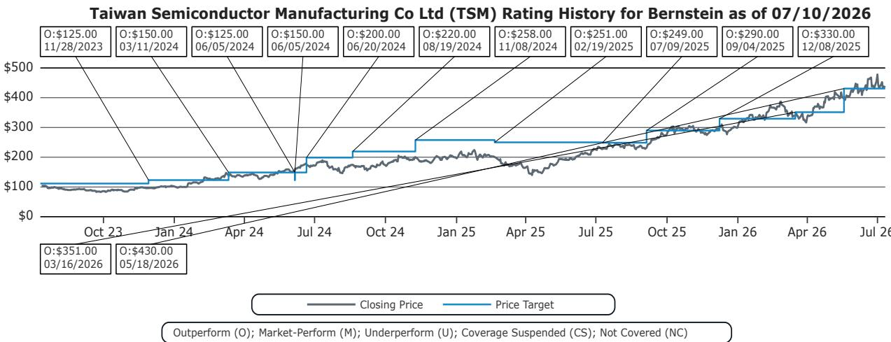
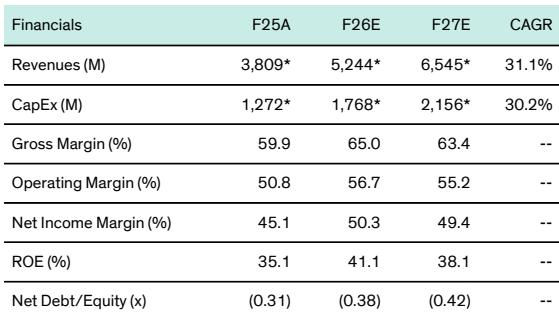

# Bernstein：亚洲半导体与设备-全球存储台积电2Q26营收落在指引高端

台积电刚刚交出一份落在指引高端的二季度营收：新台币1.27万亿元，环比增长12%，同比增长36%，比市场共识高出约0.5%。这份数字本身并不意外——市场早已习惯台积电“达标”甚至“超标”。真正值得关注的，是这份营收背后反映出的行业状态：台积电的领先产能已经紧到客户开始认真寻找替代方案。

Bernstein在最新研报中观察到，三星代工和英特尔代工近期都出现了客户兴趣改善的迹象。三星被报道对部分4/5纳米和8纳米节点的新客户提价15%，同时正与Anthropic和Meta讨论潜在的2纳米AI芯片项目。英特尔代工方面，行业传言指向可能与Google TPU相关的合作。这些信号叠加在一起，指向同一个结论：台积电的产能瓶颈正在重塑整个代工市场的竞争格局。

但Bernstein的判断是，这些替代方案短期内不会对台积电构成实质性影响。台积电至少领先对手一个世代，拥有更清晰的执行记录和更大的规模。即使这些项目最终落地，由于需求持续显著超过台积电可提供的领先产能，对台积电营收的谨慎影响预计不会出现。

> **KC评论：** 这里的关键不是三星和英特尔能否抢走台积电的订单，而是“台积电产能不足”这件事本身已经成为行业公开的约束条件。客户寻找替代方案不是对台积电的不信任，而是供应链管理的必然选择。这份报告提醒我们，在AI芯片需求持续增长的背景下，台积电的产能扩张速度才是决定行业格局的真正变量。

## 1. 二季度营收落在指引高端，毛利率扩张是下一个观察点

台积电6月营收新台币4430亿元，环比增长6%，同比增长68%。二季度合计营收1.27万亿元，落在公司此前指引的高端。Bernstein特别指出，汇率因素对这一结果没有影响。

更值得关注的是毛利率。报告预计2026年台积电毛利率将从2025年的60%扩张至65%，营业利润率从50.8%提升至56.7%。在营收强劲增长的配合下，预计2026年每股收益将同比增长约50%至新台币102元。毛利率能否如期扩张，将是7月17日法说会的核心议题之一。

## 2. 产能扩张节奏决定未来两年的竞争格局

Bernstein对台积电的资本支出预测相当积极：2026年560亿美元，2027年680亿美元。CoWoS先进封装产能预计在2026年底达到13.5万片/月，2027年底达到19.5万片/月。

这些数字背后是一个简单的逻辑：台积电的领先产能供不应求，只有加速扩张才能守住客户。但扩张本身也带来不确定性——资本支出强度持续上升，如果需求增速节奏变化，产能利用率可能承压。报告预计2027年毛利率将从2026年的65%回落至63.4%，或许反映了这种观察。

## 3. 三星和英特尔的“机会窗口”可能比市场预期的更窄

三星代工近期提价15%的消息，被部分市场解读为代工市场供需改善的信号。Bernstein则认为，这恰恰说明台积电产能紧张到客户愿意接受三星的溢价。但三星在先进制程上的良率和执行记录仍是短板，与Anthropic和Meta的2纳米项目讨论仍处于早期阶段。

英特尔代工方面，Google TPU的合作传言如果属实，将是英特尔代工业务的重要进展。但Bernstein提醒，台积电的规模优势和客户粘性意味着，即使这些项目落地，对台积电营收的影响也有限。

这份报告提供了一个观察代工行业的新框架：与其关注台积电的竞争对手能否“追上”，不如关注台积电的产能扩张速度能否跟上客户需求的增长。只要需求持续超过供给，台积电的议价能力和毛利率扩张就有支撑。而三星和英特尔能否真正抓住这个窗口期，取决于它们能否在台积电扩产完成之前，拿出足够有竞争力的产品和良率。

For informational purposes only. Portions may be generated,translated,summarized,or edited with AI assistance based on source materials and may contain omissions or errors. Please verify independently. This is not investment,legal,tax,accounting,or other professional advice.

For informational purposes only. Portions may be generated,translated,summarized,or edited with AI assistance based on source materials and may contain omissions or errors. Please verify independently. This is not investment,legal,tax,accounting,or other professional advice.

