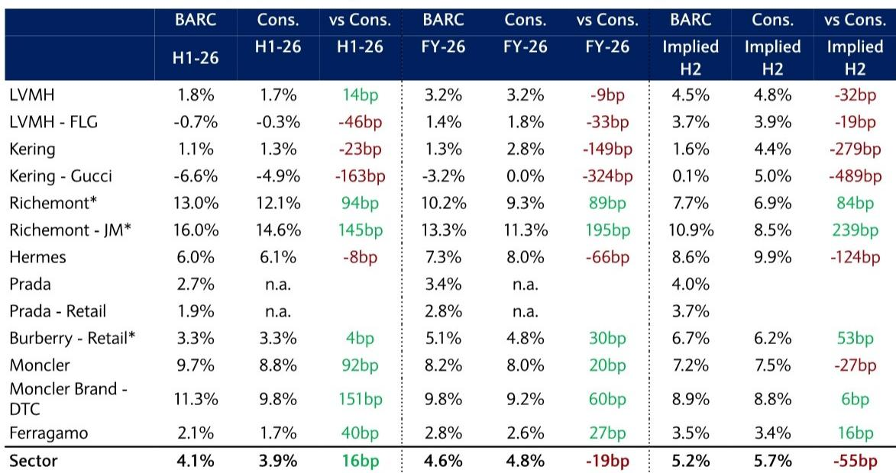
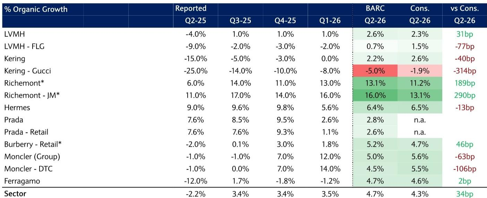
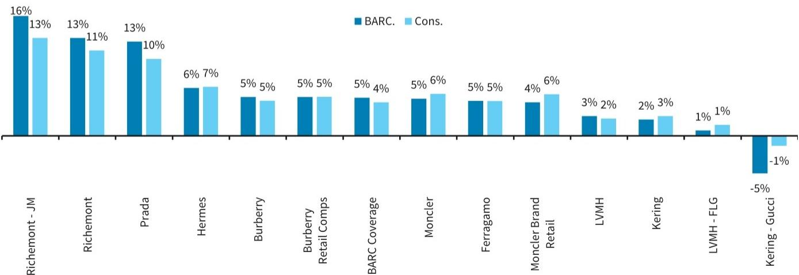

# BARC：欧洲奢侈品专业零售奢侈品数据手册7月26日

这份BARC在7月中旬发布的奢侈品数据手册，核心判断是：2026年第二季度，覆盖的欧洲奢侈品公司有机增长将加速至4.7%，略高于市场预期的4.3%，也快于一季度的3.5%。但加速的来源并非市场最关注的中国市场，而是美国和韩国。报告同时指出，行业内部的分化仍在加剧——从历峰珠宝部门预计16%的增长到Gucci预计-5%的调整，差距超过20个百分点。

这份报告最有价值的地方，不是给出了一个季度预测，而是用一系列高频数据拆解了“增长从哪来、不确定性在哪”这个读者最关心的问题。

## 1. 中国国内消费仍在调整，但韩国和美国正在接棒

报告用三个指标衡量中国国内奢侈品消费：零售总额、海南离岛免税销售额、澳门博彩收入。5月中国零售总额同比转负至-0.6%，是两年来首次负增长；珠宝零售同比-8.6%；海南免税销售增速降至0.4%；澳门6月博彩收入同比-12%。这些数字指向同一个方向：中国国内奢侈品消费在二季度继续调整。

但报告认为，这部分缺口可以被两个地区弥补。韩国方面，5月奢侈品百货销售同比仍高达37%，中国赴韩游客同比增16%，且韩国在部分公司收入中占比5-10%。美国方面，BARC自有的信用卡数据显示，二季度奢侈品支出显著加速，一季度增速6%，二季度升至16%，尽管6月单月回落至8%。

> **KC评论：** 报告提醒，韩国和美国的加速能否完全抵消中东的调整，取决于具体公司的区域敞口。历峰和爱马仕对中东依赖更高，而盟可睐和普拉达更倚重韩国。读者不能只看总量，要看公司层面的区域结构。

## 2. 中东是二季度最大的增量不确定性，但可能被高估

中东是二季度与一季度最显著的不同。一季度中东冲突仅影响3月，而二季度整个季度都受影响。报告认为，中东地区线下消费将逐季调整，但有两个细节值得注意：一是中东旅客经欧洲机场的流量在5月已出现改善，二是中东离岸消费可能正在反弹。这意味着，中东对二季度的影响可能没有市场担心的那么严重。

报告同时指出，美国游客赴欧在6月已转负，但美国本土消费依然强劲。这暗示，美国消费者正在从“出境购物”转向“境内消费”，对美国本土渠道敞口更大的品牌可能受益更多。

## 3. 珠宝提价仍在继续，但中期吸引力正在调整

报告追踪了5-6月间卡地亚腕表、蒂芙尼、LV、圣罗兰等品牌的全球提价，但6-7月间没有出现大规模提价，仅有普拉达全球提价1%、江诗丹顿提价2%以及部分品牌区域汇率调整。珠宝品类自去年二季度以来累计提价幅度已达高个位数到低双位数，显著高于软奢品类。

提价在短期内是收入增长的直接推手，但报告提出了一个中期观察：珠宝相对于软奢的性价比正在调整，而性价比恰恰是过去两年珠宝品类强势增长的主要驱动力。如果提价影响了价值感，珠宝的增长动能可能在未来几个季度节奏变化。

## 4. 估值分化在加剧，历峰变贵、爱马仕变便宜

报告在最后部分专门提到了相对估值的变化。历峰珠宝部门在强劲增长预期下估值持续走高，而爱马仕的估值反而在走低。这种分化意味着，市场对“增长确定性”的定价差异正在拉大。报告没有给出明确结论，但暗示读者需要密切关注这两个标的的不确定性回报变化——尤其是当历峰二季度业绩可能超预期时，其估值是否已经充分反映了利好。

> **KC评论：** 估值分化的背后是市场对增长可持续性的不同判断。历峰的高估值建立在高增长延续的假设上，而爱马仕的低估值可能隐含了市场对其增速节奏变化的关注。二季度业绩将是检验这些假设的第一个节点。

---

这份报告的核心价值不在于预测一个季度的数字，而在于提供了一套可复用的观察框架：用高频数据（零售额、免税销售、信用卡支出、机场客流）交叉验证区域趋势，再结合公司层面的区域敞口和品类结构，判断增长来源和不确定性点。对于关注奢侈品行业的读者来说，这套框架比任何单一季度的预测都更有长期参考意义。

For informational purposes only. Portions may be generated,translated,summarized,or edited with AI assistance based on source materials and may contain omissions or errors. Please verify independently. This is not investment,legal,tax,accounting,or other professional advice.

For informational purposes only. Portions may be generated,translated,summarized,or edited with AI assistance based on source materials and may contain omissions or errors. Please verify independently. This is not investment,legal,tax,accounting,or other professional advice.

