# China Pharma and Biotech

## China Pharma & Biotech: 2Q/1H26 Performance Preview - Amid Regulatory Adjustments and Procurement Changes, Innovative Leaders Stand Out

  
Rebecca Liang, Ph.D.  
+852 2123 2656  
rebecca.liang@bernsteinsg.com

Ellie Li

+852 2123 2621

ellie.li@bernsteinsg.com

The healthcare compliance enhancement efforts in China intensified in 2Q26, but the impact has so far been more targeted and compliance-focused than the broad adjustments seen in 2023. Company feedback points to uneven effects across the sector: Hengrui highlighted temporary disruptions to academic promotion and hospital formulary listing processes, particularly in lower-tier cities, while Innovent indicated limited impact. We expect near-term friction in physician engagement and promotional activities to modestly moderate prescription growth, particularly for crowded therapeutic categories and me-too products. However, longer term, these efforts should favor companies with clinically differentiated products as prescribing decisions become increasingly driven by efficacy, safety and real-world outcomes rather than promotional intensity.

Volume-Based Procurement (VBP) Batch 12 was announced in late June covering 65 molecules across several large off-patent therapeutic categories. Within our coverage, Hengrui and Hansoh are the most exposed names, although the implications for earnings appear manageable at the company level. For Hengrui, Sevoflurane alone contributes approximately 7% of sales and could see cumulative revenue changes of CNY0.5–1.3 Bn over the next 2-3 years, while Hansoh has exposure through two mature products. Nevertheless, both companies now derive the majority of growth from innovative products, limiting the company-level significance of VBP despite potentially meaningful product-level adjustments.

Drug sales update: Online GLP-1 sales continued to expand strongly despite tighter oversight of obesity-drug prescriptions, with combined sales of tirzepatide, mazdutide and semaglutide approaching CNY3 Bn in 1H26. TZP remained the category leader, and MAZ was the key share gainer, having surpassed SEMA. In hospital channels, the fastest-growing segments remain next-generation oncology modalities, led by PD-(L)1 bispecific antibodies (+238% YoY) and TROP2 ADCs (+149% YoY). Kelun's sac-TMT continues taking share in the domestic TROP2 segment, while the rapid emergence of ivonescimab highlights continued momentum in BsAbs.

Heading into 2Q/1H26 results, we expect Kelun-Biotech and Innovent to remain the strongest performers in our coverage. Kelun continues to benefit from robust sac-TMT uptake in the fast-growing TROP2 ADC segment, while Innovent is supported by both mazdutide's strong commercial ramp and continued share gains from tafolecimab.

Pharma names face a more challenging backdrop, balancing compliance efforts, VBP adjustments and increasing competition across several innovative drug classes including CDK4/6 and IL-17. For Hengrui, we adjust generic-drug assumptions to an approximately 10% annual decline through 2028E and modestly reduce innovative-drug expectations. We also adopt a longer recognition period for licensing upfronts and milestones, reducing long-term BD income forecasts despite incorporating the recent BMS transaction. These changes adjust our 12-month reference price to CNY65 from CNY71. For Hansoh, operating assumptions are largely unchanged, but we similarly delay recognition of upfront payments and milestones, resulting in modestly lower long-term licensing income forecasts and a slightly adjusted reference price (HK$44 from HK$47).

## BERNSTEIN TICKER TABLE

<table><tr><td rowspan="2">Ticker</td><td rowspan="2">Rating</td><td colspan="3">13 Jul 2026</td><td colspan="2">TTM</td><td colspan="4">Reported EPS</td><td colspan="3">Reported P/E (x)</td></tr><tr><td></td><td>Closing Price</td><td>Price Target</td><td>Rel. Perf.</td><td>Cur</td><td>2025A</td><td>2026E</td><td>2027E</td><td>2025A</td><td>2026E</td><td>2027E</td><td></td></tr><tr><td>9926.HK (Akeso)</td><td>M</td><td>HKD</td><td>95.25</td><td>130.00</td><td>(51.1)%</td><td>CNY</td><td>(0.60)</td><td>(0.52)</td><td>0.70</td><td>(136.2)</td><td>(159.5)</td><td>117.8</td><td></td></tr><tr><td>ONC (BeOne)</td><td>O</td><td>USD</td><td>298.70</td><td>412.00</td><td>(1.3)%</td><td>USD</td><td>2.63</td><td>5.65</td><td>8.93</td><td>113.5</td><td>52.8</td><td>33.4</td><td></td></tr><tr><td>1093.HK (CSPC)</td><td>M</td><td>HKD</td><td>8.16</td><td>10.70</td><td>(32.5)%</td><td>HKD</td><td>0.37</td><td>0.52</td><td>0.56</td><td>19.1</td><td>13.7</td><td>12.6</td><td></td></tr><tr><td>3692.HK (Hansoh)</td><td>O</td><td>HKD</td><td>32.52</td><td>44.00</td><td>(32.0)%</td><td>CNY</td><td>0.93</td><td>0.97</td><td>0.88</td><td>30.2</td><td>29.0</td><td>32.0</td><td></td></tr><tr><td>OLD</td><td></td><td></td><td></td><td>47.00</td><td></td><td></td><td></td><td>1.01</td><td>1.10</td><td></td><td></td><td></td><td></td></tr><tr><td>1801.HK (Innovent)</td><td>O</td><td>HKD</td><td>89.10</td><td>120.00</td><td>(24.7)%</td><td>HKD</td><td>0.48</td><td>0.71</td><td>2.90</td><td>183.7</td><td>125.5</td><td>30.7</td><td></td></tr><tr><td>600276.CH (Hengrui)</td><td>O</td><td>CNY</td><td>55.75</td><td>65.00</td><td>(37.3)%</td><td>CNY</td><td>1.18</td><td>1.42</td><td>1.78</td><td>47.2</td><td>39.4</td><td>31.3</td><td></td></tr><tr><td>OLD</td><td></td><td></td><td></td><td>71.00</td><td></td><td></td><td></td><td>1.54</td><td>1.92</td><td></td><td></td><td></td><td></td></tr><tr><td>6990.HK (Kelun-Biotech)</td><td>O</td><td>HKD</td><td>504.00</td><td>526.00</td><td>13.0%</td><td>CNY</td><td>(1.66)</td><td>(2.75)</td><td>0.85</td><td>43.4</td><td>44.1</td><td>27.2</td><td></td></tr><tr><td>1177.HK (Sino BioPh)</td><td>M</td><td>HKD</td><td>5.16</td><td>7.90</td><td>(48.3)%</td><td>CNY</td><td>0.19</td><td>0.20</td><td>0.22</td><td>23.3</td><td>21.9</td><td>20.1</td><td></td></tr><tr><td>9688.HK (Zai Lab)</td><td>M</td><td>HKD</td><td>15.89</td><td>15.00</td><td>(74.6)%</td><td>USD</td><td>(0.16)</td><td>(0.15)</td><td>(0.09)</td><td>0.5</td><td>0.5</td><td>0.4</td><td></td></tr><tr><td>ASIAX</td><td></td><td></td><td>1,947.59</td><td></td><td></td><td></td><td></td><td></td><td></td><td></td><td></td><td></td><td></td></tr><tr><td>SPX</td><td></td><td></td><td>7,575.39</td><td></td><td></td><td></td><td></td><td></td><td></td><td></td><td></td><td></td><td></td></tr></table>

## REFERENCE PRICE CHANGE / ESTIMATE CHANGE IN BOLD

O - Outperform, M - Market-Perform, U - Underperform, NR - Not Rated, CS - Coverage Suspended 6990.HK, 9688.HK valuation is EV/Sales (x); 9926.HK, 1093.HK, 1177.HK base year is 2024; Source: Bloomberg, Bernstein estimates and analysis.

## RESEARCH OBSERVATIONS

We rate Hansoh, Jiangsu Hengrui, Kelun-Biotech, BeOne Medicines, and Innovent Outperform; and Akeso, Zai Lab, Sino Biopharm, and CSPC Market-Perform.

## DETAILS

## POLICY UPDATES

## Compliance enhancement efforts intensified since 2Q26

Renewed enforcement, but more targeted than the 2023 campaign. Authorities in China have intensified healthcare compliance enhancement efforts in 2Q26, with the National Health Commission (NHC) and 13 government departments launching a nationwide campaign targeting practices in pharmaceutical promotion, healthcare services and procurement activities (source). Recent measures have also placed greater scrutiny on marketing activities conducted under the guise of academic meetings, research collaborations and patient programs, alongside tighter oversight of medical insurance fund usage and procurement compliance. Compared with the broad-based adjustments seen during the 2023 campaign, the current round appears more compliance-focused and targeting specific behaviors and payment practices rather than causing a widespread suspension of hospital activities.

Company feedback suggests limited and uneven commercial impact so far. Management commentary across our coverage indicates a varying range of potential impact. Hengrui has highlighted disruptions to academic promotional activities and hospital formulary listing processes, particularly in lower-tier cities where hospital decision-making has become more cautious; however, management views these disruptions as temporary rather than structural. In contrast, Innovent has indicated limited impact, reflecting the resilience of differentiated products particularly in chronic diseases. Overall, current feedback points to localized execution adjustments rather than the broad commercial changes experienced in 2023.

Our view: near-term friction, but long-term supportive for innovation. We expect compliance measures to create temporary friction in physician engagement, promotion and hospital access activities, leading to a modest near-term moderation in prescription growth across parts of the industry. There is likely more impact for crowded therapeutic classes and me-too products that rely heavily on promotional intensity, while differentiated innovative therapies should remain relatively resilient. Over the longer term, we view compliance enhancement as supportive for industry quality, as prescribing decisions should increasingly be driven by clinical efficacy, safety profiles and real-world outcomes rather than commercial promotion. In this environment, companies with truly innovative pipelines and clear product differentiation should be the principal beneficiaries.

## VBP batch 12: Hengrui and Hansoh implicated moderately

The National Organization for Drug Joint Procurement formally launched the 12th national VBP on 23 June 2026, with the final procurement list covering 65 drug varieties after an earlier information pre-fill process (source). The basket is concentrated in large off-patent therapeutic categories, including cardiovascular, oncology and metabolic products, and represents one of the larger VBP rounds by market value in recent years. Companies are currently preparing tender submissions, with bidding and award announcements expected over the coming months, followed by gradual provincial implementation.

## Hengrui likely the most exposed name in our coverage, although the earnings impact should be manageable.

Sevoflurane remains one of Hengrui's larger legacy generic products and has already experienced revenue changes during 2025 following provincial procurement initiatives. Based on our assumptions for price adjustment and tender allocation, we estimate cumulative sales changes of roughly CNY0.5–1.3 Bn over the next two to three years (Exhibit 1). While meaningful at the product level, this represents a relatively limited factor compared with Hengrui's CNY30 Bn-plus revenue base and should be increasingly offset by growth from innovative products. Hansoh also has exposure through two products included in the procurement basket. We expect adjustments on the affected mature products, although the overall portfolio impact should be limited given the company's growing contribution from innovative medicines close to 80%.

Overall we view Batch 12 primarily as a product-level modeling adjustment rather than a material change to Hengrui or Hansoh's broader earnings trajectory.

EXHIBIT 1: VBP Batch 12 exposure is concentrated in Hengrui and Hansoh

<table><tr><td>Company</td><td>TTM company sales as of 1Q26 (CNY Mn)</td><td>Drug name</td><td>TTM drug sales as of 1Q26 (CNY Mn)</td><td>Sales contribution</td></tr><tr><td rowspan="6">Hengrui</td><td rowspan="6">24,931</td><td>Sevoflurane</td><td>1,645</td><td>7%</td></tr><tr><td>Mycophenolate sodium</td><td>152</td><td>1%</td></tr><tr><td>Tolvaptan</td><td>88</td><td>0%</td></tr><tr><td>Leucovorin calcium</td><td>59</td><td>0%</td></tr><tr><td>Tacrolimus</td><td>50</td><td>0%</td></tr><tr><td>Compound amino acid</td><td>3</td><td>0%</td></tr><tr><td rowspan="3">Hansoh</td><td rowspan="3">8,832</td><td>Enzalutamide</td><td>369</td><td>4%</td></tr><tr><td>Paliperidone</td><td>314</td><td>4%</td></tr><tr><td>Deferasirox</td><td>1</td><td>0%</td></tr><tr><td rowspan="8">CSPC</td><td rowspan="8">17,203</td><td>Ertapenem sodium</td><td>257</td><td>1%</td></tr><tr><td>Pentoxifylline</td><td>202</td><td>1%</td></tr><tr><td>Paliperidone</td><td>83</td><td>0%</td></tr><tr><td>Tramadol hydrochloride</td><td>25</td><td>0%</td></tr><tr><td>Estazolam</td><td>22</td><td>0%</td></tr><tr><td>Vitamin B6</td><td>8</td><td>0%</td></tr><tr><td>Sacubitril/Valsartan sodium</td><td>3</td><td>0%</td></tr><tr><td>Mesalazine</td><td>0</td><td>0%</td></tr><tr><td rowspan="7">SBP</td><td rowspan="7">21,938</td><td>Tolvaptan</td><td>302</td><td>1%</td></tr><tr><td>Sitagliptin phosphate/metformin hydrochloride</td><td>195</td><td>1%</td></tr><tr><td>Iguratimod</td><td>69</td><td>0%</td></tr><tr><td>Compound amino acids injection</td><td>43</td><td>0%</td></tr><tr><td>Ceftazidime/Avibactam</td><td>37</td><td>0%</td></tr><tr><td>Iopromide</td><td>10</td><td>0%</td></tr><tr><td>Saxagliptin hydrochloride/metformin hydrochloride</td><td>0</td><td>0%</td></tr></table>

Source: SMPAA, Pharmcube, Bernstein analysis

## 1H26 DRUG SALES UPDATE

## GLP-1: TZP the category leader; MAZ on track to reach CNY2 Bn in 2026

GLP-1 retail demand remained robust in 1H26 despite regulatory discussions around online obesity-drug sales. Online sales of the three leading GLP-1 products—tirzepatide (TZP), mazdutide (MAZ) and semaglutide (SEMA)—continued to grow strongly through 1H26, with combined online retail sales approaching CNY3 Bn based on channel tracking (Exhibit 2, Exhibit 3). In May, media reports indicated tighter controls on online sales of obesity medicines, including stricter prescription verification requirements and restrictions on internet-hospital prescriptions in certain regions. However, GLP-1 products largely remained accessible because they are also approved for type 2 diabetes (source). While all three products experienced modest sequential moderation in June, we think it is too early to conclude that the regulatory adjustments have materially altered underlying demand trends.

Tirzepatide remained the category leader, and mazdutide was the key share gainer in 1H26. Based on our channel data, TZP generated approximately CNY1.8 Bn of retail sales during 1H26, representing about 60% share of the tracked GLP-1 market. Nevertheless, Innovent's MAZ continued to gain share against SEMA and surpassed it in monthly sales from March onward. At the current trajectory, we estimate MAZ online sales could reach approximately CNY1.3–1.5 Bn in 2026. Assuming online sales account for roughly 60–70% of total retail sales, we believe total MAZ sales remain on track to achieve the company's ~2Bn target for 2026.

Pricing dynamics have moderated since early 2026. Following the significant price adjustment for TZP in January, average selling prices have largely stabilized through 2Q26 even as volumes continued to expand. MAZ prices have gradually moved lower over recent months and are now much closer to TZP levels. We expect pricing across the leading GLP-1 products to be broadly stable in 2H26, while the next major catalyst for MAZ will be the 2026 NRDL discussions in November–December, which could meaningfully expand patient access in hospital channels and support another phase of volume growth in 2027.

EXHIBIT 2: Tirzepatide online sales grew the most in recent months; mazdutide had surpassed semaglutide sales since March

China leading GLP-1 sales from major e-commerce platforms: Sales by product (LHS) vs ASP (RHS)

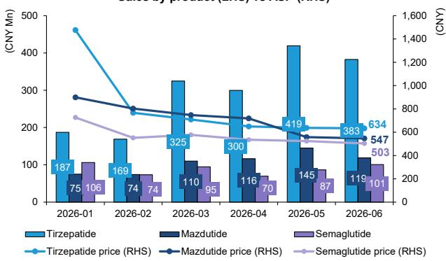  
Semaglutide: include ozempic and wegovy  
Source: Moojing Intelligence (Taobao + Tmall + JD), Bernstein analysis  
EXHIBIT 3: Mazdutide recorded over CNY 600 Mn online sales in 1H26, getting 22% of share as 2nd place among Top 3 GLP1s  
26H1 GLP-1 online sales by product

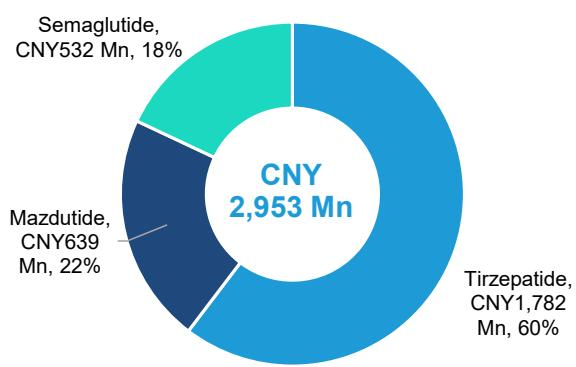  
Semaglutide: include ozempic and wegovy
Source: Moojing Intelligence (Taobao + Tmall + JD), Bernstein analysis

## 1Q26 sample hospital sales

Kelun's sac-TMT has been major beneficiary of the fast-growing TROP2 ADC market (Exhibit 7), which expanded 149% YoY in 1Q26. The product continued taking share from Trodelvy and strengthened its leadership position in the domestic TROP2 ADC segment. Among our coverage names, Kelun has the most clear-cut gain of commercial momentum as a single-asset company (aside from a few much smaller products).

Innovent remained steady, with Tafolecimab continuing share gain in the rapidly expanding PCSK9 market (Exhibit 15), where sales grew 75% YoY; meanwhile sintilimab has lost share to smaller PD-1 players but remained a solid second after tislelizumab (Exhibit 9). Combined with strong mazdutide momentum outside hospital channels, Innovent continues to demonstrate broad-based growth across multiple innovative franchises.

BeOne Medicines: BRUKINSA continued to demonstrate strong commercial momentum in the U.S. BTKi market, with sales steadily increasing and market share rising from 30% in 4Q25 to 36% in 2Q26 (Exhibit 6). The product consistently gained share at the expense of IMBRUVICA, becoming a key growth driver within the expanding BTKi class.

Hengrui: mixed trends in recently launched drugs. Rezvilutamide continued gaining share in the androgen receptor (AR) market, which accelerated to +23% YoY (Exhibit 11), while dalpiciclib lost share in the +36% YoY CDK4/6 market (Exhibit 12). Vunakizumab, new to the IL-17/23 market, was yet to get meaningful share (Exhibit 14).

Hansoh's key product aumolertinib continued to benefit from expansion of the 3rd-generation EGFR-TKI market, although category growth moderated to +18% YoY and osimertinib regained share to roughly 49% (Exhibit 13). The company remains exposed to a healthy oncology market backdrop, but momentum appears more stable than accelerating compared with prior quarters. Overall, 1Q26 suggests steady growth rather than a material inflection in hospital sales performance.

(Note: in late May 2026, Pharmcube expanded its sample hospital universe from 1,600 to 3,000 institutions. This restructuring enhances coverage by capturing a broader volume of Class II and lower-tier county hospitals in China, and thus leads to a change in historical absolute sales data.)

EXHIBIT 4: Overall drug sales changed -4% YoY in 1Q26, reflecting continued adjustments in generics, biosimilars, and TCMs despite resilient innovative sales

<table><tr><td>Drug category</td><td>LTM sales (in CNY Bn)</td><td>LTM sales YoY %</td><td>1Q26 sales (in CNY Bn)</td><td>1Q26 sales YoY %</td><td>Q1 2-year average YoY %</td></tr><tr><td>Total drug sales</td><td>1,057</td><td>-3%</td><td>257</td><td>-4%</td><td>1%</td></tr><tr><td>Gx, biosimilars, and new formulations</td><td>497</td><td>-5%</td><td>120</td><td>-6%</td><td>-3%</td></tr><tr><td>TCMs and others</td><td>181</td><td>-7%</td><td>42</td><td>-13%</td><td>3%</td></tr><tr><td>Innovatives</td><td>379</td><td>4%</td><td>95</td><td>2%</td><td>7%</td></tr></table>

Note: Pharmcube's definition of innovative drugs differs from ours, as they include legacy drugs such as aspirin with existing Gx in the market, which we do not adopt in our previous note  
Source: Pharmcube, Bernstein analysis

EXHIBIT 5: YoY growth summary of domestic drug sales by drug class

<table><tr><td>Drug category</td><td>Drug class</td><td>Treatment area</td><td>TTM sales as of 1Q26 (in CNY Mn)</td><td>TTM sales YoY%</td><td>TTM sales YoY% of the previous quarter</td><td>Delta</td></tr><tr><td rowspan="13">Innovatives</td><td>PD-1 (BsAbs)</td><td>Oncology</td><td>1,170</td><td>238%</td><td>21%</td><td>217%</td></tr><tr><td>TROP2 (ADCs)</td><td>Oncology</td><td>276</td><td>103%</td><td>212%</td><td>-109%</td></tr><tr><td>HER2 (ADCs)</td><td>Oncology</td><td>2,431</td><td>65%</td><td>43%</td><td>22%</td></tr><tr><td>PCSK9</td><td>Cardiovascular</td><td>4,970</td><td>54%</td><td>91%</td><td>-37%</td></tr><tr><td>CDK4/6</td><td>Oncology</td><td>2,611</td><td>37%</td><td>44%</td><td>-7%</td></tr><tr><td>AR</td><td>Oncology</td><td>4,256</td><td>35%</td><td>29%</td><td>6%</td></tr><tr><td>GLP-1</td><td>Metabolics</td><td>10,268</td><td>14%</td><td>15%</td><td>-1%</td></tr><tr><td>IL-17/23</td><td>Immunology</td><td>4,411</td><td>11%</td><td>7%</td><td>4%</td></tr><tr><td>PD-(L)1 (mAb)</td><td>Oncology</td><td>14,998</td><td>11%</td><td>17%</td><td>-6%</td></tr><tr><td>EGFR-TKIs</td><td>Oncology</td><td>10,984</td><td>6%</td><td>14%</td><td>-7%</td></tr><tr><td>PARP</td><td>Oncology</td><td>2,372</td><td>4%</td><td>19%</td><td>-16%</td></tr><tr><td>VEGFR inhibitors</td><td>Oncology</td><td>7,608</td><td>-2%</td><td>11%</td><td>-13%</td></tr><tr><td>TPO</td><td>Hematology</td><td>8,307</td><td>-6%</td><td>6%</td><td>-11%</td></tr><tr><td rowspan="4">Biosimilars</td><td>Adalimumab</td><td>Immunology</td><td>1,669</td><td>13%</td><td>7%</td><td>5%</td></tr><tr><td>Bevacizumab</td><td>Oncology</td><td>11,587</td><td>10%</td><td>21%</td><td>-10%</td></tr><tr><td>Rituximab</td><td>Oncology</td><td>3,619</td><td>7%</td><td>10%</td><td>-3%</td></tr><tr><td>G-CSF</td><td>Hematology</td><td>7,224</td><td>-10%</td><td>5%</td><td>-16%</td></tr></table>

Source: Pharmcube, Bernstein analysis

China HER2 ADC market: Total sales growth vs. Market share changes (in CNY Mn)

EXHIBIT 6: BRUKINSA's share gain continued in 2Q26, up 6% to 36% in 2Q26 from 30% in 4Q25  
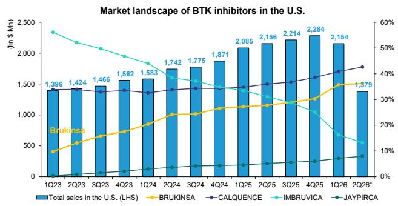  
Note: * 2Q26 data are through May 2026 only and do not represent a full quarter Source: IQVIA, Bernstein analysis

EXHIBIT 7: China TROP2 ADC sample hospital sales up 149% YoY; sac-TMT gaining share at the expense of Trodelvy  
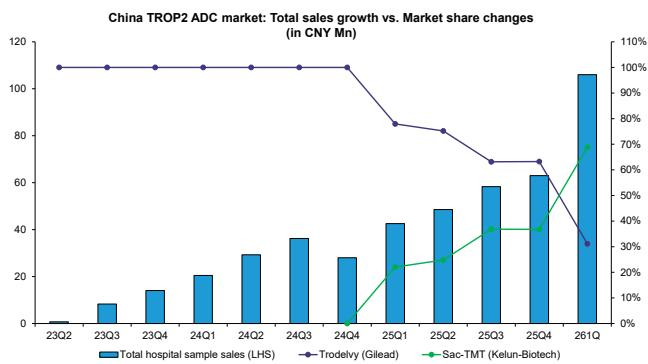  
Note: * Trastuzumab botidotin is newly approved with minimal shares and are therefore not shown  
Source: Pharmcube, Bernstein analysis

EXHIBIT 8: China HER2 ADC sample hospital sales up 35% YoY; Enhertu is becoming the dominant product by market share  
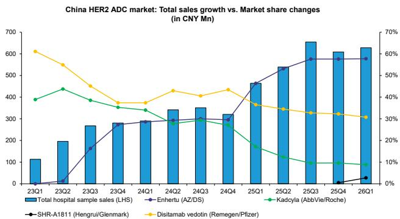  
Note: * Trastuzumab botidotin is newly approved with minimal shares and are therefore not shown
Source: Pharmcube, Bernstein analysis

EXHIBIT 9: China PD-(L)1 mAb sample hospital sales up 11% YoY; Tislelizumab and other minor PD-(L)1 mAbs gained share in 1Q26  
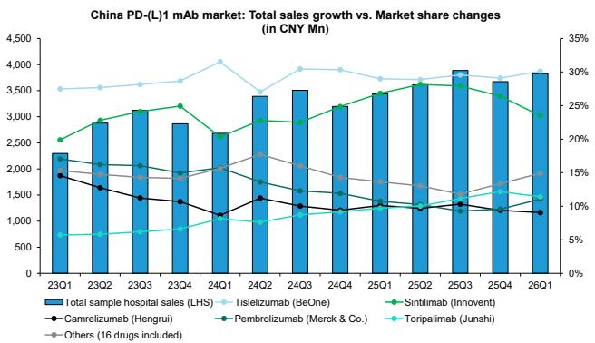  
Source: Pharmcube, Bernstein analysis

EXHIBIT 10: China PD-(L)1 BsAb sample hospital sales up 198% YoY; ivonescimab rapidly emerging as a major contributor alongside cadonilimab

China PD-(L)1 BsAb market size by drug

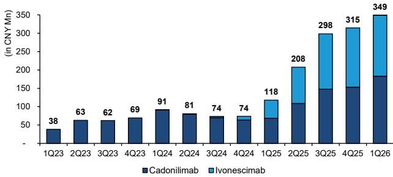  
Note: Retlirafusp alfa is newly approved with minimal shares and are therefore not shown  
Source: Pharmcube, Bernstein analysis

EXHIBIT 11: China AR market sample hospital sales up 23% YoY; Hengrui's rezvilutamab continued its momentum in 1Q26  
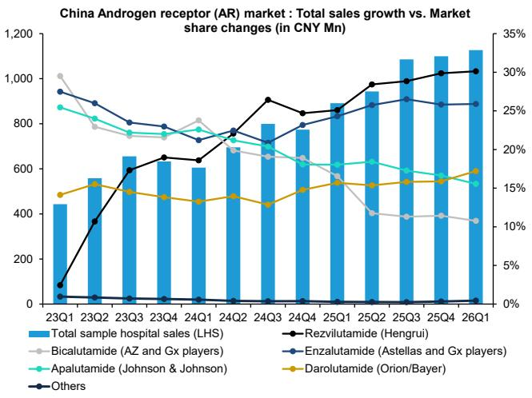

EXHIBIT 12: China CDK4/6 sample hospital sales up 36% YoY; Hengrui's dalpiciclib receded  
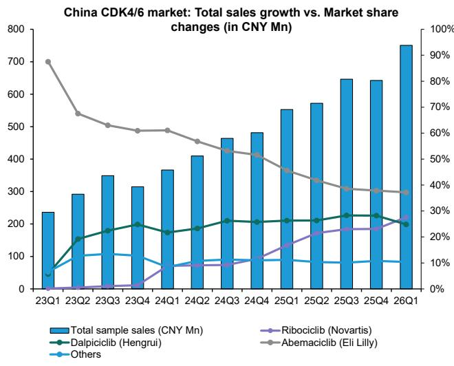  
Source: Pharmcube, Bernstein analysis

Note: Total sample hospital sales mentioned above excludes any non-AR inhibitor drugs due to their differences in drug MoA from the mentioned drugs  
Source: Pharmcube, Bernstein analysis  
EXHIBIT 13: China 3rd-gen EGFR-TKI sample hospital sales up ~18% YoY; osimertinib's market share rebounded to ~49% in 1Q26 following a period of share adjustment between 2024-2025  
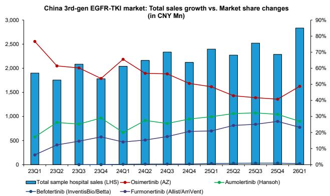  
Note: * Limertinib, rilertinib, lazertinib, and rezivertinib are newly approved with minimal shares and are therefore not shown
Source: Pharmcube, Bernstein analysis

China PCSK9 market: Total sales growth vs. Market share changes (in CNY Mn)

EXHIBIT 14: China IL-17 & IL-23 sample hospital sales up 10% YoY; Hengrui's vunakizumab and Akeso's ebdarokimab are ramping up

China IL-17 & IL-23 market: Total sales growth vs. Market share changes (in CNY Mn)

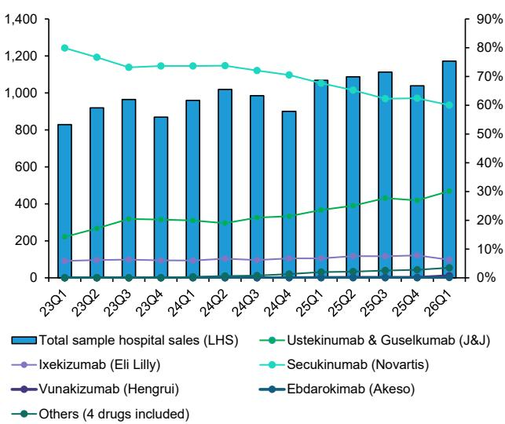

EXHIBIT 15: China PCSK9 sample hospital sales up 75% YoY; evolocumab saw a share adjustment in 1Q26  
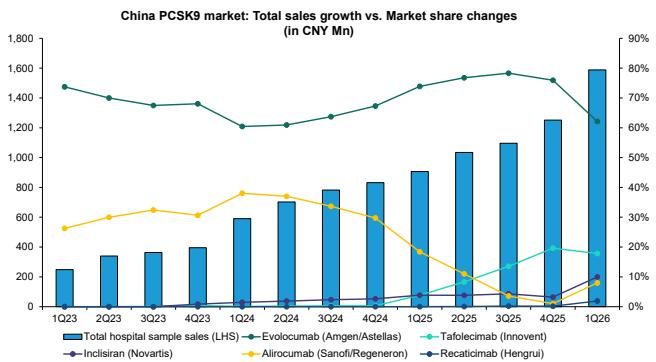  
Source: Pharmcube, Bernstein analysis  
Note: * Ongericimab is newly approved with minimal shares and are therefore not shown  
Source: Pharmcube, Bernstein analysis

EXHIBIT 16: China GLP-1 sample hospital sales up 2.4% YoY; Tirzepatide emerged as the fastest share gainer in 1Q26  
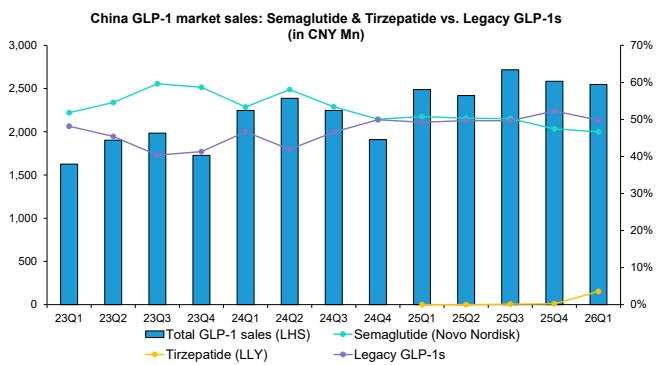  
Note: * Mazdutide is newly approved with minimal shares and are therefore not shown  
Source: Pharmcube, Bernstein analysis

## MODEL UPDATES

## Hengrui: recalibrating growth expectations amid accelerated Gx adjustment

We revised our Hengrui forecasts to reflect a more challenging operating environment for both the generics and innovative drug franchises. We adjusted our Gx sales trajectory - annual change of 10% from 2025 to 2028E (vs. low single digit change in old model), driven by the impact of VBP Batch 12 and management's guidance indicating a faster pace of generic product adjustment. We also adjusted innovative drug sales expectations moderately, reflecting the friction from the heightened compliance efforts in the near-term and increasing intensity of competition in key drug classes (CDK4/6, PCSK9, IL-17) seen above. However, a series of new launches in 2028–2030 in more differentiated spaces (GLP1/GIP, oral GLP1/GIP, are expected to support growth in the later years.

Est. Hengrui BD income trajectory (old vs new)

On license income, we incorporated the recent BMS transaction (BMS is covered by Courtney Breen), and spread out upfront payments from recent and future licensing deals over a 4–5 year period and delay the onset of milestones, as deals are increasingly done
