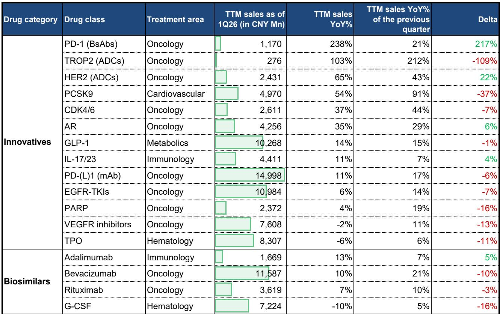
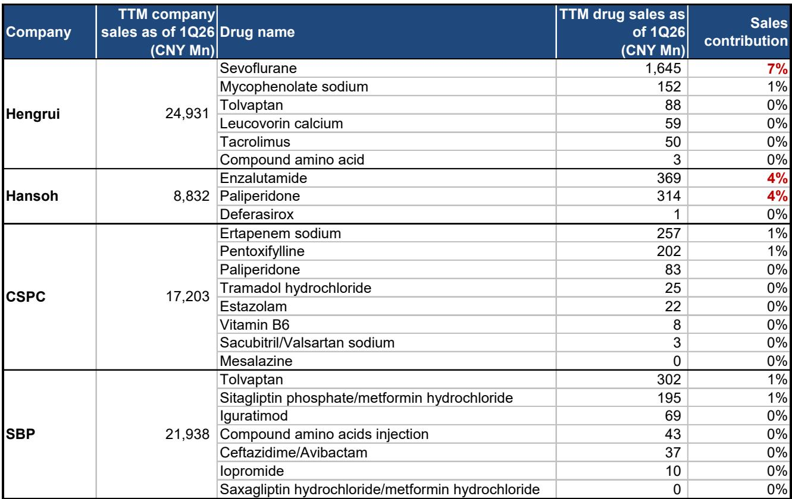
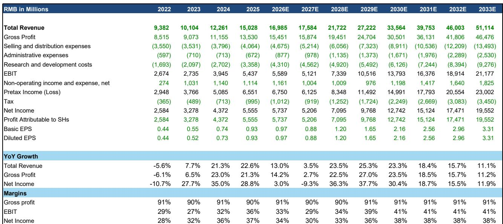

# 中国医药行业的结构性分化：财报季将揭示哪些公司真正走出了仿制药陷阱

2026年第二季度是中国医药行业的关键节点。两大结构性力量——持续深化的反腐行动与第十二批国家集采——正在同时压缩非差异化产品的商业可行性。然而，2026年上半年财报预览揭示的并非行业整体放缓，而是一个更具启发性的现象：创新领导者与依赖传统业务的公司之间的差距正在加速扩大，且这种分化并非暂时性的。

科伦博泰和信达生物预计将在覆盖范围内交出最亮眼的成绩单，其驱动力来自五年前几乎不存在的产品类别。恒瑞和翰森，尽管面临适度的集采压力，但其创新收入基础正日益提供缓冲。与此同时，那些仍依赖推广力度销售me-too产品的公司，正面临合规审查和定价压力的双重挤压。财报季将不仅仅是报告过去的表现——它将确认在中国医药市场改革后，哪些商业模式在结构上是可行的。

2026年第二季度重启的反腐行动与2023年的广泛冻结有本质区别。这一次，执法针对的是具体行为：以学术会议、研究合作和患者项目为名的变相营销。公司反馈凸显了影响的不均衡性。恒瑞报告称，学术推广和医院进药目录更新受到暂时干扰，尤其是在低线城市。相比之下，信达生物表示商业影响有限。这种分化并非随机。它反映了处方决策方式的根本转变。当临床疗效和真实世界结果取代推广力度成为医生选择的主要驱动力时，拥有差异化产品的公司获得结构性优势，而治疗领域拥挤的公司则面临日益严峻的商业环境。

6月底公布的第十二批集采覆盖了65个分子，涉及大量过专利期品种，进一步强化了这一逻辑。表面上看，恒瑞似乎受影响最大，仅七氟烷一项就约占公司销售额的7%。第十二批集采在未来两到三年内累计收入侵蚀估计在5亿至13亿元人民币之间。但这一数字必须放在背景中看待。恒瑞的总收入基础超过300亿元人民币，其创新产品组合正在增长。翰森面临两个成熟产品的风险，但创新药已占其产品组合的近80%。集采对公司层面的盈利影响是可控的，正是因为这两家公司都已经执行了政策环境所要求的战略转型。对于那些尚未完成转型的公司，同一批集采将构成生存威胁。

## 最有力的财报信号将来自五年前不存在的产品类别

2026年上半年的药品销售数据揭示了真实增长的集中区域，其模式清晰无误。新一代肿瘤治疗模式是医院渠道中增长最快的细分领域。PD-(L)1双特异性抗体在第一季度同比增长238%。TROP2抗体药物偶联物同期增长149%。科伦的sac-TMT在国内TROP2市场持续扩大份额，而依沃西单抗的快速崛起凸显了双特异性抗体的持续动能。这些并非对现有疗法的渐进式改进。它们代表了全新的治疗范式，享有溢价定价，且面临来自仿制药或生物类似药的有限竞争压力。

GLP-1市场通过不同渠道讲述了类似的故事。尽管对减肥药处方的监管审查趋严，2026年上半年替尔泊肽、玛仕度肽和司美格鲁肽的线上零售总额仍接近30亿元人民币。替尔泊肽以约60%的份额保持品类领先，但玛仕度肽自3月以来月度销售额已超过司美格鲁肽，并有望在全年实现约13至15亿元人民币的线上销售额。假设线上渠道占总零售额的60-70%，玛仕度肽仍有望实现公司2026年约20亿元人民币的目标。针对减肥药线上处方的监管收紧并未实质性改变需求趋势，因为这些产品保留了2型糖尿病的获批适应症。玛仕度肽的下一个催化剂将是2026年11月至12月的国家医保目录谈判，这可能显著扩大医院渠道准入，并在2027年推动另一轮销量增长。

这些产品层面的动态直接转化为公司层面的盈利预期。科伦博泰受益于作为专注于增长最快的ADC领域的单一资产公司。信达生物受益于双引擎：玛仕度肽在GLP-1领域的商业放量，以及托莱西单抗在PCSK9市场的持续份额增长（该市场同比增长75%）。百济神州，虽然并非纯粹的国内故事，但在国际上展示了同样的原则：BRUKINSA在美国BTKi市场的份额从2025年第四季度的30%上升至2026年第二季度的36%，在一个不断扩大的品类中稳步从IMBRUVICA手中夺取份额。

对于传统制药公司而言，情况更为复杂但仍具启发性。恒瑞的瑞维鲁胺在雄激素受体市场持续扩大份额，该市场加速至23%的同比增长。但达尔西利在CDK4/6市场失去份额，该市场同比增长36%。万赛珠单抗，作为IL-17/23市场的新进入者，尚未获得有意义的份额。翰森的奥美替尼继续受益于第三代EGFR-TKI市场的扩张，但品类增长放缓至18%的同比增长，奥希替尼重新夺回约49%的份额。这些结果表明，即使在创新品类内部，竞争动态也在加剧。市场增长并不能保证单个产品的成功。那些能够交出亮眼成绩的公司，是那些产品在快速增长类别中展现出清晰差异化的公司，而不仅仅是参与其中的公司。

## 2026年下半年的决策框架：区分赢家与落伍者的三个问题

在进入2026年下半年时，评估中国医药行业的研究者应采用结构化框架，而非依赖整体行业趋势。公司之间的分化过于显著，无法采用一刀切的方法。三个诊断性问题有助于区分哪些公司在当前政策环境下具有结构性优势。

第一，收入中有多大比例来自在其治疗类别中具有临床差异化的产品？这与被标记为“创新”的收入比例不同。在一个拥有十多个竞争对手的市场中，一个me-too PD-1抑制剂面临的商业环境，与一个first-in-class双特异性抗体或一个best-in-class ADC有着根本区别。反腐行动特别针对那些依赖推广力度驱动处方的产品。医院销售数据证实，拥挤的品类面临不成比例的压力。那些创新产品组合由真正差异化资产组成的公司将展现出韧性。那些创新产品组合由现有机制的渐进变体组成的公司将面临压缩。

第二，公司未来三年的增长轨迹对集采周期的暴露程度如何？第十二批集采对恒瑞和翰森来说是可控的，正是因为它们的创新收入占比已达到临界规模。对于那些仍从过专利期产品中获得超过30-40%收入的公司，每一轮集采都代表着一个复合逆风，而早期创新产品的增长可能无法抵消。仿制药收入下降的轨迹比任何单轮集采的相对暴露程度更重要。

第三，公司在未来12至18个月内是否有明确的医院渠道扩张催化剂？GLP-1市场表明，线上渠道可以支持可观的商业成功，但对于大多数治疗类别而言，医院准入仍是收入规模的主要驱动力。2026年底即将到来的国家医保谈判对玛仕度肽和其他寻求报销准入的产品来说是一个关键催化剂。对于有产品即将提交医保申请的公司，应评估其在医院准入方面实现阶梯式变化的潜力。对于近期没有报销催化剂的公司，通往商业规模的道路将更长且更不确定。

## 盈利修正本身包含战略信息

盈利修正本身包含战略信息。对恒瑞的盈利预测调整——将仿制药假设调整为至2028年约10%的年下降率，适度降低创新药预期，并采用更长的许可收入和里程碑收入确认周期——反映了在当前环境下，许可收入和仿制药收入应如何建模的根本性重新评估。

许可收入调整尤其具有启发性。它表明市场不应再假设首付款和里程碑付款会立即确认为收入。反腐环境以及对医药营销实践的更广泛审查，使得许可产品的商业实现变得更加不确定和漫长。这并非一次性的会计调整。这是评估外部创新价值方式的结构性变化。那些严重依赖许可引进产品或合作收入的公司，面临着更高的门槛来证明这些资产将在预期时间框架内转化为商业回报。

恒瑞的仿制药收入假设——至2028年约10%的年下降率——也具有启发性。它意味着传统的仿制药业务将继续以稳定但可控的速度侵蚀，而创新增长必须弥补。对于仿制药暴露更大且创新放量较慢的公司，隐含的收入缺口将更难填补。

相比之下，科伦博泰和信达生物的核心增长假设无需此类调整。它们的商业动能由在扩张市场中拥有自主知识产权的产品驱动，而非许可收入或仿制药稳定性。这种盈利修正方向的不对称性——多元化制药公司向下修正，纯创新药公司稳定或向上修正——是预览中关于价值正在何处创造的最清晰信号。

2026年第一季度的医院销售数据证实，药品总销售额同比下降4%，反映了仿制药、生物类似药和中药的持续疲软，尽管创新药销售保持韧性。总量数据掩盖了分化。市场并非均匀收缩。它正在将份额从非差异化产品重新分配给差异化产品，从推广驱动型类别重新分配给疗效驱动型类别，从传统产品组合重新分配给新一代治疗模式。已经完成这一转型的公司将报告确认其轨迹的盈利。仍在转型中的公司将报告揭示其仍需努力的距离。

2026年第二季度中国医药行业的财报季，不会因为任何单一产品的超预期或不及预期而被铭记。它将被铭记为一个时期，在这个时期，创新领导者与依赖仿制药的落伍者之间的结构性分化变得过于显著而无法忽视。政策环境使这种分化成为永久性的。财报数据将使其清晰可见。

*仅供参考。部分内容可能基于源材料通过AI辅助生成、翻译、总结或编辑，可能存在遗漏或错误。请独立核实。本文不构成研究、法律、税务、会计或其他专业建议。*

仅供参考。部分内容可能基于源材料通过AI辅助生成、翻译、总结或编辑，可能存在遗漏或错误。请独立核实。本文不构成研究、法律、税务、会计或其他专业建议。

