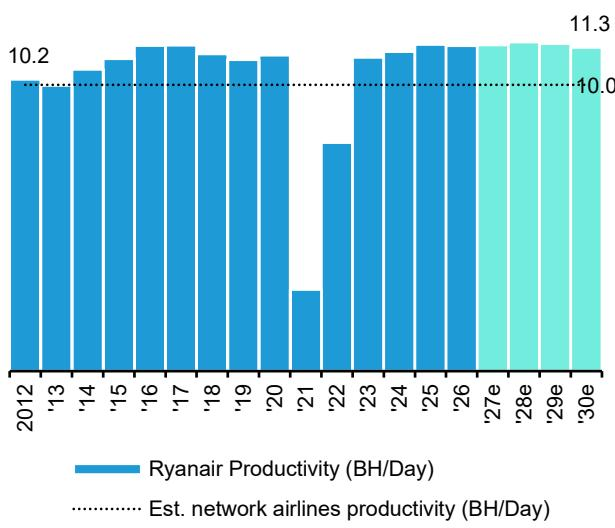
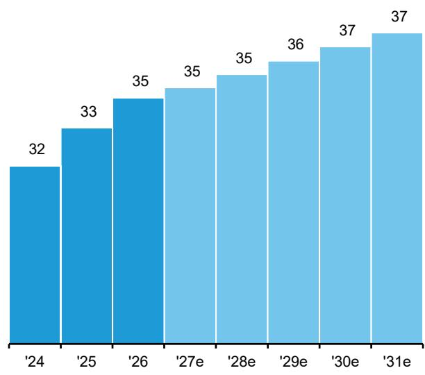
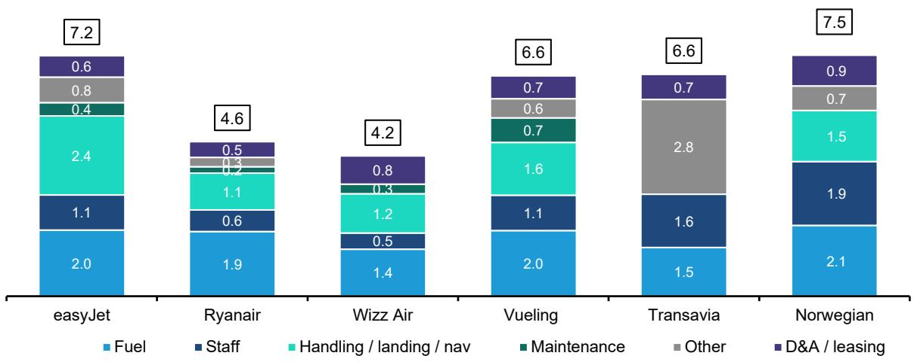

# European Airlines

## European Airlines: Ryanair Rising, Part V. 单位成本深度研究——未来多年的成本优势锁定

  
Alex Irving, CFA  
+44 20 7676 7044  
alex.irving@bernsteinsg.com

  
Antoine Madre

+33 1 58 98 74 52

antoine.madre@bernsteinsg.com

瑞安航空的业务建立在一条基本原则之上：对单位成本的控制。最低的单位成本是该行业两个可能的竞争优势来源之一（另一个是能够带来高单位收入的优越航线网络）。虽然许多其他"低成本"航空公司为了向高端市场发展而增加了开支，但瑞安航空没有这样做，它无疑是全球航空业成本最小化模式的标杆。该公司正在锁定其未来多年的成本优势，具体措施包括引入MAX-10、一项支持发动机维修内部化的CFM协议，以及在员工生产力和机场成本方面保持高度自律。

**MAX-10：瑞安航空的机型升级故事终于到来。** 空客窄体机运营商从ceo到neo的技术升级中，主要获得两个方面的单位成本降低：更高效的发动机（LEAP-1A、GTF）比上一代（CFM 56、V2500）消耗更少的燃油；飞机也更大：A321neo的最大密度为244座，而A320ceo为180座。两者都显著降低了成本。瑞安航空的737-8200相比737-NG（LEAP-1B对比CFM 56）提高了燃油效率，但座位数仅从189座增加到197座，增幅为4%。其MAX-10拥有228个座位。我们认为737-8200的CASK比NG低7%，而MAX-10的CASK比NG低14%。MAX-10将于2027年开始交付，到2030年代中期将成为机队中占比最大的机型。

**MRO内部化：我们估计内部回报率为23%。** 瑞安航空长期以来一直自行进行机身维修，而发动机大修则由CFM负责。今年早些时候，瑞安航空与CFM签署了一项为期15年的协议，由CFM为其发动机维修车间提供零部件。我们预计，这项协议意味着瑞安航空的维修成本上涨速度将低于同行，同时也能免受其他航空公司可能不得不应对的MRO产能紧张之争的影响。在15年的时间里，我们估计这项投资的内部回报率为23%。

**劳动力成本：极高的生产力。** 瑞安航空在非燃料成本的其他可控领域也保持着自律。高劳动生产率显而易见：瑞安航空每架飞机配备43名员工，而易捷航空为54名。虽然Wizz和伏林航空每架飞机的员工数更少，但瑞安航空将更多活动内部化。该公司也已开始进行新一轮的工会协议谈判，其中最大的国家（意大利）已经完成。

**机场成本：你们来争取我的业务。** 在机场成本方面，瑞安航空的航线网络灵活性使其能够将飞机从高成本市场撤出，并将其分配到成本更低、资本利用更优的市场。今年我们观察到的一个例子是，该公司减少了在西班牙地区的飞机数量，并将更多运力分配给了政策更友好的瑞典和阿尔巴尼亚。瑞安航空拥有超过80个基地和200个机场的布局，使其能够灵活地重新调配飞机；最终，机场之间需要为争取瑞安航空的业务而竞争。

**研究启示。** 瑞安航空通过成本最小化，建立了全球投资回报率最高的航空公司之一。在此方面，它保持了显著的自律，即使其他"低成本"航空公司越来越多地采取混合策略。该公司正在锁定未来多年的成本优势：MAX-10、MRO内部化、CFM零部件协议以及灵活的资本配置，应能使其成本优势得以保持并加强。

## 研究启示

**瑞安航空的成本掌控力：数据不言自明。** 瑞安航空是本世纪欧洲最成功的航空公司，也是其最大的增长驱动力。它在1990年代初期采用了低成本航空模式。从那时起，它推动了成本和票价的下降以及客运量的增长，从1997年上市到疫情前，客运量的年复合增长率为19%。瑞安航空在西南航空最初原则的基础上，完善并可以说优化了低成本航空模式。其对高生产力、低成本机场、单一机队和点对点航线的专注，带来了极低的单位成本，在欧洲只有Wizz Air可与之媲美。2025年，欧洲内部每五个座位中就有一个是瑞安航空的。其规模增强了与供应商的议价能力，并提供了抵御局部性干扰的韧性。即使增长放缓，高员工生产力也有助于维持低成本，确保商业模式保持韧性。

**单位成本深度研究：** 我们认为MAX-10相比737-NG可带来14%的CASK优势，相比MAX-8200可带来7%的优势。瑞安航空的机队更新计划将带来显著的成本效益。该航空公司应于2027年春季开始接收波音737 MAX-10。我们对瑞安航空机队中飞机类型的分析表明，相对于当前的737-NG和MAX-8200机队，MAX-10的CASK将分别降低14%和7%。具体而言，我们估计，与737 NG相比，MAX-10每ASK的燃油成本将降低27%，人员成本降低11%，机场收费降低1%，导航收费降低12%，维修成本降低17%。由于飞机购置成本持续上升，每ASK的折旧费用可能会略有增加。这些收益主要来自MAX-10更大的座位容量和下一代技术，这进一步巩固了瑞安航空的成本领先地位。

**单位成本深度研究：CFM协议。I：协议内容。** 目前整个航空业的维修成本都处于高位，这反映了维修产能紧张、零部件和劳动力成本上涨，以及新一代飞机更高的维修要求。为了进一步控制成本上涨，瑞安航空与CFM签署了一项长期协议，将机队支持与发动机维修的逐步内部化相结合。根据该协议，CFM将继续作为瑞安航空不断扩大的LEAP-1B发动机机队的整理版发动机零部件供应商，一旦该航空公司的飞机数量达到约800架、发动机数量接近2000台，年度零部件采购额预计将超过10亿美元。同时，CFM将支持瑞安航空在欧洲建设两个新的发动机维修设施（一个计划于2028年底投入使用，另一个于2029年投入使用），使维修活动逐步从第三方设施转移到瑞安航空自己的车间。

**单位成本深度研究：CFM协议。II：经济效益。** 我们通过基于机队增长、飞机利用率和发动机维修周期对未来LEAP车间访问次数进行建模，来估计瑞安航空CFM协议带来的收益。然后，我们将内部化模式（需要约15亿欧元的车间投资，但受益于更高的生产力、更低的备用发动机需求和更好的成本控制）与外包PBH模式（维修成本上涨更高，成本控制更弱，且必须考虑第三方MRO的利润率）进行比较。虽然两种情景在2029-2033年期间产生的成本都在约10亿欧元左右，但随着时间的推移，差距会扩大，外包成本超过25亿欧元，而内部化成本低于20亿欧元。总体而言，我们估计该协议可创造23%的内部回报率，并随着时间的推移释放5-8亿欧元的累计节省，主要来自较低的零部件成本上涨、生产力提升和备用发动机需求减少。

**单位成本深度研究：劳动力成本可控——现在与未来。** 劳动力是航空公司最重要的成本之一。瑞安航空的劳动力成本受益于高员工生产力、单一机型机队，以及主要与岗位、活动量和基地地点挂钩、而非绑定年度自动增长的薪酬模式。其多元化的网络和跨国员工队伍降低了周期性影响传统航空公司的局部劳资纠纷的运营威胁，同时集体劳动协议的续签工作已经开始，包括在瑞安航空最大的国家（意大利），这加强了劳资关系的稳定性。结合持续的增长和高飞机利用率，这些因素应有助于瑞安航空保持其结构性劳动力成本优势，我们认为几乎没有因素会实质性地削弱其商业模式。

**单位成本深度研究：机场激励措施将持续存在。** 机场和地面服务收费是运营成本的第三大组成部分。瑞安航空享有欧洲最低的每ASK机场成本，这得益于有吸引力的机场激励措施、对不那么拥挤的机场的关注，以及其规模和刺激客运量的能力所带来的强大议价能力。此外，其广泛的网络使其能够迅速将运力重新部署到提供最具吸引力经济条件的机场和国家，从而加强其谈判地位。瑞安航空最近一直在将运力从法国、比利时和德国等成本较高的市场，转移到意大利、瑞典、匈牙利、斯洛伐克和阿尔巴尼亚等税收较低、对机场更友好的国家。结合其在弱势竞争对手市场进行反周期扩张的历史，这形成了一个良性循环：更多的座位带来更多的客流量，进而吸引更大的激励，并进一步巩固瑞安航空的机场成本优势。

## 关键图表

图表1：瑞安航空和Wizz Air是低成本单位成本的无可匹敌的冠军
欧洲点对点航空公司CASK，2025年，欧分

  
来源：公司报告，Bernstein分析

图表2：根据我们的评估，MAX-10的CASK比737-NG低约17%，对瑞安航空而言是一个明确的成本利好

瑞安航空窄体机成本比较

<table><tr><td colspan="6">建模假设</td></tr><tr><td>燃油价格（欧元/公吨）</td><td>800</td><td></td><td></td><td></td><td></td></tr><tr><td>飞行距离</td><td>1,300公里</td><td></td><td></td><td></td><td></td></tr><tr><td>年航班数/天</td><td>5.0</td><td></td><td></td><td></td><td></td></tr><tr><td>飞机假设</td><td>737-NG</td><td>737-8200</td><td>737 MAX 10</td><td></td><td></td></tr><tr><td>最大起飞重量</td><td>79.0</td><td>82.6</td><td>89.8</td><td></td><td></td></tr><tr><td>每小时燃油消耗（公吨）</td><td>2.8</td><td>2.4</td><td>2.5</td><td></td><td></td></tr><tr><td>速度（公里/小时）</td><td>800</td><td>800</td><td>800</td><td></td><td></td></tr><tr><td>其他假设</td><td>737-NG</td><td>737-8200</td><td>737 MAX 10</td><td>MAX 10对比8200</td><td>MAX 10对比NG</td></tr><tr><td>座位数</td><td>189</td><td>197</td><td>228</td><td>+16%</td><td>+21%</td></tr><tr><td>每航班ASK</td><td>245,700</td><td>256,100</td><td>296,400</td><td>+16%</td><td>+21%</td></tr></table>

<table><tr><td>每ASK指标</td><td>737-NG</td><td>737-8200</td><td>737 MAX 10</td><td>MAX 10对比8200</td><td>MAX 10对比NG</td></tr><tr><td>燃油</td><td>1.8</td><td>1.4</td><td>1.3</td><td>-10%</td><td>-27%</td></tr><tr><td>员工</td><td>0.7</td><td>0.7</td><td>0.6</td><td>-7%</td><td>-11%</td></tr><tr><td>机场收费</td><td>0.6</td><td>0.6</td><td>0.6</td><td>-1%</td><td>-1%</td></tr><tr><td>导航收费</td><td>0.5</td><td>0.5</td><td>0.4</td><td>-10%</td><td>-12%</td></tr><tr><td>维修</td><td>0.2</td><td>0.2</td><td>0.2</td><td>-14%</td><td>-17%</td></tr><tr><td>销售成本</td><td>0.1</td><td>0.1</td><td>0.1</td><td>0%</td><td>0%</td></tr><tr><td>管理及运营成本</td><td>0.4</td><td>0.4</td><td>0.4</td><td>0%</td><td>0%</td></tr><tr><td>折旧与摊销</td><td>0.4</td><td>0.4</td><td>0.4</td><td>-6%</td><td>+3%</td></tr></table>

<table><tr><td>欧元对比</td><td>737-NG</td><td>737-8200</td><td>737 MAX 10</td><td>MAX 10对比8200</td><td>MAX 10对比NG</td></tr><tr><td>CASK（欧分）</td><td>4.7</td><td>4.3</td><td>4.0</td><td>-7%</td><td>-14%</td></tr><tr><td>扣除燃油的CASK（欧分）</td><td>2.9</td><td>2.9</td><td>2.7</td><td>-6%</td><td>-6%</td></tr><tr><td>总航程成本</td><td>11,478</td><td>11,052</td><td>11,898</td><td>+8%</td><td>+4%</td></tr></table>

来源：公司报告，RDC航空，Bernstein估计与分析

图表3：我们认为瑞安航空将发动机大修内部化的决定，到2041年将产生约23%的内部回报率
瑞安航空CFM协议内部化收益详情

<table><tr><td></td><td>2027E</td><td>2028E</td><td>2029E</td><td>2030E</td><td>2031E</td><td>2032E</td><td>2033E</td><td>2034E</td><td>2035E</td><td>2036E</td><td>2037E</td><td>2038E</td><td>2039E</td><td>2040E</td><td>2041E</td></tr><tr><td>新一代飞机</td><td>218</td><td>236</td><td>255</td><td>295</td><td>345</td><td>400</td><td>455</td><td>510</td><td>565</td><td>620</td><td>675</td><td>730</td><td>785</td><td>830</td><td>840</td></tr><tr><td>发动机</td><td>436</td><td>472</td><td>510</td><td>590</td><td>690</td><td>800</td><td>910</td><td>1,020</td><td>1,130</td><td>1,240</td><td>1,350</td><td>1,460</td><td>1,570</td><td>1,660</td><td>1,680</td></tr><tr><td>年发动机飞行小时（千）</td><td>1,526</td><td>1,652</td><td>1,785</td><td>2,065</td><td>2,415</td><td>2,800</td><td>3,185</td><td>3,570</td><td>3,955</td><td>4,340</td><td>4,725</td><td>5,110</td><td>5,495</td><td>5,810</td><td>5,880</td></tr><tr><td>LEAP年车间访问次数</td><td>122</td><td>74</td><td>96</td><td>182</td><td>142</td><td>112</td><td>218</td><td>180</td><td>192</td><td>318</td><td>290</td><td>302</td><td>306</td><td>326</td><td>316</td></tr></table>

<table><tr><td>有CFM协议</td><td>2027E</td><td>2028E</td><td>2029E</td><td>2030E</td><td>2031E</td><td>2032E</td><td>2033E</td><td>2034E</td><td>2035E</td><td>2036E</td><td>2037E</td><td>2038E</td><td>2039E</td><td>2040E</td><td>2041E</td></tr><tr><td>每次车间访问零部件成本（百万美元）</td><td></td><td></td><td>4.3</td><td>4.4</td><td>4.6</td><td>4.8</td><td>5.0</td><td>5.2</td><td>5.4</td><td>5.6</td><td>5.8</td><td>6.0</td><td>6.3</td><td>6.5</td><td>6.8</td></tr><tr><td>年通胀率</td><td></td><td></td><td></td><td>4%</td><td>4%</td><td>4%</td><td>4%</td><td>4%</td><td>4%</td><td>4%</td><td>4%</td><td>4%</td><td>4%</td><td>4%</td><td>4%</td></tr><tr><td>零部件成本（百万美元）</td><td></td><td></td><td>408</td><td>804</td><td>653</td><td>535</td><td>1,084</td><td>931</td><td>1,033</td><td>1,778</td><td>1,687</td><td>1,827</td><td>1,925</td><td>2,133</td><td>2,150</td></tr><tr><td>零部件成本（百万欧元）</td><td></td><td></td><td>352</td><td>693</td><td>563</td><td>462</td><td>934</td><td>802</td><td>890</td><td>1,533</td><td>1,454</td><td>1,575</td><td>1,660</td><td>1,839</td><td>1,854</td></tr><tr><td>+ 车间资本支出（百万欧元）</td><td></td><td></td><td>500</td><td>500</td><td>500</td><td></td><td></td><td></td><td></td><td></td><td></td><td></td><td></td><td></td><td></td></tr><tr><td>+ 增量员工成本（百万欧元）</td><td></td><td></td><td>9</td><td>10</td><td>12</td><td>14</td><td>16</td><td>18</td><td>20</td><td>22</td><td>24</td><td>26</td><td>27</td><td>29</td><td>29</td></tr><tr><td>- 避免的额外备用发动机持有成本（百万欧元）</td><td></td><td></td><td>-20</td><td>-40</td><td>-32</td><td>-27</td><td>-54</td><td>-44</td><td>-47</td><td>-78</td><td>-72</td><td>-74</td><td>-75</td><td>-80</td><td>-78</td></tr><tr><td>+ 车间年度维持成本（百万欧元）</td><td></td><td></td><td>75</td><td>75</td><td>75</td><td>75</td><td>75</td><td>75</td><td>75</td><td>75</td><td>75</td><td>75</td><td>75</td><td>75</td><td>75</td></tr><tr><td>自有重型车间总成本（百万欧元）</td><td></td><td></td><td>915</td><td>1,239</td><td>1,117</td><td>524</td><td>972</td><td>851</td><td>938</td><td>1,551</td><td>1,481</td><td>1,601</td><td>1,687</td><td>1,862</td><td>1,880</td></tr></table>

<table><tr><td>无CFM协议</td><td>2027E</td><td>2028E</td><td>2029E</td><td>2030E</td><td>2031E</td><td>2032E</td><td>2033E</td><td>2034E</td><td>2035E</td><td>2036E</td><td>2037E</td><td>2038E</td><td>2039E</td><td>2040E</td><td>2041E</td></tr><tr><td>每次车间访问零部件成本（百万美元）</td><td></td><td></td><td>4.3</td><td>4.6</td><td>4.9</td><td>5.3</td><td>5.6</td><td>6.0</td><td>6.4</td><td>6.9</td><td>7.4</td><td>7.9</td><td>8.4</td><td>9.0</td><td>9.7</td></tr><tr><td>年通胀率</td><td></td><td></td><td></td><td>7%</td><td>7%</td><td>7%</td><td>7%</td><td>7%</td><td>7%</td><td>7%</td><td>7%</td><td>7%</td><td>7%</td><td>7%</td><td>7%</td></tr><tr><td>零部件成本（百万美元）</td><td></td><td></td><td>412</td><td>836</td><td>698</td><td>589</td><td>1,227</td><td>1,084</td><td>1,237</td><td>2,192</td><td>2,139</td><td>2,384</td><td>2,584</td><td>2,946</td><td>3,056</td></tr><tr><td>零部件成本（百万欧元）</td><td></td><td></td><td>355</td><td>721</td><td>602</td><td>508</td><td>1,058</td><td>934</td><td>1,066</td><td>1,890</td><td>1,844</td><td>2,055</td><td>2,228</td><td>2,540</td><td>2,634</td></tr><tr><td>+ 员工生产力损失（百万欧元）</td><td></td><td></td><td>11</td><td>12</td><td>14</td><td>17</td><td>19</td><td>21</td><td>24</td><td>26</td><td>28</td><td>31</td><td>33</td><td>35</td><td>35</td></tr><tr><td>+ 第三方MRO利润（百万欧元）</td><td></td><td></td><td>55</td><td>110</td><td>92</td><td>79</td><td>162</td><td>143</td><td>164</td><td>287</td><td>281</td><td>313</td><td>339</td><td>386</td><td>400</td></tr><tr><td>外包车间总成本（百万欧元）</td><td></td><td></td><td>421</td><td>843</td><td>709</td><td>603</td><td>1,238</td><td>1,099</td><td>1,254</td><td>2,203</td><td>2,153</td><td>2,398</td><td>2,600</td><td>2,961</td><td>3,070</td></tr></table>

<table><tr><td>内部化收益（百万欧元）</td><td>(495)</td><td>(396)</td><td>(409)</td><td>79</td><td>267</td><td>248</td><td>316</td><td>652</td><td>672</td><td>798</td><td>913</td><td>1,098</td><td>1,190</td></tr><tr><td>内部回报率：23%</td><td></td><td></td><td></td><td></td><td></td><td></td><td></td><td></td><td></td><td></td><td></td><td></td><td></td></tr></table>

来源：Bernstein分析与估计

## 相关研究

## 模型与数据包

公司模型 | 法航-荷航 | 易捷航空 | IAG | 汉莎航空 | 瑞安航空 | Wizz Air

## 航空公司数据包

## 入门指南库

关于时刻的入门指南

关于可持续航空燃料的入门指南

关于航空公司成本的入门指南

## 黑皮书库

欧洲航空公司：从颠簸到顺风（2025年）

瑞安航空：航空业最独特的目的地……现金回报（2023年）

## 重要行业笔记

瑞安航空：2026年第三季度最佳思路——燃油危机缓解，报价低估了过低单位经济性

瑞安航空崛起，第四部分：欧洲点对点承运人日益分化的网络

瑞安航空崛起，第三部分：整合尚未结束

瑞安航空崛起，第二部分：如今昂贵的燃油如何加强中期盈利能力

瑞安航空崛起：走出燃油危机的两条路径，目的地每股收益超过3欧元

瑞安航空深度研究网络研讨会 | 瑞安航空幻灯片

欧洲航空公司：只有两个明确的赢家——燃油消耗收益。将瑞安航空上调至优于大盘，将易捷航空和Wizz Air下调至与大盘持平

## 详情

## 瑞安航空的成本掌控力：数据不言自明

瑞安航空是本世纪欧洲最成功的航空公司，也是其最大的增长驱动力。从一个爱尔兰租赁大亨的小型副业项目起步，它在1990年代初期采用了低成本航空模式。从那时起，它推动了成本和票价的下降以及客运量的增长，从1997年上市到疫情前，客运量的年复合增长率为19%。瑞安航空在西南航空最初原则的基础上，完善并可以说优化了低成本航空模式。其对高生产力、低成本机场、单一机队和点对点航线的专注，带来了极低的单位成本，在欧洲只有Wizz Air可与之媲美。2025年，欧洲内部每五个座位中就有一个是瑞安航空的。其规模增强了与供应商的议价能力，并提供了抵御局部性干扰的韧性。即使增长放缓，高员工生产力也有助于维持低成本，确保商业模式保持韧性。

- **完善低成本航空模式。** 瑞安航空可能并非低成本模式的发明者——这一荣誉属于西南航空——但比任何其他航空公司都更能声称自己完善了该模式。它几乎从未偏离使其成功的因素：高生产力、廉价机场、纯粹的点对点、专注于直销渠道等，从而巩固了其作为全球低成本飞行冠军的地位。年轻的竞争对手Wizz Air是欧洲相对少见一家在单位成本上能与瑞安航空相提并论的航空公司；其他所有公司都相去甚远。2025年，欧洲内部航线每五个座位中就有一个在瑞安航空的飞机上。可能不太为人所知的是其商业方面的能力：凭借良好的航线网络和成功销售辅助产品的经验，瑞安航空一直能够持续产生两位数的净利润率——我们预计这一趋势将在中长期内持续。

- **增长和规模帮助瑞安航空找到了额外的成本效率……** 增长有利于航空公司的单位成本。首先，它赋予了航空公司谈判中的强势地位：由于有更多的增长可以分配，供应商有动力积极竞标以获得更大份额，从而降低瑞安航空的单位成本。这在瑞安航空的机场成本中显而易见。同样，在20年内从一个小角色成长为全球最大的航空公司之一，使瑞安航空能够与波音公司达成有利的飞机交易。如今，作为最大的航空公司之一，它在谈判中仍然拥有影响力，尽管可提供的增长率正在下降。遍布欧洲的多元化网络也使其比传统航空公司更能抵御罢工：如果瑞安航空在一个国家的机组人员罢工，它可以派遣其他国家的工人来执飞航班。

- **……即使增长放缓，也不应破坏商业模式。** 随着瑞安航空进入一个容量年复合增长率接近3%（而非2010年代的10%或2000年代的20%以上）的时期，理解其对单位成本的影响至关重要。瑞安航空的单位成本过去无疑受益于其增长率，例如，这赋予了航空公司相对于供应商（机场、地面服务公司和原始设备制造商）更大的议价能力。我们可能会看到单位成本在此方面出现一些温和上涨——尽管增长只是故事的一部分，公司的规模应能继续使其达成有利的交易。更大的飞机，特别是MAX-10，也将为单位成本带来通缩动力。另一个通常令人担忧的领域是员工。对于员工合同中包含年度加薪的航空公司来说，增长至关重要，因为它使航空公司能够通过稳定流入更便宜、资历更浅的员工来稀释这一成本。然而，在瑞安航空，这种年度加薪很少见，薪酬是基地、级别和活动量的函数（飞行越多=薪酬越高）。我们认为没有任何因素会实质性地威胁到其商业模式。

图表4：高生产力——低成本的关键决定因素……

瑞安航空每架飞机平均生产力

  
来源：公司报告，Bernstein估计与分析

图表5：……使单位成本保持可控
瑞安航空每座位成本（扣除燃油），2024-2030财年  
  
来源：公司报告，Bernstein估计与分析

图表6：瑞安航空和Wizz Air是低成本单位成本的无可匹敌的冠军
欧洲点对点航空公司CASK，2025年，欧分  
  
来源：公司报告，Bernstein分析

## 单位成本深度研究：我们认为MAX-10相比B737 NG可带来14%的CASK优势，相比MAX-8200可带来7%的优势

瑞安航空的机队更新计划将带来显著的成本效益。该航空公司预计将于2027年春季开始接收波音737 MAX-10，这是一种更大、燃油效率更高的飞机。我们对瑞安航空机队中飞机类型的自下而上分析表明，相对于当前的737-NG和MAX-8200机队，MAX-10的CASK将分别降低14%和7%。具体而言，我们估计，与737 NG相比，MAX-10每ASK的燃油成本将降低27%，人员成本降低11%，机场收费降低1%，导航收费降低12%，维修成本降低17%。由于飞机购置成本持续上升，每ASK的折旧费用可能会略有增加。这些收益主要来自MAX-10更大的座位容量和下一代技术，这进一步巩固了瑞安航空的成本领先地位。

- **MAX-10比当前机队更大、燃油效率更高：CASK降低9-17%，容量提升16-21%。** 我们对瑞安航空三种飞机类型——波音737 NG（BERNe从2030财年开始逐步淘汰）、波音737 MAX-8200（瑞安航空喜欢称之为"游戏规则改变者"）和波音737 MAX-10——的深入分析，突显了其机队单位经济性的演变。我们估计，MAX-10的CASK比737 NG低17%，比MAX-8200低9%。燃油效率的提高和更高的座位容量是这一优势的主要驱动力。MAX-10与737 NG之间的主要成本差异如下：

- **燃油成本：每ASK降低27%。** MAX-10每小时消耗2.5吨煤油，而737 NG为2.8吨。假设燃油价格为每吨800欧元并考虑ETS成本，我们的计算表明，MAX-10的燃油CASK比737 NG低约27%，比737-8200低10%。先进的发动机技术和空气动力学设计，加上更大的机型，足以抵消其更重重量带来的影响。如果燃油价格上涨，成本优势将越来越有利于MAX-10。

- **人员成本：每ASK降低11%。** 这部分涵盖飞行员、客舱乘务员和工程师。在中程航班上，需要两名飞行员。MAX-10需要五名客舱乘务员，而737 NG和737-8200需要四名，因为欧洲法规要求座位数每超过50的倍数就需要增加一名客舱乘务员。我们假设三个机队的工程人员数量相同，生产力和薪资水平相似，尽管更大的MAX-10可能需要稍长的周转时间。我们的估计表明，MAX-10的员工CASK比737-NG低11%，比737-8200低7%，这主要归功于其更高的座位容量。

- **机场收费：每ASK降低1%。** 机场收费包括着陆费和地面服务费。着陆费主要取决于飞机的最大起飞重量；我们假设每吨最大起飞重量收取4欧元的着陆费，这反映了瑞安航空专注于二级低成本机场的特点。地面服务费是最大的组成部分，主要与乘客相关，因此随飞机尺寸而变化。这也受到所使用服务水平的影响（例如，使用廊桥比使用舷梯成本更高）。我们还包括机场员工成本，并注意到瑞安航空将其中一些活动外包。综合这些因素，MAX-10的每ASK机场成本比737 NG低约26%，这主要归功于其更高的座位容量（比737-8200低15%）。

- **导航收费：每ASK降低12%。** 导航收费取决于飞行距离和飞机尺寸，或者更准确地说，取决于最大起飞重量的平方根。我们假设B737 NG的导航收费为每公里0.90欧元，并根据最大起飞重量平方根的比率，为MAX-10假设为每公里0.96欧元。这导致MAX-10的每ASK导航收费低12%（比737-8200低10%）。

- **维修成本：每ASK降低17%。** 目前整个航空业的维修成本都处于高位，这反映了MRO市场产能紧张以及新一代飞机更高的维修要求。例如，Wizz Air在其2026财年第二季度业绩
