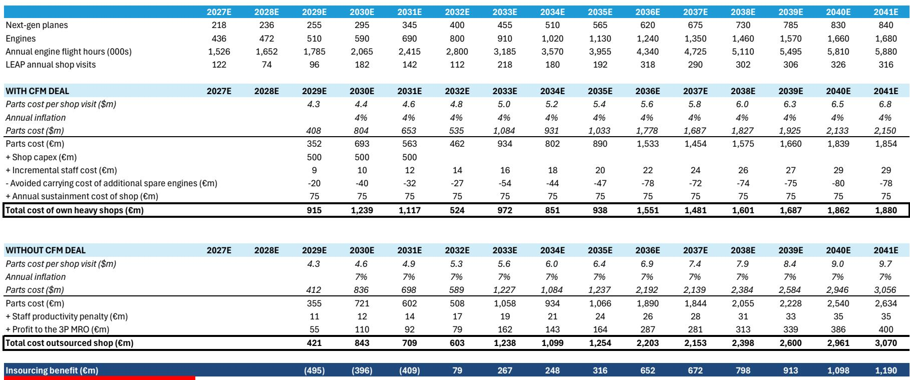
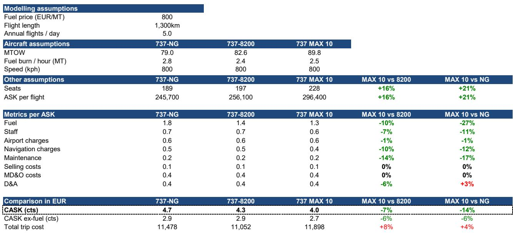
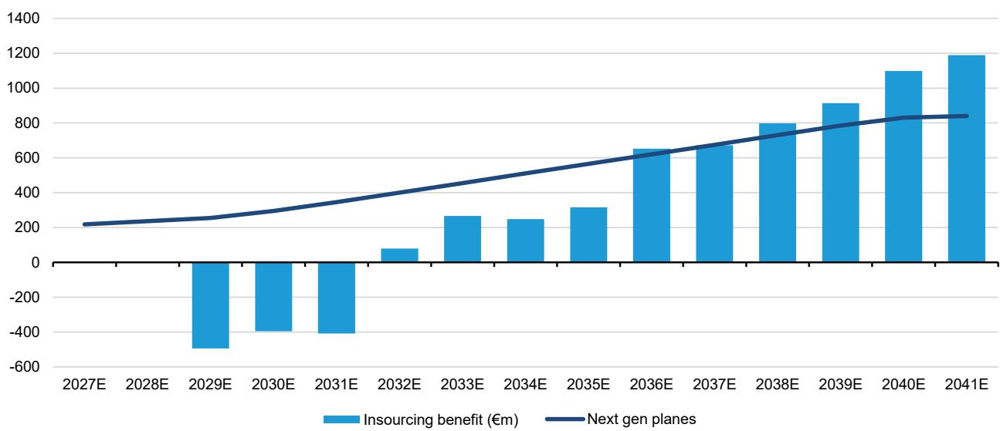

# Bernstein：欧洲航空瑞安航空崛起第五部分单位成本深度分析锁定未来数年

欧洲航空业正在经历一轮结构性分化。当多数低成本航司试图通过增加服务、提升客单价来寻找增长时，瑞安航空选择了一条更极致的路径——把单位成本压到不能再低，然后用规模优势把它锁死。Bernstein最新发布的系列研报第五部分，用大量工程级数据拆解了这家公司如何通过机队升级、发动机维修自营和机场议价权，在未来五到十年内持续拉大与同行的成本差距。

报告的核心判断是：瑞安航空的成本优势不是静态的，而是通过一系列可量化的研究和合同安排，正在被“锁定”为长期结构性壁垒。这与其他航司面临的成本通胀不确定性形成了鲜明对比。

## 1. MAX-10 带来的不是渐进改善，而是单位成本跳降

瑞安航空目前的机队主力是737-8200，相比上一代NG机型，单位成本降低了约7%。但真正的变量在2027年——当MAX-10开始交付时，单位成本将比NG机型下降14%。Bernstein的测算显示，这主要来自两个来源：一是座位数从197个增加到228个，二是新一代发动机的燃油效率提升。在每可用座公里成本（CASK）的拆解中，燃油成本下降27%，维护成本下降17%，人员成本下降11%。折旧成本略有上升，但被其他项目的节省完全覆盖。

这意味着，当MAX-10在2030年代中期成为机队主力时，瑞安航空的单位成本结构将进入一个其他欧洲航司难以追赶的新区间。

## 2. 发动机维修自营：23%的内部回报表现如何实现

发动机大修是航司成本中增长最快、最不可控的项目之一。行业普遍面临维修产能紧张、零部件通胀和第三方MRO利润率上升的三重不确定性。瑞安航空今年与CFM签署了一份为期15年的协议，核心安排是：CFM继续作为LEAP-1B发动机零部件的整理版供应商，同时支持瑞安在欧洲建设两座自有发动机维修厂。

Bernstein对这一安排的财务影响做了详细建模。在自营模式下，瑞安需要投入约15亿欧元的厂房建设成本，但换来的是更低的零部件通胀率（4%对7%）、更高的维修人员效率，以及无需为第三方MRO支付利润。模型显示，从2029年到2041年，自营模式的累计成本将比外包模式低5至8亿欧元，内部回报表现达到23%。

> **KC评论：** 23%的IRR在航空业属于极高回报。但更关键的是，这份协议让瑞安航空在维修成本这个最难控制的变量上，获得了与同行完全不同的成本曲线。当其他航司在2028年后为维修产能和价格博弈时，瑞安已经锁定了自己的节奏。

## 3. 机场议价权：网络灵活性本身就是成本武器

机场收费是航司第三大运营成本项。瑞安航空的策略不是谈判，而是用脚投票。它拥有超过80个基地和200个机场的网络，可以快速将运力从高成本市场转移到低成本市场。报告列举了今年的实际案例：瑞安减少了在西班牙部分地区的飞机部署，增加了在瑞典和阿尔巴尼亚的运力。

这种灵活性的基础是规模。当一家航司在一个区域市场拥有足够多的座位供给时，机场会主动提供激励来争取或留住这些运力。瑞安航空的机场成本已经是欧洲最低，而随着网络进一步扩张，这种议价权只会增强。

## 4. 劳动成本：43人/架飞机的效率是如何维持的

在人员成本这个航司第二大支出项上，瑞安航空的每架飞机员工数为43人，远低于易捷航空的54人。虽然Wizz Air和伏林航空的人员数量更少，但瑞安航空内部化了很多活动。更重要的是，它的薪酬模型与角色、活动和基地挂钩，而非自动年度增长。意大利作为其最大市场，已经完成了新一轮工会协议续签。

报告认为，瑞安航空的劳动力成本优势在结构上很难被削弱——单一机型机队、高利用率、跨国劳动力组合，这些因素共同构成了一个低摩擦的运营系统。

Bernstein这份研报的价值不在于给出一个“买或不买”的判断，而在于用工程级的成本拆解，展示了一家公司在极致成本控制上的系统性能力。对于关注航空业竞争格局的读者来说，真正值得跟踪的变量不是瑞安航空的客座率或票价，而是它能否在MAX-10交付、发动机维修自营和机场网络扩张这三个维度上，按计划兑现成本承诺。

For informational purposes only. Portions may be generated,translated,summarized,or edited with AI assistance based on source materials and may contain omissions or errors. Please verify independently. This is not investment,legal,tax,accounting,or other professional advice.

For informational purposes only. Portions may be generated,translated,summarized,or edited with AI assistance based on source materials and may contain omissions or errors. Please verify independently. This is not investment,legal,tax,accounting,or other professional advice.

