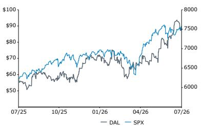

# Delta Air Lines (DAL) 2Q26: 预订趋势强劲，定价环境支撑，上调目标价至106美元

Delta Air Lines (DAL) 公布2Q26调整后稀释每股收益为1.56美元，高于其指引区间上限（1-1.50美元，见图表3），较市场/我们预期高出3%（见图表2）。全年2026年每股收益指引6-7美元（较公布前市场预期高出约18%）得到确认（见图表6）。从目前情况看，第四季度预订情况良好，即使燃料成本趋于温和，定价表现仍可能好于预期。基于对行业结构性定价转变的更强信心，我们将全年2026年调整后每股收益上调18%，并将后续年份平均上调约9%。

2Q26调整后每股收益超出预期3%，且全年指引得到确认，表明存在上行空间。多元化收入来源持续支撑增长，占总收入61%，同比提升2个百分点。高端产品扩张仍是优先事项：高端舱位（载客率更高）运力已实现低个位数增长，而主舱运力下降2-3%。国内航线表现良好，尤其从企业销售角度看（核心/沿海枢纽同比增长超过20%，部分大城市甚至达到30%）。确认全年2026年每股收益展望6.50-7.50美元，意味着较市场3季度预期有10%上行空间（使用新指引区间2-2.50美元，见图表5），较4季度预期有39%上行空间。上调我们的预测。需求保持稳健，本季度现金销售在整个预订曲线（主舱和高端产品）均有改善；第四季度预订已呈现强劲态势。同比TRASM增长预计将在3季度加速（此前我们预计增长与2季度类似），DAL第四季度盈利预期超出常规，表明对票价降幅小于燃料价格降幅的信心增强，DAL将保留部分作为盈利。我们上调预测以反映2季度超预期表现，以及对即使燃料价格下降、票价仍能维持高位的更强信心。燃料仍是变量，但行业行为的结构性变化支持该板块应重新定价的观点。

## 投资启示

维持跑赢大盘评级，目标价上调至106美元。

<table><tr><td>调整后每股收益</td><td>F25A</td><td>F26E</td><td>F27E</td></tr><tr><td>DAL (美元)</td><td>5.84</td><td>6.92</td><td>9.08</td></tr><tr><td>旧预测</td><td>--</td><td>5.86</td><td>8.52</td></tr></table>

<table><tr><td>财务数据</td><td>F25A</td><td>F26E</td><td>F27E</td><td>复合年增长率</td></tr><tr><td>收入 (百万)</td><td>63,364</td><td>72,922</td><td>74,042</td><td>8.1%</td></tr><tr><td>EBITDA (百万)</td><td>8,265</td><td>9,520</td><td>11,473</td><td>17.8%</td></tr><tr><td>净利润 (百万)</td><td>5,006</td><td>4,443</td><td>5,943</td><td>9.0%</td></tr><tr><td>自由现金流 (百万)</td><td>3,840</td><td>3,778</td><td>3,458</td><td>(5.1)%</td></tr><tr><td>调整后营业利润率 (%)</td><td>10.0</td><td>10.5</td><td>12.5</td><td>--</td></tr></table>

<table><tr><td>截止日期</td><td>2026年7月10日</td></tr><tr><td>DAL收盘价 (美元)</td><td>87.39</td></tr><tr><td>目标价 (美元)</td><td>106.00</td></tr><tr><td>上行/(下行)</td><td>21%</td></tr><tr><td>52周区间</td><td>95.68/50.45</td></tr><tr><td>标普500指数</td><td>7,575.39</td></tr><tr><td>财年截止</td><td>12月</td></tr><tr><td>股息率</td><td>1.0%</td></tr><tr><td>市值 (百万美元)</td><td>57,470</td></tr><tr><td>企业价值 (百万美元)</td><td>72,789</td></tr></table>

<table><tr><td>表现</td><td>年初至今</td><td>1个月</td><td>6个月</td><td>12个月</td></tr><tr><td>相对 (%)</td><td>25.9</td><td>14.3</td><td>20.9</td><td>53.9</td></tr><tr><td>标普500 (%)</td><td>10.7</td><td>4.2</td><td>8.7</td><td>20.6</td></tr><tr><td>相对 (%)</td><td>15.3</td><td>10.0</td><td>12.1</td><td>33.3</td></tr></table>

来源：彭博、Bernstein预测与分析。
价格表现，1年

<table><tr><td>估值指标</td><td>F25A</td><td>F26E</td><td>F27E</td></tr><tr><td>调整后市盈率 (倍)</td><td>15.0</td><td>12.6</td><td>9.6</td></tr><tr><td>PEG调整后 (倍)</td><td>(3.0)</td><td>0.7</td><td>0.3</td></tr><tr><td>企业价值/收入 (倍)</td><td>1.1</td><td>1.0</td><td>1.0</td></tr><tr><td>企业价值/EBITDA (倍)</td><td>8.8</td><td>7.6</td><td>6.3</td></tr><tr><td>企业价值/自由现金流 (倍)</td><td>19.0</td><td>19.3</td><td>21.0</td></tr><tr><td>PEG报告 (倍)</td><td>(2.3)</td><td>0.7</td><td>0.3</td></tr><tr><td>报告市盈率 (倍)</td><td>11.4</td><td>13.0</td><td>9.6</td></tr></table>

## 估值对比表

## 图表1: DAL目标价表

<table><tr><td colspan="2">截至2026年7月10日</td></tr><tr><td>DAL (NTM+1，除非另有说明)</td><td>1年目标价</td></tr><tr><td>调整后收入</td><td>70,136</td></tr><tr><td>调整后EBITDAR</td><td>12,614</td></tr><tr><td>EBITDAR利润率 (%)</td><td>18.0%</td></tr><tr><td>NTM EV/EBITDAR倍数</td><td>6.8倍</td></tr><tr><td>NTM企业价值</td><td>85,778</td></tr><tr><td>预期NTM净债务 (-)</td><td>16,091</td></tr><tr><td>股权价值</td><td>69,687</td></tr><tr><td>稀释后股份 (NTM)</td><td>658</td></tr><tr><td>目标价</td><td>106</td></tr><tr><td></td><td></td></tr><tr><td>BERN每股收益</td><td>$9.70</td></tr><tr><td>隐含市盈率</td><td>10.9倍</td></tr></table>

来源：公司报告、彭博、Bernstein预测与分析

DAL：我们通过将NTM+1 EBITDAR预测（126.14亿美元，此前为118.52亿美元）按6.8倍（此前为6.5倍）倍数资本化，并扣除一年后净债务价值，得出一年目标价106美元（此前为93美元）。106美元（此前为93美元）目标价对应NTM+1每股收益预测9.70美元（此前为8.98美元）的10.9倍（此前为10.4倍）。

## 详细分析

Delta Air Lines (DAL) 公布2Q26调整后稀释每股收益为1.56美元，高于其指引区间上限（1-1.50美元，见图表3），较市场/我们预期高出3%（见图表2）。全年2026年每股收益指引6-7美元（较公布前市场预期高出约18%）得到确认，第四季度预订曲线表现稳健，即使燃料成本趋于温和，定价表现仍可能好于预期。基于对行业结构性定价转变的更强信心，我们将全年2026年调整后每股收益上调18%，并将后续年份平均上调约9%。

2Q26超预期表现及全年指引确认表明存在上行空间。Delta Air Lines (DAL) 公布2Q26调整后稀释每股收益为1.56美元，高于其指引区间上限（即1-1.50美元，见图表3），较市场/我们预期高出3%（见图表2）。

多元化收入来源持续支撑增长，占总收入61%，同比提升2个百分点。高端收入同比增长17%，公司将其归因于回报表现强劲和高端座位投资；MRO（主要增长引擎，公司近期更多披露相关信息）同比增长32%；货运收入同比增长39%，得益于强劲的货运量，超出预期约5%。国内航线表现良好，尤其从企业销售角度看……企业销售在核心和沿海枢纽同比增长超过20%，在洛杉矶和波士顿等部分大城市甚至达到30%。

公司确认全年2026年每股收益展望为6.50-7.50美元。该区间中值较公布前市场预期高出约18%（见图表6），意味着较市场3季度预期有10%上行空间（使用新指引区间2-2.50美元，见图表5），较4季度预期有39%上行空间。

上调我们的预测。需求保持稳健，本季度现金销售在整个预订曲线（主舱和高端产品）均有改善；尽管时间尚早，第四季度预订已呈现强劲态势。结合DAL及全行业的运力增长纪律（DAL指出3季度ASM增长非常温和，约1%，4季度为2-3%，这与我们在公布前的预期一致），以及低成本航司面临高成本/难以覆盖资本成本的环境，回报表现增长似乎越来越可持续。因此，同比TRASM增长预计将在3季度从2季度的约12.4%实际加速（我们此前预计增长与2季度水平类似），DAL第四季度盈利预期超出常规，表明对票价降幅小于燃料价格降幅的信心增强，DAL将保留部分作为盈利。

展望更远期，机型升级带来的效率提升（例如MAX10交付）、中东/亚洲国际运力扩张、新的亚马逊Leo卫星安装（应在年底前改善互联网服务），以及高端产品扩张仍将是优先事项（高端舱位运力已实现低个位数增长，而主舱运力下降2-3%），所有这些都指向公司朝着中双位数营业利润率迈进。

我们上调预测以反映2季度超预期表现，以及对即使燃料价格下降、票价仍能维持高位的更强信心。我们对4季度的看法比指引暗示的略为谨慎，将调整后每股收益维持在隐含2.54美元下方约3%（因为这较预期有显著提升，转化为历史上特别强劲的4季度），使我们略低于（-1%）全年2026年指引中值7美元（见图表7至图表9），但较市场预期高出13%（市场预期应随模型更新而上调）。我们的目标价上调14%至106美元。

图表2: DAL 2Q26调整后每股收益分别较市场/我们预期高出约3%，调整后收入高出1%

[图表2数据表格保留]

来源：公司报告、彭博、Bernstein预测与分析

## 2季度公布前的指引

图表3: 上次公布时的指引... DAL 2Q26指引 vs. Bernstein和彭博一致预期
这些数字反映2Q26公布前的Bernstein和一致预期。

[图表3数据表格保留]

来源：公司报告、彭博、Bernstein预测与分析

图表4: 上次公布时的指引... DAL FY26指引 vs. Bernstein和彭博一致预期
这些数字反映2Q26公布前的Bernstein和一致预期。

[图表4数据表格保留]

来源：公司报告、彭博、Bernstein预测与分析

## 更新后指引 vs. 2季度公布前的预期

图表5: 新指引... DAL 3Q26指引 vs. Bernstein和彭博一致预期
这些数字反映2Q26公布前的Bernstein和一致预期。

[图表5数据表格保留]

来源：公司报告、彭博、Bernstein预测与分析

图表6: 新指引... DAL FY26指引 vs. Bernstein和彭博一致预期
这些数字反映2Q26公布前的Bernstein和一致预期。

[图表6数据表格保留]

来源：公司报告、彭博、Bernstein预测与分析

## 我们更新后的预测 vs. 一致预期

图表7: DAL 3Q26E关键利润表和运营指标，Bernstein vs. 一致预期

[图表7数据表格保留]

来源：公司报告、彭博、Bernstein预测与分析

图表8: DAL 4Q26E关键利润表和运营指标，Bernstein vs. 一致预期

[图表8数据表格保留]

来源：公司报告、彭博、Bernstein预测与分析

图表9: DAL FY26E和FY27E关键利润表和运营指标，Bernstein vs. 一致预期

[图表9数据表格保留]

来源：公司报告、彭博、Bernstein预测与分析

## 附录 - 财务预测

图表10: DAL财务摘要

[图表10数据表格保留]

来源：CME集团、彭博、Bernstein预测与分析

## BERNSTEIN股票代码表

[股票代码表保留]

目标价调整/预测调整以粗体显示

O - 跑赢大盘，M - 与大市同步，U - 跑输大盘，NR - 未评级，CS - 暂停覆盖
来源：彭博、Bernstein预测与分析。

## I. 必要披露

[披露信息保留]

## 估值方法

## Delta Air Lines Inc

我们通过将NTM+1 EBITDAR预测（126.14亿美元）按6.8倍倍数资本化，并扣除一年后净债务价值，得出一年目标价106美元。106美元目标价对应NTM+1每股收益预测9.70美元的10.9倍。

## 风险

## Delta Air Lines Inc

DAL目标价的下行风险包括：全球或美国经济出现重大放缓、航空运输服务提供或营销的政府监管发生不利变化、航空旅行需求低于预期、市场运力增长强于预期、航空公司间竞争加剧、燃料价格上行波动、可能导致运营中断的不可预见事件（如地缘政治事件、罢工、故障、极端天气等）。

## 评级定义、基准和分布

## 股票评级定义

## Bernstein品牌

Bernstein品牌根据未来12个月相对于基准指数的相对表现预测对股票进行评级：美国和加拿大交易所上市股票相对于标普500指数，欧洲交易所和新兴市场（亚太地区以外）上市股票相对于彭博欧洲发达市场大中盘价格回报指数（EDME），日本交易所上市股票相对于彭博日本大中盘价格回报指数（JPL），亚洲（除日本）交易所上市股票相对于彭博亚洲（除日本）大中盘价格回报指数（ASIAX）——除非另有说明。

Bernstein品牌有三个评级类别：

- 跑赢大盘：股票将跑赢市场指数超过15个百分点
- 与大市同步：股票表现将与市场指数一致，偏差在+/-15个百分点以内
- 跑输大盘：股票将落后市场指数超过15个百分点

暂停覆盖：Bernstein品牌下对某公司的覆盖已暂停。评级和目标价暂时中止，不再有效，因此不应依赖。

未评级：当目前无法准确估值股票或准确预测公司表现时分配的评级。覆盖分析师可能继续发布关于该公司的研究报告，向读者更新事件和进展。

未覆盖（NC）表示未在覆盖范围内的公司。

Bernstein品牌股票评级基于12个月时间框架。

## Autonomous品牌 – 普通股

Autonomous品牌按如下方式对普通股进行评级。我们使用彭博欧洲600金融价格回报指数（E600BK）和彭博欧洲发达市场金融大中盘价格回报指数（EDMFI）作为发达欧洲银行和支付公司的基准，彭博欧洲600保险价格回报指数（E600IN）作为欧洲保险公司的基准，标普500和标普金融指数作为美国银行和支付公司覆盖的基准，S5LIFE作为美国保险的基准，标普保险精选行业指数（SPSIINS）作为美国非寿险公司覆盖的基准，彭博新兴市场金融大中盘小盘价格回报指数（EMLSF）作为新兴市场银行、保险公司和支付公司的基准。评级相对于行业（而非市场）表述。

Autonomous品牌有三个普通股评级类别：

- 跑赢大盘（OP）：股票将跑赢相关指数超过10个百分点
- 中性（N）：股票表现将与市场指数一致，偏差在+/-10个百分点以内
- 跑输大盘（UP）：股票将落后相关指数超过10个百分点

暂停覆盖：Autonomous研究品牌下对某公司的覆盖已暂停。评级和目标价暂时中止，不再有效，因此不应依赖。

未评级：当目前无法准确估值股票或准确预测公司表现时分配的评级。覆盖分析师可能继续发布关于该公司的研究报告，向读者更新事件和进展。

标记为"特色"（例如特色跑赢大盘FOP、特色跑输大盘FUP）的是我们的核心观点。

未覆盖（NC）表示未在覆盖范围内的公司。

Autonomous品牌普通股评级基于12个月时间框架。

## Autonomous品牌 – 优先股

Autonomous品牌有三个优先股评级类别：

- 跑赢大盘（OP）：优先工具的总回报预计将在未来六个月内优于在类似行业或评级类别中运营的其他发行人的优先证券。
- 中性（N）：优先工具的总回报预计将在未来六个月内与在类似行业或评级类别中运营的其他发行人的优先证券表现一致。
- 跑输大盘（UP）：优先工具的总回报预计将在未来六个月内落后于在类似行业或评级类别中运营的其他发行人的优先证券。

Autonomous优先股评级基于6个月时间框架。

## AUTONOMOUS信用研究

如果本报告包含对信用工具的研究交流（定义见市场滥用监管条例第3(1)(35)条），以下信息旨在满足其披露要求。

本报告可能还包含对Autonomous或Bernstein其他分析师就本文提及的发行人股权证券发表的已发布意见的引用。请注意，本报告作者发布的信用工具研究交流可能与本文所含发行人的股权证券分析师的已发布观点不同，反之亦然。

## 信用评级定义

Autonomous品牌有三个信用评级类别：

- 信用跑赢大盘（C-OP）：参考信用工具的总回报预计将在未来六个月内优于在类似行业或评级类别中运营的其他发行人的债券信用利差。
- 信用中性（C-N）：参考信用工具的总回报预计将在未来六个月内与在类似行业或评级类别中运营的其他发行人的债券信用利差表现一致。
- 信用跑输大盘（C-UP）：参考信用工具的总回报预计将在未来六个月内落后于在类似行业或评级类别中运营的其他发行人的债券信用利差。

Autonomous信用评级基于6个月时间框架。

可应要求提供本报告作者制作的所有研究交流清单以及信用评级历史。

由公司自行决定何时启动、更新和停止研究覆盖。公司已建立、维护并依赖信息壁垒，以控制公司一个或多个领域（即私密侧）中包含的信息流向公司的其他领域、单位、集团或关联公司（即公开侧）。

## 股票评级/投资银行服务分布

[分布表格保留]

*这些数字代表Bernstein关联公司在过去12个月内提供投资银行服务的每个股票评级类别中的公司百分比。
截至2026年6月30日。所有数字按季度更新。

## 价格图表/评级和目标价历史

在2024年4月1日之前，Bernstein & Co., LLC.发布了以下公司的评级和目标价信息：Delta Air Lines Inc.

Delta Air Lines Inc (DAL) Bernstein评级历史，截至2026年7月10日
[价格图表保留]
以上图表中的所有目标价和收盘价数据均以本报告股票代码表中注明的货币计价。

## 利益冲突

SG和/或其关联公司实益拥有Delta Air Lines Inc. [已发行总股本/任何类别的普通股证券]的0.5%或以上，净[多头/空头]头寸为：Delta Air Lines Inc.

SG和/或其关联公司实益拥有以下公司一类普通股证券的1%或以上：Delta Air Lines Inc.

Bernstein和/或关联公司在过去十二个月内从以下客户处获得非投资银行证券相关产品或服务的报酬：Delta Air Lines Inc.

Bernstein的某些关联公司担任以下公司股权证券的做市商或流动性提供者：Delta Air Lines Inc.

## 其他事项

本报告所列分析师的雇佣法律实体及其所在地可通过其电话号码的国家代码确定，如下所示：

+1 Bernstein Institutional Services LLC；纽约，纽约州，美国
+44 Bernstein Autonomous LLP；伦敦，英国
+212 SG Africa Technologies & Services；卡萨布兰卡，摩洛哥
+33 BSG France S.A.；巴黎，法国
+34 BSG France S.A.；马德里，西班牙
+41 Bernstein Autonomous LLP；日内瓦，瑞士
+49 BSG France S.A.；法兰克福，德国
+91 Bernstein (India) Private Limited；孟买，印度
+852 Bernstein (Hong Kong) Limited 盛博香港有限公司；香港，中国
+65 Bernstein (Singapore) Private Limited；新加坡
+81 Bernstein Japan KK；东京，日本

如果本报告由非美国关联公司雇佣的研究分析师编写，则该分析师（除非另有明确说明）未注册为Bernstein Institutional Services LLC或任何其他SEC注册经纪交易商的关联人士，也未获得FINRA研究分析师的资格或许可。因此，该分析师可能不受FINRA关于（其中包括）研究分析师与主题公司沟通、研究分析师与投资银行人员互动、研究分析师参与与投资银行交易相关的招揽和营销活动、研究分析师公开露面以及研究分析师账户交易证券的限制。

如果本报告由SG Africa Technologies & Services（SG集团公司的一部分）雇佣的研究分析师编写，则其是根据Bernstein与SG之间的全球服务协议代表Bernstein公司编写的。

## 认证

本报告的主要负责内容编写的每位研究分析师证明，本出版物中表达的所有观点准确反映了该分析师对任何及所有主题证券或发行人的个人观点，并且该分析师的报酬的任何部分过去、现在或将来都不直接或间接与本出版物中的具体建议或观点相关。

## II. 额外全球冲突披露

由公司自行决定何时启动、更新和停止研究覆盖。公司已建立、维护并依赖信息壁垒，以控制公司一个或多个领域（即私密侧）中包含的信息流向公司的其他领域、单位、集团或关联公司（即公开侧）。

## III. 其他重要信息和披露

"Bernstein"和"Autonomous"研究产品保持独立品牌。

- Bernstein生产多种不同类型的研究产品，包括但不限于"Autonomous"和"Bernstein"品牌下的基本面分析和定量分析。一种研究产品中包含的建议可能因时间框架、方法论或其他方面的不同而与另一种研究产品中的建议不同。此外，一个品牌下发布的研究产品中的观点或建议可能与另一个品牌下发布的同类型研究产品中的观点或建议不同。两个品牌的研究评级系统以及与这些评级系统相关的其他信息包含在前一节中。

- Autonomous作为以下实体内独立的业务部门运营：Bernstein Institutional Services LLC、Bernstein Autonomous LLP、Bernstein (Hong Kong) Limited 盛博香港有限公司和Bernstein (India) Private Limited。有关"Autonomous"品牌产品（包括某些销售材料）的信息，请访问：www.autonomous.com。有关Bernstein品牌产品的信息，请访问：www.bernsteinresearch.com。

分析师的报酬基于其对研究业务的整体贡献，以账户渗透率、生产力和投资思路的主动性来衡量。没有分析师的报酬基于其在产生投资银行收入方面的表现或贡献。

本报告由独立分析师编写，定义见欧盟596/2014市场滥用监管条例（"MAR"）第3(1)(34)(i)条，以及该条例作为2018年欧盟（退出）法案的一部分构成英国国内法的相同条款。

致美国读者：Bernstein Institutional Services LLC是一家在美国证券交易委员会（"SEC"）注册的经纪交易商，也是美国金融业监管局（"FINRA"）的成员，在美国分发本出版物并对其内容负责。如果本材料包含对债务产品的分析，则该材料仅面向机构读者，不适用于为零售客户准备的债务研究的美国独立性和披露标准。

Bernstein Institutional Services LLC可能作为其自身账户的本金或作为另一人（包括关联公司）的代理人，买卖本报告主题的任何证券。本报告不旨在满足任何特定个人、实体或账户的目标或需求。

致加拿大读者：如果本出版物涉及加拿大注册的公司，则由Bernstein (Canada) Limited在加拿大分发，该公司由加拿大投资监管组织许可和监管。如果出版物涉及非加拿大注册的公司，则由Bernstein Institutional Services LLC（由SEC和FINRA许可和监管）根据国际交易商豁免在加拿大分发。

本文件不得传递给加拿大的任何人，除非该人符合NI 31-103第1.1节定义的"许可客户"资格。

致巴西读者：本报告由Bernstein Institutional Services LLC编写，Banco BTG Pactual S.A.（"BTG"）负责在巴西分发本报告。

致英国读者：本出版物已由Bernstein Autonomous LLP在英国发布或批准发布，该公司由金融行为监管局授权和监管，地址为60 London Wall, London EC2M 5SH，电话+44 (0)20-7170-5000。在英格兰和威尔士注册，编号OC343985。

本文件仅面向以下人士分发：(i) 具有《2000年金融服务和市场法（金融促进）令2005》（经修订，"金融促进令"）第19(5)条规定的投资相关事项专业经验的人士，(ii) 属于金融促进令第49(2)(a)至(d)条（"高净值公司、非法人协会等"）的人士，(iii) 在英国境外的人士，或(iv) 可以合法地以其他方式传达或导致传达与发行或销售任何证券相关的投资活动（FSMA第21条含义内）的邀请或诱导的人士（所有此类人士统称为"相关人士"）。本文件仅面向相关人士，不得由非相关人士依据或采取行动。本文件相关的任何投资或投资活动仅面向相关人士，并将仅与相关人士进行。

致欧洲经济区成员国读者：本出版物由BSG France SA分发，该公司由审慎监管和处置局（ACPR）和金融市场管理局（AMF）授权和监管。

致香港读者：本出版物由Bernstein (Hong Kong) Limited 盛博香港有限公司在香港分发，该公司由香港证券及期货事务监察委员会许可和监管（中央实体编号AXC846），以进行第4类（就证券提供意见）受规管活动，并受SFC公开登记册（https://www.sfc.hk/publicregWeb/corp/AXC846/details）中提及的许可条件约束。本出版物仅面向《证券及期货条例》（第571章）定义的"专业读者"。本报告的目的仅为提供对本文提及的发行人的分析，不旨在用于违反香港法律的任何目的。

致新加坡读者：本出版物由Bernstein (Singapore) Private Limited在新加坡分发，仅面向《2001年新加坡证券及期货法》（"SFA"）定义的"认可读者"或"机构读者"。新加坡的接收者应就本出版物引起或与之相关的事项联系Bernstein (Singapore) Private Limited。Bernstein (Singapore) Private Limited受新加坡金融管理局监管，并根据SFA获得资本市场服务牌照，可进行证券和集体投资计划等资本市场产品的交易，并作为豁免财务顾问提供关于证券的建议、发布和传播分析和报告。Bernstein (Singapore) Private Limited在新加坡注册，公司注册号20213710W，地址为8 Marina Boulevard, #12-01, Marina Bay Financial Centre, Singapore 018981，电话+65-6326-7000。

致中华人民共和国读者：本文件中提及的证券未在中华人民共和国（就此类目的而言，不包括香港和澳门特别行政区或台湾，"中国"）发售或销售，且不得在违反中国任何适用法律的情况下在中国直接或间接发售或销售。

本文件不构成向中国任何人发售或招揽购买任何证券的要约，如果向该人进行要约或招揽是非法的。

我们不表示本文件可以在中国合法分发，或者任何证券可以在遵守中国任何适用注册或其他要求或根据可用的豁免的情况下合法发售，也不承担促进任何此类分发或发售的任何责任。特别是，我们未采取任何行动允许在中国公开发售任何证券或分发本文件。因此，不得通过本文件或任何其他文件在中国境内发售或销售证券。除非在会导致遵守任何适用法律和法规的情况下，不得在中国分发或发布本文件或任何广告或其他发售材料。

致日本读者：本出版物由Bernstein Japan KK（サンフォード・C・バーンスタイン株式会社）在日本分发，该公司在日本注册为金融工具业务运营商，注册号为关东财务局长（金商）第3387号，受金融厅监管。它也是日本投资管理协会的成员。本出版物仅面向日本的合格机构读者，定义见《金融工具和交易法》第2条第(3)款第(i)项。

对于已获得Daiwa集团（"Daiwa"）授予Bernstein网站访问权限的日本机构客户读者，您对本文件的访问不应被解释为Bernstein正在为您提供任何目的的研究交流。虽然Bernstein编写了本文件，但您的关系是且将继续与Daiwa保持，Bernstein与您既无合同关系也无任何义务。

致澳大利亚读者：Bernstein (Hong Kong) Limited 盛博香港有限公司负责在澳大利亚分发研究。它受美国法律下的证券交易委员会、英国法律下的金融行为监管局监管，这与澳大利亚法律不同。Bernstein (Hong Kong) Limited 盛博香港有限公司免于持有《2001年公司法》下的澳大利亚金融服务牌照，以向批发客户提供以下金融服务：

- 提供金融产品建议；
- 交易金融产品；
- 为金融产品做市；以及
- 提供托管或存管服务。

致印度读者：本出版物由Bernstein (India) Private Limited（SCB India）在印度分发，该公司由印度证券交易委员会（"SEBI"）根据《2014年SEBI（研究分析师）条例》许可和监管为研究分析师实体，注册号INH000006378，并作为股票经纪商，注册号INZ000213537。SCB India目前从事研究和股票经纪服务业务。更多信息请访问www.bernsteinresearch.in。

- SCB India是一家根据《2013年公司法》于2017年4月12日成立的私人有限公司，公司识别号U65999MH2017FTC293762，注册办公室位于Level 3A, 4th Floor, First International Financial Centre, Plot Nos C-54 and C-55, G Block, Near CBI Office, Bandra Kurla Complex, Bandra (East), Mumbai 400098, Maharashtra, India（电话：+91-22-68421401）。
- 有关SCB India关联公司（即关联公司/集团公司）的详细信息，请发送电子邮件至MUM-BERNSTEIN-InCompliance@bernsteinsg.com。
- 截至本报告日期，SCB India没有任何纪律处分历史。
- 除上述说明外，SCB India和/或其关联公司（即关联公司/集团公司）、编写本报告的研究分析师及其亲属：
  - 在主题公司中没有财务利益；
  - 不实际/实益拥有主题公司证券的百分之一或以上；
  - 未从事任何印度公司的投资银行活动；
  - 在过去十二个月内未为任何印度公司管理或共同管理公开发行；
  - 在过去十二个月内未从主题公司获得投资银行服务或商人银行服务的任何报酬；
  - 在过去十二个月内未从主题公司获得经纪服务报酬；
  - 未从主题公司或第三方获得与本报告中的具体建议或观点相关的任何报酬或其他利益；以及
  - 目前没有，但将来可能担任本报告所覆盖公司金融工具的做市商。
  - 截至本报告日期，与主题公司没有任何利益冲突。
- 除上述说明外，在本研究报告分发日期之前的十二个月内，主题公司不是SCB India的客户。SCB India及其关联公司（即关联公司/集团公司）在过去十二个月内未从主题公司获得除投资银行、商人银行或经纪服务以外的产品或服务的报酬。
- 编写本报告的首席研究分析师、分析师团队成员及其家庭成员不是本报告所覆盖公司的官员、董事、员工或顾问委员会成员。
- 我们的合规官/申诉官是Rupal Talati女士，可通过电话+91-22-68421451或MUM-BERNSTEIN-InCompliance@bernsteinsg.com / Scbin-investorgrievance@bernsteinsg.com联系。
- SCB India的研究读者章程和条款条件可在其网站上获取，并可访问Bernstein (India) Private Limited (https://bernsteinresearch.in/) 以供参考。
- 免责声明：SEBI的注册和NISM的认证绝不保证中介机构的业绩或提供任何投资回报保证。证券市场投资存在市场风险。投资前请仔细阅读所有相关文件。

致瑞士读者：本文件由Bernstein Autonomous LLP在瑞士提供，仅面向《瑞士集体投资计划法》（"CISA"）第10条及相关《集体投资计划条例》规定的合格读者，并严格遵守适用的瑞士法律和法规。本文件中提及的产品可能不适合所有类型的读者。本文件基于瑞士银行家协会（SBA）2008年1月发布的《金融研究独立性指令》。

致中东读者：Bernstein Autonomous LLP, DIFC branch的主要办公室位于Gate Village 06, DIFC, Dubai, UAE。Bernstein Autonomous LLP, DIFC branch由迪拜金融服务局（DFSA）监管，注册号CL10040，获准安排交易投资和提供金融产品建议。所有通信和服务仅面向专业客户和市场对手方（定义见DFSA规则手册）。专业客户和市场对手方以外的人士（如零售客户）不是我们通信或服务的预期接收者。

## 法律

所有研究出版物通过发布在公司的密码保护网站bernsteinresearch.com和autonomous.com上向客户传播。某些（但非全部）研究出版物也通过第三方供应商向客户提供，或通过替代电子方式作为便利重新分发。

本出版物已根据公司投资研究利益冲突管理政策发布和分发，该政策副本可从Bernstein Institutional Services LLC合规总监处获取，地址为245 Park Avenue, New York, NY 10167。有关Bernstein业务的额外披露和信息可在我们的网站www.bernsteinresearch.com上获取。

本文所述的证券可能不在所有司法管辖区或向某些类别的读者销售，如果该许可概况与本文所述实体持有的许可证不一致。本文件仅可在法律允许的情况下分发。本出版物不针对或意图分发给任何位于任何地方、州、国家或其他司法管辖区的公民或居民或实体，如果此类分发、出版、可用性或使用违反法律或法规，或会使本文提及的任何实体或其任何子公司或关联公司受到此类司法管辖区的任何注册或许可要求。本出版物基于我们认为可靠的公开来源，但我们不表示该出版物准确或完整。我们不承诺告知您报告信息或此处意见的任何变更。本出版物由本文提及的实体为向合格对手方或专业客户分发而编写和发布。本出版物不是购买或出售任何证券的要约，也不构成投资、法律或税务建议。本文提及的投资可能不适合您。读者必须在其特定情况下咨询其专业顾问后自行做出投资决策。研究价值可能波动，以外币计价的投资可能因汇率波动而价值波动。关于投资过去表现的信息不一定是未来表现的指南、指标或保证。

本报告面向并仅适用于我们的客户，这些客户是上述监管机构定义的"合格对手方"、"专业客户"、"机构读者"和/或"专业读者"，不得重新分发给上述监管机构定义的零售客户。收到本报告的零售客户应注意，本文所述实体的服务不适用于他们，不应依赖本文材料做出投资决策。此类行为的结果不会使本文所述实体对由此产生的任何损失承担责任，因为本文所述实体未注册/授权/许可与零售客户交易，也不会与零售客户签订任何合同协议/安排。本报告受客户可能与本文所述实体签订的任何协议的条款和条件约束。所有研究报告通过电子发布到我们的客户门户网站同时向合格客户分发。

本报告中的信息由Bernstein仅为客户的内部业务使用而编写。客户可以仅为这一
