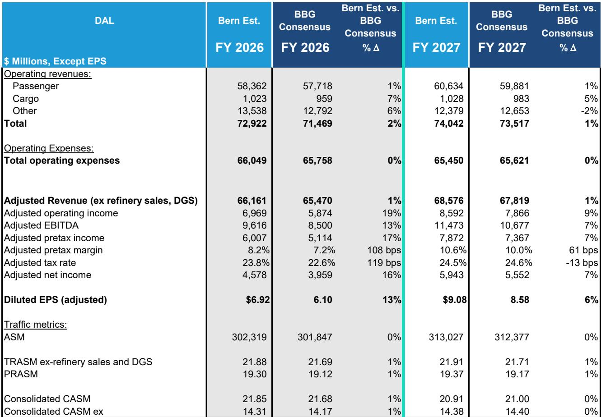
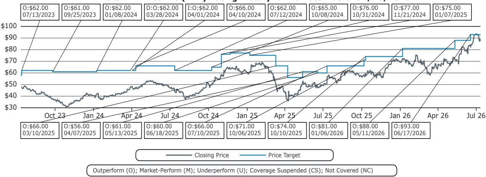
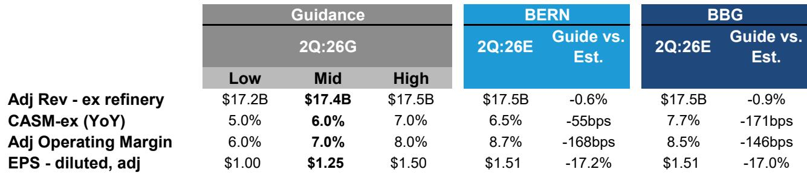

# Bernstein：基于强劲预订曲线和定价背景

达美航空二季度调整后每股收益1.56美元，落在自身上限1.50美元之上，同时重申全年6.50-7.50美元的指引。这份业绩本身不算意外——市场此前已有预期——但真正值得关注的不是数字本身，而是支撑这些数字的定价环境正在发生什么变化。

核心依据不是燃油成本下降，也不是需求突然爆发，而是他们观察到的一个更持久的转变：美国航空业的定价行为正在从“周期性的供需波动”转向“结构性的定价纪律”。报告用了一个关键词组——“positive structural pricing shift”。如果这个判断成立，那么达美航空目前的估值可能还没有完全反映这一变化。

## 1. 二季度超预期背后，真正起作用的是“非票收入”和“企业客户”

达美二季度调整后收入176.66亿美元，比Bernstein预期高出约1%。但超预期的结构比幅度更重要。非票收入（包括MRO维修、货运、联名信用卡等）占总收入比例升至61%，同比提升2个百分点。其中MRO收入同比增长32%，货运收入增长39%，均大幅超出预期。

企业客户销售同比增长超过20%，在洛杉矶、波士顿等核心城市甚至达到30%。这意味着商务出行需求不仅回来了，而且集中在高价值航线上。Bernstein指出，达美在高端舱位的运力投放仍在增加（低个位数增长），而主舱运力反而下降了2-3%。高端舱位的载客率更高，这直接拉动了单位收入。

> **KC评论：** 非票收入占比超过六成，意味着达美的盈利模式已经不再是“卖座位”那么简单。MRO和货运的增长，说明航空公司正在把运营资产变成服务平台。这部分收入对宏观环境周期的敏感度低于客运，是估值框架中容易被低估的稳定器。

## 2. 全年指引隐含的“定价韧性”才是关键信号

达美重申全年调整后每股收益6.50-7.50美元，中点约7美元，比市场预期高出约18%。Bernstein据此测算，三季度指引隐含的每股收益区间2.00-2.50美元，比市场共识高出约10%；四季度隐含的每股收益约2.54美元，比共识高出39%。

这个四季度数字尤其值得注意。通常四季度是航空淡季，票价会随需求回落而走低。但达美的指引暗示，即便燃油价格节奏变化，票价也不会同步下降——公司有能力把一部分燃油成本下降转化为利润留存。Bernstein在报告中写道，这反映了“更高的信心，即票价下降幅度将小于燃油价格下降幅度”。

报告还提到，达美三季度单位收入（TRASM）同比增速预计将从二季度的约12.4%进一步加速。在运力增速仅1%的背景下，这意味着定价环境比预期更有利。

## 3. 行业结构变化：低成本航司的困境正在为全服务航司创造护城河

Bernstein认为，当前定价环境改善不是短期现象，而是行业竞争结构变化的产物。报告明确指出，低成本航司（LCC）正面临高成本和难以覆盖资本开支的困境。这限制了它们扩张运力的能力，也降低了价格战的可能性。

达美自身的运力纪律也在强化：三季度运力增速约1%，四季度2-3%，远低于疫情前的扩张节奏。全行业供给约束叠加需求韧性，使得票价水平在更长时间内保持高位。Bernstein将这一逻辑称为“结构性定价转变”，并据此将达美未来几年的盈利预测上调了约9%。

从估值角度看，隐含的远期市盈率约10.9倍。这个倍数并不高，但考虑到盈利预测的上修幅度，估值提升更多来自“盈利质量改善”而非“市场情绪回暖”。

> **KC评论：** 6.8倍EV/EBITDAR在航空业历史中不算便宜，但Bernstein上调倍数的理由是“行业行为的结构性变化”。这意味着他们不再把达美当作周期股来定价。如果这个逻辑被市场逐步接受，估值中枢的上移可能比盈利增长本身更具持续性。

## 4. 可复用的观察框架：如何判断“结构性”还是“周期性”

对于关注航空或其他周期性行业的读者，Bernstein这份报告提供了一个可复用的判断框架：区分结构性变化与周期性改善，核心看三个维度。

第一，供给端是否有不可逆的约束。达美和全行业都在克制运力扩张，低成本航司因成本结构问题无法快速补位。这种约束不会随需求波动而消失。

第二，收入结构是否多元化。非票收入占比持续提升，意味着公司对票价波动的敏感度下降。MRO和货运等业务有独立的增长逻辑，不完全依赖航空出行需求。

第三，企业客户行为是否发生质变。商务出行恢复且集中在高端产品上，说明企业不再把差旅视为可压缩的成本项，而是视为必要的业务投入。这种行为的改变通常比休闲出行更持久。

这三个维度叠加，才能支撑“定价权从周期走向结构”的判断。如果只有其中一两个成立，那可能只是阶段性改善。

达美二季度业绩本身并不惊艳，但报告揭示的行业定价纪律变化，可能比季度数字更有长期意义。燃油价格仍是变量，但Bernstein认为，即使油价节奏变化，行业行为的变化也足以支撑票价和利润率保持在高于历史平均的水平。这个判断是否成立，需要后续几个季度的数据来验证。

For informational purposes only. Portions may be generated,translated,summarized,or edited with AI assistance based on source materials and may contain omissions or errors. Please verify independently. This is not investment,legal,tax,accounting,or other professional advice.

For informational purposes only. Portions may be generated,translated,summarized,or edited with AI assistance based on source materials and may contain omissions or errors. Please verify independently. This is not investment,legal,tax,accounting,or other professional advice.

