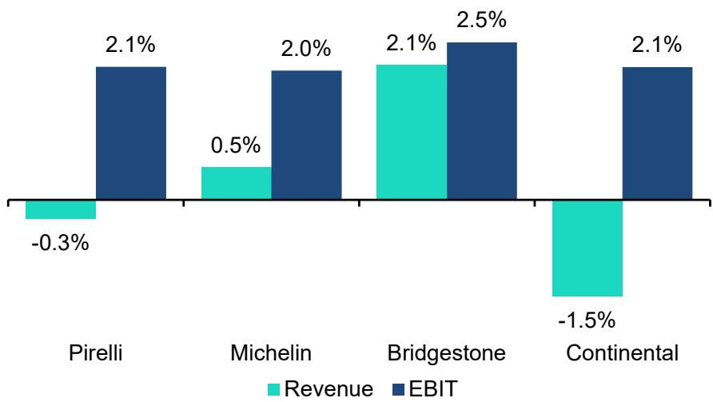
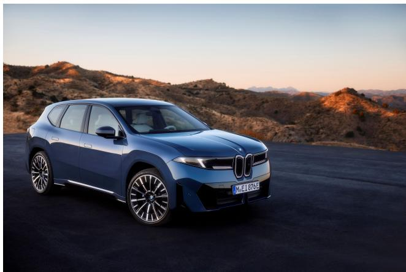
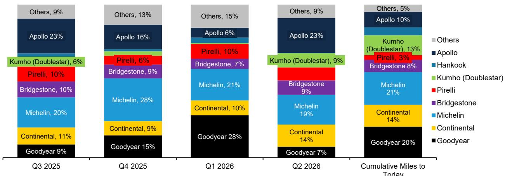
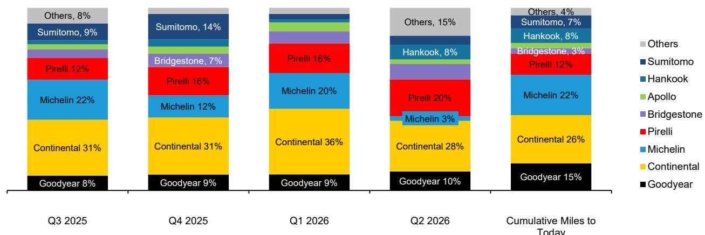
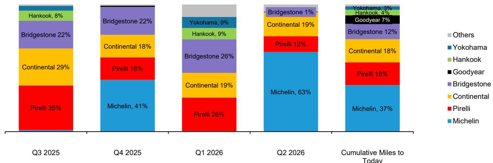
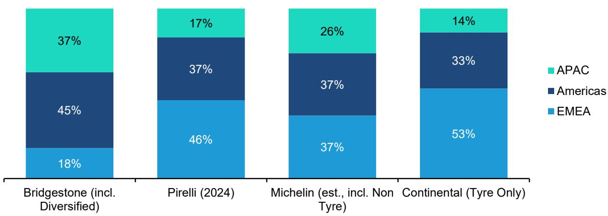
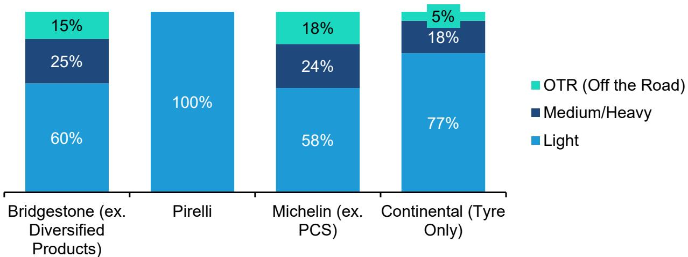
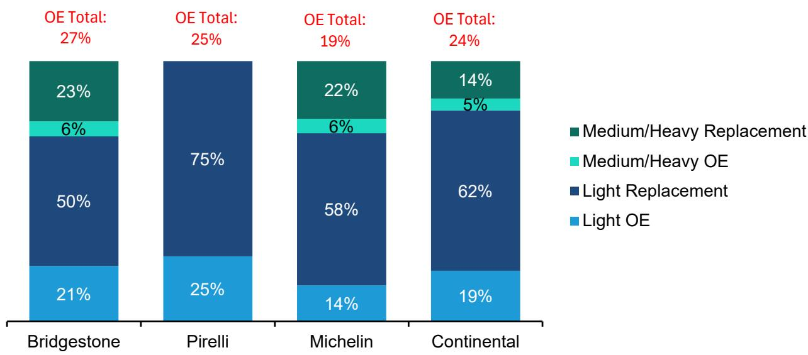

# European Automobiles & Components

# Global Tyres: Pressure Monitor (Q2 2026 Preview) - This remains a sector to own

Harry Martin, CFA
+44 20 7676 8965
harry.martin@bernsteinsg.com

Stephen Reitman
+44 20 7762 5535
stephen.reitman@bernsteinsg.com

Gali Salvatorelli Naraghi
+44 20 7676 6741
gali.salvatorelli-naraghi@bernsteinsg.com

Steve Pereira Fernandes, CFA
+44 20 7676 7254
steve.pereira-fernandes@bernsteinsg.com

## Specialist Sales

James Brady
+44 20 7762 5272
james.brady@bernsteinsg.com

As we approach tyremaker Q2 reporting (starting with Michelin on 27 July) we update volume forecasts for recent data and maintain our raw material headwind assumption due to impact in H2. This does not change our view on the sector today. The last time there was a major cost increase (2021/22) tyre companies performed well, and we expect tyremakers to demonstrate their resilience and pricing power again this time. Even after our adjusted base scenario, consensus numbers appear achievable, and existing full year guidance ranges provide room on the downside. Beyond Q2 we continue to expect positive H2 volumes for Tier 1 tyremakers driven in part by the cyclical recovery in US trucks, and we see a good entry into companies which are high quality relative to their valuation multiples. We maintain our positive view on Michelin, Pirelli & Bridgestone.

Q2 stock performance. Since the beginning of the quarter, the tyremakers have all outperformed the autos index, with Michelin the best performer (+12%) driven by a relative flight to safety in our cyclical sector. Relative performance has not been completely in line with estimate changes: the worst performer, Bridgestone, has not seen major estimate cuts, yet Michelin has seen close to a 10% cut since reporting Q1.

Q2 volumes moderated, H2 set for recovery. After a soft Q1, Q2 was expected to still be moderate but not to the same extent. Today OE passenger tyres are seeing trends that vary by region. Passenger replacement markets remain moderate in North America (-4%) (see Link) and very strong in China (+13%). Europe >18" continues to be a notable area of strength as well coming in +13%. Tier 1s should also finally start benefiting from slowing imports in North America: Q2 sell-in is tracking down 4% but US tyre imports are down double digits. Truck, Agriculture remain cyclically moderate but should recover in H2, particularly in truck where order books are very strong. We expect all to post negative volume growth in Q2 but expect improving volumes in H2 driven by cyclical recovery.

Q2 expectations. We see potential for the sector going into results. We are just above consensus for Michelin's Q2 revenue, but see potential for EBIT in H1. We are roughly in line for Pirelli topline, but see 2% potential in EBIT. For Bridgestone we are 2% above for revenues and 3% above for EBIT. And for Continental, we are 1% below street on sales, but see notable margin potential and are 2% above on absolute EBIT. We expect FY guidance to be reiterated across the group with existing guides still appearing conservative.

What is the impact from Middle East & higher raw material costs in H2? Although the stocks are down since the beginning of the conflict, we see limited structural risk. Premium tyres have historically performed in line with standard even in economic cycles. The tyremakers have also consistently demonstrated pricing power. While there will be a timing impact (we incorporate a headwind to margin in H2), we expect the tyremakers to fully recuperate higher costs from H1 2027 onwards and see no structural impairment to margin. We therefore see today as an attractive entry point.

## BERNSTEIN TICKER TABLE

<table><tr><td rowspan="2"></td><td colspan="5">10 Jul 2026</td><td rowspan="2">TTM</td><td colspan="4">Reported EPS</td><td colspan="3">Reported P/E (x)</td></tr><tr><td></td><td></td><td rowspan="2">Closing Price</td><td rowspan="2">Price Target</td><td rowspan="2">Rel. Perf.</td><td></td><td></td><td></td><td></td><td></td><td></td><td></td></tr><tr><td>Ticker</td><td>Rating</td><td>Cur</td><td>Cur</td><td>2025A</td><td>2026E</td><td>2027E</td><td>2025A</td><td>2026E</td><td>2027E</td><td></td></tr><tr><td>5108.JP (Bridgestone)</td><td>O</td><td>JPY</td><td>3,569.00</td><td>4,300.00</td><td>(28.2)%</td><td>JPY</td><td>238.14</td><td>309.88</td><td>377.66</td><td>15.0</td><td>11.5</td><td>9.5</td><td></td></tr><tr><td>OLD</td><td></td><td></td><td></td><td></td><td></td><td></td><td></td><td>308.66</td><td>386.43</td><td></td><td></td><td></td><td></td></tr><tr><td>CON.GR (Continental)</td><td>M</td><td>EUR</td><td>71.84</td><td>73.00</td><td>7.3%</td><td>EUR</td><td>(2.22)</td><td>5.97</td><td>7.94</td><td>(32.3)</td><td>12.0</td><td>9.1</td><td></td></tr><tr><td>ML.FP (Michelin)</td><td>O</td><td>EUR</td><td>34.87</td><td>38.00</td><td>(10.6)%</td><td>EUR</td><td>2.33</td><td>2.73</td><td>3.73</td><td>15.0</td><td>12.8</td><td>9.3</td><td></td></tr><tr><td>OLD</td><td></td><td></td><td></td><td></td><td></td><td></td><td></td><td>2.78</td><td>3.79</td><td></td><td></td><td></td><td></td></tr><tr><td>PIRC.IM (Pirelli)</td><td>O</td><td>EUR</td><td>6.88</td><td>7.00</td><td>(0.5)%</td><td>EUR</td><td>0.50</td><td>0.52</td><td>0.58</td><td>13.9</td><td>13.4</td><td>11.8</td><td></td></tr><tr><td>OLD</td><td></td><td></td><td></td><td></td><td></td><td></td><td></td><td>0.50</td><td>0.55</td><td></td><td></td><td></td><td></td></tr><tr><td>JPL</td><td></td><td></td><td>2,639.99</td><td></td><td></td><td></td><td></td><td></td><td></td><td></td><td></td><td></td><td></td></tr><tr><td>EDME</td><td></td><td></td><td>1,593.41</td><td></td><td></td><td></td><td></td><td></td><td></td><td></td><td></td><td></td><td></td></tr></table>

## ESTIMATE CHANGE IN BOLD

O - Outperform, M - Market-Perform, U - Underperform, NR - Not Rated, CS - Coverage Suspended

Source: Bloomberg, Bernstein estimates and analysis.

## INVESTMENT IMPLICATIONS

We rate Michelin Outperform. Michelin is about to hit the next leg of margin expansion driven by premiumisation and restructuring. We expect margin expansion ahead of consensus, and are 4% and 15% ahead on 2026 and 2027 EBIT. Cash return potential is also considerable: balance sheet leverage is at a 20+ year low giving Michelin scope to pay dividends, announce buybacks beyond the new €2bn, and do accretive M&A. Our work on valuation leads us to expect that the market will sustain a higher multiple for the sector, with the real opportunity in Michelin which is trading below historical ranges, unjustified for a company which makes consumer goods margins but trades at auto supplier multiples.

Michelin: Nunc est Bibendum. A Primer on our new top pick in Tyres (Outperform)

We rate Pirelli Outperform. As a pureplay consumer tyremaker, Pirelli will benefit from the same structural tailwinds as the rest of the industry, driving revenue and margin expansion ahead of consensus. Pirelli trades at a discount to peers and ~40% discount to 'fair value' due to the Sinochem shareholding's political risk, and issues investing directly into the U.S. or the future restriction on selling the Cyber Tyre. In recent months, newsflow has suggested progress and we expect a decision by the AGM on 25 June, which could drive a meaningful rerating.

Pirelli: From pit lane to championship corner. A Primer on our new Outperform

Pirelli: Best Idea Q2 2026 - From pit lane to championship corner (Outperform)

We rate Bridgestone Outperform. The structural growth story from premiumisation is highly attractive and, coupled with restructuring, we expect earnings growth ahead of consensus. In this industry, the market values shareholder returns and Bridgestone is committed to a ~6% yield this year and could increase the buyback after August.

Bridgestone Primer: Starting on the path to ENLITEN-ment (Outperform)

We rate Continental Market-Perform. We continue to like the tyre industry structurally but see downside risk for Continental. Its lower premium mix and historically volume-focused expansion model means lower pricing power than peers which has contributed to material margin decline since 2017, a period where industry volumes have shrunk and raw material inflation has accelerated. At today's share price the RemainCo is valued at ~8x EBIT, a small premium to Michelin which in our view looks fair.

Continental: Road to tyre pureplay almost complete - ContiTech sale agreed at €4bn

Global Tyres 2026 Outlook: A race to be won. Upgrade Pirelli to Outperform, Conti to Market-Perform. Michelin remains top pick

We would like to acknowledge the valuable contribution of Douae Doukkali in the preparation of this report

EXHIBIT 1: Q2: Bernstein vs Consensus

Bernstein vs Consensus: Q2 2026

  
Michelin EBIT is for H1 2026  
Source: Bloomberg, Company compiled consensus (Pirelli), Visible Alpha, Bernstein estimates & analysis

## Related Research

## On the Industry

Global Tyres: EU confirms tariffs on Chinese passenger vehicle tyres

Global Tyres: Why has the North American tyre market been so weak?

Global Tyres 2026 Outlook: A race to be won. Upgrade Pirelli to Outperform, Conti to Market-Perform. Michelin remains top pick
Global Tires: Rubber Wars

Global Tyres: Have premium players pushed prices too high?

Global Tyres Primer: 101 on Competition, Capital allocation & How to invest in the sector

Global Tyres: Deglobalization ... It's a Big World After All. Tier 1s even better set for the next decade

European Auto Suppliers: Initiating on Tyres - A gripping journey

## Company Specific

Continental: Road to tyre pureplay almost complete - ContiTech sale agreed at €4bn

Michelin: Nunc est Bibendum. A Primer on our new top pick in Tyres (Outperform)

Pirelli: From pit lane to championship corner. A Primer on our new Outperform

Pirelli: Best Idea Q2 2026 - From pit lane to championship corner (Outperform)

Continental: The Fracture Complete - Now a Rubber Pureplay. Target price to €50 (12% downside)

Continental: After The Fracture is ContiTech the real hidden upside? We think no

Bridgestone Primer: Starting on the path to ENLITEN-ment (Outperform)

## On Q2

Quick Take: Michelin Q2 2026 Briefing - Prior guidance & consensus look achievable

Continental Q2 2026 Briefing: Q2 within guidance range on strong (tariff refund-aided) tyre margins

## DETAILS

## Q2 SECTOR NEWS/FITMENT WINS

## Tyre Fitments

\- Continental will supply the new A-segment BEV Renault Twingo with its 18" EcoContact 7 tyres.

\- Pirelli has developed two custom Pirelli P Zero tyres in collaboration with BMW for the new iX3, the first of the German OEM's new Neue Klasse series.

\- Bridgestone chosen as exclusive tyre partner for Maserati MCUPRA super sports car.

\- Michelin has developed its premium comfort tire, the Michelin Primacy 5 energy, with Toyota for the Japanese group's Alphard and Vellfire models.

\- Bridgestone chosen as exclusive tyre partner for Lamborghini Fenomeno Roadster.

\- Continental received original equipment approvals for the Volkswagen's new T-Roc

## Capacity Changes

\- Pirelli announced a multi-year investment plan for the US of between approximately €1.0-1.2bn. This will likely take shape as an expansion in capacity of its existing Georgia plant.

\- Michelin intends to completely ramp down production at its BFGoodrich Tuscaloosa plant by the end of 2028, with all operations to be consolidated at the plant in Fort Wayne.

\- Continental inaugurates Expansion of its Tire Plant in Rayong, Thailand. This will add annual capacity of 3 million passenger car and light truck tires.

## Other News

\- Continental sells ContiTech to Lone Star Funds at an enterprise value of €4bn to become a pure-play tire manufacturer. See our recent report (link).

\- Bridgestone presented at the 41st Space Symposium the progress of its development of tyres for small and medium-sized lunar rovers.

• Doublestar has completed the acquisition of Kumho.

\- The EU issued its long-awaited Definitive Measures from the antidumping investigation into Chinese tyres for the passenger vehicle industry. For producers other than Hankook this results in tariffs of 24-45% effective immediately. See our recent report (link).

EXHIBIT 2: Renault approves Continental's 18-inch EcoContact 7 for the new all-electric Renault Twingo worldwide  
  
Source: Company website

EXHIBIT 3: 2 Custom Pirelli P Zero tyres have been developed in collaboration with BMW for the new iX3, the first of the German OEM's new Neue Klasse series  
  
Source: Company website

EXHIBIT 4: Bridgestone is the sole tyre partner for Maserati's new super sports car MCPURA  
  
Source: Company website

EXHIBIT 5: Michelin Primacy 5 fitted on the Toyota Vellfire  
  
Source: Company website

## OUR PROPRIETARY ANALYSIS OF RECENT TYRE USAGE REVIEW DATA (IN THE US)

As we introduced in our initiation report (Link), using live review data from Tire Rack we can get a proxy for market share of miles driven by tyre manufacturer. Looking at three major segments (Grand Touring All Season, Max Performance Summer and Ultra High Performance All Season) we find the following implied by incremental reviews since January (ie in Q1):

\- Overall. All four segments continue to be highly consolidated towards the Tier 1s, with limited share gains from Challenger peers. Exceptions to this include some review share gain from Kumho in Grand Touring All-Season and Hankook in Ultra High Performance All-Season. Share can vary quarter to quarter due to rounding, but in Q2, Continental saw notable gains in Grand Touring All-Season, Pirelli gained in Ultra High Performance All Season and Michelin was strong in Max Performance Summer.

\- GT All Season. Incremental miles driven in Q2 saw review share gains from Continental. Michelin's CrossClimate2 continues to be category leader with the most incremental miles in absolute terms. Continental General AltiMAX RT45 also continues to take a good share of reviews. Kumho's Solus tyre took a good share of reviews historically, but have seen limited new reviews in recent quarters. Apollo saw a notable increase in its share of reviews after a few declining quarters, mostly driven by the Vredestein HiTrac All Season and the Vredestein Quatrac Pro+.

\- Ultra High Performance All Season: Continental continues to dominate this segment, driven by the ExtremeContact DWS 06 Plus launched in 2021. Michelin's Michelin Pilot Sport All Season 4 has historically been a key player in the segment but did not gain any significant incremental review share in Q2.

\- Max Performance Summer: Reviews in this category are more variable. Michelin rebounded in Q2 thanks to the Michelin Pilot Sport 4S after losing share in Q1 to Pirelli, Hankook and Yokohama. Historically, the Tier 1s dominate this segment, with a 92% share of all reviews left on Tire Rack to date.

EXHIBIT 6: Continental and Bridgestone gained incremental review share in Q2 driven by the Bridgestone WeatherPeak and General AltiMAX RT45 respectively.

Grand Touring All-Season Tyres - Share of Incremental Miles Reviewed on TireRack.com  
  
Source: Tire Rack, Bernstein analysis

EXHIBIT 7: Continental continues to dominate this segment, driven by the ExtremeContact DWS 06 Plus launched in 2021. Although Pirelli made some incremental gains in Q2 thanks to the Pirelli P Zero All Season and the Pirelli P Zero All Season Plus 3.  
Ultra High Performance All Season tyres - Share of Incremental Reviews on TireRack.com  
  
Source: Tire Rack, Bernstein analysis  
EXHIBIT 8: Reviews in the Max Performance Summer category are more variable. Michelin rebounded in Q2 after a soft Q1 thanks to the Michelin Pilot Sport 4S. Historically, Tier 1s dominate this segment, with a 92% share of all reviews left on the Tire Rack to date.  
Max Performance Summer tyres - Share of Incremental Reviews on TireRack.com (live SKUs)

  
Source: Tire Rack, Bernstein analysis

## VOLUMES

Revenue Exposure

EXHIBIT 9: Bridgestone has a greater exposure to APAC than peers, Continental and Pirelli are more exposed to Europe, and Michelin is most exposed to North America

Tyres 2025 Geographic Exposure  
  
Source: Company reports, Bernstein estimates & analysis

EXHIBIT 10: Pirelli is a passenger car pureplay. Conti skews mostly to passenger cars. Michelin and Bridgestone have a similar exposure to Truck/Bus, and Michelin has the largest Off the Road exposure

Tyres 2025 Exposure by Vehicle Type

  
Source: Company reports, Bernstein estimates & analysis

EXHIBIT 11: Within passenger and truck tyres, Bridgestone has the largest exposure to OE, while Michelin has the smallest exposure  
Estimated 2025 Passenger and Truck Tyres Revenue Split  
  
Source: Company reports, Bernstein estimates & analysis

## Market Data

EXHIBIT 12: Tyre Industry Monthly Market Data

<table><tr><td></td><td colspan="5">Passenger OE</td><td colspan="8">Passenger Replacement</td><td colspan="5">Truck/Bus OE</td><td colspan="4">Truck/Bus Replacement</td><td colspan="2">US</td><td colspan="2">China</td><td colspan="2">Japan</td><td>Agriculture</td></tr><tr><td></td><td>Europe</td><td>North &amp; Central America</td><td>China</td><td>South America</td><td>Worldwide</td><td>Europe</td><td>North &amp; Central America</td><td>China</td><td>South America</td><td>Worldwide</td><td>Europe ≥18&quot;</td><td>North America ≥18&quot;</td><td>North America Retail Sellout</td><td>Europe</td><td>North &amp; Central America</td><td>South America</td><td>Worldwide</td><td>Class 5-8 Truck Production on North America</td><td>Europe</td><td>North &amp; Central America</td><td>South America</td><td>Worldwide</td><td>Exports (Value)</td><td>Imports (Value)</td><td>Exports Volume</td><td>Exports Value</td><td>Passenger Volume</td><td>Truck &amp; Bus Volume</td><td>Farm Wheel Tractors Retail Sales (Units)</td></tr><tr><td>Data Source</td><td>Michelin</td><td>Michelin</td><td>Michelin</td><td>Pirelli</td><td>Michelin</td><td>Michelin</td><td>Michelin</td><td>Michelin</td><td>Pirelli</td><td>Michelin</td><td>Pirelli</td><td>Pirelli</td><td>Modern Tire Dealer</td><td>Michelin</td><td>Michelin</td><td>Michelin</td><td>Michelin</td><td>ACT</td><td>Michelin</td><td>Michelin</td><td>Michelin</td><td>Michelin</td><td>US Gov.</td><td>US Gov.</td><td>China Gov.</td><td>China Gov.</td><td>Japan Gov.</td><td>Japan Gov.</td><td>Bloomberg</td></tr><tr><td>Jan-23</td><td></td><td></td><td></td><td>14%</td><td></td><td></td><td></td><td></td><td>-4%</td><td></td><td>3%</td><td>-3%</td><td></td><td></td><td></td><td></td><td></td><td>14%</td><td></td><td></td><td></td><td></td><td></td><td></td><td></td><td></td><td>-4%</td><td>-5%</td><td>-12%</td></tr><tr><td>Feb-23</td><td></td><td></td><td></td><td>2%</td><td></td><td></td><td></td><td></td><td>-5%</td><td></td><td>-1%</td><td>1%</td><td></td><td></td><td></td><td></td><td></td><td>12%</td><td></td><td></td><td></td><td></td><td></td><td></td><td></td><td></td><td>-4%</td><td>-2%</td><td>-19%</td></tr><tr><td>Mar-23</td><td></td><td></td><td></td><td>11%</td><td></td><td></td><td></td><td></td><td>-2%</td><td></td><td>-3%</td><td>1%</td><td></td><td></td><td></td><td></td><td></td><td>26%</td><td></td><td></td><td></td><td></td><td></td><td></td><td></td><td></td><td>2%</td><td>-7%</td><td>-13%</td></tr><tr><td>Apr-23</td><td></td><td></td><td></td><td>3%</td><td></td><td></td><td></td><td></td><td>-4%</td><td></td><td>-10%</td><td>-5%</td><td>-4%</td><td></td><td></td><td></td><td></td><td>14%</td><td></td><td></td><td></td><td></td><td></td><td></td><td></td><td></td><td>2%</td><td>-12%</td><td>-17%</td></tr><tr><td>May-23</td><td></td><td></td><td></td><td>12%</td><td></td><td></td><td></td><td></td><td>-6%</td><td></td><td>-1%</td><td>5%</td><td>-2%</td><td></td><td></td><td></td><td></td><td>20%</td><td></td><td></td><td></td><td></td><td></td><td></td><td></td><td></td><td>5%</td><td>-4%</td><td>-2%</td></tr><tr><td>Jun-23</td><td></td><td></td><td></td><td>-11%</td><td></td><td></td><td></td><td></td><td>3%</td><td></td><td>2%</td><td>8%</td><td>-1%</td><td></td><td></td><td></td><td></td><td>3%</td><td></td><td></td><td></td><td></td><td></td><td></td><td></td><td></td><td>-6%</td><td>-15%</td><td>0%</td></tr><tr><td>Jul-23</td><td></td><td></td><td></td><td>-4%</td><td></td><td></td><td></td><td></td><td>-5%</td><td></td><td>1%</td><td>4%</td><td>4%</td><td></td><td></td><td></td><td></td><td>10%</td><td></td><td></td><td></td><td></td><td></td><td></td><td></td><td></td><td>-9%</td><td>-13%</td><td>-7%</td></tr><tr><td>Aug-23</td><td></td><td></td><td></td><td>5%</td><td></td><td></td><td></td><td></td><td>-3%</td><td></td><td>1%</td><td>7%</td><td>0%</td><td></td><td></td><td></td><td></td><td>11%</td><td></td><td></td><td></td><td></td><td></td><td></td><td></td><td></td><td>-10%</td><td>-19%</td><td>-5%</td></tr><tr><td>Sep-23</td><td></td><td></td><td></td><td>6%</td><td></td><td></td><td></td><td></td><td>-2%</td><td></td><td>-1%</td><td>4%</td><td>1%</td><td></td><td></td><td></td><td></td><td>-6%</td><td></td><td></td><td></td><td></td><td></td><td></td><td></td><td></td><td>-4%</td><td>-11%</td><td>-5%</td></tr><tr><td>Oct-23</td><td></td><td></td><td></td><td>0%</td><td></td><td></td><td></td><td></td><td>-2%</td><td></td><td>8%</td><td>12%</td><td>-2%</td><td></td><td></td><td></td><td></td><td>-1%</td><td></td><td></td><td></td><td></td><td></td><td></td><td></td><td></td><td>3%</td><td>-8%</td><td>-4%</td></tr><tr><td>Nov-23</td><td></td><td></td><td></td><td>-4%</td><td></td><td></td><td></td><td></td><td>0%</td><td></td><td>14%</td><td>-1%</td><td>0%</td><td></td><td></td><td></td><td></td><td>10%</td><td></td><td></td><td></td><td></td><td></td><td></td><td></td><td></td><td>2%</td><td>-18%</td><td>-4%</td></tr><tr><td>Dec-23</td><td></td><td></td><td></td><td>-7%</td><td></td><td></td><td></td><td></td><td>10%</td><td></td><td>3%</td><td>3%</td><td>1%</td><td></td><td></td><td></td><td></td><td>4%</td><td></td><td></td><td></td><td></td><td></td><td></td><td></td><td></td><td>0%</td><td>-18%</td><td>-6%</td></tr><tr><td>Jan-24</td><td>2%</td><td>8%</td><td>72%</td><td>-5%</td><td>18%</td><td>4%</td><td>9%</td><td>46%</td><td>-9%</td><td>10%</td><td>15%</td><td>6%</td><td>0%</td><td>-11%</td><td>-9%</td><td>11%</td><td>-3%</td><td>2%</td><td>-11%</td><td>-9%</td><td>11%</td><td>-3%</td><td>6%</td><td>13%</td><td>18%</td><td>15%</td><td>-9%</td><td>-17%</td><td>-22%</td></tr><tr><td>Feb-24</td><td>3%</td><td>7%</td><td>-3%</td><td>8%</td><td>-1%</td><td>5%</td><td>13%</td><td>-23%</td><td>1%</td><td>2%</td><td>16%</td><td>17%</td><td>0%</td><td>-15%</td><td>-19%</td><td>23%</td><td>-4%</td><td>14%</td><td>-13%</td><td>-14%</td><td>18%</td><td>-4%</td><td>-2%</td><td>22%</td><td>-3%</td><td>-5%</td><td>-7%</td><td>-19%</td><td>-9%</td></tr><tr><td>Mar-24</td><td>-10%</td><td>1%</td><td>1%</td><td>-9%</td><td>-5%</td><td>-2%</td><td>1%</td><td>6%</td><td>-10%</td><td>-2%</td><td>8%</td><td>7%</td><td>-2%</td><td>-25%</td><td>-19%</td><td>14%</td><td>-12%</td><td>-5%</td><td>-5%</td><td>6%</td><td>-2%</td><td>-3%</td><td>-10%</td><td>7%</td><td>4%</td><td>3%</td><td>-14%</td><td>-12%</td><td>-12%</td></tr><tr><td>Apr-
