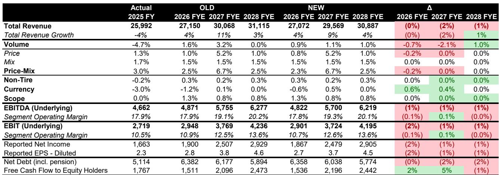
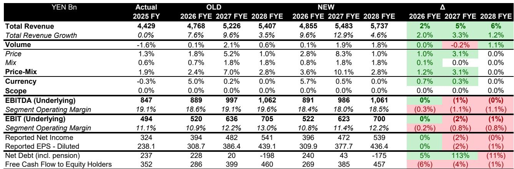
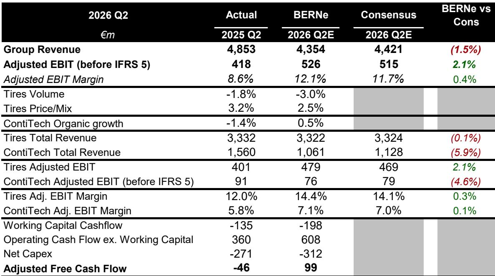

# 轮胎行业：周期复苏、定价能力与估值洼地的罕见组合

随着轮胎制造商准备从7月27日米其林开始公布第二季度业绩，该行业呈现出一种不同寻常的态势。自第一季度以来，销量数据进一步走弱，原材料成本上升，地缘政治不确定性持续存在。然而，主要轮胎公司的市盈率在9至13倍前瞻收益之间，这一估值已包含了相当程度的悲观预期。近期数据疲软与结构性定价能力之间的张力，构成了核心的研究问题：这些被压低的市盈率是价值陷阱还是入场时机？

上一次主要成本周期的证据指向后者。当2021年和2022年原材料价格飙升时，轮胎公司不仅站稳了脚跟，而且表现优于大盘，恰好在投入成本压力最严重时达到了估值峰值。这种模式并非巧合。它反映了该行业的一个基本特征：高端轮胎制造商拥有大多数工业企业所缺乏的定价能力。它们能够滞后地转嫁成本上涨，而市场历来通过在这一时期给予更高的市盈率来奖励这种韧性，并预期随后的复苏。

如今，市场格局在几个关键方面与早期阶段相似。下半年的原材料逆风已被广泛预期，并已纳入提供显著下行缓冲的指引区间。即使经过下调，共识预期仍然是可以达到的。支撑高端化的结构性驱动因素——消费者升级到更大轮辋直径、转向需要专用轮胎的电动汽车、以及新兴市场替换需求的长期增长——依然保持不变。该行业并非根据未来十二个月的盈利能力定价，而是为尚未发生的衰退定价。

## 第二季度销量下滑普遍存在，但掩盖了有利于一线制造商的周期性转折点

第二季度几乎所有轮胎类别的销量都将出现负增长，但疲软的结构比总量数字更重要。全球原配乘用车轮胎需求正在下降，反映了全球汽车生产的整体放缓。北美乘用车替换市场同比下降4%，这是一个持续数个季度的疲软期。卡车和农业领域仍处于周期性低迷状态，第二季度本身没有立即反弹的催化剂。

然而，在这些疲软的总量中，几个结构性趋势正在加速。欧洲对18英寸及以上轮辋直径轮胎（该行业利润率最高的细分市场）的需求在第二季度增长了13%。中国乘用车替换市场以同样的速度扩张，得益于持续老化的汽车保有量和越来越愿意为高端品牌付费的消费者群体。这些并非周期性波动。向更大轮辋尺寸的转变是一个与车辆设计、消费者偏好以及电动汽车（需要能够承受更高扭矩和重量的轮胎）份额增长相关的多年趋势。一线制造商主导着这一领域，其竞争地位正在加强。

然而，最重要的转折点出现在北美卡车轮胎领域。订单簿被描述为非常强劲，表明被疲软的货运需求和去库存所延迟的替换周期即将转向。当这种情况发生时，复苏将集中在最大的制造商身上，这些制造商保持了生产能力和分销网络，而较小的参与者已经缩减规模。该行业预期的下半年销量复苏并非一厢情愿。它基于历史上先于商用车轮胎需求回升的领先指标。

## 原材料逆风是时机问题，而非对利润率的结构性威胁，市场误读了风险

近期天然橡胶和合成橡胶价格的飙升，部分由东南亚供应中断和石油相关成本上升驱动，自中东冲突开始以来一直拖累轮胎公司。市场似乎将此视为利润率受损事件。这种解读在历史上是不准确的。

高端轮胎制造商的商业模式更像消费品公司，而非传统汽车供应商。它们通过多种渠道传递观点，维持品牌忠诚度以实现定期提价，并已证明有能力在两到三个季度内收回投入成本增长。在2021-2022年成本周期中，米其林、普利司通和倍耐力在整个期间都扩大了毛利率，即使原材料成本达到了数十年高位。其机制很简单：它们提高价格，而客户，尤其是替换市场的客户，接受这些涨价，因为在安全关键产品中更换品牌存在感知风险。

当前的成本逆风预计将在2026年下半年冲击利润率，并在2027年上半年开始全面恢复。这个时间差创造了一个市场悲观情绪的窗口，历史上这曾是最具吸引力的入场时机。自冲突开始以来，公司股价下跌，但公司的潜在盈利能力并未改变。如果说有什么不同的话，过去十年的行业整合意味着最大的参与者今天拥有比上一个周期更强的定价杠杆。风险不在于利润率将永久受损，而在于读者会等待复苏在报告收益中变得可见，从而错过通常先于复苏发生的重新定价。

## 共识预期设定得足够低，即使是温和疲软的季度也可能产生积极惊喜

市场预期与公司可能报告的结果之间的差距异常之大。Bernstein对米其林第二季度营收的估计略高于共识，上半年息税前利润有上行空间。对于倍耐力，营收估计大致一致，但息税前利润比共识高2%。对于普利司通，营收和息税前利润估计分别比共识高2%和3%。即使对于大陆集团，其销售估计比市场低1%，但由于预期的利润率上行空间，相对息税前利润估计仍高出2%。

这些并非激进的预测。它们反映了这样一个事实：所有四家公司都维持的全年指引区间已经考虑到了较弱的上半年和较强的下半年。指引本身是保守的，提供了额外的缓冲。如果第二季度业绩接近这些估计，市场的即时反应应该是积极的，不是因为数字在相对意义上强劲，而是因为它们证实了收益的下限高于当前估值所暗示的水平。

风险在于市场已经定价了更糟糕的结果。自报告第一季度以来，米其林的收益估计已被削减近10%，但同期股价上涨了12%，跑赢了汽车指数。估计修正与价格表现之间的这种背离表明，读者已经在审视短期疲软，并关注下半年的复苏和结构性利润率轨迹。相比之下，普利司通尽管没有重大估计削减，但一直是该集团中表现最差的，表明市场因其对疲软的北美替换市场的更大敞口而给予折扣。考虑到即将到来的卡车周期复苏，这种折扣可能过度了。

## 决策框架：判断该行业是否值得配置的四个问题

对于今天评估轮胎公司的研究者来说，决策归结为四个问题。首先，下半年的销量复苏是否可信？证据表明是肯定的，特别是对于卡车轮胎，订单簿强劲，去库存周期已经结束。对于乘用车轮胎，复苏不太确定，但受到持续的高端化趋势以及欧洲和中国替换需求稳定的支持。

第二，公司能否在不失去市场份额的情况下转嫁更高的原材料成本？2021-2022年周期的历史数据显示，最大的制造商不仅转嫁了成本，而且在通胀期间获得了份额，因为较小的竞争对手缺乏品牌资产来提价而不损失销量。当前的一线参与者——米其林、普利司通、倍耐力和大洲集团——都拥有支持这种定价能力的高端品牌地位。

第三，估值是否足够有吸引力以补偿周期性风险？米其林2026年收益的12.8倍、普利司通的11.5倍、倍耐力的13.4倍和大陆集团的12.0倍，该行业的交易价格低于其历史平均水平和更广泛的消费品同行群体。这些市盈率意味着市场对高端化带来的结构性增长、重组计划带来的利润率扩张或强劲资产负债表带来的现金回报上行空间没有赋予任何价值。

第四，如果复苏未能实现，下行风险是什么？现有的全年指引区间提供了缓冲。即使在H2销量持平的情况下，公司也可能维持指引，并且股票不会面临急剧的重新定价，因为当前的估值已经折现了疲软的结果。不对称的风险回报特征是目前持有该行业最令人信服的理由。

## 行业内的质量差异创造了明显的分化，米其林和倍耐力提供了最具吸引力的风险回报

并非所有轮胎公司都是平等的，当前环境有利于那些拥有最高端产品组合、较强品牌定价能力和最灵活成本结构的公司。米其林在这三个维度上都脱颖而出。它产生消费品利润率——营业利润率在12-14%范围内——却以汽车供应商的市盈率交易。其资产负债表杠杆处于20年低点，为股息、现有20亿欧元计划之外的股票回购以及增值收购提供了充足的能力。该公司即将进入由高端化和重组驱动的下一轮利润率扩张，Bernstein对2026年和2027年的息税前利润估计分别比共识高4%和15%。其盈利质量与估值之间的脱节是该行业中最大的。

倍耐力提供了一个不同但同样引人注目的故事。作为纯消费轮胎制造商，它受益于与行业其他公司相同的结构性顺风，但由于与其最大股东中化集团相关的政治风险，其交易价格存在显著折价。最近的新闻表明在解决这一悬而未决的问题上取得了进展，6月年度股东大会的决定可能推动有意义的重新定价。公允价值折价估计约为40%，这与实际运营风险不成比例。如果股东问题得到解决，倍耐力可能会迅速重新定价。

普利司通的吸引力在于其股东回报状况。该公司今年承诺了大约6%的股息回报表现，并可能在8月后增加其股票回购计划。其对即将转向的北美卡车周期的敞口提供了额外的上行空间。尽管没有重大估计削减，该股表现不佳，创造了一个潜在的追赶机会。

大陆集团是异类。其较低的高端产品组合和历史上以数量为导向的扩张模式导致自2017年以来定价能力较弱和利润率大幅下降。以40亿欧元向Lone Star Funds出售ContiTech将把该公司转变为纯轮胎制造商，但结构性挑战依然存在。大约8倍息税前利润，估值相对于米其林看起来合理，但上行空间不那么令人信服。

*仅供参考。部分内容可能基于源材料通过AI辅助生成、翻译、总结或编辑，可能包含遗漏或错误。请独立核实。这不构成专业建议。*

仅供参考。部分内容可能基于源材料通过AI辅助生成、翻译、总结或编辑，可能包含遗漏或错误。请独立核实。这不构成专业建议。

