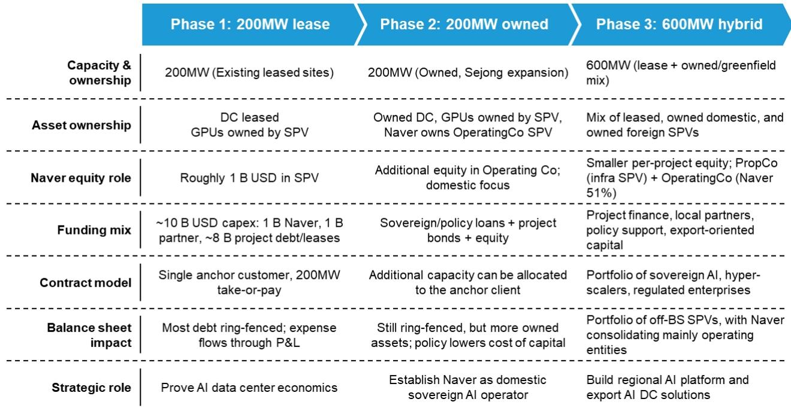
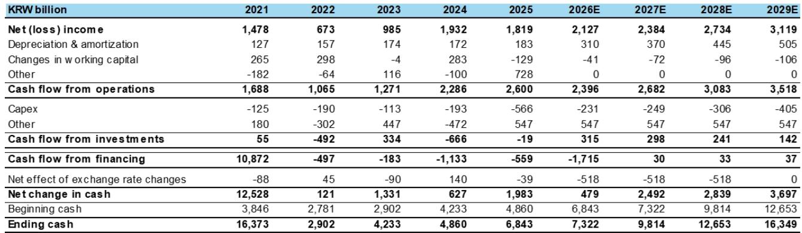
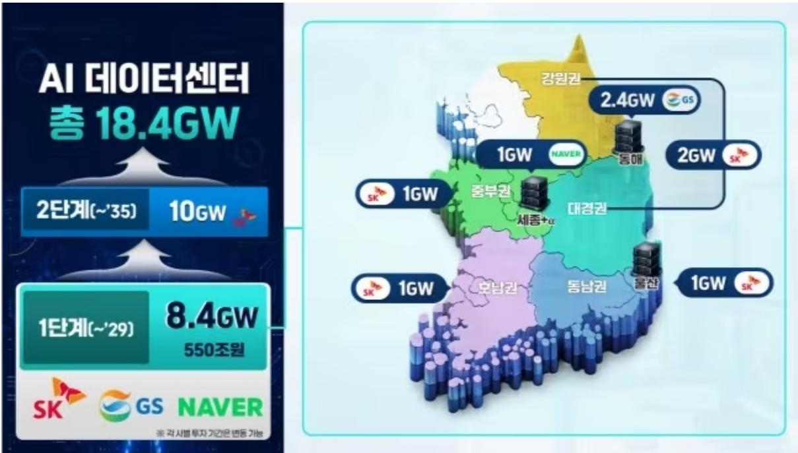

# Naver Is Not Building a Neocloud. It Is Building a Regional AI Platform Disguised as One.

Naver has abruptly pivoted into neocloud infrastructure, and the strategic logic holds. The company is deploying special purpose vehicles, ring-fenced financing, and forward-demand visibility to accelerate AI capacity buildout rather than waiting for organic cloud demand curves. At first glance, the model resembles CoreWeave: GPU-first infrastructure, high-density AI factory design, tight NVIDIA partnership, starting with a 55 MW footprint and scaling ambitions well beyond. The company, which had slipped off observer radar, is suddenly relevant again.

The debate has flipped fast. The question is no longer whether Naver should build AI infrastructure. It is whether they can execute, and more importantly, who is willing to back this pivot. A global investment bank report recently valued the ambition at roughly $50 billion. That figure is not a valuation. It is a statement of scale. And it forces a fundamental question: what exactly is Naver building, and how should observers evaluate it?

The answer matters because the wrong framework leads to the wrong conclusions. If Naver is merely a Korean neocloud, it should be valued on GPU utilization, power contracts, and EBITDA multiples against capital employed. But if Naver is using a neocloud framework as a wedge into something broader, the appropriate valuation lens shifts entirely. The report makes a compelling case that Naver is pursuing the latter path, and the distinction carries material implications for how observers should think about risk, return, and time horizon.

## Naver's AI Infrastructure Strategy Looks Like a Neocloud Today, But the Endgame Is Fundamentally Different

At the infrastructure level, Naver is executing a classic neocloud playbook. The company is deploying dedicated project financing structures that isolate capital risk, securing long-term demand commitments before construction, and prioritizing speed to market over capital efficiency. The initial 55 MW deployment is designed for high-density GPU workloads, and the expansion trajectory points toward a 1 GW buildout that would place Naver among the largest AI infrastructure operators globally.

The industrial logic is equally aligned with the neocloud model. Naver is leaning into GPU-native infrastructure that bypasses traditional cloud architecture, optimizing for latency, power density, and direct NVIDIA integration. This is not a cloud business. It is a compute factory designed for a single purpose: training and inference at scale. Early operating metrics will likely resemble those of CoreWeave and other neocloud operators, with success dependent on utilization rates, power availability, financing execution, and the ability to secure anchor tenants.

But the divergence lies in intent. Neocloud providers monetize GPU capacity in a supply-constrained market. Their economic model is straightforward: report观点 chips, build data centers, rent compute, collect margin. The strategic horizon is measured in quarters, and the competitive advantage comes from access to hardware and speed of deployment. Naver, by contrast, is building infrastructure as a foundation for something larger. The company enters the AI era with assets that extend well beyond compute: a search franchise that dominates Korean-language queries, consumer and enterprise distribution networks, local content ecosystems, and a strategic position within Korea's digital infrastructure landscape. The ambition is not to maximize GPU hours sold. It is to own the regional AI stack.

## Naver's Competitive Moat Is Not Compute Alone, But the Combination of Search Heritage, Korean-Language AI Assets, and Domestic Distribution

The most underappreciated element of Naver's strategy is its starting position. Most neocloud operators begin with capital and a construction plan. Naver begins with decades of search data, a user base conditioned to rely on its services for daily information needs, and language-specific AI capabilities that global hyperscalers cannot easily replicate. Korean is a complex, context-dependent language with distinct grammatical structures and cultural references. Training a large language model that performs well in Korean requires not just compute, but specialized data, linguistic expertise, and iterative refinement through user interaction. Naver has all three.

This creates a defensible position that pure infrastructure providers cannot match. A neocloud can report观点 the same NVIDIA chips as Naver. It can build data centers with similar power density and cooling specifications. But it cannot replicate Naver's search index, its understanding of Korean user behavior, or the feedback loop between consumer services and model improvement. The more users interact with Naver's AI features, the better the underlying models become, creating a data network effect that compounds over time.

The enterprise opportunity is equally significant. Korean corporations are under pressure to adopt AI, but they face constraints around data sovereignty, language accuracy, and integration with domestic infrastructure. Global hyperscalers offer powerful models, but those models are optimized for English-language use cases and may not perform reliably in Korean business contexts. Naver can offer enterprises a full-stack solution: infrastructure for training, models fine-tuned on Korean data, and integration with existing enterprise tools. This is a fundamentally different value proposition from renting GPU hours.

## The $50 Billion Ambition Will Be De-Risked Through Partnerships, Not Solo Balance Sheet Investment

A 1 GW AI infrastructure buildout at current capital costs implies a multi-billion dollar investment program. Naver's balance sheet is strong, but not strong enough to fund this ambition alone without distorting returns or constraining other business lines. The report explicitly assumes that Naver will not attempt a solo build. Instead, the strategy relies on a partnership-driven model that mirrors the blueprint Meta demonstrated in its own infrastructure expansion.

The signals are already visible. Recent Naver meetings with chip suppliers and large language model players point to a neocloud structure designed from day one to be capital-light. The model works as follows: special purpose vehicles offload capital expenditure from Naver's balance sheet, infrastructure providers provide the funding in exchange for predictable returns, GPU suppliers provide hardware on favorable terms in exchange for long-term offtake commitments, and model owners anchor demand through multi-year contracts that lock in utilization rates. Naver sits in the middle, orchestrating the stack rather than funding it entirely.

This structure fundamentally changes the risk profile. The $50 billion ambition is not a single bet on a single company's execution. It is a portfolio of projects, each with its own capital structure, risk allocation, and return profile. Naver's equity exposure is limited to its share of each SPV, and the returns are protected by long-term contracts that provide visibility on utilization and pricing. The execution risk shifts from balance sheet capacity to project management capability: can Naver source power, secure permits, manage construction timelines, and maintain relationships with partners across the ecosystem?

## Korean Government Policy Support Transforms Naver's Buildout from Corporate Capex into Sovereign AI Infrastructure

The most recent development in the Naver story is also the most strategically significant. The Korean government has announced an 8.4 GW AI infrastructure initiative that effectively positions Naver's planned 1 GW buildout as sovereign AI infrastructure. This is not merely a policy tailwind. It is a structural shift in how the project should be evaluated.

Government backing improves funding visibility in multiple dimensions. First, it reduces power-related execution risk. AI data centers require enormous amounts of electricity, and Korean grid capacity is constrained. Government designation as sovereign infrastructure prioritizes Naver's power allocation over other commercial projects. Second, it broadens the addressable market beyond domestic cloud demand. Sovereign AI infrastructure is expected to serve national interests, including government AI applications, defense-related computing, and public sector digital transformation. These use cases provide demand visibility that pure commercial neoclouds cannot access. Third, it reduces political risk. A project that is aligned with national strategic priorities is less likely to face regulatory headwinds or community opposition.

The policy support increasingly strengthens the case for viewing Naver as a strategic AI platform rather than simply a capital-intensive GPU infrastructure builder. The valuation framework should reflect this distinction. Neoclouds trade on near-term utilization metrics and EBITDA multiples that compress as capital intensity increases. Strategic AI platforms trade on longer-term earnings power, ecosystem value, and the optionality created by data network effects and sovereign positioning. Naver's current valuation, at roughly 13.6x 2026 estimated adjusted P/E, does not appear to embed a significant premium for this optionality.

## A Decision Framework for Observers: Three Questions to Distinguish Infrastructure Commodity from Platform Asset

The most useful way to frame the observation is through three diagnostic questions that separate a pure neocloud bet from a platform build.

The first question is about demand composition. Does Naver's customer base consist primarily of hyperscalers and AI startups renting generic compute, or does it include enterprises and government entities consuming integrated AI services? The former indicates commodity infrastructure exposed to pricing compression as supply catches up with demand. The latter indicates platform stickiness and pricing power. The early evidence points toward the latter, but observers should track the mix over the next four to six quarters.

The second question is about margin trajectory. Neoclouds tend to have high initial margins during supply-constrained periods, followed by compression as competitors add capacity. Platform businesses, by contrast, tend to show improving margins over time as software and services layer on top of infrastructure. If Naver's margins remain stable or improve as capacity scales, that supports the platform thesis. If margins compress in line with industry peers, the story is more likely a neocloud in disguise.

The third question is about capital allocation. Is Naver using SPVs and partnerships to fund expansion while maintaining balance sheet discipline, or is it progressively committing more equity as the buildout scales? The former indicates a capital-light model that preserves return on invested capital. The latter indicates a capital-intensive model that will eventually face diminishing returns. The report assumes the former, but execution will determine whether this assumption holds.

## The Distinction Between Infrastructure and Platform Will Determine Outcomes

Naver is not simply importing a neocloud model into Korea. It is using a neocloud-style infrastructure framework as the entry point for a broader strategic ambition. The near-term case shares many features with the broader neocloud universe: substantial capital requirements, infrastructure execution risk, and sensitivity to utilization and demand trends. But Naver possesses platform assets that infrastructure-focused peers do not.

If Naver successfully integrates its AI infrastructure with its search franchise, Korean-language AI capabilities, enterprise distribution, and sovereign positioning, the outcome will look more like a regional AI platform than a GPU rental business. The valuation would then reflect earnings power from software, services, and ecosystem monetization, not just compute margins. If execution falls short, or if the platform assets fail to generate meaningful synergies with the infrastructure, the outcome will look more like a Korean neocloud with a premium valuation that eventually compresses.

The report's conviction rests on the view that the market is undervaluing the platform optionality embedded in the infrastructure strategy. The next twelve to eighteen months will be decisive. Observers should watch partnership announcements, customer mix, margin trends, and capital allocation choices. Those signals will reveal whether Naver is building a commodity or a castle.

*For informational purposes only. Portions may be generated, translated, summarized, or edited with AI assistance based on source materials and may contain omissions or errors. Please verify independently. This is not professional advice.*

For informational purposes only. Portions may be generated, translated, summarized, or edited with AI assistance based on source materials and may contain omissions or errors. Please verify independently. This is not professional advice.

