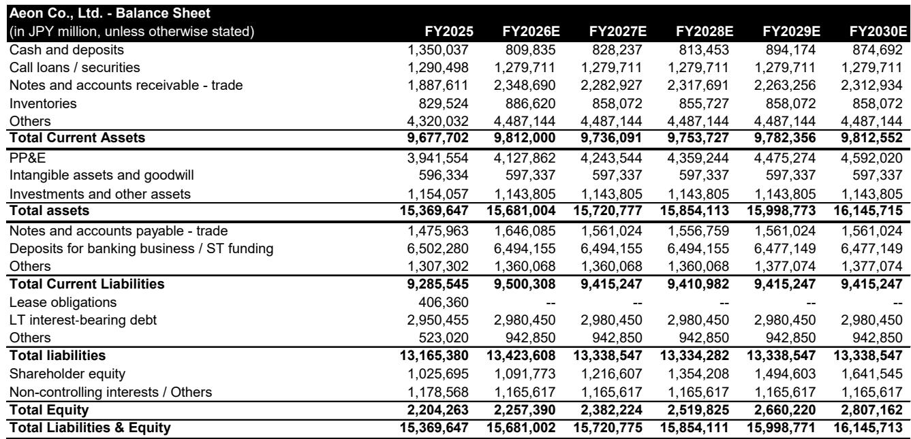
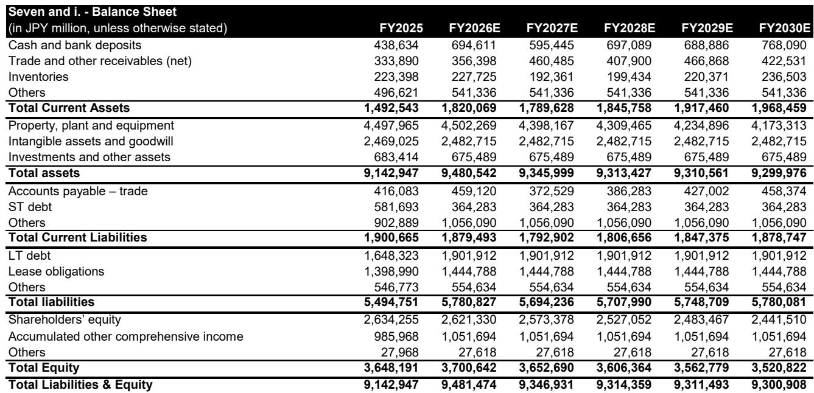
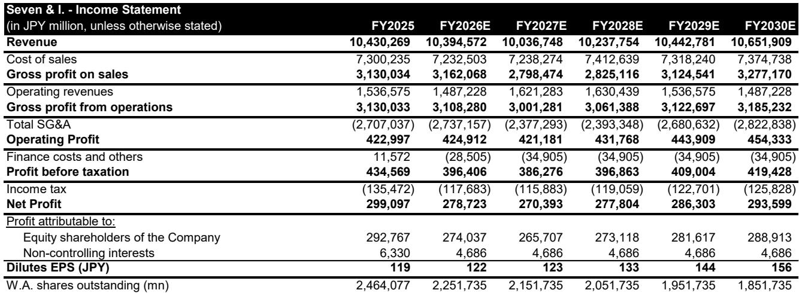

# 便利店并未消亡——它正在成为日本最重要的实体AI试验场

日本零售业目前最具战略价值的资产，并非一项增长型业务。过去十年，日本便利店的实质销售额基本持平。客流指数为87.5，较基准值100下降了12.5个点，而客单价指数则攀升至123.7——两者之间36.2个点的差距揭示了一个简单的事实：进店人数在减少，而进店的人为同样的商品组合支付了更高的价格。门店网络已触及约55,000家的天花板。核心客群——用金钱换取时间的过度劳累的上班族——是一个在结构上正在萎缩的人口群体。

然而，自2018年以来，约有1.4万亿日元（约合90亿美元）的外部资本流入了这个行业。伊藤忠商事控股了全家便利店。三菱商事和KDDI联合收购了罗森。现在，据报道，软银公司、PayPay和三井住友卡正在洽谈向7&i控股公司投资高达3000亿日元，该公司运营着全球最大的便利店网络。表面上看，这似乎是一个矛盾：资本追逐着一个公认已过巅峰期的业态。

但这并非矛盾，而是一个信号。这些买家收购的并非一项衰退的零售业务。他们收购的是一个网络——日本经济基础设施中连接供应链、支付流量、金融服务以及一个预计到2029年将达到1.3万亿日元的零售媒体市场的最后一块实体拼图。而对于软银集团来说，其收获更为宏大：孙正义一直在构建的实体AI技术栈中缺失的底层。日本的便利店并非一个垂死的业态。它们是人工智能证明其能够从事实体工作——不是在演示视频或数据中心里，而是在55,000个标准化布局的门店中处理数千万笔日常交易——的最具可扩展性、高频、可证伪的试验场。

接下来的论述并非关于便利店能否再次增长。总体而言，它们可能无法增长。论述的核心在于，当这个网络成为必须在实体世界中证明自身价值的人工智能的部署场域时，它究竟价值几何。那些只从数据中心角度解读AI未来的观察者，只看到了故事的一半。另一半，就在最近一家便利店的货架上。

## 业态或许已失势，但网络价值从未如此之高

日本的便利店行业面临着三个任何管理努力都无法逆转的结构性问题。首先，实质销售额十年来停滞不前。其次，客流下降并非周期性，而是人口结构性的：养成便利店消费习惯的上班族群体正在萎缩，而年轻消费者有不同的支出模式。第三，门店数量已达饱和——增加新店只会蚕食现有门店的生意。

这些问题无法修复。业态之争——便利店对阵药妆店对阵折扣超市——已有结果，便利店并非赢家。药妆店和硬折扣店正在吸引便利店流失的客流，尤其是在年长和对价格敏感的消费者群体中。维持名义销售额的客单价上涨是一种假象：它掩盖了顾客购买频率降低、购物篮规模缩小的事实。

然而，网络本身——由55,000个门店组成的实体基础设施，每个门店都有标准化的布局、供应链连接、支付终端和数据流——其价值从未如此之高。伊藤忠商事的大部分全家便利店利润并非来自店内；而是通过服务门店的供应链赚取的。Seven银行的ATM业务每平方米产生的利润大约是其所处便利店本身的40倍。通过PayPay和三井住友卡终端流动的支付流量是一项数据资产，随着AI模型需要更多真实世界的交易数据进行训练，其价值与日俱增。

关键洞察在于，网络的价值独立于零售业态的健康状况。一家便利店可以同时是一个平庸的零售业务和一个卓越的基础设施资产。这正是外部资本正在收购的东西。

## 软银收购的不是零售，而是其AI技术栈的实体层

软银集团已投资于完整的AI技术栈：基础设施、模型、芯片和实体AI。但实体AI部分一直缺少一个关键组件——一个让AI每天大规模接触实体世界并根据表现接受评估的场所。不是在受控环境中，不是在试点项目中。而是在真实的门店里，面对真实的顾客、真实的库存和真实的劳动力短缺——这使得自动化成为一种生存条件，而非奢侈品。

日本的便利店就是那个场所。它们是地球上最好的此类实验室：55,000个拥有相同布局的门店，数百万笔日常交易，以及一个极度缺乏劳动力的行业，以至于任何能替代一个工时的人工智能技术都能立即产生回报。实验条件近乎完美。每家门店都是一个可重复的单位。每笔交易都是一个数据点。每一次失败的实验都会立即在库存损耗、排队时间或顾客投诉中显现出来。

对于软银公司（软银集团的电信业务部门）而言，对7&i控股的投资并非为了向便利店顾客销售更多手机套餐。而是为了确保软银集团正在构建的AI服务的实体部署场地。55,000家门店产生的数据——库存变动、客流模式、支付行为、供应链流动——是下一代实体AI模型的训练数据。门店本身则是机器人技术、计算机视觉和自动结账系统的部署目标。

其战略逻辑与驱动软银集团投资安谋（Arm）的逻辑相同：控制其他人必须在其上进行构建的那一层。安谋控制着移动设备的芯片架构。如果软银能够拿下便利店网络，它将成为日本实体AI部署的架构。每一个想要构建零售AI应用的竞争者都将需要接入这个网络。而软银将控制这个接入点。

## 同一网络吸引三种不同战略布局，仅其一与AI相关

过去六年中的三大便利店交易——伊藤忠商事与全家、三菱商事和KDDI与罗森，以及现在的软银联盟与7&i控股——表面相似，但代表了根本不同的战略。

伊藤忠的布局是供应链整合。伊藤忠是一家贸易公司，而非零售商。它通过货物流动赚钱，而非销售商品。全家便利店网络为伊藤忠的食品和消费品业务提供了一个专属的分销渠道。门店本身几乎是次要的；重要的是为其供货的物流管道。伊藤忠的回报来自优化这条管道，而非提升门店层面的利润率。

三菱商事和KDDI的布局是支付和数据。KDDI是一家寻求拓展金融服务业务的电信公司。罗森网络为KDDI提供了其支付业务的实体接触点，以及其核心电信业务所没有的交易数据来源。三菱的贸易业务与KDDI的数字基础设施相结合，创造了另一种价值：网络成为一个金融普惠和数据变现的平台。

软银的布局则不同。它关乎实体规模的人工智能部署。软银公司提供连接和AI服务。PayPay提供支付基础设施和用户基础。三井住友卡提供金融服务整合。三者结合，它们有能力将7&i控股变成一个实体AI的活体实验室——不仅为日本，也可能为全世界。

重要的区别在于，软银的战略要求网络保持开放和标准化。伊藤忠和KDDI希望对其各自的网络进行专有控制。软银希望的是一个能够作为第三方AI开发者平台的网络，就像安谋的芯片架构作为芯片设计者的平台一样。这一差异将决定哪种战略能够胜出。

## 读者的决策框架：区分基础设施与零售的三个问题

对于试图解读这些交易价值的观察者来说，关键任务是将零售业务与网络资产区分开来。零售业务在衰退。网络资产在增值。以下框架有助于区分两者。

首先，询问研究逻辑是否依赖于同店销售增长。如果是，那么该逻辑是脆弱的。便利店同店销售十年来一直持平，且人口结构方面的不利因素正在加剧。任何AI或自动化都无法逆转进店人数减少的事实。任何需要客流增长的研究逻辑很可能都是错误的。

其次，询问利润从何而来。如果利润来自店内——以高于门店运营成本的利润率销售商品——那么该业务就是零售，并将面临与其他所有便利店运营商相同的结构性压力。如果利润来自店外——来自供应链费用、支付处理、数据许可或金融服务——那么该业务就是基础设施，即使门店层面销售下降也能增长。

第三，询问网络是否具有排他性。伊藤忠整理版控制着全家的供应链。KDDI和三菱商事控制着罗森的支付和数据。但软银对7&i控股的投资是少数股权，而非控股权。如果网络对多个合作伙伴保持开放，其价值在于平台，而非专有数据。如果它变得排他，其价值在于对稀缺实体资产的垄断。

这个框架最重要的启示是，网络的价值与门店数量并非线性关系。第55,000家门店为网络增加的价值超过了第一家门店，因为网络的价值随着数据点的数量增长，而非交易数量。一个由55,000家门店组成的、生成库存、客流和支付数据的网络，其价值远超一个5,000家门店的网络。这就是为什么门店数量的上限并非网络价值的上限——它是一个下限。

## 从展示项目到全链核心系统的执行差距

实体AI最常见的失败模式是永远无法规模化的试点项目。世界上几乎每个零售商都测试过用于结账的计算机视觉、用于补货的机器人技术或用于库存管理的AI。但几乎没有一家零售商将这些技术部署到整个连锁体系。从一个门店的成功试点到55,000家门店的可靠系统之间的差距，不是技术差距——而是运营差距。

日本的便利店拥有大多数零售业态所缺乏的优势：标准化的布局。每一家7&i控股门店、每一家全家、每一家罗森都遵循相同的布局。这意味着在一个门店有效的解决方案可以在整个网络中复制，无需定制。规模化成本远低于超市或百货商店等每个门店都不同的业态。

但标准化还不够。真正的挑战是整合。一家便利店不是一个单一系统——它是一个系统堆栈：库存管理、销售点、供应链物流、支付、排班和顾客忠诚度。孤立运作的AI——例如，一个清点库存的摄像头——增加的价值有限。跨堆栈运作的AI——一个检测到低库存商品、自动从供应链补货、调整排班以配合到货、并在顾客忠诚度应用中推送促销信息的系统——创造的价值是指数级的。

软银联盟拥有构建这个集成堆栈的组件。软银公司提供连接和AI平台。PayPay提供支付层和顾客数据。三井住友卡提供金融服务整合。问题在于，他们能否大规模执行这种整合——不是在东京的一个展示门店，而是在从北海道到冲绳的55,000个地点。

这个问题的答案将决定便利店网络是成为日本最有价值的实体AI资产，还是仅仅成为另一项表现不佳的零售投资。

*仅供参考。部分内容可能基于源材料通过AI辅助生成、翻译、总结或编辑，可能存在遗漏或错误。请独立核实。本文不构成研究、法律、税务、会计或其他专业建议。*

仅供参考。部分内容可能基于源材料通过AI辅助生成、翻译、总结或编辑，可能存在遗漏或错误。请独立核实。本文不构成研究、法律、税务、会计或其他专业建议。

